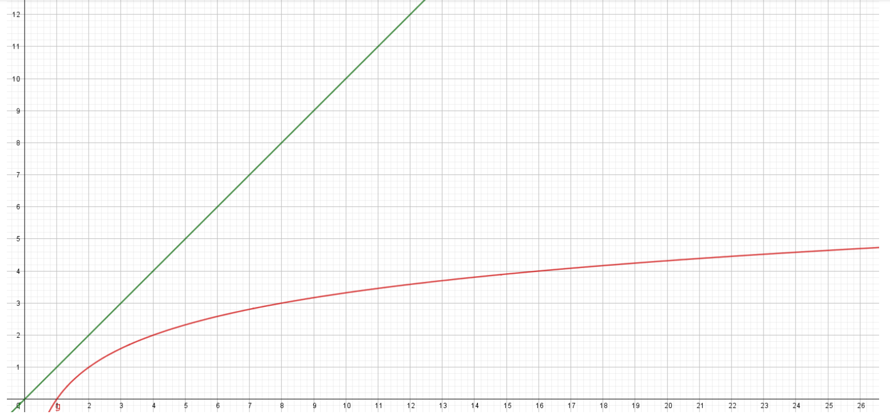

# Algorithmes de recherche dichotomique 🔪

??? conclu "Programme"
	|Notions|Compétences|Remarques|
	|--|--|--|
    Recherche dichotomique dans un tableau trié | Montrer la terminaison de la recherche dichotomique à l’aide d’un variant de boucle. | Des assertions peuvent être utilisées.<br>La preuve de la correction peut être présentée par le professeur.

{{exercice(prem=1, titre="Je joue contre l'ordinateur")}}

    === "Question 1"

        Exécuter le programme du jeu du nombre mystère.
        Faire quelques parties, expliquer la stratégie de l'ordinateur pour trouver le nombre mystère.

        {{ IDE('scripts/mystere') }} 

        ??? success "Solution"

                A chaque fois, il se place au milieu.

    === "Question 2"

        Lorsque le nombre est compris entre 1 et 100, en combien d'essais au maximum l'ordinateur trouve-t-il la solution ?

        ??? success "Solution"

            En 7 essais.

    === "Question 3"

        Et si le nombre mystère est compris entre 1 et 200 ?

        ??? success "Solution"

            En 8 essais.


??? info "Définition et principe de la dichotomie"

    Le mot dichotomie vient du grec ancien διχοτομία, dikhotomia (« division en deux parties »).

    La méthode de dichotomie fait partie des méthodes dites *«diviser pour régner»*. 

    «dichotomie» se dit en anglais *binary search*.

    !!! note "Dichotomie, déroulement intuitif"
        - on se place *au milieu* de la liste.
        - on regarde si la valeur sur laquelle on est placée est inférieure ou supérieure à la valeur cherchée.
        - on ne considère maintenant que la bonne moitié de la liste qui nous intéresse.
        - on continue jusqu'à trouver la valeur cherchée (ou pas)


    Comprendre la méthode de dichotomie est relativement simple, mais savoir la programmer est plus difficile.

    Pour des raisons d'efficacité, nous allons garder *intacte* notre liste de travail et simplement faire évoluer les indices qui déterminent le début et la fin de notre liste.

    Une autre méthode pourrait être d'extraire à chaque étape une nouvelle liste (dont on espère qu'elle contient la valeur cherchée), mais la technique utilisée (le *slicing* de liste) consomme beaucoup trop de ressources.

    Nous allons donc travailler avec trois variables :

    - `indice_debut` (en bleu sur le schéma)
    - `indice_fin` (en bleu sur le schéma)
    - `indice_central`, qui est égale à `(indice_debut + indice_fin) // 2` (en rouge sur le schéma)

    Dans cet exemple nous cherchons `14` dans la liste **triée** `[2, 3, 6, 7, 11, 14, 18, 19, 24]`.

    {: .center}

    Nous allons faire *se rapprocher* les indices `indice_debut` et `indice_fin` **tant que** `indice_debut <= indice_fin`

{{exercice(titre="Recherche d'appartenance")}}

    Compléter la fonction `appartient_dichotomique` qui prend en paramètre une liste Python `ma_liste` et un valeur `valeur`. Cette fonction renvoie `True` si `valeur` est dans `ma_liste` et `False` sinon.

    {{ IDE('scripts/appartient_dicho') }}


{{exercice(titre="Déroulé à la main : `v = 9` est-il dans `t = [1, 3, 6, 9]` ?")}}

    Écrire le déroulé à la main. Voici le début à poursuivre de façon analogue : 

    * indice_debut = <font color="#cc7777"><b>0</b></font>
    * indice_fin = <font color="#cc7777"><b>3</b></font>
    * condition du while : <font color="#cc7777"><b>True</b></font>
    * indice_centre =  <font color="#cc7777">**(0+3)//2 = 1**</font>
    * valeur_centrale = ma_liste[indice_centre]  = <font color="#cc7777"><b>3</b></font>
    * v == valeur_centrale → `False`
    * valeur_centrale < v → `True`
    * indice_debut =  <font color="#cc7777">**2**</font>
    * condition du while : <font color="#cc7777"><b>True</b></font>
    * ...


    ??? success "Solution"

        * indice_debut = <font color="#cc7777"><b>0</b></font>
        * indice_fin = <font color="#cc7777"><b>3</b></font>
        * condition du while : <font color="#cc7777"><b>True</b></font>
        * indice_centre =  <font color="#cc7777">**(0+3)//2 = 1**</font>
        * valeur_centrale = ma_liste[indice_centre]  = <font color="#cc7777"><b>3</b></font>
        * v == valeur_centrale → `False`
        * valeur_centrale < v → `True`
        * indice_debut =  <font color="#cc7777">**2**</font>
        * condition du while : <font color="#cc7777"><b>True</b></font>
        * indice_centre =  <font color="#cc7777">**(2+3)//2 = 2**</font>
        * valeur_centrale = ma_liste[indice_centre]  = <font color="#cc7777"><b>6</b></font>
        * v == valeur_centrale → `False`
        * valeur_centrale < v → `True`
        * valeur_debut =  <font color="#cc7777">**3**</font>
        * condition du while : <font color="#cc7777"><b>True</b></font>
        * indice_centre =  <font color="#cc7777">**(3+3)//2 = 3**</font>
        * valeur_centrale = ma_liste[indice_centre]  = <font color="#cc7777"><b>9</b></font>
        * v == valeur_centrale → `True`
        * la fonction renvoie `True`


{{exercice(titre="Déroulé à la main : `v = 7` est-il dans `t = [1, 3, 6, 9, 10]` ?")}}

    Écrire le déroulé à la main, comme dans l'exercice précédent

    ??? success "Solution"

        * indice_debut = <font color="#cc7777"><b>0</b></font>
        * indice_fin = <font color="#cc7777"><b>4</b></font>
        * condition du while : <font color="#cc7777"><b>True</b></font>
        * indice_centre =  <font color="#cc7777">**(0+4)//2 = 2**</font>
        * valeur_centrale = ma_liste[indice_centre]  = <font color="#cc7777"><b>6</b></font>
        * v == valeur_centrale → `False`
        * valeur_centrale < v → `True`
        * indice_debut =  <font color="#cc7777">**3**</font>
        * condition du while : <font color="#cc7777"><b>True</b></font>
        * indice_centre =  <font color="#cc7777">**(3+4)//2 = 3**</font>
        * valeur_centrale = ma_liste[indice_centre]  = <font color="#cc7777"><b>9</b></font>
        * v == valeur_centrale → `False`
        * valeur_centrale < v → `False`
        * indice_fin =  <font color="#cc7777">**2**</font>
        * condition du while : <font color="#cc7777"><b>False</b></font>
        * la fonction renvoie `False`

        👉 On voit dans cet exemple pourquoi l'instruction `while indice_debut <= indice_fin :` est **absolument nécessaire**.


{{exercice(titre="Recherche d'indice")}}

    Compléter la fonction `recherche_dichotomique` qui prend en paramètre une liste Python `ma_liste` et un valeur `valeur`. Cette fonction renvoie son indice si `valeur` est dans `ma_liste` et `None` sinon.

    {{ IDE('scripts/recherche_dicho') }}


{{exercice(titre="Une fête")}}

    Nicolas organise une fête, et demande à ses amis s'ils viendront. Dès qu'un ami lui répond favorablement, il l'ajoute dans `liste_amis`.
    Compléter le code ci-dessous afin de pouvoir déterminer si Vincent, Romain et Valérie ont décidé de venir (bien respecter les majuscules, minuscules et accents). La liste `liste_amis` est dans du code caché.

    Vous devez **absolument** réaliser une recherche **dichotomique** et pas une recherche naïve. Attention, c'est à vous de créer `ma_liste_amis` qui est utilisée dans les tests. (Vous pouvez regader l'astuce plus bas, en cas de besoin)

    {{IDE('scripts/exo_dicho')}}

    ??? tip "Astuce"

        N'y-a-t-il pas une condition sur la liste dans laquelle on réalise la recherche dichotomique ?
            

    ??? success "Solution pour Vincent, Romain et Valérie"

        ```pycon
        >>> appartient_dichotomique(ma_liste_amis, "Vincent")
        False
        >>> appartient_dichotomique(ma_liste_amis, "Romain")
        False
        >>> appartient_dichotomique(ma_liste_amis, "Valérie")
        True
        >>> 
        ```

??? python "Logarithme de recherche par dichotomie : à savoir refaire 💚"

    ```python
    def recherche_dichotomique(ma_liste, valeur) :
        indice_debut = 0
        indice_fin = len(ma_liste) - 1
        while indice_debut <= indice_fin :  # (1)
            indice_centre = (indice_debut + indice_fin) // 2  # (2)
            valeur_centrale = ma_liste[indice_centre]
            if valeur_centrale == valeur :
                return indice_centre
            if valeur_centrale < valeur :
                indice_debut = indice_centre + 1  # (3)
            else :
                indice_fin = indice_centre - 1  # (4)
        return None
    ```

    1. :warning: Il faut bien `<=` et pas `<` 
    2. :warning: Il faut une division **entière** donc `//` et pas `/`
    3. 👉 On cherche à droite
    4. 👈 On cherche à gauche

    !!! attention "Prenez le temps de lire les commentaires (cliquez sur les +)"


??? abstract "Terminaison de l'algorithme de recherche dichotomique"
    Est-on sûr que l'algorithme va se terminer ?  
    La boucle `while` qui est utilisée doit nous inciter à la prudence.  
    Il y a en effet le risque de rentrer dans une boucle infinie.  
    Pourquoi n'est-ce pas le cas ?

    **Aide :** observer la position des deux flèches bleues lors de l'exécution de l'algorithme 
    {: .center}


    La condition de la boucle `while` est `indice_debut <= indice_fin `, qui pourrait aussi s'écrire `indice_fin >= indice_debut `.  
    Au démarrage de la boucle, on a :


    ```python
        indice_debut = 0
        indice_fin = len(L) - 1
    ```

    Ceci qui nous assure donc de bien rentrer dans la boucle. 

    Ensuite, à chaque étape, les deux variables `indice_debut` et `indice_fin` vont se **rapprocher** jusqu'à ce que le programme rencontre un `return` ou bien jusqu'à ce que `indice_fin` devienne inférieur à `indice_debut`.  

    Ceci nous assure donc que le programme va bien se terminer.

    ??? note "Variant de boucle"

        On dit que la valeur `indice_fin - indice_debut ` représente le **variant de boucle** de cet algorithme. 
        Ce variant est un nombre entier, d'abord strictement positif, puis qui va décroître jusqu'à la valeur 0.

{{exercice(titre="Complexité de l'algorithme de recherche dichotomique")}}

    Nous allons considérer que la complexité est due au nombre d'étapes nécessaires pour obtenir le résultat. 

    ??? question "Quel est le pire des cas de recherche dichotomique d'une valeur dans une liste triée ?"
        Le pire des cas est lorsque l'élément n'est pas présent dans la liste.


    ??? question "Combien d'étapes (au maximum) sont-elles nécessaires pour arriver à la fin de l'algorithme ?"
        Imaginons que la liste initiale possède 8 valeurs. 
        Après une étape, il ne reste que 4 valeurs à traiter. 
        Puis 2 valeurs.  
        Puis une seule valeur.  
        Il y a donc 3 étapes avant de trouver la valeur cherchée.

    ??? question "Combien d'étapes en fonction de la taille de la liste ?"
        **1.** Remplissez le tableau ci-dessous :

        | taille de la liste | 1 | 2 | 4 | 8 | 16 | 32 | 64 | 128 | 
        | :----------------- |:-:|:-:|:-:|:-:|:-:|:-:|:-:|:-:|
        | nombre d'étapes    | _ | _ |  _  |   3 |  _ | _   | _   | _   | 

        ??? success "Solution"

            | taille de la liste | 1 | 2 | 4 | 8 | 16 | 32 | 64 | 128 | 
            | :----------------- |:-:|:-:|:-:|:-:|:-:|:-:|:-:|:-:|
            | nombre d'étapes    | 0 | 1 |  2  |   3 |  4 | 5  | 6  | 7   |

        **2.** Pouvez-vous deviner le nombre d'étapes nécessaires pour une liste de 4096 termes ?

        ??? success "Solution"

            12 étapes

        **3.** Pour une liste de $2^n$ termes, quel est le nombre d'étapes ?
        
        ??? success "Solution"

            $n$ étapes


    !!! info "Nombres d'étapes pour une liste de taille $n$"

        Sachant qu'à chaque itération de la boucle on divise à peu près (division entière) le tableau en $2$, cela revient donc à se demander combien de fois faut-il diviser le tableau en $2$ pour obtenir, à la fin, un tableau comportant un seul élément ?   
        🙃 Autrement dit, combien de fois faut-il diviser `n` par `2` pour obtenir `1` ?
        

    !!! info "Le logarithme en base 2"

        Une mesure de la complexité est donc le nombre $k$ tel que  $2^k=n$.

        Nous n'allons pas rentrer dans les détails, mais il faut savoir qu'il existe une fonction mathématique (réciproque de la fonction qui à $x$ associe $2^x$) qui permet de résoudre ce problème :   
        la fonction "logarithme en base 2" notée $\text{log}_2$  

        $k=\text{log}_2(n)$      

        { width=60% }

        La courbe en rouge correspond à la complexité de la recherche dichotomique (logarithmique en base 2), et la droite verte à celle de la recherche séquentielle (linéaire).

    ??? danger "Attention calculatrices"

        les calculatrices ont une touche <kbd>log</kbd> et une touche <kbd>ln</kbd> qui donnent respectivement le logaritme en base 10, et le logarithme en base $\text{e}$.  
        On peut obtenir le résultat du logarithme en base 2 d'un nombre de la façon suivante, par exemple pour calculer $\text{log}_2(1024)$ :  
        <kbd>(</kbd> <kbd>log</kbd> <kbd>1024</kbd> <kbd>)</kbd> <kbd>$\div$</kbd> <kbd>log</kbd> <kbd>2</kbd>  
        ou bien  
        <kbd>(</kbd> <kbd>ln</kbd> <kbd>1024</kbd> <kbd>)</kbd> <kbd>$\div$</kbd> <kbd>ln</kbd> <kbd>2</kbd>  

    ??? note "Complément sur les fonctions logarithme"

        * La fonction $\text{log}_2$ est la fonction réciproque de celle qui à tout réel $x$ associe $2^x$
        * La fonction $\text{log}$ est la fonction réciproque de celle qui à tout réel $x$ associe $10^x$
        * La fonction $\text{ln}$ est la fonction réciproque de celle qui à tout réel $x$ associe $\text{e}^x$

    ??? python "Le logarithme en base 2 en Python"

        En Python, il suffit d'importer la fonction `log2`

        Tester le script ci-dessous :

        {{ IDE('scripts/log2_python') }}


??? abstract "Complexité logarithmique de la recherche dichotomique 💚 A retenir"

    La recherche dichotomique se fait avec une **complexité logarithmique**.

    On rencontrera parfois la notation $O(\log_2(n))$.

    Le $O$ se prononce "grand O" (la lettre)

    Cette complexité est bien meilleure qu'une complexité linéaire. Le nombre d'opérations à effectuer est très peu sensible à la taille des données d'entrée, ce qui en fait un algorithme très efficace.

    !!! warning "N'oubliez pas que dans le cas de la recherche dichotomique, **le tableau doit être trié !**"


{{exercice(titre="Temps de calcul")}}

    Recopier et exécuter le code suivant dans votre éditeur python local (pas en ligne)

    ```python
    from timeit import timeit

    def dicho(tableau: list, x: int) -> bool :
        """
        :param tableau: une liste d'entiers triés par ordre croissant
        :param x: de type int
        :returns: bool : True si x est dans tableau, False sinon

        >>> dicho([1, 3, 4, 9], 4)
        True
        >>> dicho([1, 3, 4, 9], 11)
        False
        """
        deb = 0
        fin = len(tableau) - 1
        mil = (deb + fin) // 2

        while deb <= fin :

            if tableau[mil] ==  x:
                return True
            elif tableau[mil] < x:
                deb = mil + 1
            else :
                fin = mil - 1
            mil = (deb + fin) // 2
        return False

    tailles = [500, 2500, 12500, 62500]

    # tref est le temps de calcul pour une liste de taille 100
    liste_ref = [i for i in range(100)]
    tref = timeit("dicho(liste_ref, -1)", number = 1000, globals = globals())
    print("n = 100 -> tref = ",round(tref, 6))

    for n in tailles :
        print("n =", n, end='')
        tab = [i for i in range(n)]
        # Calcul du temps pour des listes triées de tailles n
        t = timeit("dicho(tab, -1)", number = 1000, globals = globals())

        print('\t-> temps = ',round(t, 6), '\t x', round(t/tref, 2) )
        tref = t
    ```

    ??? note pliée "Que remarque-t-on?"

        A chaque étape, n est multilié par 5, et on voit dans le tableau que le temps est multiplié par un nombre très inférieur à 5.  


??? example "Un exemple spectaculaire de l'efficacité de la recherche par dichotomie"
    { width=20%; : .center }

    Imaginons un annuaire qui contienne les noms, prénoms, adresses.....des 7 milliards d'êtres humains vivant sur la terre.

    🤔 Quel est le nombre maximum d'étapes pour trouver un individu ? 

    Plaçons nous dans le pire des cas.

    Comme à chaque étape on divise le nombre de personne par 2, la question revient à : **combien de fois faut-il que je divise 7 milliards par 2 pour qu'il n'en reste qu'un ?**

    Cela revient à trouver $n$  tel que $\dfrac{7000000000}{2^n}=1$  , c’est à dire $2^n=7000000000$ .

    A la calculatrice on voit que  $2^{32}=4294967296$ et que $2^{33}=8589934592$.

    Il faut donc au maximum 33 étapes

    🌵 Un algorithme qui balaye la liste du début à la fin aurait fait 1 étape pour la première personne et 7 milliards d'étapes pour la dernière !

    Un algorithme par parcours séquentiel de liste aurait nécessité, dans le pire des cas 7 milliards d’étapes. L’algorithme par dichotomie qui n'en nécessite que 33 est donc énormément plus efficace.  

    !!! warning "Cependant"

        Cependant, il ne faut pas perdre de vue que dans le cas de la recherche dichotomique, **il est nécessaire d'avoir un tableau trié**. 

        !!! danger "Attention"

            Si au départ le tableau n'est pas trié, il faut rajouter la durée du tri.  


{{exercice(titre="Compléter la fonction `dichotomie`")}}
    * prenant en paramètre un tableau de nombres triés dans l'ordre croissant `nombres` et une valeur `cible`
    
    * renvoyant `True` si `cible` est une valeur de `nombres`, `False` dans le cas contraire.

    !!! example "Exemples"

        ```pycon
        >>> dichotomie([1, 2, 3, 4], 2)
        True
        >>> dichotomie([1, 2, 3, 4], 1)
        True
        >>> dichotomie([1, 2, 3, 4], 4)
        True
        >>> dichotomie([1, 2, 3, 4], 5)
        False
        >>> dichotomie([1, 2, 3, 4], 0)
        False
        >>> dichotomie([1], 1)
        True
        >>> dichotomie([1], 0)
        False
        >>> dichotomie([], 1)
        False

        ```

    !!! warning "Remarque"

        Vous utiliserez obligatoirement un algorithme de **recherche dichotomique**.
        

    ???+ question "Compléter ci-dessous"

        {{ IDE('scripts/dicho_1') }}


{{exercice(titre="Déterminer l'indice d'un nombre dans une liste")}}

    On considère dans cet exercice des tableaux non vides contenant des nombres entiers, tous distincts, triés dans l'ordre croissant.

    On cherche à déterminer l'indice d'une valeur `#!py cible` dans ce tableau à l'aide d'une **recherche dichotomique** dans sa version itérative.

    Écrire la fonction `#!py indice` qui prend en paramètres le tableau de nombres `#!py tableau` et la valeur cherchée `#!py cible`.

    Si la `#!py cible` est dans le tableau, la fonction renverra son indice. Dans le cas contraire, la fonction renverra `None`.


    ???+ danger "Attention"

        Les tableaux des tests secrets peuvent être très grands. Une recherche linéaire naïve prendrait trop de temps lors de l'exécution.

        Les tests secrets limitent le nombre de lectures dans le tableau à 100. Si votre code accède à plus de 100 valeurs dans le tableau, une erreur sera levée.


    ???+ example "Exemples"

        ```pycon
        >>> tableau = [23, 28, 29, 35, 37]
        >>> indice(tableau, 23)
        0
        >>> indice(tableau, 29)
        2
        >>> indice(tableau, 37)
        4
        >>> indice(tableau, 10)
        None
        >>> indice(tableau, 100)
        None
        ```

    ???+ question

        Compléter le script ci-dessous :
        
        {{ IDE('scripts/dicho_2') }}


{{exercice(titre="Étude d'une panne")}}

    Une sonde interroge à intervalles réguliers l'état de fonctionnement d'un système électronique. Celui-ci peut être en marche ou en panne.

    La sonde est programmée pour enregistrer les résultats de ses requêtes dans un *log*. Il s'agit d'un tableau de booléens (une `#!py list` Python) dans lequel les valeurs `#!py True` précèdent les `#!py False`. La valeur `#!py True` indique que le système est en marche, `#!py False` qu'il est en panne.

    Une panne nécessite une intervention humaine et ne peut donc pas disparaître seule : elle persiste jusqu'à la fin de l'enregistrement.

    ```python
    #         0     1      2      3      4
    log = [True, True, False, False, False]
    ```

    Lors d'une vérification on constate que le système est en panne : le *log* contient au moins une valeur `#!py False` en dernière position. On se demande à quel moment a débuté cette panne.

    Dans l'exemple précédent, le premier `#!py False` est à l'indice `#!py 2` : la panne a débuté à l'instant `#!py 2`.

    Écrire la fonction `#!py indice_panne` qui prend en paramètre le tableau de booléens `#!py log` et renvoie l'instant du démarrage de la panne.

    On garantit que le *log* n'est pas vide et que, au moment de la vérification, le système est en panne (la dernière valeur du tableau est `False`).

    ???+ danger "Attention"

        La panne du système a aussi corrompu le fichier de *log*. Vous ne pouvez pas lire plus de 500 valeurs dans celui-ci. Passé ce nombre de lectures, tout nouvel accès lèvera une erreur.

        Il est donc important de bien concevoir votre algorithme car les *logs* utilisés dans les tests secrets peuvent être très longs : un milliard de valeurs !

    ???+ example "Exemples"

        ```pycon
        >>> indice_panne([True, False])
        1
        >>> indice_panne([False, False, False])
        0
        >>> indice_panne([True] * 10 + [False] * 100)
        10
        >>> indice_panne([True, True, False, False, False])
        2
        ``` 

    ???+ question

        Compléter le script ci-dessous :   

        {{ IDE('scripts/panne') }}

    ??? tip "Astuce (1)"

        Il s'agit d'une recherche dans un tableau trié : les valeurs `#!py True` sont au début, les `#!py False` à la fin.

    ??? tip "Astuce (2)"

        Si le *log* ne contient que des valeurs `#!py False`, il faut renvoyer `#!py 0`. 
        
        Dans le cas contraire, l'indice cherché est l'unique indice `#!py i` qui vérifie `#!py log[i - 1] and not log[i]`.
