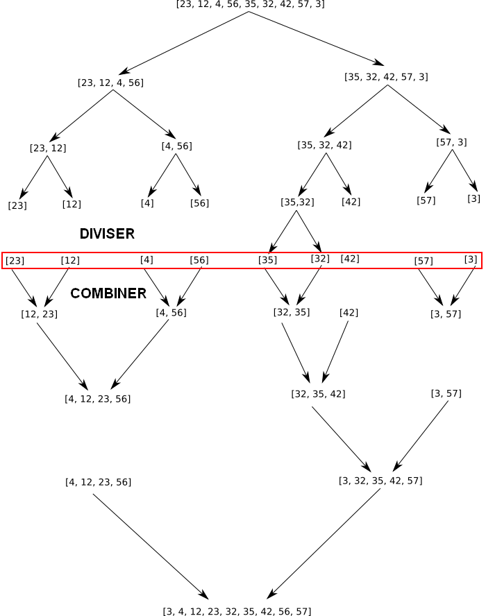

# Diviser pour régner


??? conclu "Programme"
    |Notions|Compétences|Remarques|
    |--|--|--| 
    Méthode « diviser pour régner ». | Écrire un algorithme utilisant la méthode « diviser pour régner ».| La rotation d’une image bitmap d’un quart de tour avec un coût en mémoire constant est un bon exemple.<br> L’exemple du tri fusion permet également d’exploiter la récursivité et d’exhiber un algorithme de coût en n log2 n dans les pires des cas.

## Introduction

L’expression «Diviser pour régner» est très ancienne : Les romains l’utilisaient au sénat («divide ut regnes»), Jules César l’ayant adapté en «divide et impera». Cette expression est reprise par le penseur Machiavel au XVIème siècle. La version anglaise donne «divide and conquer»!


Le but de ce type d'algorithme est d'optimiser la complexité en temps.

## Principe

On prend un problème (généralement complexe à résoudre), on divise ce problème en une multitude de petits problèmes, l'idée étant que les "petits problèmes" seront plus simples à résoudre que le problème original. Une fois les petits problèmes résolus, on recombine les "petits problèmes résolus" afin d'obtenir la solution du problème de départ.

Le paradigme "diviser pour régner" repose donc sur 3 étapes :

- **DIVISER** : le problème d'origine est divisé en un certain nombre de sous-problèmes.
- **REGNER** : on résout les sous-problèmes (les sous-problèmes sont plus faciles à résoudre que le problème d'origine)
- **COMBINER** : les solutions des sous-problèmes sont combinées afin d'obtenir la solution du problème d'origine.

Les algorithmes basés sur le paradigme "diviser pour régner" sont très souvent des algorithmes récursifs.

## Recherche dans un tableau

On dispose d'un tableau de valeurs, et on cherche à savoir si une valeur donnée est présente dans le tableau ou non.

### Recherche naïve

On considère le programme suivant sous Python :

```python
def recherche(tableau, element):
    for valeur in tableau:
        if valeur == element:
            return True
    return False
```

Notons qu'il n'est pas possible de savoir si la valeur à rechercher est absente du tableau avant d'avoir examiné toutes les valeurs du tableau: à cause de cela, on en déduit immédiatement que la complexité dans le pire des cas est proportionnelle à la taille du tableau $N$. On dit qu'il s'agit d'un algorithme de **complexité linéaire** : $O(n)$.

### Recherche dans un tableau trié

Supposons à présent que les valeurs du tableau sont triées dans l'ordre croissant. Peut-on améliorer l'algorithme précédent afin de le rendre plus efficace ?

Une première amélioration — très simple — vient à l'esprit: dès que l'on tombe sur une valeur supérieur à la valeur à rechercher, on peut stopper la recherche car toutes les valeurs suivantes seront elles aussi supérieures. Puisque l'on souhaite stopper l'algorithme préventivement, il faut utiliser une boucle tant que.

```python
def recherche_ordonnee(tableau, element):
    i = 0
    N = len(tableau)
    while tableau[i] <= element and i < N:
        if tableau[i] == element:
            return True
        i = i + 1
    return False
```

Lorsque la boucle est terminée, on a soit la condition $i\ge N$ qui signifie que tout le tableau a été parcouru sans succès, soit la condition $tableau[i] > element$ qui signifie qu'il est inutile de poursuivre la recherche: on peut donc bien renvoyer False.

La complexité de cet algorithme est-elle améliorée ? Il est difficile d'évaluer si — et quand — la recherche pourra s'interrompre prématurément. En outre, il est toujours possible que la valeur à rechercher soit la dernière du tableau.

La complexité dans le pire des cas reste donc linéaire : $O(N)$

### La recherche dichotomique

Il est possible de faire bien mieux que cela avec un tableau trié, en s'inspirant du jeu "plus petit - plus grand".

- On regarde l'élément au milieu du tableau: s'il est supérieur à la valeur recherchée, on sait que celle-ci ne pourra se trouver que dans la première moitié du tableau, et on réduit alors la recherche à cette première moitié. Si au contraire l'élément central est inférieur, on doit réduire la recherche à la deuxième moitié du tableau, car l'élément à rechercher ne peut se trouver que là.
- On peut poursuivre ainsi, en subdivisant à chaque étape les sous-tableaux en deux moitiés à peu près égales (à un élément près), et en recommençant à l'étape précédente.
- On finira par arriver à un tableau de longueur 1, contenant (ou pas) l'élément à rechercher.

Le fait de couper le tableau en deux parties donne son nom à l'algorithme : dichotomie signifie couper en deux.

Plus précisément, on va utiliser deux indices $g$ et $d$ (pour *gauche* et *droite*) en indiquant l'intervalle dans lequel doit s'effectuer la recherche.

Supposons que l'on dispose d'un tableau ordonnée *t* de longueur *N*.

1. Au départ, on aute $g=0$ et $d=N-1$.
2. On calcule l'indice au milieu de l'intervalle de recherche : $m=(g+d)//2$. On utilise une division euclidienne afin de s'assurer que cet indice est bien un entier.<br>
Trois cas peuvent se produire :
    - Si $t[m]==element$, on a trouvé la valeur à rechercher.
    - Sinon, si $t[m] < element$, la valeur à rechercher se trouve (peut-être) dans la seconde moitié. On gardera la valeur actuelle de *d*, mais on prendra à présent $g=m+1$. Reprendre à l'étape 1.
    - Sinon, on a nécessairement $t[m]>element$ et la valeur à rechercher est peut-être dans la première moitié. On gardera la valeur actuelle de *g* mais on posera $d=m-1$. Reprendre à l'étape 1.
3. Si à un moment donné, on a $g>d$ (ce qui est possible avec les instructions $g=m+1$ ou bien $d=m-1$), on sait que l'on peut interrompre la recherche car la valeur ne se trouve pas dans le tableau.

On obtient ainsi le programme suivant de recherche dichotomique :

```python
def recherche_dichotomique(tableau, element):
    g = 0
    d = len(tableau) - 1
    while g <= d and tableau[g] <= element <= tableau[d]:
        m = (g + d) // 2
        if tableau[m] == element:
            return True
        elif tableau[m] < element:
            g = m + 1
        else:
            d = m - 1
    # La recherche n'a rien donné
    return False
```
La complexité est bien plus compliquée à évaluer. A chaque étape (passage de la boucle), le nombre de valeur à rechercher est à peu près divisé par 2.

Pourquoi *à peu près*? Plus précisément (et cela ressemble énormément au raisonnement utilisé en mathématique pour déterminer la médiane d'une série de données) :

- Si $L=d-g + 1$ est pair, alors à la moitié à gauche de la valeur d'indice $m = (g + d) // 2$ comportera $(L // 2) - 1$ valeurs, celle de droite en comportera $L // 2$. Le cas le plus défavorable étant $L // 2$, on considérera cette valeur pour nos calculs.
- Si $L = d - g + 1$ est impair, alors il y aura une valeur centrale d'indice $m = (g + d) // 2$, et les deux moitiés du tableau comporteront exactement $L // 2$ valeurs.

Dans tou les cas, *L* prendra pour valeur suivante $L//2$.

Voyons cela sur un exemple avec un tableau de taille $N=100$ :

- A la première étape, on gardera une moitié de taille 49 ou 50. Supposons que ce soit 50.
À l'étape suivante, on aura un tableau de taille 24 ou 25. Prenons le cas défavorable \(L = 25\).
À l'étape suivante, on aura un tableau nécessairement de taille 12.
À l'étape suivante, on aura un tableau de taille au plus 6.
- puis un tableau de taille au plus 3.
- puis un tableau de taille 1: la recherche s'arrêtera nécessairement à ce moment là (si le tableau contient l'élément à rechercher), ou bien à la suivante s'il n'y est pas.

Comptons : nous aurons au maximum 7 étapes (il peut y en avoir moins si l'élément à trouver est l'un des pivot d'indice *m* examiné par une boucle), c'est qui est largement inférieur à la valeur initiale $N = 100$.

Est-il possible de calculer à l'avance ce nombre 7 ? En fait oui: il suffit de remarquer que la plus petite puissance de 2 inférieure ou égale à 100 est $2^6 = 64$, la puissance de 2 immédiatement supérieure étant $2^7 = 128$. C'est pour cela qu'il faut au maximum 7 étapes pour effectuer une recherche dichotomique.

Le principe est donc très simple: il suffit de trouver la plus petite puissance de 2 strictement supérieure à *N*, c'est-à-dire le plus petit entier *k* tel que $N < 2^k$, le nombre d'étapes dans le pire des cas sera alors *k*.

Il existe en mathématique une fonction réalisant exactement cela: c'est la fonction $\log_2$ (logarithme de base 2), qui renvoie exactement *N* lorsqu'elle est calculée sur $2^N$, et un nombre réel pour les valeurs intermédiaires. On a par exemple $\log_2(100) \approx 6,64$, ce qui est bien compris entre 6 et 7.

La complexité dans le pire des cas reste donc logarithmique : $O(\log_2(N))$.

### La recherche dichotomique récursive

Rappelons l'explication informelle donnée initialement pour expliquer l'algorithme de recherche dichotomique en Première:

- On regarde l'élément au milieu du tableau: s'il est supérieur à la valeur recherchée, on sait que celle-ci ne pourra se trouver que dans la première moitié du tableau, et on réduit alors la recherche à cette première moitié. Si au contraire l'élément central est inférieur, on doit réduire la recherche à la deuxième moitié du tableau, car l'élément à rechercher ne peut se trouver que là.
- On peut poursuivre ainsi, en subdivisant à chaque étape les sous-tableaux en deux moitiés à peu près égales (à un élément près), et en recommençant à l'étape précédente.
- On finira par arriver à un tableau de longueur 1, contenant (ou pas) l'élément à rechercher.

Tel qu'il est écrit ici, on a l'impression qu'il est structuré autour d'une boucle (et c'est effectivement comme cela que l'on peut l'interpréter en Première), alors qu'en réalité il s'agit d'une définition récursive. Reformulons légèrement cet algorithme:

- Pour effectuer une recherche dichotomique sur un tableau, on commence par regarder l'élément au milieu du tableau: s'il est supérieur à la valeur recherchée, on sait que celle-ci ne pourra se trouver que dans la première moitié du tableau, et on effectue alors une recherche dichotomique sur cette première moitié. Si au contraire l'élément central est inférieur, on doit effectuer la recherche dichotomique sur à la deuxième moitié du tableau, car l'élément à rechercher ne peut se trouver que là.
- On s'arrête soit lorsque l'élément central est la valeur à rechercher, soit lorsque le sous-tableau ne contient plus aucune valeur (largeur inférieure à 0).

Cette fois, la récursivité intrinsèque de l'algorithme apparaît explicitement. Donnons-en une implémentation en python. Nous utiliserons les mêmes paramètres *g* et *d* que pour l'implémentation itérative de Première:

```python
def recherche_dichotomique_rec(tableau, element,  g, d):
    if g > d:
        # La "largeur" de la zone de recherche est négative: 
        # La recherche a été infructueuse
        return False
    else:
        # On sait que g <= d: la "largeur" de la zone est positive ou nulle
        # (nulle = il ne reste plus qu'un seul élément)
        m = (g + d) // 2
        if tableau[m] == element:
            return True
        elif tableau[m] < element :
            return recherche_dichotomique_rec(tableau, element, m + 1, d)
        else:
            return recherche_dichotomique_rec(tableau, element, g, m - 1)


def recherche_dichotomique(tableau, element):
    return recherche_dichotomique_rec(tableau, element, 0, len(tableau) - 1)
```

Cette implémentation récursive de l'algorithme est plus simple à comprendre que l'implémentation itérative, car elle est plus proche de la description initiale de l'algorithme.

La complexité de l'algorithme est exactement la même en version récursive qu'itérative, puisque le nombre d'appels récursifs est égal au nombre de passage de la boucle pour la version de Première.

Est-il possible de dépasser la pile d'appel de python (en général 1000 appels maximum) ? Difficilement, car pour cela il faudrait que la taille du tableau *N* soit supérieure à $2^{1000}$, ce qui donne environ $10^{300}$, un nombre largement supérieur au nombre estimé d'atomes de l'univers (l'ordre de grandeur est d'environ $10^{80}$). Aucune chance d'avoir assez de mémoire dans un ordinateur pour ne serait-ce que stocker un tableau aussi grand.


{{exercice(prem=1, titre="Temps d'execution")}}
    {{jupy('temps_exec.ipynb')}}

{{exercice(titre="Recherche dichotomique")}}
    {{jupy('recherche_dicho.ipynb')}}
    {{jupy_cor('recherche_dicho_correction.ipynb')}}

## Le tri fusion

La méthodologie «diviser pour régner» peut être avantageusement utilisée pour trier une liste, donnant à la fois un algorithme simple à décrire, mais qui s'avérera aussi beaucoup plus efficace que les algorithmes de tri par insertion ou par sélection étudiés en classe de Première.

Le principe est schématisé ci-dessous :

{: .center}

- A chaque étape, on sépare la liste en deux sous-listes (flèches bleues sur le diagramme).
- Lorsque toutes les sous-listes ont été décomposées, on les fusionne deux par deux (flèches rouges). L'opération de fusion prend 2 listes déjà triées (ce qui est notamment le cas pour les listes de longueur 1), et les combine en une unique liste elle aussi triée.


La méthode décrite peut se résumer en l'algorithme naïf suivant :

```
fonction Tri_Fusion(Liste):
    Découper Liste en deux sous-listes L1 et L2
    Appliquer la fonction tri_fusion à L1
    Appliquer la fonction tri_fusion à L2
    Fusionner L1 et L2

    Renvoyer le résultat de la fusion
```

L'algorithme de tri fusion se prête bien à une implémentation à l'aide de listes.

Outre la fonction récursive *tri_fusion*, nous avons besoin d'une fonction *coupe* pour découper une liste en sous-listes, ainsi que d'une fonction *fusion*.

Sur le schémas précédents, la coupe a toujours été effectuée en milieu de liste. Mais cela n'est absolument pas une nécessité: l'essentiel est que l'on obtiennent deux sous-listes de tailles à peu près équivalentes (il peut y avoir une différence d'une unité), peu importe comment les éléments de la liste initiale ont été répartis :

```
Fonction  coupe(liste):
   """
   Découpe la liste  en deux sous-listes de tailles équivalentes.
   """

   l1 ← liste vide
   l2 ← liste vide

   Pour i allant de 0 à longueur de liste
   
      si  i est pair :
         ajouter l'élément de liste d'indice i à l1
      else:
         ajouter l'élément de liste d'indice i à l2

    Renvoyer l1, l2
```

La fonction de fusion peut se décrire facilement à l'aide d'un algorithme récursif :

```
Fonction fusion(l1,l2)
    """
    Fusionne les deux listes TRIÉES l1 et l2 en une unique liste triée.
    """
    
    N1 ← longueur de l1
    N2 ← longueur de l2
    
    liste ← liste vide
    i1 ← 0
    i2 ← 0
    Tant que  i1 < N1 ou i2 < N2: # tant qu'il reste des éléments à traiter dans au moins l'une des 2 listes
        Si i1 = N1 Alors
            # La première liste est déjà épuisée: on peut donc traiter exclusivement la deuxième
            Tant que i2 < N2 Faire
                Ajouter à liste l'élément d'incide i2 dans l2
                i2 ← i2 + 1
        Sinon Si i2 = N2 Alors
            # La deuxième liste est déjà épuisée: on peut donc traiter exclusivement la première
            Tant que i1 < N1 Faire
                Ajouter à liste l'élément d'incide i1 dans l1
                i1 ← i1+ 1
        Sinon
            # Il reste des éléments à traiter dans chacune des 2 listes: on garde le plus petit des 2
            Si l1[i1] < l2[i2] Alors
                Ajouter à liste l'élément d'incide i1 dans l1
                i1 ← i1 + 1
            Sinon
                Ajouter à liste l'élément d'incide i2 dans l2
                i2 ← i2 + 1
    
    Renvoyer liste
```

Il est tout fait possible (et intéressant) de remplacer cet algorithme récursif par un autre algorithme, itératif. L'avantage étant qu'avec l'algorithme récursif, il n'est pas aisé de fusionner des listes dont la taille dépasse la limite de récursion de python (normalement 1000 appels). Avec un algorithme itératif, aucun problème de ce genre.

Enfin, la fonction de tri proprement dite est une implémentation directe de l'algorithme de la section précédente:

```
Fonction tri_fusion(liste):
    """
    Renvoie une copie triée de `liste`.
    """
    
    # Une liste de longueur 0 ou 1 est déjà triée: il n'y a rien à faire
    Si liste est vide Alors
        Renvoyer []
    Sinon Si liste de longueur 1 Alors
        Renvoyer [liste[0]] # On doit renvoyer une *copie* de liste, pas la liste elle-même.
    Sinon:
        l1, l2 ← coupe(liste)
        lt1 ← tri_fusion(l1)
        lt2 ← tri_fusion(l2)
        
        Renvoyer fusion(lt1, lt2)
```

Quel est le nombre d'étapes nécessaires pour effectuer un tri fusion ?

La fusion elle-même prend exactement \(N\) étapes, où \(N\) est la taille de la liste fusionnée. Si on note \(c(N)\) le nombre d'étapes pour fusionner une liste de taille \(N\), alors l'algorithme récursif nous donne directement la relation

\[ c(N) = 2\times c(N/2) + N\]

En effet, on a compté le nombre d'étapes du tri fusion des deux sous-listes, ainsi que la fusion elle-même (on peut considérer que le découpage est, quand à lui, constant, même si ce n'est pas le cas dans l'implémentation proposée ici).

On peut montrer en mathématiques que la fonction *c(N)* est proportionnelle à $N\times\log_2(N)$ (cette démonstration est totalement hors-programme au lycée).

La complexité de l'algorithme de tri fusion est donc intermédiaire entre une complexité linéaire et une complexité quadratique. Cependant, nous verrons en TP que la complexité de l'algorithme de tri fusion est très largement supérieure à celle des tris par insertion ou sélection lorsque le nombre d'éléments devient grand.

Prenons par exemple le cas d'une liste de taille $N = 1000$. Un tri de complexité quadratique aurait un nombre d'étapes proportionnel à $1000^2 = 1\,000\,000$, alors que le tri fusion ne prendrait que $1000\times \log_2(1000) \approx 9966$ étapes. La différence est considérable, et l'écart ne ferait que se creuser avec une liste plus longue.


{{exercice(titre='Le tri Fusion')}}
    {{jupy('tri_fusion.ipynb')}}
    {{jupy_cor('tri_fusion_correction.ipynb')}}

