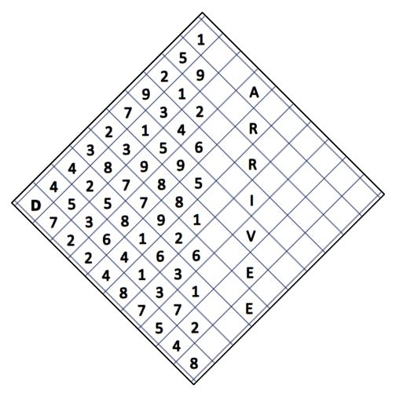

# Algorithmes gloutons 😋

??? conclu "Programme"
	|Notions|Compétences|Remarques|
	|--|--|--|
    Algorithmes gloutons | Résoudre un problème grâce à un algorithme glouton. | Exemples : problèmes du sac à dos ou du rendu de monnaie. <br> Les algorithmes gloutons constituent une méthode algorithmique parmi d’autres qui seront vues en terminale.


!!! info "Principe d'un algorithme glouton"

    Les **algorithmes gloutons** (ou greedy) algorithmes forment une catégorie d’algorithmes permettant de donner une solution à des **problèmes d’optimisation** qui visent à maximiser/minimiser une quantité (GPS (plus court chemin, temps minimum, côut minimum) - plus petit temps d’exécution, meilleure organisation d’un emploi du temps, ....).

    Un algorithme glouton donc est un algorithme qui suit le principe suivant :

	* résout le problème étape par étape, en faisant un choix optimum local dans l'espoir d'obtenir un résultat optimum global.
	* Ce choix d'étape n'est jamais remis en cause lors des étapes suivantes.

{{exercice(prem=1, titre="Optimisation d'une trajectoire")}}

    { width=40%; : .center }

    Sur la grille ci-dessus, on part de la case tout à gauche marquée de la lettre D.
    On souhaite atteindre les cases vides sur la partie droite en se déplaçant de case en case.
    Lorsqu'on est sur une case on peut se déplacer sur une des deux cases voisines situées sur la droite. On note S la somme de toutes les cases traversées.  
    Par exemple on peut effectuer la trajectoire suivante (on ne note pas la dernière case, qui est vide) : D - 7 – 5 – 3 – 5 – 7 – 9 – 8 – 9 – 6 qui conduit à S = 59.

    🤔 On cherche à effectuer la trajectoire qui rend la somme S la plus petite possible.
    Pour cela, on va utiliser un algorithme glouton.
        * A chaque étape, nous choisissons le plus petit nombre.
        * Nous ne revenons jamais en arrière.

    ??? question "Trajectoire gloutonne"

        Quelle trajectoire et quelle somme S obtenez-vous sur cet exemple avec votre algorithme glouton ?

        ??? success "Solution"

            D – 4 – 4 – 2 – 5 – 7 – 7 – 8 – 8 – 1

            S = 46


    ??? question "Trajectoire optimale"

        Sur cette grille, en cherchant bien, la trajectoire optimale donne une somme S = 23. Déterminer le chemin correspondant

        ??? success "Solution"

            D - 4 - 4 - 3 - 2 - 3 - 1 - 3 - 1 - 2


    !!! info "Algorithme par force brute"

        Pour obtenir la solution optimale de façon certaine on souhaite trouver toutes les trajectoires possibles et calculer pour chacune d'elles la somme associée.  
        On doit faire 9 déplacements, et à chaque déplacement on a deux possibilités.  
        On a donc $2^9=512$ trajectoires différentes. Il faudrait donc calculer la somme pour chacune de ces 512 trajectoires différentes.  
        🌵 Cette méthode est exacte, mais beaucoup plus coûteuse en termes de calculs.


{{exercice(titre="Rendu de monnaie")}}
    **Situation :** 
    Dans le pays nommé New Land, la monnaie est constituée de pièces de 4 nl, 3 nl et 1 nl.  
    L’unité de monnaie est le newland, symbolisé par nl.  
    Alice et Bob sont deux commerçants qui disposent dans leur caisse de beaucoup de pièces de chaque type, mais ils veulent rendre la monnaie en utilisant **le moins de pièces possible**.

    ??? question "Méthode gloutonne"

        Bob a une idée : il se dit que plus il rendra de pièces de grandes valeurs, mieux cela sera.

        Pour donner 10 nl :
        
        * Il donne une pièce de 4 nl, il lui reste à rendre 6 nl,
        * puis il donne une pièce de 4 nl, il lui reste à rendre 2 nl,
        * puis il donne une pièce de 1 nl, il lui reste à rendre 1 nl,
        * puis il donne une pièce de 1 nl, il lui reste à rendre 0 nl.

        La fonction `monnaie_Glouton` prend en paramètre un entier qui est le montant en nl, et renvoie la liste des pièces correspondantes, obtenue par l'algorithme glouton.

        !!! example "Exemple"

            ```pycon
            >>>monnaie_Glouton(6)
            [4, 1, 1]
            >>>monnaie_Glouton(9)
            [4, 4, 1]
            
            ```
            
        Compléter ci-dessous :

        {{ IDE('scripts/bob') }}

    ??? question "Méthode par force brute"

        Alice est très méthodique. Elle va chercher toutes les possibilités dont la somme correspond, puis ensuite elle prendra celle qui correspond au plus petit nombre de pièces.
        Cette méthode, qui consiste à chercher toutes les possibilités s'appelle une méthode par force brute. Le nombre maximal de pièces est la somme totale (si on la donne uniquement avec des pièces de 1)

        La fonction `possibilites` renvoie une liste de listes. Chaque liste donne une possibilité pour rendre le montant.  
        Par exemple [1, 0, 2] signifie qu'on rend une pièce de 4, 0 pièce de 3, et 2 pièces de 1.

        !!! example "Exemple"

            ```pycon
            >>> possibilites(6)
            [[0, 0, 6], [0, 1, 3], [0, 2, 0], [1, 0, 2]]
            ```
            
        La fonction `monnaie_brute` renvoie un tuple dont le premier élément est la liste optimale comme décrite ci-dessus, et le deuxième le nombre de pièces.

        !!! example "Exemple"

            ```pycon
            >>> monnaie_brute(6) 
            ([0, 2, 0], 2)
            ```


        Compléter les fonctions :

        {{ IDE('scripts/alice') }}
        
    ??? question "Rendre le moins de pièces possibles"

        Comparer le résultat obtenu pour la méthode par algorithme glouton, ou par force brute pour le cas d'un rendu de monnaie de 6 nl, 10 nl, 22nl . Que constatez vous ?

        ??? success "Solution"

            |montant|algorithme glouton (liste triée)|algorithme par force brute (liste triée)|
            |:--:|:--:|:--:|
            |6|[1, 1, 4]|[3, 3]|
            |10|[1, 1, 4, 4]|[3, 3, 4]|
            |22|[1, 1, 4, 4, 4, 4, 4]|[3, 3, 4, 4, 4, 4]|

            L'algorithme glouton donne un résultat très rapidement, mais il n'est pas forcément optimal.

{{exercice(titre='Problème du sac à dos ("Knapsack Problem")')}}

    ??? tip "Jouons un peu..."
        <iframe id="frame" src="https://animations.interstices.info/sac-a-dos-js/sac-a-dos/applet.html" scrolling="no" frameborder="1" width="900" height="520"></iframe>


    { width=30%; : .center }


    Le problème est celui-ci : vous disposez d'un sac d'une contenance limitée (sur le dessin ci-dessus, 15kg) et vous souhaitez maximiser la valeur totale des objets que vous mettez dans votre sac. Évidemment, la somme de leur masse ne doit pas dépasser 15 kg.

    Ce problème (de la catégorie des **problèmes d'analyse combinatoire**) malgré sa simplicité est **un problème majeur** d'optimisation. 

    Actuellement :

    *   On sait trouver LA meilleure solution, mais en explorant toutes les combinaisons une par une. Cette méthode par **force brute** est inapplicable si beaucoup d'objets sont en jeu.
    *   On sait facilement trouver une _bonne_ solution, mais pas forcément la meilleure, par exemple en adoptant une stratégie gloutonne.
    * On ne sait pas trouver facilement (en temps polynomial) la meilleure solution. Si vous y arrivez, [1 Million de $](https://www.claymath.org/millennium-problems/p-vs-np-problem){. target="_blank"} sont pour vous.

    ??? question "Tri par deuxième élément"

        Supposons qu'on dispose d'une liste  `mylist = [["A",3], ["B",2], ["C",8]]`. 

        Comment classer les éléments de cette liste par leur deuxième élément ???

        Nous allons procéder en 2 temps :

        - création d'une fonction qui renvoie le deuxième élément d'un objet `liste`
        - tri de la liste grâce à cette fonction

        Tester ci-dessous :
        
        {{ IDE('scripts/sorted_key') }}

        ??? success "Solution"

            Il s'affiche : `[['C', 8], ['A', 3], ['B', 2]]`


    ??? question "Revenons à notre sac à dos"
        On considère un sac de 40 kg et les objets suivants :

        | objet  |  A  |  B  |  C  |  D  |  E  |  F  |
        |:------:|:---:|:---:|:---:|:---:|:---:|:---:|
        |  masse |  13 |  12 |  8  |  10 |  14 |  18 |
        | valeur | 700 | 500 | 200 | 300 | 600 | 800 |

        Quels objets faut-il prendre ?


        ??? tip "Indice : stratégie gloutonne"

            * Classer les objets dans l'ordre décroissant de leur taux de valeur (taux de valeur = valeur / masse). Ainsi le premier élément de la liste sera celui ayant le meilleur rapport valeur/masse.
            * Prendre le premier élément de la liste, puis le deuxième, etc., tant que le sac peut encore les contenir.


        ??? question "Trier dans l'ordre décroissant de leur taux de valeur"

            {{ IDE('scripts/tri_sac_dos') }}


        ??? question "Résoudre le problème par la méthode gloutonne"

            {{ IDE('scripts/sac_dos') }}


        ??? success "Solution"

            Il faut donc choisir la combinaison A, F, C. Elle est bien valide (poids 39) et rapporte 1700.


        !!! warning "Question ?"  

            L'algorithme glouton nous a-t-il donné la solution **optimale** ?  
            Nous allons pour cela avoir recours à la force brute pour tester toutes les combinaisons possibles.
            

    ??? question "La méthode par force brute"

        Nous allons chercher toutes les possibilités pour lequel le poids total est inférieur au poids total autorisé, puis ensuite nous chercherons la possibilité qui donne la valeur totale maximale.
        Cette méthode, qui consiste à chercher toutes les possibilités s'appelle une méthode par force brute.

        La fonction `possibilites` prend en paramètres la liste `objets` et l'entier `poids` qui est le poids maximal. Cette fonction renvoie une liste de listes. Chaque liste donne une possibilité de choix d'objets
        Par exemple [1, 1, 0, 1, 0, 1] signifie qu'on prend l'objet A, le B, pas le C, le D, pas le E et le F.

        !!! example "Exemple"

            On a :

            ```python
            objets = [["A", 13, 700], ["B", 12, 500], ["C", 8, 200],\
            ["D", 10, 300], ["E", 14, 600], ["F", 18, 800]]
            ```
            Appel de la fonction `possibilites`

            ```pycon
            >>> possibilités(objets, 15)
            [[0, 0, 0, 0, 0, 0],
            [0, 0, 0, 0, 1, 0],
            [0, 0, 0, 1, 0, 0],
            [0, 0, 1, 0, 0, 0],
            [0, 1, 0, 0, 0, 0],
            [1, 0, 0, 0, 0, 0]]
            >>> 
            ```
            
        La fonction `butin_brut` renvoie un tuple dont le premier élément est la liste optimale comme décrite ci-dessus, et le deuxième le magot obtenu.

        !!! example "Exemple"

            ```pycon
            >>> butin_brut(objets, 25)
            ([1, 0, 0, 1, 0, 0], 1000)
            ```


        Compléter les fonctions :

        {{ IDE('scripts/dos_brut') }}

        ??? success "Solution"

            La combinaison A-B-E est bien valide (poids total 39) et rapporte 1800


    !!! info "Comparaison des méthodes"       

            La force brute a mis en évidence une combinaison **meilleure que celle donnée par l'algorithme glouton**. 

            En effet la combinaison A-B-E est bien valide (poids total 39) et rapporte 1800, donc 100 de mieux que la solution gloutonne.

            Par contre, la force brute est inenvisageable pour si le nombre d'objets est grand, alors que la stratégie gloutonne reste très rapide.

    
    Pour aller plus loin : [interstices](https://interstices.info/le-probleme-du-sac-a-dos/){ .md-button target="_blank" rel="noopener" }

    !!! info "Conclusion"

        La stratégie gloutonne donne très rapidement des solutions **satisfaisantes** mais **pas forcément optimales**. Pour beaucoup de problèmes (dont le problème du sac à dos), la recherche d'une solution optimale sans passer par la force brute semble impossible (mais n'est pas démontrée).  
        Dans ce cas-là, la stratégie gloutonne peut être employée pour avoir vite et bien une solution convenable, même si peut-être non optimale. On dit que la stratégie gloutonne est une **heuristique** de résolution. On sait que ce n'est pas forcément optimal, mais faute de mieux, on s'en contente...

{{exercice(titre='Conversion binaire')}}

    Pour convertir en base $2$ un entier écrit en base $10$, nous pouvons utiliser l'algorithme glouton de rendu de monnaie, en utilisant les puissances de $2$ successives comme valeurs des pièces.

    Par exemple, pour obtenir la représentation binaire de $43$, on peut utiliser les valeurs $32$, $16$, $8$, $4$, $2$ et $1$. On se limite à $32$ car la puissance suivante, $64$, est strictement supérieure à $43$.

    On procède alors ainsi :

    * Pour $43$ on **doit** prendre $32$ , il reste $11$,
    * Pour $11$ on **ne peut pas** prendre $16$ (en effet $16>11$),
    * Pour $11$ on **doit** prendre $8$, il reste $3$,
    * Pour $3$ on **ne peut pas** prendre $4$,
    * Pour $3$ on **doit** prendre $2$, il reste $1$,
    * Pour $1$ on **doit** prendre $1$, il reste $0$.

    On obtient la représentation binaire en observant les différentes étapes : s'il est possible de prendre une puissance, on note un `#!py 1`, si c'est impossible, on note un `#!py 0`.

    | Puissance de 2 | Possible ? | Bit correspondant |
    | :------------: | :--------: | :---------------: |
    |$32$| Oui | `#!py 1` |
    |$16$| Non | `#!py 0` |
    |$8$| Oui | `#!py 1`|
    |$4$ | Non | `#!py 0`|
    |$2$ | Oui | `#!py 1`|
    |$1$ | Oui | `#!py 1`|

    Dans la pratique, pour convertir « à la main » $43$ en binaire, cela revient réaliser le tableau suivant :

    |$32$|$16$|$8$|$4$|$2$|$1$|
    |:--:|:--:|:--:|:--:|:--:|:--:|
    |`#!py 1`|`#!py 0`|`#!py 1`|`#!py 0`|`#!py 1`|`#!py 1`|


    On en déduit que $43$ en décimal s'écrit `#!py 101011` en binaire.

    ??? question "Résolution sur papier"

        Utiliser la méthode précédente pour convertir 100 en binaire.

        ??? success "Solution"

            on peut utiliser les valeurs $64$, $32$, $16$, $8$, $4$, $2$ et $1$. On se limite à $64$ car la puissance suivante, $128$, est strictement supérieure à $100$.

            On procède alors ainsi :

            * Pour $100$ on **doit** prendre $64$ , il reste $36$,
            * Pour $36$ on **doit** prendre $32$, il reste $4$
            * Pour $4$ on **doit** prendre $4$, il reste $0$


            On obtient la représentation binaire en observant les différentes étapes : s'il est possible de prendre une puissance, on note un `#!py 1`, si c'est impossible, on note un `#!py 0`.

            | Puissance de 2 | Possible ? | Bit correspondant |
            | :------------: | :--------: | :---------------: |
            |$64$| Oui | `#!py 1` |
            |$32$| Oui | `#!py 1` |
            |$16$| Non | `#!py 0` |
            |$8$| Non | `#!py 0`|
            |$4$ | Oui | `#!py 1`|
            |$2$ | Non | `#!py 0`|
            |$1$ | Non | `#!py 0`|

            Dans la pratique, pour convertir « à la main » $100$ en binaire, cela revient réaliser le tableau suivant :

            |$64$|$32$|$16$|$8$|$4$|$2$|$1$|
            |:--:|:--:|:--:|:--:|:--:|:--:|:--:|
            |`#!py 1`|`#!py 1`|`#!py 0`|`#!py 0`|`#!py 1`|`#!py 0`|`#!py 0`|

            On en déduit que $100$ en décimal s'écrit `#!py 1100100` en binaire.

    ???+ question "Résolution avec Python"

        Vous devez écrire une fonction `binaire` qui prend en paramètre un entier écrit en base $10$, et renvoie la chaîne de caractères la plus courte possible (sans zéros inutiles) représentant sa conversion en binaire.

        !!! example "Exemples"

            ```pycon
            >>> binaire(43)
            '101011'
            >>> binaire(32)
            '100000'
            >>> binaire(0)
            '0'
            >>> binaire(54321)
            '1101010000110001'
            ```

        !!! danger "Contraintes"

            Vous utiliserez obligatoirement un algorithme glouton qui met en oeuvre la méthode décrite dans cet exercice.   
            L'utilisation de la fonction `bin` et du modulo (`%`) est interdite.

        Compléter le script ci-dessous"

        {{IDE('scripts/conversion_gloutonne', SANS = "bin")}}
