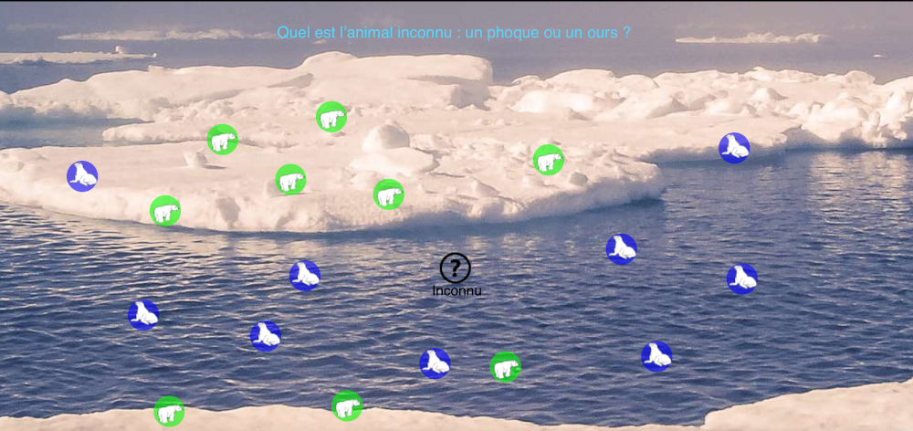
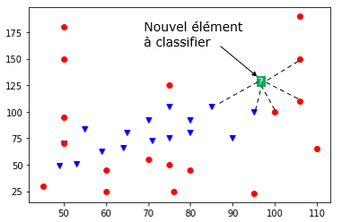
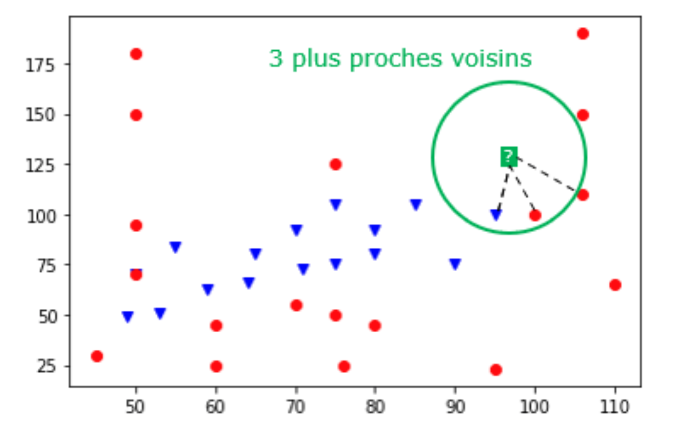
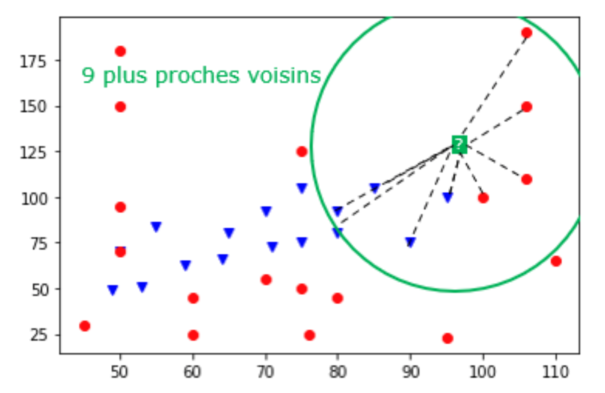
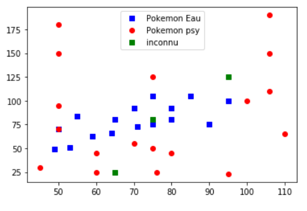

# K plus proches voisins

??? conclu "Programme"
	|Notions|Compétences|Remarques|
	|--|--|--|
	Algorithme des k plus proches voisins | Écrire un algorithme qui prédit la classe d’un élément en fonction de la classe majoritaire de ses k plus proches voisins. | Il s’agit d’un exemple d’algorithme d’apprentissage.


??? info "Algorithme KNN et problème de classification"

	* Les algorithmes des k plus proches voisins est abrégé **kppv** en français. En anglais, **K** **N**earest **NS**eighbors souvent abrégé en **knn**.
	* L’algorithme des k plus proches voisins appartient à la famille des algorithmes d’apprentissage automatique (machine learning) qui constituent le poumon de l'intelligence artificielle actuellement.
	* Pour simplifier, l'apprentissage automatique part souvent de données (data) et essaye de dire quelque chose des données qui n'ont pas encore été vues : il s'agit de généraliser, de prédire.


{{exercice(prem=1, titre="Un ours ou un phoque ?")}}

	Le problème revient à prédire à quelle catégorie, ou classe, appartient ce nouvel élément donné. Il est appelé **problème de classification**. L'algorithme des k plus proches voisins permet de trouver les k voisins les plus proches (si k = 5 on cherche les 5 voisins les plus proches) de ce nouvel élément dans le but de lui associer une classe plausible (Psy ou Eau, dans cet exemple).

	{ width=40%; : .center }

	L'animal inconnu est-il un ours ou un phoque ?

	[Lancer l'appli](http://fred.boissac.free.fr/AnimsJS/Dariush_KVoisins/index.html){ .md-button target="_blank" rel="noopener" }


{{exercice(titre="Classification des Pokémons")}}
	{ width=30%; : .center }

    {{jupyter('/notebooks/knn_intro.ipynb')}}


??? abstract "Fonctionnement de l'algorithme KKN"

	A partir d'un jeu de données (par exemple, les données sur nos 34 Pokémons) et d'une donnée cible (le nouveau Pokemon à classifier), l'algorithme des k plus proches voisins détermine les k données les plus proches de la cible. (si k=3 les 3 plus proches voisins de la cible seront pris en compte, si k=5 les 5, ...)

 	**Données : **

	* une table données de taille n contenant les données et leurs classes
	* une donnée cible : cible
	* un nombre k inférieur à n
	* une formule permettant de calculer la distance entre deux données

    **Résultat :** Un tableau contenant les k plus proches voisins de la donnée cible.

    **Étapes de l'algorithme :**

	* Créer une table `distances_voisins` contenant les éléments de la table données et leurs distances avec la donnée `cible`.
	* Trier les données de la table `distances_voisins` selon la distance décroissante avec la donnée cible
	* Renvoyer les k premiers éléments de cette table triée.
 	* **Prédiction :** détermination de la classe majoritaire (la plus présente) dans les k plus proches voisins.

	??? note "Influence de la valeur de k"
		!!! info "k impair"

			On est contents si k est impair car il ne peut pas y avoir d'ex-aequo.

		!!! warning "Remarque"

			La valeur de k est très importante, elle doit être choisie judicieusement car elle a une influence forte sur la prédiction. Regardons le résultat de la prédiction pour différentes valeurs de k sur notre exemple.

		!!! info "k = 1"

			Si k=1, cela revient à chercher la donnée la plus proche de notre élément cible.  
			Ici, on se rend compte que s la classe du plus proche élément est "Eau" (point bleu)  
			➜ on classerait le nouveau Pokémon comme étant de type "Eau".

		{ width=40%; : .center }

		!!! info "k = 3"

			Si k=3, on se rend compte que la classe majoritaire dans les 3 plus proches voisins est "Psy" (2 points rouges contre 1 point bleu) donc on classerait le Pokémon inconnu comme étant de type "Psy".

		{ width=40%; : .center }

		!!! info "k = 9"

			La classe majoritaire parmi les 9 plus proches voisin est "Eau" (5 points bleus contre 4 points rouges) donc on classerait le Pokémon inconnu comme étant de type "Eau".

		{ width=40%; : .center }


		!!! warning "Remarque"

			Si on choisit k = 34 (le nombre total de données), alors la prédiction serait toujours "Psy" car c'est la classe majoritaire de l'échantillon. Il est donc incorrect de penser que plus la valeur de k augmente meilleure sera la prédiction, c'est plus complexe que cela. Il faudra observer les resultats.


	??? note "Choix des distances"
		L'algorithme des plus proches voisins repose sur la distance entre deux données. Dans les exemples vus précédemment, c'est la distance "naturelle" qui a été choisie (celle "à vol d'oiseau").

		!!! warning "La distance euclidienne"

			Dans un repère orthonormé, si A et B de coordonnées $(x_{A},y_{A})$ et $(x_{B},y_{B})$, alors la distance entre ces deux points est donnée par la formule : 
			
			$AB=\sqrt{(x_{B}-x_{A})^{2}+(y_{B}-y_{A})^{2}}$

			On parle alors de la **distance euclidienne**.

{{exercice(titre="Des Pokémons inconnus")}}

	Dans l'activité précédente, nous avons obtenu la figure suivante : 

	{ width=60%; : .center }

	Mettre en oeuvre l'algorithme knn pour prédire le `type` des trois Pokémon représentés en vert, qui sont inconnus.  
	Ce sont des "cibles" :

	* `cible_1` : points de vie : 65 et valeur d'attaque : 25
	* `cible_2` : points de vie : 75 et valeur d'attaque : 80
	* `cible_3` : points de vie : 95 et valeur d'attaque : 125

	??? infos "Indices"
		* La liste de dictionnaires `pokemons` est déjà implémentée, mais cachée pour ne pas alourdir l'exercice.  
		```python
		pokemons = [{'Attaque': 105, 'Nom': 'Aligatueur', 'Points de vie': 85, 'Type': 'Eau'},  
		{'Attaque': 92, 'Nom': 'Bargantua', 'Points de vie': 70, 'Type': 'Eau'},  
		{'Attaque': 63, 'Nom': 'Carabaffe', 'Points de vie': 59, 'Type': 'Eau'},  
		... ] 
		```

		* `cible`  est un dictionnaire représentant un pokémon dont on cherche à déterminer le type.

		Par exemple `cible_1 = {'Attaque': 25, 'Points de vie' : 65}`

		* La fonction `cree_liste` prend en paramètre la liste `pokemons` et le dictionnaire `cible`.  
		Elle renvoie la liste des listes composées du nom des Pokémon, de leur type, et de leur distance à la cible.

		Par exemple

		```pycon
		>>> cree_liste(pokemons, cible_1)
		[['Aligatueur', 'Eau', 82.46211251235322],
		['Bargantua', 'Eau', 67.1863081289633],
		... ]
		```
		👉 La fonction `cree_liste_triee` prend en paramètre la liste `pokemons` et le dictionnaire `cible`.  
		Elle renvoie la liste des listes composées du nom des Pokémon, de leur type et de leur distance à la cible **triée par ordre croissant des distances**.

		Par exemple

		```pycon
		>>> cree_liste_triee(pokemons, cible_1)
		[['Spoink', 'Psy', 5.0],
		['Munna', 'Psy', 11.0],
		...]
		```
		👉 La fonction `knn` prend en paramètre la liste `pokemons` et le dictionnaire `cible`.   
		Elle renvoie la liste des k premiers éléments de la liste créée par la fonction `cree_liste_triee`
	{{IDE('scripts/dist_pok')}}  