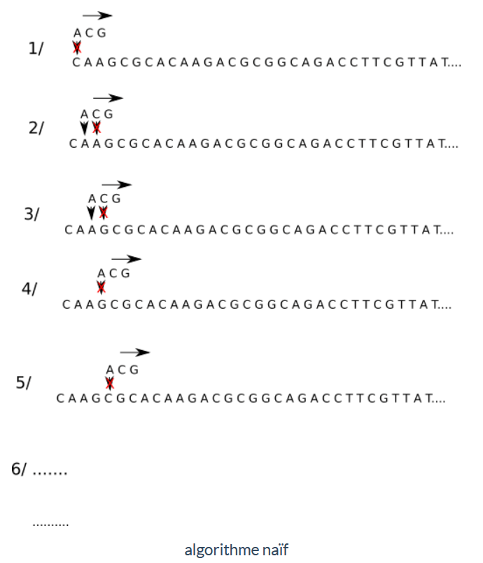
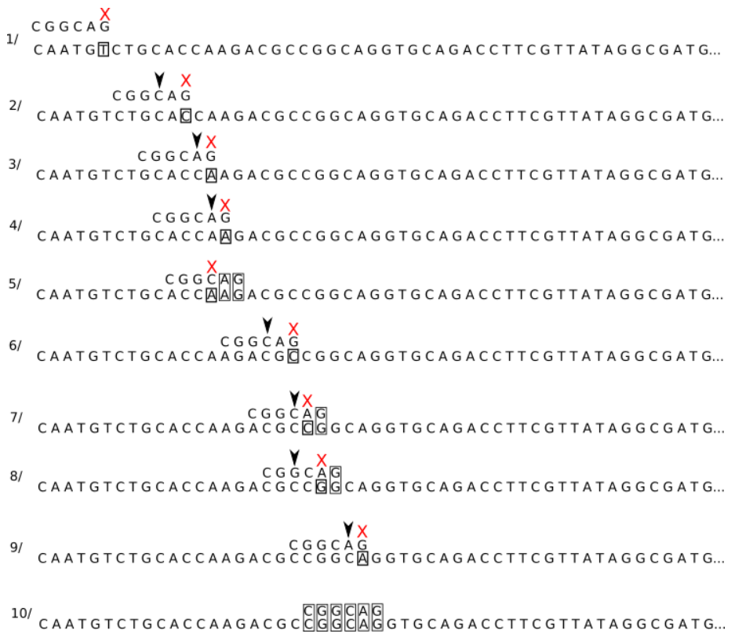
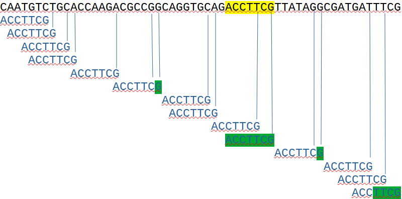
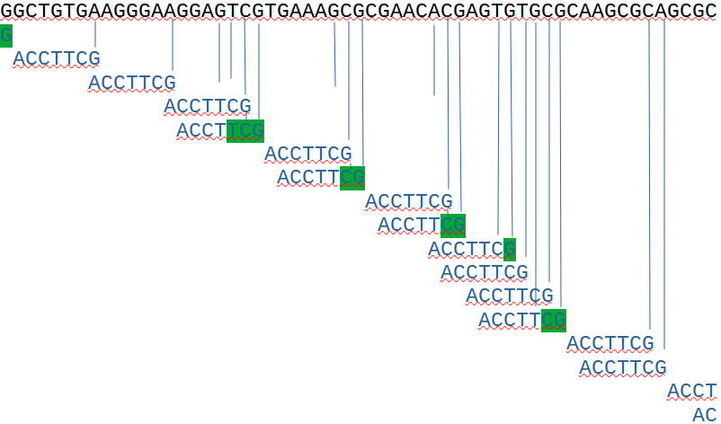
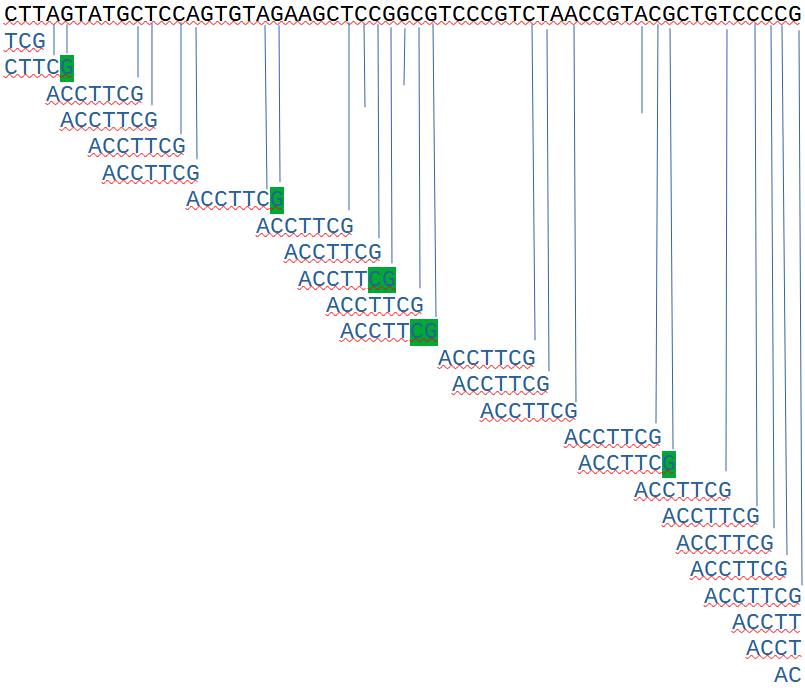
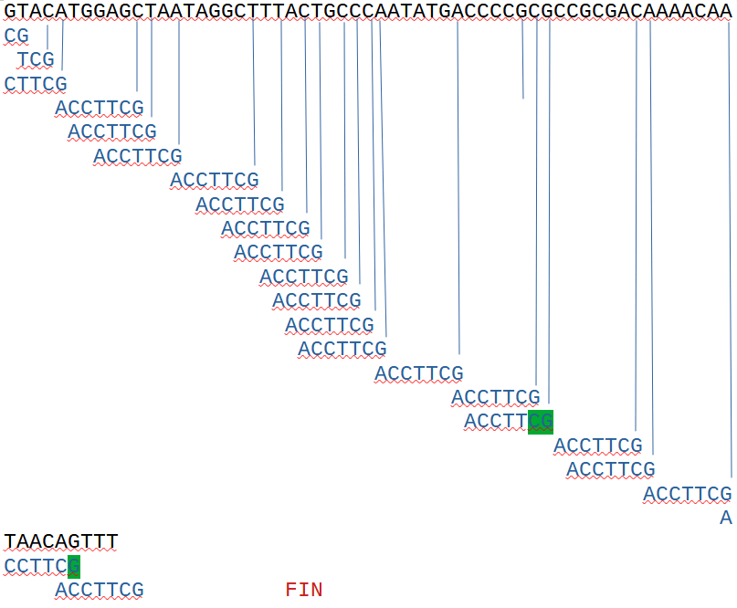

# Recherche textuelle

??? conclu "Programme"
    |Notions|Compétences|Remarques|
    |--|--|--| 
    Recherche textuelle.| Étudier l’algorithme de Boyer-Moore pour la recherche d’un motif dans un texte. | Étudier l’algorithme de Boyer-Moore pour la recherche d’un motif dans un texte.

## Introduction

On s'intéresse dans ce chapitre à la **recherche** des occurences d'une chaîne de caractère **dans un texte**. On appellera cette chaîne le **motif**.

Ce principe s'applique bien évidemment à la recherche lexicographique et de nombreux logiciels permettent de nos jours de rechercher un mot ou une phrase dans un texte avec une rapidité surprenante.

On la retrouve aussi en bio-informatique pour la recherche de gène dans l'ADN. L'ADN est composé de 4 nucléotides A(Adénine), G(Guanine), C(Cytosine) et T(Thymine) : on peut donc le considérer comme un texte d'un alphabet à 4 caractères et où le gène recherché sera le motif.

{.center}

Dès 1970, les informaticiens ont développé des algorithmes de recherche d'un motif dans un texte parmi lesquels on peut citer :

- l'algorithme de **Knuth-Morris-Pratt** (1970)
- l'algorithme de **Boyer-Moore** (1976) que nous étudierons dans ce cours

## Algorithme de recherche naïf

### Rappel sur les chaînes de caractères

Une chaîne de caractère en Python est un objet non mutable, c'est à dire que pour la modifier, il faut enregistrer une copie.

Une chaîne s'écrit entre apostrophe ou entre guillement.

Elle est de type `string` (str). Soit `c` une chaîne de caractère, la longueur de `c` s'obtient avec l'instruction `len(c)`.

Comme pour les listes, les caractères d'une chaîne `c` sont numérotés de 0 à `len(c)-1` et le $i^{ème}$ caractère s'obtient avec `c[i-1]`.

### Un algorithme naïf

Reprenons l'exemple d'une recherche de motif dans un brin d'ADN :

```
CAAGCGCACAAGACGCGGCAGACCTTCGTTATAGGCGATGATTTCGAACCTACTAGTGGGTCTCTTAGGCCGAGCGGTTCCGAGAGATAGTGAAAGATGGCTGGGCTGTGAAGGGAAGGAGTCGTGAAAGCGCGAACACGAGTGTGCGCAAGCGCAGCGCCTTAGTATGCTCCAGTGTAGAAGCTCCGGCGTCCCGTCTAACCGTACGCTGTCCCCGGTACATGGAGCTAATAGGCTTTACTGCCCAATATGACCCCGCGCCGCGACAAAACAATAACAGTTTGCTGTATGTTCCATGGTGGCCAATCCGTCTCTTTTCGACAGCACGGCCAATTCTCCTAGGAAGCCAGCTCAATTTCAACGAAGTCGGCTGTTGAACAGCGAGGTATGGCGTCGGTGGCTCTATTAGTGGTGAGCGAATTGAAATTCGGTGGCCTTACTTGTACCACAGCGATCCCTTCCCACCATTCTTATGCGTCGTCTGTTACCTGGCTTGGCAT
		
```

On cherche le motif **ACG** dans ce brin, et on veut savoir combien de fois il apparaît et à quel endroit bien sur.

Nous allons commencer par le premier algorithme qui nous vient à l'esprit :

{width=80%}

!!! info "Algorithme naïf"
    1. On place le motif recherché au même niveau que les 3 premiers caractères de notre chaîne, le premier élément du motif ne correspond pas au premier élément de la chaîne (A et C), on décale le motif d'un cran vers la droite.
    2. Le premier élément du motif correspond au premier élément de la chaine (A et A) mais pas le second (C et A), on décale d'un cran vers la droite
    3. Le premier élément du motif correspond au premier élément de la chaine (A et A) mais pas le second (C et G), on décale d'un cran vers la droite
    4. Le premier élément du motif ne correspond pas au premier élément de la chaine (A et G), on décale d'un cran vers la droite.
    5. Le premier élément du motif ne correspond pas au premier élément de la chaine (A et C), on décale d'un cran vers la droite.
    6. On continue le processus jusqu'au moment où les 3 éléments du motif correspondent avec les 3 éléments de la chaine situés au même niveau. 

{{exercice(prem=1, titre="Recherche naïve de chaine")}}
    Ecrire une fonction de recherche naïve en python permettant de savoir si un motif est présent dans une chaîne, et si oui, à quelle place.

    {{IDE()}}

    ??? success "Correction"
        {{IDE('scripts/adn_naif')}}

    Cet algorithme naïf peut, selon les situations demander un très grand nombre de comparaisons, ce qui peut entraîner un très long temps de "calcul" avec des chaines très très longues. 

    En effet, la fonction doit teste $N-n$ positions dans `texte` et pour chacune effectuer jusqu'à $N-n$ comparaisons, soit jusqu'à $(N-n) \times n$. La complexité de cet algorithme est dans le pire des cas $O(N^2)$ car souvent $N>>n$.

    L'**algorithme de Boyer-Moore** permet de faire mieux en termes de comparaisons à effectuer.

## L'algorithme de Boyer-Moore : version simplifiée de Horspool

### A la main

Nous allons étudier une version simplifiée du meilleur algorithme connu de recherche textuelle : l'algorithme de Boyer-Moore qui a été proposé par Nigel Horspool.

Cet algorithme repose sur trois idées :

- on effecture un prétraitement du motif. Cela signifie que l'algorithme "connait" les caractères qui se trouvent dans le motif
- on compare le mot de droite à gauche à partir de sa dernière lettre.
- on n'avance pas dans le texte caractère par caractère, mais on utilise un décalage dépendant de la dernière comparaison effectuée.


Examinons toujours un exemple sur l'ADN. Soit la chaîne suivante :

```
CAATGTCTGCACCAAGACGCCGGCAGGTGCAGACCTTCGTTATAGGCGATGATTTCGAACCTACTAGTGGGTCTCTTAGGCCGAGCGGTTCCGAGAGATAGTGAAAGATGGCTGGGCTGTGAAGGGAAGGAGTCGTGAAAGCGCGAACACGAGTGTGCGCAAGCGCAGCGCCTTAGTATGCTCCAGTGTAGAAGCTCCGGCGTCCCGTCTAACCGTACGCTGTCCCCGGTACATGGAGCTAATAGGCTTTACTGCCCAATATGACCCCGCGCCGCGACAAAACAATAACAGTTT
```

et le motif **CGGCAG**



!!! info "Principe de l'algorithme Boyer-Moore"
    1. On commence la comparaison par la droite, G et T ne correspondent pas. Le prétraitement du motif nous permet de savoir qu'il n'y a pas de T dans ce dernier, on peut décaler le motif de 6 crans vers la droite.
    2. G et C ne correspondent pas, en revanche, on trouve 2 C dans le motif. On effectue un décalage du motif de 2 crans vers la droite afin de faire correspondre le C de la chaine (encadré sur le schéma) et le C le plus à droite dans le motif.
    3. G et A ne correspondent pas, il existe un A dans le motif, on effectue un décalage d'un cran.
    4. G et A ne correspondent pas, il existe un A dans le motif, on effectue un décalage d'un cran.
    5. G et G correspondent, A et A correspondent, mais C et A ne correspondent pas. À gauche du C, il n'y a plus de A, on peut donc effectuer un décalage de 4 crans.
    6. G et C ne correspondent pas, on effectue un décalage de deux crans pour faire correspondre les C.
    7. G et G correspondent, A et C ne correspondent pas, on effectue un décalage d'un cran
    8. G et G correspondent, A et G ne correspondent pas, on effectue un décalage de 2 crans (faire correspondre les G)
    9. G et A ne correspondent pas, on effectue un décalage d'un cran
    10. toutes les lettres correspondent, on a trouvé le motif dans la chaine.

    On peut remarquer que l'on a bien, en fonction des cas, effectué plusieurs décalages en un coup, ce qui, au bout du compte, permet de faire moins de comparaison que l'algorithme naïf. On peut aussi remarquer que plus le motif est grand et plus l'algorithme de Boyer-Moore sera efficace. 

{{exercice(titre="Algorithme de Boyer-Moore à la main")}}
    Appliquez l'algorithme de Boyer-Moore au cas suivant :

    ```
    CAATGTCTGCACCAAGACGCCGGCAGGTGCAGACCTTCGTTATAGGCGATGATTTCGAACCTACTAGTGGGTCTCTTAGGCCGAGCGGTTCCGAGAGATAGTGAAAGATGGCTGGGCTGTGAAGGGAAGGAGTCGTGAAAGCGCGAACACGAGTGTGCGCAAGCGCAGCGCCTTAGTATGCTCCAGTGTAGAAGCTCCGGCGTCCCGTCTAACCGTACGCTGTCCCCGGTACATGGAGCTAATAGGCTTTACTGCCCAATATGACCCCGCGCCGCGACAAAACAATAACAGTTT
            
    ```

    avec le motif **ACCTTCG**


    ??? success "Correction"
        
        
        
        
        

### Implémentation en Python

Pour implémenter efficacement cet algorithme, on va passer par un pré-traitement du nom pour facilement accéder au décalage à effectuer. On utilise un dictionnaire pour cela.   

{{IDE('scripts/boyer_moore')}}

{{exercice(titre="Algorithme de Boyer-Moore en Python")}}
    Après avoir analysé le programme, le tester avec les séquences de l'exercice précédent.

    ??? success "Correction"
        {{IDE('scripts/boyer_moore2')}}


{{exercice(titre="Modification de l'algorithme de Boyer-Moore")}}
    Modifiez l'algorithme de recherche de Boyer-Moore (version Horspool) de manière à identifier **tous** les emplacements du motif dans le texte avec l'exemple du brin d'adn.

    ??? success "Correction"
        {{IDE('scripts/boyer_moore3')}}

!!! note "Visualiser les algorithmes"
    A l'adresse suivante : [http://whocouldthat.be/visualizing-string-matching/](http://whocouldthat.be/visualizing-string-matching/)
    TODO: traduire [le code](https://github.com/justinj/string-matching-visualization) en français pour l'afficher directement sur ce site.
