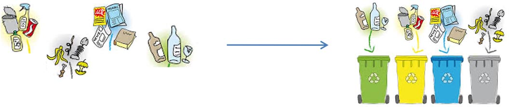
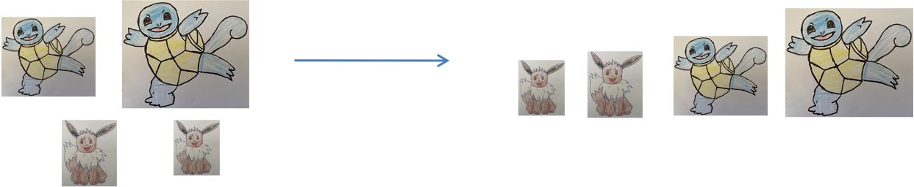

# Introduction aux algorithmes de tri

??? conclu "Programme"
	|Notions|Compétences|Remarques|
	|--|--|--|
    Tris par insertion, par sélection | Écrire un algorithme de tri.  Décrire un invariant de boucle qui prouve la correction des tris par insertion, par sélection. | La terminaison de ces algorithmes est à justifier.  On montre que leur coût est quadratique dans le pire cas.

??? abstract "Le tri en informatique"
    Dans la vie courante, les deux verbes trier et classer ne sont pas synonymes.
    - **Trier** ou effectuer un tri c’est répartir les éléments en paquets correspondant à un certain critère : par exemple séparer les déchets selon leur nature, les personnes d’une assemblée selon leur sexe ou selon leur langue maternelle.

    { width=80%; : .center }

    - **Classer** ou effectuer un classement c’est mettre des éléments selon un certain ordre : par exemple ranger les personnes d’une assemblée de la plus petite à la plus grande, ou de la plus jeune à la plus âgée.

    { width=80%; : .center }

    !!! info "Définition à retenir"
        En informatique le **tri**  est à prendre avec le sens de **classement**.

{{exercice(prem=1, titre="Algorithmes de tri")}}
    Le lien suivant va nous aider à imaginer des algorithmes de tris en manipulant des cartes :

    [Simulateur de jeu de cartes](https://deck.of.cards/){ .md-button target="_blank" rel="noopener" }

    💡 Vous devez imaginer et expliquer une méthode qui permette de trier des cartes. Il y a beaucoup de méthodes possibles ! A vous d'en trouver au moins une !

??? python "Le tri natif en Python avec `sorted`"
    👉 En Python, vous pourrez utiliser la fonction `sorted`
    === "`help(sorted)`"
        {{ IDE('scripts/help_sorted') }}

    === "`sorted(ma_liste)`"
        {{ IDE('scripts/tri_hello') }}

    === "`sorted(ma_liste, reverse = True)`"
        {{ IDE('scripts/reverse') }}

    - [Tri par sélection](selection.md)
    - [Tri par insertion](insertion.md)
    - [Exercices](exercices.md)

??? abstract "Compléments"
    <iframe loading="lazy" src="https://animations.interstices.info/methodes-tri/index.html" width="740" height="410" frameborder="0" scrolling="no" bis_size="{&quot;x&quot;:995,&quot;y&quot;:1284,&quot;w&quot;:740,&quot;h&quot;:410,&quot;abs_x&quot;:995,&quot;abs_y&quot;:1284}"></iframe>

    😊 Pour approfondir : [Interstices](https://interstices.info/les-algorithmes-de-tri/){ .md-button target="_blank" rel="noopener" }