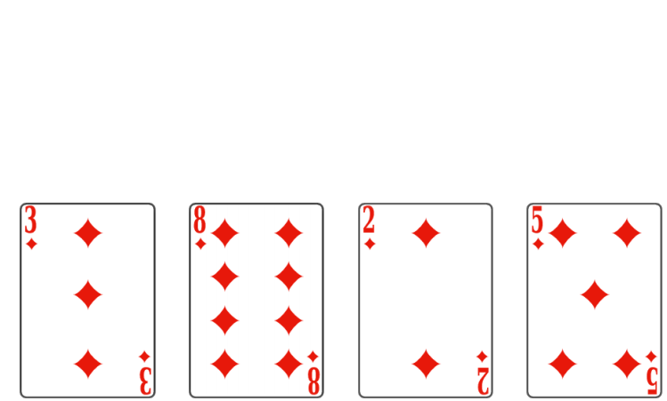
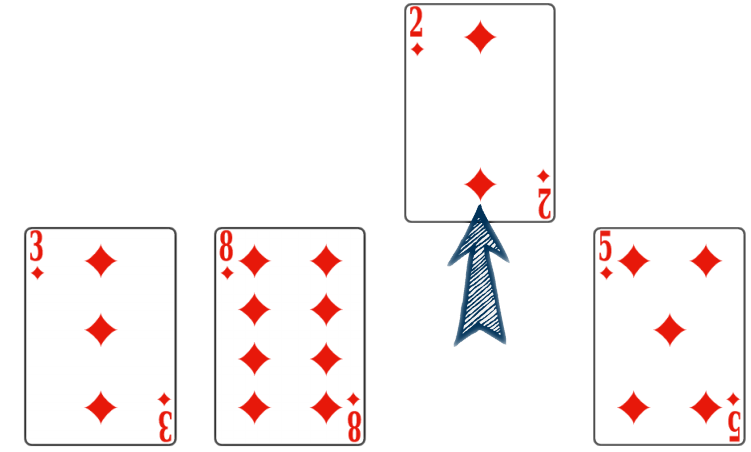
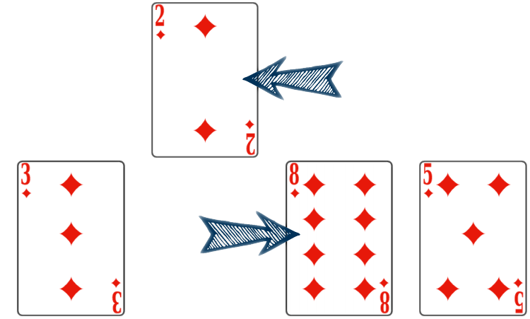
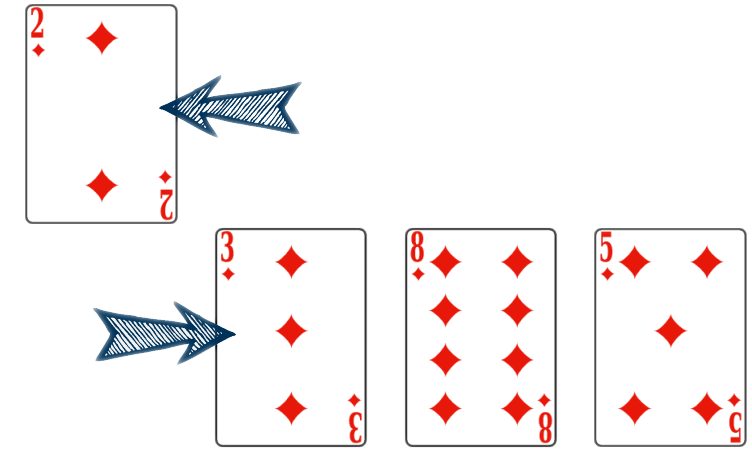
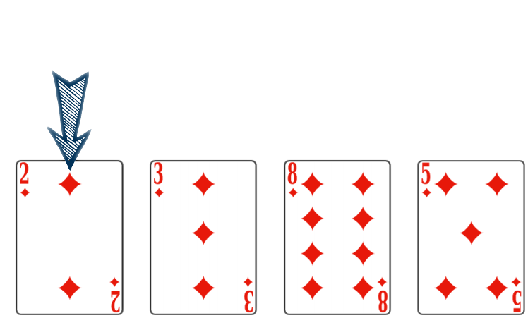
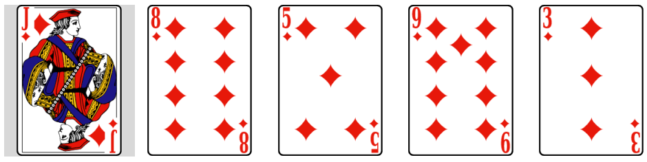
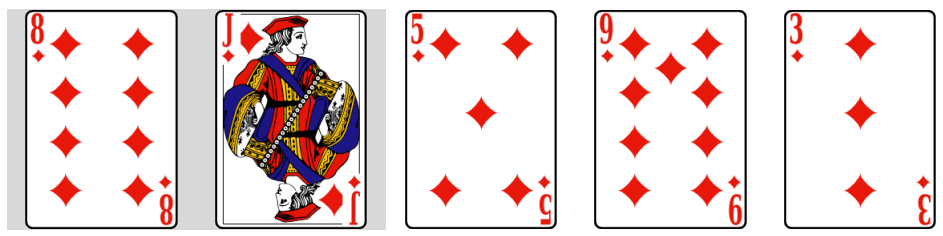
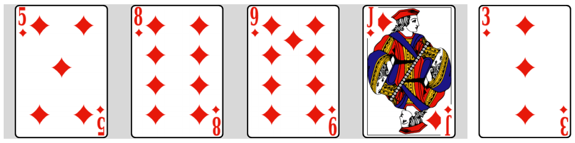
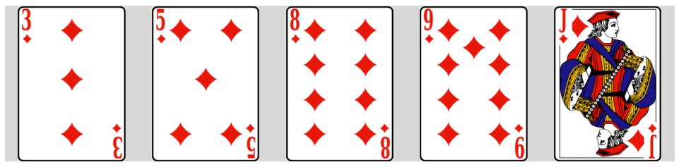

# Tri par insertion

??? abstract "Insérer la clef"
    <center>
    <iframe width="560" height="315" src="https://www.youtube.com/embed/bRPHvWgc6YM" title="YouTube video player" frameborder="0" allow="accelerometer; autoplay; clipboard-write; encrypted-media; gyroscope; picture-in-picture; web-share" allowfullscreen></iframe>
    </center>
    <font color="blue">Pour un tableau `tab` de taille `n`</font>  
    <pre><code style="background-color:black;color:white;width:100%;font-size: large;"><b>
    pour <font color="red">i</font> allant de 1 à n-1
        <font color="green">clef</font> ← tab[<font color="red">i</font>]
        insérer la clef au bon endroit dans tab 
    </b></code></pre>

??? info "Le tri par insertion en bref"

    L'opération, pour chaque position <b>`i`</b>, consiste à prendre l'éléments d'indice `i` (la clef) et à l'insérer à la bonne place dans le tableau des éléments d'indices `0` à`i - 1`. Ce processus assure que les `i` premiers éléments seront triés.  

    On pourra donc recommencer avec l'élément suivant (la clef suivante à l'indice `i + 1`).


{{exercice(prem=1, titre="Déroulé « *à la main* »")}}

    Considérons la situation suivante (utiliser les onglets afin de passer d'une étape à la suivante)

    === "Étape 0"
        On débute dans la situation où les premières cartes ont déjà été triées.
        
        Il faut désormais placer le $2$ convenablement.
        
        { width=50% .center}


    === "Étape 1"
        La première étape est de mettre cette carte de côté.

        On la sort du jeu.
        
        { width=50% .center}


    === "Étape 2"
        Cette étape réalisée, on va comparer sa valeur à la carte précédente. Ici le $8$ est strictement supérieur au $2$.
        
        On décale le $8$ vers la droite :

        { width=50% .center}


    === "Étape 3"
        On peut ensuite comparer le $2$ et le $3$.
        
        Là encore, le $3$ est strictement supérieur au $2$ : on le décale vers la droite.

        { width=50% .center}


    === "Étape 4"
        Le $2$ est remonté au début du tableau, le comparer à la carte précédente n'a pas de sens.
        
        On peut insérer le $2$ à cette position.
        
        { width=50% .center}

    ---

    Il est important de s'attarder sur deux points :

    * à quels éléments est-il **indispensable** d'appliquer l'algorithme ?
    * sous quelle condition peut-on décaler des éléments ?

    ???+ question "À quels éléments est-il **indispensable** d'appliquer l'algorithme ?"

        === "Cocher la ou les affirmations correctes"
            
            - [ ] À tous les éléments
            - [ ] À tous les éléments sauf le premier
            - [ ] À tous les éléments sauf le dernier
            - [ ] À un élément sur deux en partant du deuxième

        === "Solution"
            
            - :x: À tous les éléments
            - :white_check_mark: À tous les éléments sauf le premier
            - :x: À tous les éléments sauf le dernier
            - :x: À un élément sur deux en partant du deuxième

            En effet, le premier élément ne peut pas être décalé car au début du tableau. Il faut par contre aborder tous les autres éléments.

    ???+ question "Sous quelle condition peut-on décaler des éléments ?"

        === "Cocher la ou les affirmations correctes"
            
            - [ ] On décale un élément lorsque le précédent est strictement inférieur au suivant
            - [ ] On décale un élément lorsque le précédent est strictement supérieur au suivant
            - [ ] On ne peut pas décaler l'élément s'il est en deuxième position
            - [ ] On ne peut pas décaler l'élément s'il est en première position (à gauche du tableau)

        === "Solution"
            
            - :x: On décale deux éléments lorsque le précédent est strictement inférieur au suivant
            - :white_check_mark: On décale deux éléments lorsque le précédent est strictement supérieur au suivant
            - :x: On ne peut pas décaler l'élément si l'on est en deuxième position
            - :white_check_mark: On ne peut pas décaler l'élément si l'on est en première position

            La condition de décalage est double. Il faut ainsi que :

            * l'élément étudié ne soit **pas** au début du tableau,
            * l'élément précédent lui soit strictement supérieur.


{{exercice(titre="Algorithme du tri par insertion en Python")}}
    === "Principe"
        Avant d'écrire l'ensemble du tri, attardons nous sur les décalages de valeurs.

        Contrairement à l'exemple du tri de cartes, il est impossible de « sortir un élément » du tableau. Il est néanmoins possible de stocker sa valeur dans une variable temporaire.

        Les décalages vers la droite vont, quant à eux, alors dupliquer des valeurs ! Toutefois, chaque valeur dupliquée sera « écrasée » de proche en proche lors des décalages. En dernier lieu, la valeur à insérer viendra « écraser » la dernière valeur dupliquée.

        L'illustration ci-dessous présente ce fonctionnement dans le cadre d'un tableau. La valeur à insérer est stockée sur la gauche.
        <section>
            <canvas id="canvas"></canvas>
            <span id="bouton-melange" onclick="initialisation('insertion')">
                Tableau aléatoire
            </span>
            <span id="bouton-melange" onclick="croissant('insertion')">
                Tableau croissant
            </span>
            <span id="bouton-melange" onclick="decroissant('insertion')">
                Tableau décroissant
            </span>
            <p>
                <span id="bouton-lancer"
                    onclick="initialisation('insertion', document.getElementById('tableau').value)">
                    Trier votre tableau
                </span>
                <input type="text" id="tableau" placeholder="[valeur1, valeur2,...]" value="[3,4,2,1]">
            </p>
            <script>
                $().ready(() => {
                    setTimeout(
                        initialisation('insertion'),
                        500)
                }
                );
            </script>
        </section>
        Avant de transcrire en Python l'algorithme, gardons à l'esprit que :

        * il n'est pas indispensable d'aborder **tous** les éléments du tableau,
        * l'élément abordé dans une itération doit être stocké dans **une variable temporaire**,
        * la condition pour savoir s'il est possible de décaler des éléments est **double**,
        * lors de chaque décalage, on **duplique** un élément.

    === "En python"
        Compléter la fonction `#!py tri_insertion` prenant en argument un `#!py tableau` et le triant **en place** à l'aide du tri par insertion.

        {{ IDE('scripts/insertion') }}

    === "Utilisation"

        ??? question "tester le tri par insertion"

            Tester ci-dessous. Que s'est-il passé ?
        
            {{ IDE('scripts/tri_insertion') }}

        ??? success "Solution"

            La fonction n'a pas de `return`, c'est une procédure. Elle renvoie donc `None`

        ??? question "Que fait la fonction de tri par insertion ?"

            Tester ci-dessous. Que s'est-il passé ?
        
            {{ IDE('scripts/tri_ins_effet') }}

        ??? success "Solution"

            La liste de départ a été modifiée ...

            C'est ce qu'on appelle un **effet de bord**. La fonction a modifié **"en place"** la liste.


{{exercice(titre="Complexité du tri par insertion")}}

    Déterminons le coût de cet algorithme.

    ???+ question "Tri par insertion « *à la main* »"

        On considère le tableau $[6,\,1,\,4,\,5,\,2,\,3]$.

        === "Cocher la ou les affirmations correctes"
            
            - [ ] Lors de la première itération, le $6$ reste à sa place
            - [ ] Après deux itérations, le tableau est $[1,\,4,\,6,\,5,\,2,\,3]$
            - [ ] Après trois itérations, le tableau est $[1,\,2,\,4,\,6,\,5,\,3]$
            - [ ] Au total, la valeur $6$ sera déplacée 5 fois

        === "Solution"
            
            - :x: La première itération étudie la deuxième valeur, le $1$. Le $6$ sera donc décalé
            - :white_check_mark: Oui car on a traité les valeurs $1$ et $4$
            - :x: La troisième itération décale le $5$. On obtient donc $[1,\,4,\,5,\,6,\,2,\,3]$
            - :white_check_mark: Oui car cette valeur doit être décalée à la fin du tableau

    La performance du tri par insertion peut s'évaluer en nombre d'itérations élémentaires. Comme dans le cas du tri par sélection, il y a **deux boucles imbriquées** :

    * la boucle principale est une boucle « *Pour* ». Elle parcourt les valeurs de la deuxième à la dernière afin de les insérer à la bonne position à leur gauche,
    * chaque insertion est menée dans une seconde boucle « *Tant que* » qui décale la valeur vers la gauche.

    À l'issue de chaque tour de la boucle principale, on a inséré un élément sur la gauche et on est certain que **tous les éléments du début du tableau jusqu'à celui-ci inclus sont triés dans l'ordre croissant**.

    On présente ci-dessous les différentes étapes du tri. Chaque onglet correspond à une itération de **la boucle principale**.

    === "État initial"

        { width=70% .center}

    === "Après une itération"

        { width=70% .center}

    === "Après deux itérations"

        { width=70% .center}

    === "Après trois itérations"

        { width=70% .center}

    === "Après quatre itérations"

        { width=70% .center}

    ---

    Dans un tableau de $5$ valeurs, on effectue donc $4$ itérations de la boucle principale.

    Les différentes étapes de la boucle secondaire correspondent aux illustrations présentées en haut de la page.

    ???+ question "Combien d'itérations ? de lectures ?"

        On considère un tableau de $20$ valeurs initialement trié **dans l'ordre décroissant**.

        === "Cocher la ou les affirmations correctes"
            
            - [ ] La boucle principale va s'exécuter $19$ fois
            - [ ] Lors de la première itération de la boucle principale on doit lire $1$ valeur
            - [ ] La troisième itération de la boucle principale va effectuer $3$ décalages de valeurs
            - [ ] Lors de la dernière itération de la boucle principale on doit effectuer $1$ seul décalage

        === "Solution"
            
            - :white_check_mark: Oui car la première valeur n'est pas traitée par cette boucle
            - :x: On étudie la deuxième valeur et on la compare à la première. Il faut lire $2$ valeurs
            - :white_check_mark: On place correctement la quatrième valeur : elle remonte de trois positions. On effectue donc $3$ décalages
            - :x: Lors de la dernière itération, la dernière valeur remonte en première position. Il faut effectuer $19$ décalages


    ???+ question "Quel est le "pire des cas?""

        ??? success "Solution"

            Le **pire des cas** est atteint lorsque le tableau est trié dans l'ordre décroissant. Dans ce cas, pour un tableau de $N$ valeurs :

    **Dans le pire des cas** : 

    * la boucle principale effectue $N-1$ itérations,
    * la première boucle secondaire effectue $1$ décalage,
    * la deuxième effectue $2$ décalages,
    * la troisième $3$ décalages,
    * ...
    * la dernière boucle $N - 1$ décalages.

    On effectue donc au total $1 + 2 + 3 + \dots+(N-1)$ décalages. On retrouve la somme étudiée dans [cette page](../2_selection/#iii-complexite-du-tri-par-selection). Le coût de cet algorithme est donc **quadratique**.

    !!! info "Dans le *meilleur* des cas ?"

        Dans le cas où le tableau est initialement trié dans l'ordre croissant, l'algorithme n'effectuera qu'une seule comparaison et aucun échange à chaque itération de la boucle principale.
        
        Le coût sera alors **linéaire**.
        

    !!! abstract "💚 A retenir"

        La complexité du tri par insertion est quadratique : **Le coût est quadratique**.  
        On se place en effet dans le pire des cas : celui où le tableau est trié dans l'ordre décroissant.


{{exercice(titre="Mesures du temps de calcul")}}

    ??? note "On se place dans le pire des cas"

        Le pire des cas est celui où la liste est triée par ordre décroissant.


    ??? question "Vérifions sur une liste de taille 100000 ..."

        Recopier le script ci-dessous dans votre éditeur Python (pas en ligne) 
        
        Il faut attendre un peu, on trie une "grosse" liste ...

        ```python
        from timeit import timeit

        def tri_insertion(tableau):
            for i in range(1, len(tableau)):
                valeur_a_inserer = tableau[i]
                j = i
                while j > 0 and tableau[j - 1] > valeur_a_inserer:
                    tableau[j] = tableau[j - 1]
                    j = j - 1
                tableau[j] = valeur_a_inserer


        liste_croiss = [i for i in range(10000)]
        liste_decroiss = [i for i in range(10000,0,-1)]
        t_croiss = timeit("tri_insertion(liste_croiss)", number = 1, globals = globals())
        t_decroi = timeit("tri_insertion(liste_decroiss)", number = 1, globals = globals())
        print("t_croiss = ",t_croiss)
        print("t_decroi = ",t_decroi)
        ```

    !!! warning "Remarque"

        En nous inspirant de ce qui a été fait sur les tri par sélection, nous allons comparer le temps de tri pour différentes tailles de listes  
        💣 **Attention**, il y a une difficulté supplémentaire. Le tri par insertion est beaucoup plus lent si la liste n'est pas triée.   
        Nous avons vu que nous mesurons le pire des cas. Or le tri par insertion est à effet de bord. Donc n'oubliez pas que si vous avez chronométré le tri d'une liste une première fois , et que vous voulez recommencer une deuxième fois, il faut le faire sur la liste originale (indication : ou une copie de celle-ci...)

    ???+ question "regardons plus précisément"

        Recopier le script ci-dessous dans votre éditeur Python (pas en ligne). Que se passe-t-il ?

        ```python
        from timeit import timeit

        def tri_insertion(tableau):
            for i in range(1, len(tableau)):
                valeur_a_inserer = tableau[i]
                j = i
                while j > 0 and tableau[j - 1] > valeur_a_inserer:
                    tableau[j] = tableau[j - 1]
                    j = j - 1
                tableau[j] = valeur_a_inserer

        liste_tailles = [300, 900, 2700]
        liste_ref = [i for i in range(100,0,-1)] # liste [100, 99, 98, ..., 1]
        # pour chronométrer les 20 fois, on reprend à chaque fois une copie de la liste de départ list(liste_ref)
        tref = timeit("tri_insertion(list(liste_ref))", number = 20, globals = globals())
        print("n = 100 : tref = ",tref)
        for n in liste_tailles :
            print("n =", n, end = '')
            # Création de la liste triée par ordre décroissant de taille n : [n, n-1, ..., 1]
            liste_decr = [i for i in range(n, 0, -1)]
            # Temps d'éxécution du tri : il faut trier list(liste_decr) pour ne pas trier la liste déjà triée !
            temps = timeit("tri_insertion(list(liste_decr))", number = 20, globals = globals())
            # Affichage
            print('\t-> temps = ', round(temps, 2), '\t x', round(temps/tref, 2) )
            # Nouveau temps de référence avant le tour de boucle suivant
            tref = temps
        ```

        ??? success "Solution"

            Lorsque la taille de la liste et multipliée par 3, la temps est multiplié par 9. Or $3^2 = 9$

            Cela correspond bien à une complexité **quadratique**

    ??? info "Visulalisation du temps de calcul"
        {{jupyter('/algo/notebooks/temps_tri_insertion.ipynb')}}

    
??? "Correction de l'algorithme de tri par insertion et invariant de boucle"

    **Après la ième itération de la boucle for (boucle en i de l’algorithme fourni) les i premiers éléments sont triés.**  
    Cette propriété est un invariant de boucle pour le tri par insertion.  
    Cela se comprend aisément car dans chaque tour de boucle nous avions utilisé la fonction `insere` dont le rôle est de ranger les i premiers éléments de la liste par ordre croissant.  
  
    😀 Cet invariant de boucle prouve la correction du tri par insertion.

??? info "Terminaison de l'algorithme de tri par insertion"

	😒 La procédure de tri par insertion contient une boucle while.  

    A chaque fois qu'on écrit une boucle while, il faut s'interroger : est-on sûr que cette boucle va se terminer ?

    Rien de pire qu'un programme qui ne se termine jamais...

    Cette boucle s'arrête quand l'une des 2 conditions est fausse, donc quand :

    * `j <= 0`
    * ou `tableau[j - 1] <= valeur_a_inserer`

    ??? info "Le variant de boucle"

        👀 regardons ce qu'il se passe en détail :  
        Avant la boucle, `j` vaut `i` et `0 <= i <n`. 

        😀 Notons que si `i = 0` on n'entre pas dans la boucle, elle se termine d'emblée sans commencer. La terminaison est alors évidente.

        🏃 Sinon, on démarre avec `j` > 0, on entre donc dans la boucle. 

        Dans le corps de la boucle, `j` est décrémenté de 1.

        On a donc un entier positif qui décroît **strictement** à chaque itération.

        Le mot strictement est ici crucial, car si ce n'était pas strictement, il se pourrait qu'on itère indéfiniment sans que `j` diminue, mais dans notre exemple, `j` diminue forcément.

        Donc `j` finira par devenir négatif si on n'a pas été stoppé avant par l'autre condition.

        Ceci prouve que la boucle se termine. 

        <font color=" #c0392b"><b>j est un variant de boucle qui nous a permis de démontrer la terminaison de l'algorithme. </b></font>   
    
        Ici, ce **variant de boucle** est une quantité qui décroît strictement et finit donc inévitablement par atteindre une valeur "plancher" qui assure la terminaison.

??? python "A mémoriser : l'algorithme du tri par insertion"

	```python
    def tri_insertion(tableau):
        for i in range(1, len(tableau)):
            valeur_a_inserer = tableau[i]
            j = i
            while j > 0 and tableau[j - 1] > valeur_a_inserer:
                tableau[j] = tableau[j - 1]
                j = j - 1
            tableau[j] = valeur_a_inserer
    ```

??? info "A mémoriser : la complexité du tri par insertion"

	Le tri par insertion a une complexité **quadratique**, c'est à dire de l'ordre du carré de la taille de la liste à trier.


    
