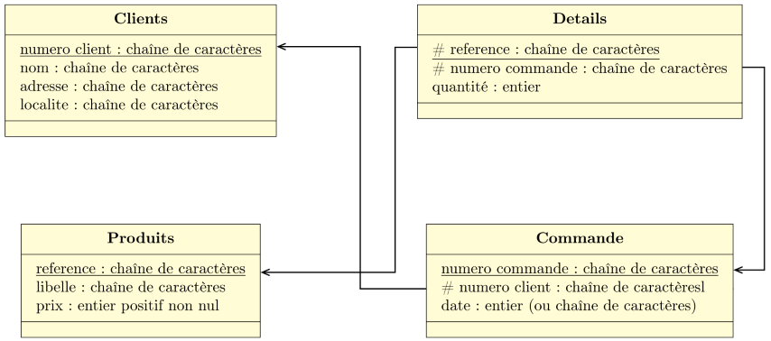

??? note "Correction"
    1.  
    **Commande** : (<u>Numéro de commande</u>, # numéro client, date) 
    **Client** : (<u>Numéro de client</u>, nom, adresse, ville) 
    **Produit** : (<u>Référence</u>, libelle, prix) 
    **Détail** : (<u># Référence, # numero de commande</u>, quantite)
    2.  
    
