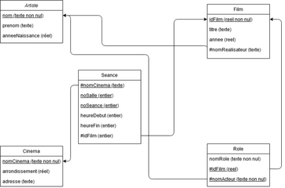

??? note "Correction"
    1. 5 relations : Artiste, Cinema, Film, Role, Seance.
    2. Artiste à 3 attributs : nom, prenom, anneeNaissance.
    3. La clé primaire d’Artiste est nom.
    4. Film a 4 attributs : idFilm, titre, annee, nomRealisateur.
    5. La clé primaire de Film est idFilm.
    6. La clé étrangère de Film est nomRealisateur.
    7. La clé étrangère de Film fait référence à l’attribut nom de la relation Artiste.
    8.  