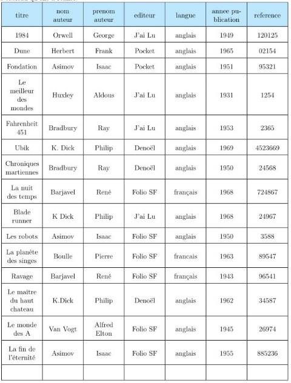
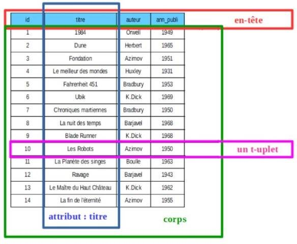
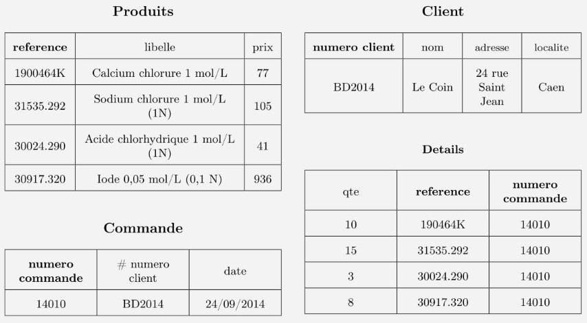
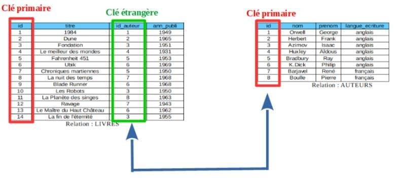
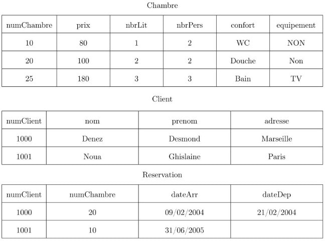
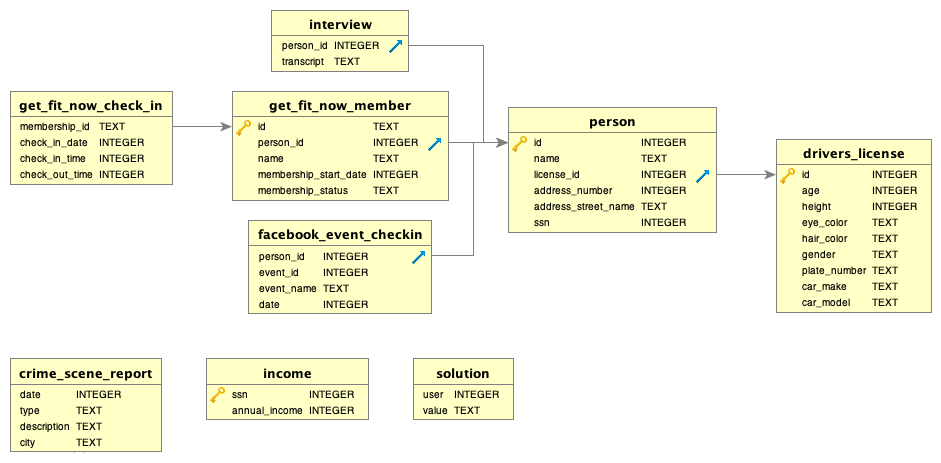

# Les bases de données

??? conclu "Programme"
    |Notions|Compétences|Remarques|
    |--|--|--| 
    Modèle relationnel : relation, attribut, domaine, clef primaire, clef étrangère, schéma relationnel. | Identifier les concepts définissant le modèle relationnel.|  Ces concepts permettent d’exprimer les contraintes d’intégrité (domaine, relation et référence).
    Base de données relationnelle.| Savoir distinguer la structure d’une base de données de son contenu.<br> Repérer des anomalies dans le schéma d’une base de données.| La structure est un ensemble de schémas relationnels qui respecte les contraintes du modèle relationnel.<br> Les anomalies peuvent être des redondances de données ou des anomalies d’insertion, de suppression, de mise à jour.<br> On privilégie la manipulation de données nombreuses et réalistes.
    Système de gestion de bases de données relationnelles.| Identifier les services rendus par un système de gestion de bases de données relationnelles : persistance des données, gestion des accès concurrents, efficacité de traitement des requêtes, sécurisation des accès.| Il s’agit de comprendre le rôle et les enjeux des différents services sans en détailler le fonctionnement.

## Introduction : limite du traitement des données

Faire l'activité **Indexation des ouvrages d'une bibliothèque** sur Capytale avec le code : `3793-623224`

--8<-- "docs/04-Bases_de_donnees/Corrections/Indexation_correction.md"

Faire l'activité **Manipuler des données avec une table** sur Capytale avec le code : `1e7e-623230`

--8<-- "docs/04-Bases_de_donnees/Corrections/Manipulation_correction.md"

## Le modèle relationnel

### Un peu d'histoire

Le modèle relationnel est une manière de modéliser les relations existantes entre plusieurs informations, et de les ordonner entre elles. Cette modélisation qui repose sur des principes mathématiques mis en avant par E.F. Codd (laboratoire de recherche d’IBM) est souvent implémentée dans une base de données.

|||
|:--:|:--:|
|1970| Edgar Franck Cood pose les bases du modèle relationnel|
|1974| Création du langage SQL|
|1979| Création du premier système de gestin de base de données Oracle|
|1980| Le volume mondial de données stockées est estimé à $10^{18}$ octets|
|1990| Le volume mondial de données stockées est estimé à $10^{19}$ octets|
|1995| Première version du langage MySQL|
|2002| Le volume mondial de données stockées est estimé à $10^{20}$ octets|
|2010| Le volume mondial de données stockées est estimé à $10^{21}$ octets|
|2014| Le volume mondial de données stockés est estimé à $10^{22}$ octets|

### Les limites des outils traditionnels

#### L'exemple de la médiathèque

Prenons l’exemple d’une médiathèque. Elle souhaite recenser les ouvrages qu’elle possède. Voici le tableau qu’elle a réalisé.

{: .center}

**Exercice 6**

- Identifiez les redondances dans ce tableau, et les éléments qui semblent uniques.
- Le livre de Ray Bradbury intitulé « Chroniques martiennes » est régulièrement indisponible car il est trop souvent emprunté. La médiathèque achète donc un deuxième exemplaire, paru chez le même éditeur. Il portera le numéro d’inventaire 236984. Complétez le
tableau avec ce nouvel ouvrage.
- Existe-t-il un élément unique qui va référencer totalement l’ouvrage?
- La médiathèque s’ouvre depuis peu à la bande dessinée. Elle souhaite enregistrer l’album de bande dessinée en langue française L’incal  noir , scénarisé par Alejandro  Jodorowsky , dessiné par Moebius et édité par Les humanoïdes associés en 1982 . Quel est (sont) le(s) problème(s) rencontré(s)?

--8<-- "docs/04-Bases_de_donnees/Corrections/Exercice6_correction.md"

#### Notion de base de données

Une donnée est une information représentée sous une forme conventionnelle, afin de pouvoir être traitée automatiquement. Une base de données (BDD) représente un ensemble ordonné de données dont l’organisation est régie par un modèle.

Les données sont généralement regroupées selon leur appartenance à un objet du monde réel.

- Le regroupement d’objets homogènes constitue une entité .
- Une entité est décrite par un ensemble d’ attributs .
- Chacun de ces attributs prend une valeur pour chaque objet.

*Exemple 1*

- Entité : un être humain
- Attributs : nom, prénom, date de naissance, lieu de naissance
- Valeurs : Young, Neil, 12 novembre 1945, Toronto

**Exercice 7**

On souhaite représenter les données issues de la carte nationale d’identité. À partir de votre carte personnelle, donnez le nom de l’entité correspondante, les attributs qui lui sont associés
et les valeurs qui vous sont propres.

--8<-- "docs/04-Bases_de_donnees/Corrections/Exercice7_correction.md"

### Le modèle relationnel

Vous pourrez visionnez cette video :

<iframe title="a70f2f7b-b471-4e66-90d2-5d6282a8e7f3-360" src="https://tube-sciences-technologies.apps.education.fr/videos/embed/d222f1d6-f8bd-4c5c-baf4-fe358b54d114" allowfullscreen="" sandbox="allow-same-origin allow-scripts allow-popups" width="560" height="315" frameborder="0"></iframe>

#### Les principes de base

Un des modèles de données le plus courant est le modèle relationnel. Les principes de base de ce modèle sont les suivants :

- séparer les données dans plusieurs tables
  - chaque table contient des données relatives à un même sujet
  - on évite la redondance des données
  - on ne stocke pas des données qui peuvent être calculées (exemple : une ligne Total)
- mettre les tables en relation par l’utilisation de clés
  - clés primaires : leurs valeurs (souvent des entiers) permettent d’identifier une donnée de manière unique
  - clés étrangères : elles référencent une clé primaire d’une autre table

#### Un exemple : le bon de commande

La société Le Coin, située à Caen, a commandé des produits chimiques à la société BonPrixChim.

Le bon de commande est indiqué ci-dessous :

{: .center}

À partir de ce bon de commande, on peut séparer les informations en 3 entités :

- une entité commande qui va regrouper les données de la commande;
- une entité client qui va regrouper les données du client;
- une entité produits qui va regrouper les données d’un détail.

{: .center}

**Exercice 8**

1. Établissez, pour chaque entité, la liste des attributs.
2. Représentez chaque entité par une table contenant les attributs et la liste de leurs valeurs.
3. Pensez-vous qu’il y ait des redondances? S’il y en a, modifiez les tables pour les supprimer.
4. En réalité, la table Produits n’est pas pertinente. Elle ne devrait contenir que les informations associées à un produit. Quels seraient ses attributs?
5. Construisez une quatrième table intitulé Details reprenant les attributs manquants.
6. Comment éditera-t-on le bon de commande?

--8<-- "docs/04-Bases_de_donnees/Corrections/Exercice8_correction.md"

#### Définition

!!! example "Définition"
    Une **relation** (on parle aussi de table) est composée d’un en-tête (le libellé des attributs ) et d’un corps composé d’un ou plusieurs t-uplets (on parle aussi d’enregistrement).
    
    {: .center}


#### Domaine de valeurs d'un attribut

Chaque valeur possède un type et un ensemble fini ou non des valeurs possibles. Cela constitue le domaine de valeurs d’un attribut.

*Exemple 2*

- L’attribut idAuteur de la relation Auteurs est un entier positif. Son type est entier . Le domaine de valeur correspond à tous les entiers de 0 à $+\infty$ .
- L’attribut titre de la relation Livres est une chaîne de caractères. Son type est chaîne de
caractères . Le domaine de valeur correspond à toutes les chaînes de caractères .

**Exercice 9**

Déterminez le domaine de valeurs des attributs de la relation Produits .

|reference |libelle| prix|
|:--:|:--:|:--:|
|1900464K  |Calcium chlorure 1 mol/L| 77|
|31535.292 |Sodium chlorure 1 mol/L (1N) |105|
|30024.290 |Acide chlorhydrique 1 mol/L (1N)|41|
|30917.320 |Iode 0,05 mol/L (0,1 N) |936|

--8<-- "docs/04-Bases_de_donnees/Corrections/Exercice9_correction.md"

#### Notion de clé primaire

À l’intérieur d’une relation, deux t-uplets identiques ne sont pas autorisés. Il faut pouvoir identifier de façon unique un t-uplet.

!!! example "Définition"
    Une clé primaire permet d’identifier un t-uplet de manière unique.

    Il faut déterminer, parmi les attributs, lequel permet d’identifier de manière unique un t-uplet.

    Cet attribut sera considéré comme la **clé primaire** de la relation.

Dans la figure précédente :

- L’attribut auteur ne peut pas jouer le rôle de clé primaire (deux ouvrages pouvant avoir le même auteur).
- De même pour les attributs titre et annPubli .
- Il reste donc l’attribut idLivre (pour identifiant), qui a été ajouté ici pour jouer le rôle de clé primaire.

!!! note "Remarque"
    Ici, nous avons créé artificiellement une clé primaire, car aucun des autres attributs ne pouvait convenir (ce n’est pas toujours le cas).

#### Clé étrangère

Dans la relation **Auteurs** , chaque auteur est identifié par l’attribut **idAuteur** (clé primaire de la relation).

Dans la relation **Livres** , on a rajouté un attribut **idAuteur** qui est la clé primaire de la relation
**Auteurs** .

!!! example "Définition"
    Une **clé étrangère** référence une clé primaire d’une autre table.

    {: .center}

L’attribut **idAuteur** est ce que l’on nomme une **clé étrangère** de la relation **Livres** , elle permet de faire le lien entre les deux relations.

!!! note "Remarque"
    Il peut y avoir plusieurs clés étrangères dans une relation.

**Exercice 10**

1. Reprenez les relations de l’exercice 8 , en identifiant une clé primaire pour chacune des tables, ou en en introduisant une si elle n’existe pas.
2. Justifiez que dans la relation Details , les attributs reference et numero commande ne peuvent pas constituer individuellement une clé primaire.
3. Justifiez que dans la relation Details , le couple (reference, numero commande) constitue une clé primaire.
4. Identifiez les clés étrangères.

--8<-- "docs/04-Bases_de_donnees/Corrections/Exercice10_correction.md"

#### Représentation du modèle relationnel

Le schéma d’une relation définit cette relation. Il est composé :

- du nom de la relation (on la place en tête, et en gras),
- de la liste de ses attributs avec les domaines respectifs dans lesquels ils prennent leurs valeurs (cette liste est placée entre parenthèses),
- de la clé primaire (elle est soulignée),
- des clés étrangères (on place un # entre la clé étrangère et la référence),
- des autres valeurs.

L’ensemble des relations peut être représenté soit par un schéma, soit par une notation textuelle.

*Exemple : notation textuelle*

**Livres** (<u>idLivre</u>, titre, idAuteur # Auteurs(idAuteur), annPubli)<br>
**Auteurs** (<u>idAuteur</u>, nom, prenom, langueEcriture)

*Exemple : schéma relationnel*

{: .center}

**Exercice 11**

Les relations de l'exercice 8 sont représentées ci-dessous :

{: .center}

Les clés primaires et étrangères ont été définies à l’exercice 10.

1. Écrivez la notation textuelle du modèle relationnel.
2. Réalisez le schéma relationnel.

--8<-- "docs/04-Bases_de_donnees/Corrections/Exercice11_correction.md"

### Les contraintes d'intégrité

Il est important d’assurer la cohérence et donc l’intégrité des données présentes dans une base de données. Cela consiste à s’assurer que les données stockées sont cohérentes entre elles, c’est à dire qu’elles respectent toutes les règles exigées par le concepteur de la base de données. C’est une assertion vérifiée par les données de la base, à tout moment.

!!! example "Définition"
    Une contrainte d’intégrité est une règle appliquée à un attribut ou une relation et qui doit toujours être vérifié.

    Les contraintes d’intégrité sont vérifiées par le système de gestion des bases de données (SGBD).

    Si l’une des règle n’est pas respectée, le SGBD signalera cette erreur et n’autorisera pas l’écriture de cette nouvelle donnée.

#### La contrainte de domaine

!!! example "Définition"
    Chaque attribut doit prendre une valeur dans son domaine de valeurs.

*Exemple*

- La note obtenue dans une matière doit être comprise entre 0 et 20;
- la quantité commandée est obligatoire ET doit être strictement supérieure à 0.

#### La contrainte de relation

!!! example "Définition"
    Chaque relation dans le modèle relationnel est identifiée par une clé primaire qui doit être **unique** et **non nulle** . Donc, chaque t-uplet est également identifié par une clé primaire.

#### La contrainte de référence

!!! example "Définition"
    Une clé étrangère dans une relation doit être une clé primaire dans une autre. De plus, le domaine de valeurs de ces deux clés doit être identique. Enfin, la valeur d’une clé étrangère doit exister dans la clé primaire qui y fait référence.


*Exemple*

Dans la figure ci-dessous, la valeur de la clé étrangère idAuteur ne peut pas être supérieure à 8.

{: .center}

### Exercices

**Exercice 12**

Dans l’exemple de la Médiathèque, on souhaite créer 3 relations :

-  Auteur , contenant toutes les informations sur un auteur
-  Livre , contenant toutes les informations sur un livre
-  Ouvrage , contenant toutes les informations sur un ouvrage disponible à l’emprunt.

<br>

1. Pour chacune des relations, indiquez les attributs avec leur type et leur domaine de valeurs.
2. Pour chacune des relations, indiquez la clé primaire et éventuellement la ou les clé(s) étrangère(s).
3. Représentez le schéma relationnel correspondant, ainsi que la notation textuelle qui lui est associée.

--8<-- "docs/04-Bases_de_donnees/Corrections/Exercice12_correction.md"

**Exercice 13**

Un laboratoire souhaite gérer les médicaments qu’il conçoit :

- Un médicament est décrit par un nom, qui permet de l’identifier. En effet il n’existe pas deux médicaments avec le même nom.
- Un médicament comporte une description courte en français, ainsi qu’une description longue en latin.
- On gère aussi le conditionnement du médicament, c’est à dire le nombre de pilules par boîte (qui est un nombre entier).
- À chaque médicament on associe une liste de contre-indications, généralement plusieurs, parfois aucune.
- Une contre-indication comporte un code unique qui l’identifie, ainsi qu’une description.
- Une contre-indication est toujours associée à un et un seul médicament.

Voici deux exemples de données :

- Le Chourix a pour description courte « Médicament contre la chute des choux » et pour description longue « Vivamus fermentum semper porta. Nunc diam velit, adipiscing ut tristique vitae, sagittis vel odio. Maecenas convallis ullamcorper ultricies. Curabitur ornare. ». Il est conditionné en boîte de 13.<br>
Ses contre-indications sont :

  - CI1 : Ne jamais prendre après minuit.
  - CI2 : Ne jamais mettre en contact avec de l’eau.

- Le Tropas a pour description courte « Médicament contre les dysfonctionnements intellectuels » et pour description longue « Suspendisse lectus leo, consectetur in tempor sit amet,
placerat quis neque. Etiam luctus porttitor lorem, sed suscipit est rutrum non. ». Il est conditionné en boîte de 42.<br>
Ses contre-indications sont :

  - CI3 : Garder à l’abri de la lumière du soleil.
  
<br>

1. Donnez la représentation sous forme de tables des relations Medicament et ContreIndication .
2. Écrivez le schéma relationnel permettant de représenter une base de données pour ce laboratoire.

--8<-- "docs/04-Bases_de_donnees/Corrections/Exercice13_correction.md"

## Les systèmes de gestion de base de données (SGBD)

### Un peu d'histoire

|||
|:--:|:--:|
|1960|développement de l’IMS (Information Management System) par la société IBM dans le cadre du programme Apollo.|
|1979| création du premier SGBD Oracle|
|1995| première version de MySQL|

### Définition

!!! example "Définition"
    Un Système de Gestion de Base de Données est un outil permettant aux utilisateurs de structurer, d’insérer, de modifier et de rechercher de manière efficace des données au sein d’une
    grande quantité d’informations stockées sur des mémoires partagées.

    {: .center}

### Propriétés

Les SGBD permettent de gérer la lecture, l’écriture ou la modification des informations contenues dans une base de données.

-  elles permettent de gérer les autorisations d’accès à une base de données. Il est en effet souvent nécessaire de contrôler les accès par exemple en permettant à l’utilisateur A de lire
et d’écrire dans la base de données alors que l’utilisateur B aura uniquement la possibilité de lire les informations contenues dans cette même base de données. Les accès sont ainsi
sécurisés.
-  les fichiers des bases de données sont stockés sur des disques durs dans des ordinateurs, ces ordinateurs peuvent subir des pannes. Il est souvent nécessaire que l’accès aux informations
contenues dans une base de données soit maintenu, même en cas de panne matérielle. Les bases de données sont donc dupliquées sur plusieurs ordinateurs afin qu’en cas de panne d’un ordinateur A, un ordinateur B contenant une copie de la base de données présente dans A, puisse prendre le relais. Tout cela est très complexe à gérer, en effet toute modification de la base de données présente sur l’ordinateur A doit entraîner la même modification de la base de données présente sur l’ordinateur B. Cette synchronisation entre A et B doit se faire le plus rapidement possible, il est fondamental d’avoir des copies parfaitement identiques en permanence. C’est aussi les SGBD qui assurent la maintenance des différentes copies de la base de données. On parle de persistance des données.
-  plusieurs personnes peuvent avoir besoin d’accéder aux informations contenues dans une base données en même temps. Cela peut parfois poser problème, notamment si les 2 personnes désirent modifier la même donnée au même moment (on parle d’accès concurrent).

Ces problèmes d’accès concurrent sont aussi gérés par les SGBD.

{: .center}

L’utilisation des SGBD explique en partie la supériorité de l’utilisation des bases de données sur des solutions plus simples à mettre en oeuvre; mais aussi beaucoup plus limitées comme les fichiers au format CSV.

L’interaction avec le SGBD se fait par l’intermédiaire de requêtes exprimées dans un langage devenu standard au fil des temps : le langage SQL (Structured Query Language).

!!! note "A Retenir"
    Un système de gestion de base de données doit pouvoir :

    -  décrire les données, indépendamment des applications;
    -  manipuler les données : dire QUOI sans dire COMMENT;
    -  contrôler les données pour s’assurer de leur intégrité ou qu’elles vérifient les contraintes;
    -  partager les données entre plusieurs utilisateurs;
    -  sécuriser les données (reprise après panne, journalisation).

## Le langage SQL

### Les requêtes d'interrogation

#### Construction d'une requête simple

Le langage SQL (Strutured Query Language) permet d’interroger les bases de données en traduisant les opérations par des mots-clés simples. C’est un langage normalisé.

!!! note "Remarque"
    Le langage SQL n’est pas sensible à la casse. néanmoins, il est coutumier d’écrire les mots-clés en majuscule.

!!! example "Définition"
    L’instruction de base pour l’interrogation d’une base de données en SQL est constituée du mot-clé `SELECT` suivi du mot-clé `FROM`.

      - `SELECT` permet de sélectionner les attributs dont il faut afficher les valeurs. Le caractère $*$ permet d’afficher les valeurs de tous les attributs.
      -  `FROM` permet de sélectionner la relation à explorer.

    Une requête SQL finit toujours par un point-virgule `;`

*Exemple*

On considère la relation **LIVRES** ( <u>id</u> , titre, auteur, ann_publi)

{: .center}

Elle contient les éléments suivants :

{: .center}

- Affichage de tous les titres présents dans la relation LIVRES

```sql
SELECT  titre 
FROM  livres;
```
renvoie l’affichage :

```
1984
Dune
Fondation
Farenheit  451
Chroniques  martiennes
```

- Affichage de tous les titres et années de publication présents dans la relation LIVRES

```sql
SELECT  titre,  ann_publi 
FROM  livres;
```
renvoie l’affichage :

```
1984,  1949
Dune,  1965
Fondation,  1951
Farenheit  451,  1953
Chroniques  martiennes,  1950
```

- Affichage de tous les attributs présents dans la relation LIVRES

```sql
SELECT  *
FROM  livres;
```

renvoie l’affichage :

```
1,  1984,  Orwel,  1949
2,  Dune,  Herbert,  1965
3,  Fondation,  Asimov,  1951
4,  Farenheit  451,  Bradbury  1953
5,  Chroniques  martiennes,  Bradbury,  1950
```

!!! example "Définition"
    Le mot-clé `DISTINCT` permet d’éviter l’affichage de doublons.

*Exemple*

- Affichage de tous les auteurs dans la relation LIVRES

```sql
SELECT  auteur 
FROM  livres;
```

renvoie l’affichage :

```
Orwell
Herbert
Asimov
Bradbury
Bradbury
```

- Affichage de tous les auteurs dans la relation LIVRES sans les doublons

```sql
SELECT  DISTINCT  auteur 
FROM  livres;
```

renvoie l’affichage :

```
Orwell
Herbert
Asimov
Bradbury
```

!!! example "Définition"
    Le mot-clé `ORDER BY` permet de trier les résultats par ordre croissant.<br>
    Pour trier par ordre décroissant, il faut ajouter l’option `DESC`.

*Exemple*

- Affichage de tous les auteurs et titre dans la relation LIVRES par ordre croissant de l’attribut **auteur**

```sql
SELECT  titre,  auteur 
FROM  livres 
ORDER  BY  auteur;
```

renvoie l’affichage :

```
Fondation,  Asimov
Farenheit  451,  Bradbury
Chroniques  martiennes,  Bradbury
Dune,  Herbert
1984,  Orwell
```

- Affichage de tous les auteurs et titre dans la relation LIVRES par ordre décroissant de l’attribut **ann_publi**

```sql
SELECT  DISTINCT  auteur,  titre 
FROM  livres
ORDER  BY ann_publi  DESC;
```

renvoie l’affichage :

```
Dune,  Herbert
Chroniques  martiennes,  Bradbury
Fondation,  Asimov
Farenheit  451,  Bradbury
1984,  Orwell
```

**Exercice 14**

On considère la relation COMMUNES dont une partie du contenu est représenté ci-dessous :

{: .center}

1. Quelle requête permet d’afficher tous les noms de commune?
2. Quelle requête permet d’afficher tous les noms de commune et leur population?
3. Quelle requête permet d’afficher tous les noms de commune et leur population, classé par ordre croissant de population?
4. Quelle requête permet d’afficher tous les noms de commune et leur population, classé par ordre décroissant d’élus municipaux?

--8<-- "docs/04-Bases_de_donnees/Corrections/Exercice14_correction.md"

#### Construction d'une requête avec une ou plusieurs restrictions

!!! example "Définition"
    Une restriction est une sélection de lignes d’une relation, sur la base d’une condition à respecter, définie à la suite du terme **WHERE** . Cette condition peut être une combinaison de comparaisons à l’aide de `AND` , de `OR` et de `NOT` (attention donc aux parenthèses dans ce cas).

!!! note "Remarque"
    Nous disposons de tous les opérateurs classiques de comparaison : $=, <>, >, >=, <, <=$.

*Exemple*

Reprenons la relation définie dans l’exemple sur la relation LIVRES.

- Affichage de tous les auteurs et titres dont le titre du livre est « 1984 »

```sql
SELECT  auteur,  titre 
FROM  livres 
WHERE  titre  =  '1984';
```

renvoie l’affichage :

```
Orwell,  1984
```

Affichage de tous les auteurs et titres dont le titre du livre n’est pas « 1984 »

```sql
SELECT  auteur,  titre 
FROM  livres 
WHERE  titre  <>  '1984';
```

renvoie l’affichage :

```
Herbert,  Dune
Asimov,  Fondation
Bradbury,  Farenheit  452
Bradbury,  Chroniques  martiennes
```

- Affichage de tous les auteurs et titres dont l’année de publication est inférieure ou égale à 1950

```sql
SELECT  auteur,  titre 
FROM  livres 
WHERE  ann_publi  <=  1950;
```

renvoie l’affichage :

```
Orwell,  1984
Bradbury,  Chroniques  martiennes
```

!!! note "Remarque"
    Pour les comparaisons de chaînes de caractères, il est important de faire attention à la casse. Par définition, un "a" est donc différent d’un "A". Pour remédier à ce problème, il
    existe les fonction UPPER() et LOWER() pour transformer une chaîne en respectivement majuscule et minuscule.

```sql
SELECT  auteur,  titre 
FROM  livres 
WHERE  UPPER(titre)  =  "DUNE";
```

**Exercice 15**

On reprend la relation COMMUNES de l’exercice 14.

1. Quelle requête permet d’afficher le nom des communes dont le nombre d’élus municipaux est strictement inférieur à 10?
2. Quelle requête permet d’afficher le nom des communes dont le nombre d’élus municipaux est strictement inférieur à 10 ET dont la population est inférieure ou égale à 100?
3. Quelle requête permet d’afficher le nombre d’élus municipaux et la population de la ville de « Cressin-Rochefort »? (NB : affranchissez vous de la casse)

--8<-- "docs/04-Bases_de_donnees/Corrections/Exercice15_correction.md"

!!! example "Définition"
    Une donnée manquante en SQL est repérée par un NULL. Il y a plusieurs raisons, bonnes ou mauvaises, pour avoir des données manquantes, et il est parfois utile de tester leur
    présence. Pour cela, nous allons utiliser le terme `IS  NULL` comme condition.

    Au contraire, si l’on veut uniquement les employés pour lesquels l’information est présente, nous devrons utiliser la négation avec `IS  NOT  NULL`.

*Exemple*

Affichage de tous les auteurs et titres dont l’année de publication est connue

```sql
SELECT  auteur,  titre 
FROM  livres 
WHERE  ann_publi  IS  NOT  NULL;
```

renvoie l’affichage :

```
Orwell,  1984
Herbert,  Dune
Asimov,  Fondation
Bradbury,  Farenheit  451
Bradbury,  Chroniques  martiennes
```

**Exercice 16**

On reprend la relation COMMUNES de l’exercice 14.

1. Quelle requête permet d’afficher le nom des communes dans lesquelles il y a eu un deuxième tour?
2. Quelle requête permet d’afficher le nom des communes dont la population est supérieure à 5 000 habitants et dans lesquelles il y a eu un deuxième tour?

--8<-- "docs/04-Bases_de_donnees/Corrections/Exercice16_correction.md"

!!! example "Définition"
    L’opérateur `LIKE` permet de rechercher les valeurs contenant une partie seulement de la chaîne de caractères. Le caractère $\%$ représente une suite de caractères, éventuellement nulle.

*Exemple*

Affichage de tous les auteurs et titres dont le titre contient le mot « Chronique » (remarquez l’absence du s final)

```sql
SELECT  auteur,  titre 
FROM  livres 
WHERE  titre  LIKE  "%Chronique%";
```

renvoie l’affichage :

```
Bradbury,  Chroniques  martiennes
```

**Exercice 17**

On reprend la relation COMMUNES de l’exercice 14.

1. Quelle requête permet d’afficher le nom des communes dont le nom commence par Roncherolles?
2. Quelle requête permet d’afficher le nom des communes dont le nom contient le mot « sur »?

--8<-- "docs/04-Bases_de_donnees/Corrections/Exercice17_correction.md"

#### Les fonctions d'agrégation


!!! example "Définition"
    La fonction d’agrégation `COUNT()` permet de compter le nombre d’enregistrement dans une table.

*Exemple*

Reprenons la relation définie dans le premier exemple.

- On compte tous les enregistrements présents dans la relation LIVRES.

```sql
SELECT  COUNT(*) 
FROM  livres;
```

renvoie l’affichage :


```
5
```

- On compte tous les enregistrements qui ont l’attribut ann_publi renseigné


```sql
SELECT  COUNT(ann_publi) 
FROM  livres;
```

renvoie l’affichage :

```
5
```

- On compte le nombre d’auteurs différents enregistrés


```sql
SELECT  COUNT(DISTINCT  auteur) 
FROM  livres;
```

renvoie l’affichage :


```
4
```

- On compte le nombre d’enregistrements pour lesquels l’année de publication est inférerieure ou égale à 1950


```sql
SELECT  COUNT(*) 
FROM  livres 
WHERE  ann_publi  <=  1950;
```

renvoie l’affichage :


```
2
```

!!! example "Définition"
    - La fonction `SUM(attribut)` permet donc de faire la somme des valeurs non nulles de l’attribut passé en paramètre.
    - La fonction `AVG(attribut)` permet de faire la moyenne des valeurs de l’attribut passé en paramètre.
    - La fonction `MEDIAN(attribut)` permet de faire la médiane des valeurs de l’attribut passé en paramètre.
    - La fonction `MIN(attribut)` permet d’afficher la valeur minimale de l’attribut passé en paramètre.
    - La fonction `MAX(attribut)` permet d’afficher la valeur maximale de l’attribut passé en paramètre.

*Exemple*

Reprenons la relation définie dans le premier exemple.

On affiche l’année de publication la plus petite :

```sql
SELECT  MIN(ann_publi) 
FROM  livres;
```

renvoie l’affichage :

```
1949
```

**Exercice 18**

On reprend la relation COMMUNES de l’exercice 14.

1. Quelle requête permet d’afficher le nombre total d’élus de toutes les communes?
2. Quelle requête permet d’afficher la moyenne du nombre d’habitants dans les communes?
3. Quelle requête permet d’afficher le nom de la ville avec la population la plus grande pour laquelle il n’y a pas de deuxième tour?

--8<-- "docs/04-Bases_de_donnees/Corrections/Exercice18_correction.md"

#### Les requêtes avec jointure

On a vu dans la partie consacrée au modèle relationnel, qu’une clé étrangère référence une clé primaire venant d’une autre table, suivant l’exemple ci-dessous :

{: .center}

Pour représenter le lien entre la clé étrangère et la clé primaire, on réalise une **jointure** .

Une jointure est l’opération consistant à rapprocher selon une condition les clé primaire et clé étrangère de deux relations.

La syntaxe est : 

```sql
relation1
JOIN  relation2  ON  relation1.attribut1  = relation2.attribut2;
```

La jointure se positionne après les clauses `SELECT` et `FROM`

```sql
SELECT  attribut 
FROM  relation1 
JOIN  relation2  ON  realtion1.attribut1  =  realtion2.attribut2;
```

*Exemple*

Suivant le schéma ci-dessus,on écrirait:

```sql
SELECT livres
FROM Livres
JOIN  Auteurs  ON  livres.idAuteur  =  auteurs.id;
```

**Exercice 19**

On considère les deux relations représentés ci-dessous :

{: .center}

1. Quelle requête permet d’afficher l’auteur du livre dont le titre est « 1984 »?
2. Quelle requête permet d’afficher tous les auteurs qui ont publié un livre avant 1960 (strictement)?
3. Quelle requête permet d’afficher tous les titres des livres publiés par Pierre Boulle?
4. Quelle requête permet d’afficher l’auteur et le titre de tous les livres publiés avant 1960 (strictement)?

--8<-- "docs/04-Bases_de_donnees/Corrections/Exercice19_correction.md"


### Les requêtes de manipulation de données

#### Insertion de données

!!! example "Définition"
    L’instruction de base pour l’insertion de données dans une base est constituée du mot-clé `INSERT INTO` suivi du mot-clé `VALUES` .

    - `INSERT INTO` permet de sélectionner la relation dans laquelle on insère les données.
    - `VALUES` indique les valeurs qui doivent être insérées. Elles sont indiquées entre deux parenthèses.

    La syntaxe est :

    ```sql
    INSERT  INTO  relation 
    VALUES  (attribut1  =  valeur1,  attribut2  =  valeur2) 
    WHERE  condition;
    ```

*Exemple*

```
INSERT  INTO  Livres VALUES  (4,  "Les  Furtifs",  "Damasio",  2019);
```

{: .center}

- On insère des valeurs dans la relation Livres ;
- l’attribut id prend la valeur 4 ;
- l’attribut titre prend la valeur Les Furtifs ;
- l’attribut auteur prend la valeur Damasio ;
- l’attribut ann_publi prend la valeur 2019 .

**Exercice 20**

Au vu du diagramme relationnel suivant, indiquez les deux requêtes pour insérer le livre d’Alain Damasio intitulé "La Horde du Contrevent", paru en 2004 et publié en langue française.

{: .center}

--8<-- "docs/04-Bases_de_donnees/Corrections/Exercice20_correction.md"

#### Suppression de données

!!! example "Définition"
    L’instruction de base pour l’insertion de données dans une base est constituée du mot-clé `DELETE FROM`.

    La syntaxe est :

    ```sql
    DELETE  FROM  relation WHERE  condition
    ```

**Exercice 21**

1. Indiquez la requête permettant de supprimer le livre "Fondation" de la relation Livres .
2. Indiquez la requête permettant de supprimer tous les livres d’Alain Damasio de la relation Livres .
3. Indiquez la requête permettant de supprimer tous les livres écrits avant 1945 de la relation Livres .

--8<-- "docs/04-Bases_de_donnees/Corrections/Exercice21_correction.md"

#### Modification de données

!!! example "Définition"
    L’instruction de base pour la modification de données dans une base est constituée du mot-clé `UPDATE` , suivi du mot-clé `SET` .

    - `UPDATE` permet de sélectionner la relation dans laquelle on insère les données.
    - `SET` indique les attributs qui doivent être modifiés, et les valeurs correspondantes.

    La syntaxe est :

    ```sql
    UPDATE  relation
    SET  attribut  =  valeur 
    WHERE  condition;
    ```

**Exercice 22**

1. Indiquez la requête permettant de renommer le livre "Fondation" en "Fondation - Tome 1" dans la relation Livres .
2. Le bibliothécaire de Gonneville-la-Mallet a inscrit par erreur que le livre d’Alain Damasio "La Zone du Dehors" a été publié en 2007, or sa première édition date de 1999. Indiquez la
requête permettant de corriger cette erreur dans la relation Livres .

--8<-- "docs/04-Bases_de_donnees/Corrections/Exercice22_correction.md"

### Exercices

**Exercice 23**

Soit la base de données d’un festival de musique : dans une représentation peut participer un ou plusieurs musiciens. Un musicien ne peut participer qu’à une seule représentation.

-  **Representation** (<u>numRep</u> , titreRep , lieu)
-  **Musicien** (<u>numMus</u> , nom , #numRep)
-  **Programmer** (<u>Date</u> , #numRep, tarif)

Indiquez les requêtes qui permettent d’obtenir :

1. La liste des titres des représentations.
2. La liste des titres des représentations ayant lieu au "théâtre allissa".
3. La liste des noms des musiciens et des titres des représentations auxquelles ils participent.
4. La liste des titres des représentations, les lieux et les tarifs du 25/07/2008.
5. Le nombre des musiciens qui participent à la représentations n°20.
6. Les représentations et leurs dates dont le tarif ne dépasse pas 20 euros.

--8<-- "docs/04-Bases_de_donnees/Corrections/Exercice23_correction.md"

**Exercice 24**

Soit le modèle relationnel suivant relatif à la gestion des locations de films :

-  **Clients** (<u>codecli</u>, prenomcli, nomcli, ruecli, cpcli, villecli)
-  **Films** (<u>codefilm</u>, nomfilm)
-  **Locations** (<u># codecli</u>, <u># codefilm</u>, datedebut, duree)

Indiquez les requêtes qui permettent d’obtenir :

1. L’insertion du film "The Raid" avec le code numéro 12.
2. L’insertion de client numéro 124 qui s’appelle Jean Talu (les autres informations sur ce client ne sont pas connues).
3. La suppression du film "Dans la peau de John Malkovitch".
4. Le renommage du film "Boulevard de la Mort" en "Death Proof".

--8<-- "docs/04-Bases_de_donnees/Corrections/Exercice24_correction.md"

**Exercice 25**

Soit la Base de données **hôtel** qui contient 3 relations :

-  **Chambre** (<u>numChambre</u>, prix, nbrLit, nbrPers, confort, equipement)
-  **Client** (<u>numClient</u>, nom, prenom, adresse)
-  **Reservation** (<u># numClient, # numChambre</u>, dateArr, dateDep)

Le contenu de chaque relation est :

{: .center}

Indiquez les requêtes qui permettent d’obtenir :

1. Les numéros de chambres avec TV.
2. Les numéros de chambres et leurs capacités.
3. La capacité théorique d’accueil de l’hôtel.
4. Le prix par personne des chambres avec TV.
5. Les numéros des chambres et le numéro des clients ayant réservé des chambres pour le 09/02/2004.
6. Les numéros des chambres coûtant au maximum 80 Euro, ou ayant un bain et valant au maximum 120 Euro.
7. Les Nom, Prénoms et adresses des clients dans le noms commencent par « D ».
8. Le nombre de chambres dont le prix est entre 85 et 120 Euro.
9. Les noms des clients n’ayant pas fixé la date de départ.

--8<-- "docs/04-Bases_de_donnees/Corrections/Exercice25_correction.md"

## Mise en pratique

### Base de données sur les prix Nobel

#### Exploration de la base

**Exercice 26**

1) Pour connaître l'ensemble des tables, il suffit d'écrire 

```sql
SELECT * 
FROM sqlite_master 
WHERE TYPE ="table";
``` 

et de valider.

2) A l'aide de la cellule ci-dessous, répondre aux questions :

{!{ sqlide titre="Base Prix Nobel" base="04-Bases_de_donnees/Documents/nobel.sqlite" }!}

a) Combien de relation possède la base de données?

b) Combien d'attributs possède la relation **nobel**?

c) Quel est le type de l'attribut **annee**?

--8<-- "docs/04-Bases_de_donnees/Corrections/Exercice26_correction.md"

#### Les requêtes d'interrogation

**Chaque requête devra se terminer par un `;` avant d'être exécutée.**

**Exercice 27**

{!{ sqlide titre="Base Prix Nobel" base="04-Bases_de_donnees/Documents/nobel.sqlite" }!}

1. Comment afficher le nom de tous les lauréats?
2. Comment afficher le nom de toutes les disciplines **en évitant les doublons**?
3. Quelle est la discipline de **Wilhelm Conrad Röntgen**?
4. Dans quelle discipline **Paul Krugman** est-il devenu Prix Nobel?
5. En quelle année **Albert Fert** a-t-il eu le prix Nobel?
6. Quelle est l’année de distinction de **Pierre Curie**?
7. Quelle est l’année de distinction et la matière de **Bertha von Suttner**?
8. Quels sont les lauréats distingués au XXI e siècle?
9. Quels sont les lauréats du prix Nobel de la Paix durant la deuxième guerre mondiale?
10. Quels sont les lauréats distingués en Médecine en 1901 et 2001?
11. Quels sont les lauréats des prix nobel de Physique et de Médecine en 2008?

--8<-- "docs/04-Bases_de_donnees/Corrections/Exercice27_correction.md"

#### Les requêtes d'agrégation

**Exercice 28**

{!{ sqlide titre="Base Prix Nobel" base="04-Bases_de_donnees/Documents/nobel.sqlite" }!}

1. Combien d’enregistrements au total comporte la relation?
2. Combien de personnes ont reçu le prix Nobel de la paix?
3. Combien de personnes ont reçu le prix Nobel de litérature?
4. Combien de personnes ont reçu le prix Nobel de mathématiques?
5. Combien de personnes ont reçu un prix Nobel en 1901?
6. Combien de personnes ont reçu un prix Nobel de chimie en 1939?
7. En quelle année a été décerné le premier prix Nobel d’économie?
8. Combien de prix Nobel a reçu **Marie Curie**?
9. Quels sont les prix lauréats, leur discipline et l’année de disctinction de tous les prix Nobel contenant cohen dans leur nom (on ne fera pas de distinction de casse)?
10. Combien y’a t’il eu de lauréats en Physique et en Chimie?
11. Combien y’a t’il eu de lauréats de Médecine et de littérature en 2000?
12. Nombre de lauréats différents parmi les prix nobels de la paix?

--8<-- "docs/04-Bases_de_donnees/Corrections/Exercice28_correction.md"

#### Les requêtes d'insertion

**Exercice 29**

{!{ sqlide titre="Base Prix Nobel" base="04-Bases_de_donnees/Documents/nobel.sqlite" }!}

1. En 2019, Esther Duflo a reçu le prix Nobel d’économie. Écrivez la requête permettant d’insérer cet enregistrement.
2. Quelle requête permet de modifier l’enregistrement précédent pour accoler le nom d’époux (Banerjee) après celui de Duflo?
3. De nombreuses pétitions circulent pour retirer le prix Nobel à Aung San Suu Kyi. Quelle requête permettrait cela?

--8<-- "docs/04-Bases_de_donnees/Corrections/Exercice29_correction.md"

### Base de données collectivités

#### Exploration de la base

**Exercice 30**

Dans la cellule ci-dessous, on a chargé la base de donnée `Collectivites.db`.

{!{ sqlide titre="Base Collectivites" base="04-Bases_de_donnees/Documents/Collectivites.db" }!}

1. Combien de relation possède la base de données?
2. Réalisez un schéma relationnel de cette base de données, sous la forme graphique, en précisant pour chaque attribut son type et s'il doit impérativement être rempli.

--8<-- "docs/04-Bases_de_donnees/Corrections/Exercice30_correction.md"

#### Collecte des informations

**Exercice 31**

La base **Collectivites** est vide. Il faut la remplir. Pour cela, en vous aidant d'internet, complétez les tableaux suivants :

|idCommune|Commune|Code Postal|Département|Nombre d'habitants|
|--:|--:|--:|--:|--:|
||Rouen||||
||Dieppe||||
||Enverneu||||
||Le Neubourg|27110|Eure||
||Igoville||||


|idDepartement|Département|Code d'immatriculation|
|--:|--:|--:|
||Seine-Maritime||
||Eure||
||Calvados||


--8<-- "docs/04-Bases_de_donnees/Corrections/Exercice31_correction.md"

#### Insertion des enregistrements

**Exercice 32**

{!{ sqlide titre="Base Collectivites" base="04-Bases_de_donnees/Documents/Collectivites.db" }!}

1. Insérez le département de Seine-Maritime.
2. Insérez la commune de Rouen.
3. Faîtes de même, en une seule requête, avec les communes de Dieppe et d’Envermeu.
4. Insérez la commune d’Igoville.
5. Insérez la commune du Neubourg.

--8<-- "docs/04-Bases_de_donnees/Corrections/Exercice32_correction.md"

**Exercice 33**

{!{ sqlide titre="Base Collectivites" base="04-Bases_de_donnees/Documents/Collectivites.db" }!}

En recherchant éventuellement les informations manquantes, indiquez le code SQL permettant de répondre aux consignes suivantes :

1. Trouville, Mézidon-Canon et Crèvecoeur-en-Auge sont des villes du Calvados.
2. Le vrai nom de Trouville est en fait Trouville-Sur-Mer.
3. Médizon-Canon et Crèvecoeur-en-Auge n’existent plus. Elles ont fusionné pour donner une nouvelle commune : Mézidon-Vallée-d’Auge.

--8<-- "docs/04-Bases_de_donnees/Corrections/Exercice33_correction.md"

#### Vérification des enregistrements

**Exercice 34**

{!{ sqlide titre="Base Collectivites" base="04-Bases_de_donnees/Documents/Collectivites.db" }!}

Indiquez le code SQL permettant de répondre aux consignes suivantes :

1. Combien il y a-t-il de départements différents enregistrés dans la base? (réponse : 3)
2. Combien il y a-t-il de communes différentes enregistrées dans la base? (réponse : 7)
3. Combien il y a-t-il de communes dans l’Eure enregistrées dans la base? (réponse : 2)
4. Combien il y a-t-il de communes en Seine-Maritime enregistrées dans la base? (réponse : 3)
5. Combien il y a-t-il de communes dans le Calvados enregistrées dans la base? (réponse : 2)

--8<-- "docs/04-Bases_de_donnees/Corrections/Exercice34_correction.md"

### Base consacrée au cinéma

#### Exploration de la base de données

**Exercice 35**

Dans la cellule ci-dessous, on a chargé la base de donnée `Cinema.sqlite`.

{!{ sqlide titre="Base Cinema" base="04-Bases_de_donnees/Documents/Cinema.sqlite" }!}

1. Combien de relations possède la base de données?
2. Combien d’attributs possède la relation Artiste?
3. Quelle est sa clé primaire?
4. Combien d’attributs possède la relation Film?
5. Quelle est sa clé primaire?
6. Quelle est sa clé étrangère?
7. Quelle est la référence de la clé étangère.
8. En procédant de la même façon pour toutes les tables, représentez le schéma relationnel sous forme graphique, en faisant bien figurer les relations entre les clé primaires et clés étrangères.

--8<-- "docs/04-Bases_de_donnees/Corrections/Exercice35_correction.md"

#### Requêtes simples

**Exercice 36**

{!{ sqlide titre="Base Cinema" base="04-Bases_de_donnees/Documents/Cinema.sqlite" }!}

Indiquez le code SQL permettant d’afficher :

1. les titres des films triés par ordre alphabétique.
2. Les prénoms, noms et année de naissance des artites nés avant 1950.
3. Les cinémas qui sont situés dans le 12ème arrondissement.
4. Les artistes dont le nom commence par la lettre H (on utilisera la commande LIKE).
5. Les acteurs dont on ignore la date de naissance (cela signifie que la valeur n’existe pas).
6. Le nombre de fois où Bruce Willis a joué le rôle de McLane (on utilisera la commande UPPER() pour s’affranchir de la casse).

--8<-- "docs/04-Bases_de_donnees/Corrections/Exercice36_correction.md"

#### Requêtes avec jointure

**Exercice 37**

On rapelle qu’une jointure consiste à rapprocher les clé primaire et étrangère de deux relations.

La syntaxe est la suivante :

```sql
SELECT  attribut 
FROM  relation1 JOIN  relation2  
ON  relation1.cle1  =  relation2.cle2;
```

{!{ sqlide titre="Base Cinema" base="04-Bases_de_donnees/Documents/Cinema.sqlite" }!}

Indiquez le code SQL permettant de répondre aux questions suivantes :

1. Quel est le nom et le prénom de l’acteur qui a joué Tarzan (pensez à la commande UPPER()).
2. Quelle est l’année de naissance du réalisateur de Reservoir Dogs?
3. Quels sont les titres des films dans lesquels a joué Woody Allen. Donnez aussi le rôle joué.
4. Quels films peut-on voir au cinéma Rex? (Attention aux doublons)
5. Quels films peut-on voir à 15h dans un cinéma parisien?
6. Quels sont les cinémas (nom, adresse et arrondissement) qui diffusent des films le matin.
7. Quels sont les cinémas (nom, adresse et arrondissement) qui diffusent des films le matin.<br>
Indiquez aussi le titre du film.
8.Quels films peut-on voir dans un cinéma du 12 e arrondissement? On donnera le titre du film, le cinéma dans lequel il est joué et son adresse.
9. Quels sont les nom et prénom des acteurs qui ont joué dans le film Vertigo.
10. Quel réalisateur a tourné dans ses propres films? Donnez le nom, le rôle et le titre des films.
11. Où peut-on voir le film Pulp Fiction? On donnera le nom, l’adresse du cinéma et numéro de la séance.
12. Où peut-on voir un film avec Clint Eastwood? On donnera le titre du film, le nom et l’adresse du cinéma, ainsi que l’heure de début du film.
13. Quels sont les cinémas (nom, adresse et arrondissement) ayant une salle de plus de 150 places et passant un film avec Bruce Willis?

--8<-- "docs/04-Bases_de_donnees/Corrections/Exercice37_correction.md"

#### Modification de la base cinéma

**Exercice 38**

{!{ sqlide titre="Base Cinema" base="04-Bases_de_donnees/Documents/Cinema.sqlite" }!}

1. On souhaite insérer un nouvel artiste. Il s’agit de Ridley Scott, né en 1937. Indiquez la requête SQL permettant de réaliser cette opération.
2. Ridely Scott est le réalisateur du film Blade Runner, sorti en 1982. Indiquez la requête SQL permettant de saisir ce nouvel enregistrement.
3. Les acteurs principaux sont Harisson Ford (né en 1942) dans le rôle de Rick Deckard et Rutger Hauer (né en 1944) dans le rôle de Roy Batty. Indiquez la requête SQL permettant de saisir ces nouveaux enregistrements.
4. Mark Hamill (né en 1951), Harisson Ford (né en 1942) et Carrie Fisher (née en 1956) sont les acteurs principaux du film L’empire contre attaque réalisé en 1980 par Irvin Kershner (né en 1923). Indiquez les requêtes SQL permettant de saisir ces enregistrements.
Indiquez l’ordre dans lequel il faut remplir les relations.
5. Le réalisateur moldave Mevatlave Kraspeck est décédé brutalement hier à l’âge de 103 ans. Le Rex décide de lui rendre hommage en diffusant le film Gant, Savon, Serviette et Ponge tourné en 1957 avec la star du cinéma muet Agathe Zeblouse (née en 1932) dans la
salle 1 de 13h à 16h, le film Shower on the Beach tourné en 1963 avec Camille Honnête (née en 1940) dans la salle 1 de 16h à 18h et Bains Moussants avec Jacques Célère (né en 1945 et décédé trop vite en 1969) tourné en 1967 dans la salle 2 de 15h à 18h. Indiquez
les requêtes SQL permettant de modifier les séances du cinéma Rex.

--8<-- "docs/04-Bases_de_donnees/Corrections/Exercice38_correction.md"

### [SQL Murder Mystery](https://mystery.knightlab.com/){target="_blank"}


Un meurtre  a été commis.  Comme vous  ne prenez jamais  de notes, vous  ne vous
souvenez plus du nom du meurtrier. Vous  vous souvenez juste que le meurtre a eu
lieu le 15 janvier 2018 dans la ville de SQL City.


Vous disposez ensuite de la base de données schématisée ici :



A vous de jouer :


{!{ sqlide titre="Entrez ici vos requêtes pour mener l'enquête:" base="04-Bases_de_donnees/Documents/sql-murder-mystery.db" espace="bddmm"}!}


Vous rentrerez ensuite votre solution ici :


{!{ sqlide titre="Votre solution:" sql="04-Bases_de_donnees/Documents/sqlmm-sol.sql" espace="bddmm"}!}