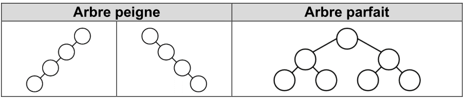
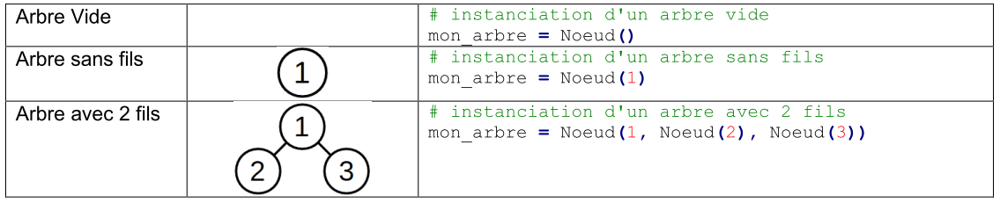
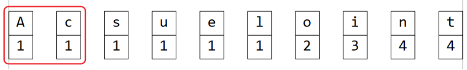
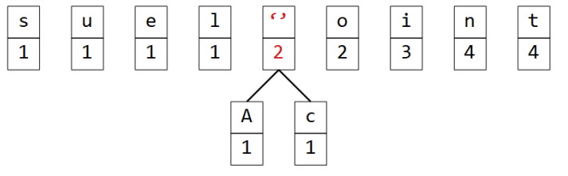

# Les arbres binaires

??? conclu "Programme"
    |Notions|Compétences|Remarques|
    |--|--|--| 
    Arbres : structures hiérarchiques.<br>Arbres binaires : nœuds, racines, feuilles, sous-arbres gauches, sous-arbres droits.|Identifier des situations nécessitant une structure de données arborescente.<br>Évaluer quelques mesures des arbres binaires (taille, encadrement de la hauteur, etc.).| On fait le lien avec la rubrique « algorithmique ».

{{exercice(1, titre="Introduction")}}
    !!! video "Regardez la vidéo"

        <iframe title="marmottes-enonce" src="https://tube-sciences-technologies.apps.education.fr/videos/embed/5c498de7-7a69-4bc8-9827-0d653ec25685" allowfullscreen="" sandbox="allow-same-origin allow-scripts allow-popups" width="560" height="315" frameborder="0"></iframe>

    1. Construisez un ou deux terriers correspondants à la consigne : un terrier qui minimise le nombre de trajets.<br>
    N'oubliez pas d'indiquer pour chaque arbre le nombre total de trajets fait pour toutes les marmottes du terrier. Pour chaque marmotte on prend le nombre de fois où elle se réveille fois le nombre de tunnels empruntés.
    2. Comparez avec les autres élèves de la classe les différents terriers créés. Caractérisez les arbres qui répondent le mieux à la question.
    3. Déterminez un algorithme de construction de terrier qui minimise le nombre de trajets.

    ??? success "Correction"
        1.  
        ```mermaid
        flowchart TD
                A(( )) --- B(( ))
                A --- C(( ))
                B --- D(( ))
                B --- E((5))
                C --- F((7))
                C --- G((8))
                D --- H((2))
                D --- I((3))
        ```
        2. Nombre de trajets: 2 x 6 + 3 x 6 + 5 x 4 + 7 x 4 + 8 x 4 = 110  
        3. Par exemple, si on a les réveils des marmottes suivants : 7; 3; 5; 9; 2; 4; 6  

            - on créé des terriers en les séparant en deux au bout de chacun, jusqu’à ce qu’il y ait autant de terrier que de marmottes (ici 7)      

            ```mermaid
            flowchart TD
                A(( )) --- B(( ))
                A --- C(( ))
                B --- D(( ))
                B --- E(( ))
                C --- F(( ))
                C --- G((9))
                D --- H((2))
                D --- I((3))
                E --- K((4))
                E --- L((5))
                F --- M((6))
                F --- N((7))
            ```

            - On place les marmottes le plus en haut suivant le nombre de réveil le plus haut, puis on descend au niveau inférieur et on recommence…
        
            Ici, le nombre de trajet est : 2  x 6 +  3 x 6 + 4 x 6 + 5 x 6 + 6 x 6 + 7 x 6 + 9 x 4 = 198


!!! info "Les arbres binaires"

    ??? video "Vidéo"
        <iframe title="arbre-definition" src="https://tube-sciences-technologies.apps.education.fr/videos/embed/d1870ca9-0274-4703-a04e-9edce320163b" allowfullscreen="" sandbox="allow-same-origin allow-scripts allow-popups" width="560" height="315" frameborder="0"></iframe>

    Un **arbre binaire** est une structure dite **arborescente** où chaque position donne accès sur exactement deux branches.

    Un arbre binaire est un ensemble fini de **noeuds** correspondant à l'un des deux cas suivants :

    - soit l'arbre est vide, c'est à dire qu'il ne contient aucun noeud.
    - soit l'arbre n'est pas vide et ses noeuds sont structurés de la manière suivante :
      - un noeud est appelé la **racine** de l'arbre.
      - la racine a deux branches (ou arêtes) qui forment récursivement deux sous-arbres (ou fils) appelés respectivement **sous-arbre gauche** et **sous-arbre droit**.
      
    Un noeud dont les sous-arbres sont vides est appelé **feuille**.

    Dans la figure ci-dessous, tous les arbres dessinés sont deux à deux distincts, ce qui confirme qu'il faut distinguer sous-arbre droit et gauche, et qu'un des sous-arbres peut être vide :

    {: .center}

{{exercice(titre="Nombre de noeuds")}}
    1. Dessiner tous les arbres binaires ayant 3 noeuds.
    2. Dessiner tous les arbres binaires ayant 4 noeuds.
 

    ??? success "Correction"
        Avec 3 noeuds :

        ```mermaid
        flowchart LR

            subgraph a [A]
                direction TB
                A(( )) --- B(( ))
                A --- C(( ))

            end

            subgraph b [B]
                direction TB
                D(( )) --- E(( ))
                D --- F(( ))
                E --- G(( ))
                E --- H(( ))
                style F opacity:0
                linkStyle 3 stroke-width:0px
                style H opacity:0
                linkStyle 5 stroke-width:0px

            end

            subgraph c [C]
                direction TB
                I(( )) --- J(( ))
                I --- K(( ))
                K --- M(( ))
                K --- L(( ))
                style J opacity:0
                linkStyle 6 stroke-width:0px
                style M opacity:0
                linkStyle 8 stroke-width:0px

            end

            subgraph d [D]
                direction TB
                N(( )) --- O(( ))
                N --- P(( ))
                O --- Q(( ))
                O --- R(( ))
                style P opacity:0
                linkStyle 11 stroke-width:0px
                style Q opacity:0
                linkStyle 12 stroke-width:0px

            end

            subgraph e [E]
                direction TB
                S(( )) --- T(( ))
                S --- U(( ))
                U --- V(( ))
                U --- W(( ))
                style T opacity:0
                linkStyle 14 stroke-width:0px
                style W opacity:0
                linkStyle 17 stroke-width:0px

            end

            a x--x | | b x--x | | c x--x | | d x--x | | e

        ```

        Avec 4 noeuds :

        ```mermaid
        flowchart LR

            subgraph a [A]
                direction TB
                A(( )) --- B(( ))
                A --- C(( ))
                B --- D(( ))
                B --- E(( ))
                D --- F(( ))
                D --- G(( ))

                style C opacity:0
                linkStyle 1 stroke-width:0px
                style E opacity:0
                linkStyle 3 stroke-width:0px
                style G opacity:0
                linkStyle 5 stroke-width:0px

            end

            subgraph b [B]
                direction TB
                A1(( )) --- B1(( ))
                A1 --- C1(( ))
                C1 --- D1(( ))
                C1 --- E1(( ))
                E1 --- F1(( ))
                E1 --- G1(( ))

                style B1 opacity:0
                linkStyle 6 stroke-width:0px
                style D1 opacity:0
                linkStyle 8 stroke-width:0px
                style F1 opacity:0
                linkStyle 10 stroke-width:0px

            end

            subgraph c [C]
                direction TB
                A2(( )) --- B2(( ))
                A2 --- C2(( ))
                B2 --- D2(( ))
                B2 --- E2(( ))
                E2 --- F2(( ))
                E2 --- G2(( ))

                style C2 opacity:0
                linkStyle 13 stroke-width:0px
                style D2 opacity:0
                linkStyle 14 stroke-width:0px
                style G2 opacity:0
                linkStyle 17 stroke-width:0px

            end

            subgraph d [D]
                direction TB
                A3(( )) --- B3(( ))
                A3 --- C3(( ))
                C3 --- D3(( ))
                C3 --- E3(( ))
                D3 --- F3(( ))
                D3 --- G3(( ))

                style B3 opacity:0
                linkStyle 18 stroke-width:0px
                style E3 opacity:0
                linkStyle 21 stroke-width:0px
                style F3 opacity:0
                linkStyle 22 stroke-width:0px

            end

            subgraph e [E]
                direction TB
                A4(( )) --- B4(( ))
                A4 --- C4(( ))
                C4 --- D4(( ))
                C4 --- E4(( ))
                D4 --- F4(( ))
                D4 --- G4(( ))

                style B4 opacity:0
                linkStyle 24 stroke-width:0px
                style E4 opacity:0
                linkStyle 27 stroke-width:0px
                style G4 opacity:0
                linkStyle 29 stroke-width:0px

            end

            subgraph f [F]
                direction TB
                A5(( )) --- B5(( ))
                A5 --- C5(( ))
                B5 --- D5(( ))
                B5 --- E5(( ))
                E5 --- F5(( ))
                E5 --- G5(( ))

                style C5 opacity:0
                linkStyle 31 stroke-width:0px
                style D5 opacity:0
                linkStyle 32 stroke-width:0px
                style F5 opacity:0
                linkStyle 34 stroke-width:0px

            end

            a x--x | | b x--x | | c x--x | | d x--x | | e x--x | | f

        ```

        ```mermaid
        flowchart LR

            subgraph a [A]
                direction TB
                A(( )) --- B(( ))
                A --- C(( ))
                B --- D(( ))
                B --- E(( ))

                style C opacity:0
                linkStyle 1 stroke-width:0px

            end

            subgraph b [B]
                direction TB
                A1(( )) --- B1(( ))
                A1 --- C1(( ))
                C1 --- D1(( ))
                C1 --- E1(( ))

                style B1 opacity:0
                linkStyle 4 stroke-width:0px

            end

            subgraph c [C]
                direction TB
                A4(( )) --- B4(( ))
                A4 --- C4(( ))
                B4 --- F4(( ))
                B4 --- G4(( ))

                style F4 opacity:0
                linkStyle 10 stroke-width:0px

            end

            subgraph d [D]
                direction TB
                A3(( )) --- B3(( ))
                A3 --- C3(( ))
                C3 --- D3(( ))
                C3 --- E3(( ))

                style E3 opacity:0
                linkStyle 15 stroke-width:0px

            end

            subgraph e [E]
                direction TB
                A2(( )) --- B2(( ))
                A2 --- C2(( ))
                B2 --- D2(( ))
                B2 --- E2(( ))

                style E2 opacity:0
                linkStyle 19 stroke-width:0px

            end

            subgraph f [F]
                direction TB
                A5(( )) --- B5(( ))
                A5 --- C5(( ))
                C5 --- D5(( ))
                C5 --- E5(( ))

                style D5 opacity:0
                linkStyle 22 stroke-width:0px

            end

            a x--x | | b x--x | | c x--x | | d x--x | | e x--x | | f

        ```


!!! info "Propriétés"
    **Taille** : nombre de noeuds d'un arbre.

    **Profondeur** : 
    
    {: .center}

    **Hauteur** : Profondeur maximale d'un arbre

    **Complet ou parfait** : c'est un arbre binaire de hauteur *h* tel qu'à chaque profondeur *p* tous les noeuds sont présents.


{{exercice(titre="Taille et hauteur")}}
    Déterminer les taille et hauteur de chaque arbre de l'activité précédente.

    ??? success "Correction"
        Avec 3 noeuds :

        ```mermaid
        flowchart LR

            subgraph a [Hauteur 2]
                direction TB
                A(( )) --- B(( ))
                A --- C(( ))

            end

            subgraph b [Hauteur 3]
                direction TB
                D(( )) --- E(( ))
                D --- F(( ))
                E --- G(( ))
                E --- H(( ))
                style F opacity:0
                linkStyle 3 stroke-width:0px
                style H opacity:0
                linkStyle 5 stroke-width:0px

            end

            subgraph c [Hauteur 3]
                direction TB
                I(( )) --- J(( ))
                I --- K(( ))
                K --- M(( ))
                K --- L(( ))
                style J opacity:0
                linkStyle 6 stroke-width:0px
                style M opacity:0
                linkStyle 8 stroke-width:0px

            end

            subgraph d [Hauteur 3]
                direction TB
                N(( )) --- O(( ))
                N --- P(( ))
                O --- Q(( ))
                O --- R(( ))
                style P opacity:0
                linkStyle 11 stroke-width:0px
                style Q opacity:0
                linkStyle 12 stroke-width:0px

            end

            subgraph e [Hauteur 3]
                direction TB
                S(( )) --- T(( ))
                S --- U(( ))
                U --- V(( ))
                U --- W(( ))
                style T opacity:0
                linkStyle 14 stroke-width:0px
                style W opacity:0
                linkStyle 17 stroke-width:0px

            end

            a x--x | | b x--x | | c x--x | | d x--x | | e

        ```

        Avec 4 noeuds :

        ```mermaid
        flowchart LR

            subgraph a [Hauteur 4]
                direction TB
                A(( )) --- B(( ))
                A --- C(( ))
                B --- D(( ))
                B --- E(( ))
                D --- F(( ))
                D --- G(( ))

                style C opacity:0
                linkStyle 1 stroke-width:0px
                style E opacity:0
                linkStyle 3 stroke-width:0px
                style G opacity:0
                linkStyle 5 stroke-width:0px

            end

            subgraph b [Hauteur 4]
                direction TB
                A1(( )) --- B1(( ))
                A1 --- C1(( ))
                C1 --- D1(( ))
                C1 --- E1(( ))
                E1 --- F1(( ))
                E1 --- G1(( ))

                style B1 opacity:0
                linkStyle 6 stroke-width:0px
                style D1 opacity:0
                linkStyle 8 stroke-width:0px
                style F1 opacity:0
                linkStyle 10 stroke-width:0px

            end

            subgraph c [Hauteur 4]
                direction TB
                A2(( )) --- B2(( ))
                A2 --- C2(( ))
                B2 --- D2(( ))
                B2 --- E2(( ))
                E2 --- F2(( ))
                E2 --- G2(( ))

                style C2 opacity:0
                linkStyle 13 stroke-width:0px
                style D2 opacity:0
                linkStyle 14 stroke-width:0px
                style G2 opacity:0
                linkStyle 17 stroke-width:0px

            end

            subgraph d [Hauteur 4]
                direction TB
                A3(( )) --- B3(( ))
                A3 --- C3(( ))
                C3 --- D3(( ))
                C3 --- E3(( ))
                D3 --- F3(( ))
                D3 --- G3(( ))

                style B3 opacity:0
                linkStyle 18 stroke-width:0px
                style E3 opacity:0
                linkStyle 21 stroke-width:0px
                style F3 opacity:0
                linkStyle 22 stroke-width:0px

            end

            subgraph e [Hauteur 4]
                direction TB
                A4(( )) --- B4(( ))
                A4 --- C4(( ))
                C4 --- D4(( ))
                C4 --- E4(( ))
                D4 --- F4(( ))
                D4 --- G4(( ))

                style B4 opacity:0
                linkStyle 24 stroke-width:0px
                style E4 opacity:0
                linkStyle 27 stroke-width:0px
                style G4 opacity:0
                linkStyle 29 stroke-width:0px

            end

            subgraph f [Hauteur 4]
                direction TB
                A5(( )) --- B5(( ))
                A5 --- C5(( ))
                B5 --- D5(( ))
                B5 --- E5(( ))
                E5 --- F5(( ))
                E5 --- G5(( ))

                style C5 opacity:0
                linkStyle 31 stroke-width:0px
                style D5 opacity:0
                linkStyle 32 stroke-width:0px
                style F5 opacity:0
                linkStyle 34 stroke-width:0px

            end

            a x--x | | b x--x | | c x--x | | d x--x | | e x--x | | f

        ```

        ```mermaid
        flowchart LR

            subgraph a [Hauteur 3]
                direction TB
                A(( )) --- B(( ))
                A --- C(( ))
                B --- D(( ))
                B --- E(( ))

                style C opacity:0
                linkStyle 1 stroke-width:0px

            end

            subgraph b [Hauteur 3]
                direction TB
                A1(( )) --- B1(( ))
                A1 --- C1(( ))
                C1 --- D1(( ))
                C1 --- E1(( ))

                style B1 opacity:0
                linkStyle 4 stroke-width:0px

            end

            subgraph c [Hauteur 3]
                direction TB
                A4(( )) --- B4(( ))
                A4 --- C4(( ))
                B4 --- F4(( ))
                B4 --- G4(( ))

                style F4 opacity:0
                linkStyle 10 stroke-width:0px

            end

            subgraph d [Hauteur 3]
                direction TB
                A3(( )) --- B3(( ))
                A3 --- C3(( ))
                C3 --- D3(( ))
                C3 --- E3(( ))

                style E3 opacity:0
                linkStyle 15 stroke-width:0px

            end

            subgraph e [Hauteur 3]
                direction TB
                A2(( )) --- B2(( ))
                A2 --- C2(( ))
                B2 --- D2(( ))
                B2 --- E2(( ))

                style E2 opacity:0
                linkStyle 19 stroke-width:0px

            end

            subgraph f [Hauteur 3]
                direction TB
                A5(( )) --- B5(( ))
                A5 --- C5(( ))
                C5 --- D5(( ))
                C5 --- E5(( ))

                style D5 opacity:0
                linkStyle 22 stroke-width:0px

            end

            a x--x | | b x--x | | c x--x | | d x--x | | e x--x | | f

        ```

!!! info "Arbres particuliers"
    {: .center}

{{exercice(titre="Un arbre en python")}}


    ??? question "Création de l'arbre"

        Une façon classique de représenter un arbre binaire en Python est de créer une **classe Noeud** :

        ```python
        class Noeud :
            """objet Noeud d'un arbre binaire"""
            def __init__(self, val = None, filsG = None, filsD = None) :
                self.set_val(val)
                self.set_filsG(filsG)
                self.set_filsD(filsD)
            
            def get_val(self):
                return self.val
        
            def set_val(self, nouvelle_val):
                self.val = nouvelle_val
            
            def get_filsG(self):
                return self.filsG
        
            def set_filsG(self, nouveau_filsG):
                self.filsG = nouveau_filsG
        
            def get_filsD(self):
                return self.filsD
        
            def set_filsD(self, nouveau_filsD):
                self.filsD = nouveau_filsD
            
            def __str__(self):
                return f"{self.get_val()}, {self.get_filsG()}, {self.get_filsD()}"
        ```

        Le noeud contient 3 attributs : sa valeur, ses fils droit et gauche. On peut y ajouter un affichage basique.

        **Utilisation de la classe Noeud**

        {: .center}

        **Consigne :**

        - Implémenter l'arbre suivant :

        {: .center}

        {{ IDE('scripts/noeud/exo', MAX=10) }}

    ??? question "Taille de l'arbre"

        Voici l'algorithme **récursif** de la fonction `taille` :

        ```
        Fonction taille(arbre):
        Si arbre est vide :
            Renvoyer 0
        Sinon :
            Renvoyer 1 + taille(arbre.filsG) + taille(arbre.filsD)
        Fin Si
        ```

        - Implémenter la fonction `taille` en vous aidant de l'algorithme précédent.

        {{ IDE('scripts/taille/exo', MAX=10) }}

    ??? question "Taille de l'arbre"

        Voici l'algorithme **récursif** de la fonction `hauteur` : 

        ```
        Fonction hauteur(arbre):
        Si arbre est vide :
            Renvoyer 0
        Sinon :
            Renvoyer 1 + max(hauteur(arbre.filsG) , hauteur(arbre.filsD))
        Fin Si
        ```

        - Implémenter la fonction `hauteur`

        {{ IDE('scripts/hauteur/exo', MAX=10) }}


{{exercice(titre="Parcours d'un arbre")}}

    On parcours un arbre pour "afficher" ou tester toutes les valeurs d'un arbres. Il existe 4 type de parcours :

    {: .center}


    On donne les algorithmes de parcours suivants :

    === "Parcours Préfixe"
        ```
        Fonction parcours_prefixe(arbre):
        Si arbre n'est pas vide :
            Noeud ← arbre.racine
            Afficher Noeud.valeur
            parcours_prefixe(arbre.gauche)
            parcours_prefixe(arbre.droit)
        Fin Si
        ```

    === "Parcours Infixe"
        ```
        Fonction parcours_infixe(arbre):
        Si arbre n'est pas vide :
            Noeud ← arbre.racine
            parcours_infixe(arbre.gauche)
            Afficher Noeud.valeur
            parcours_infixe(arbre.droit)
        Fin Si
        ```

    === "Parcours Suffixe"
        ```
        Fonction parcours_suffixe(arbre):
        Si arbre n'est pas vide :
            Noeud ← arbre.racine
            parcours_suffixe(arbre.gauche)
            parcours_suffixe(arbre.droit)
            Afficher Noeud.valeur
        Fin Si
        ```

    === "Parcours en Largeur d'abord"
        ```
        Fonction parcours_largeur(arbre):
        Enfiler(f,arbre.racine)
        Tant que f est non vide :
            x ← Defiler(f)
            Afficher x.valeur
            Si x.gauche est non nul :
            filsG ← x.gauche
            Enfiler(f,filsG.racine)
            Fin Si
            Si x.droit est non nul :
            filsD ← x.droit
            Enfiler(f,filsD.racine)
            Fin Si 
        Fin Tant que
        ```

    - Appliquez les 4 algorithmes "à la main" sur l'arbre binaire suivant et donner les valeurs dans l'ordre :

    {: .center}
    
    ??? success "Correction"
        - Préfixe : A B C E D F G I H J
        - Indixe : C E B D A I G F H J
        - Suffixe : E C D B I G J H F A
        - Largeur : A B F C D G H E I J


{{exercice(titre="Introduction aux arbres binaires de recherche (ABR)")}}


    {{jupy('abr.ipynb')}}
    {{jupy_cor('abr_corr.ipynb')}}


!!! info "Définition d'un Arbre binaire de recherche (ABR)"
    Un **arbre binaire de recherche** est un **arbre binaire** dont les valeurs peuvent être **comparées** (entiers, flottants, caractères, chaînes...) avec la règle suivante :

    **Pour tout noeud** de l'arbre :

    - Toutes les valeurs situées dans le **sous-arbre gauche** sont plus **petites** que la valeur du noeud.
    - Toutes les valeurs situées dans le **sous-arbre droit** sont plus **grandes** que la valeur du noeud.

    {: .center}


{{exercice(titre="Algorithmes de recherche dans un ABR")}}
    Complétez l'activité précédente avec les autres algorithmes de recherche.

    {{jupy('abr2.ipynb')}}
    {{jupy_cor('abr2_corr.ipynb')}}


??? example "Application : algorithme de Huffman"

    ??? question "Introduction"

        On cherche à crypter le mot **Anticonstitutionnel** sous forme d’une série de 0 et de 1.

        1.	Proposez un cryptage possible.
        2.	Quels peuvent être les inconvénients d’un tel cryptage?

    !!! info "Le principe de l’algorithme de Huffman"

        L’**algorithme de Huffman** (ou codage de Huffman) permet aussi d’encoder un message texte sous forme d’une série de 0 et de 1. La différence, c’est que ce codage s’appuie sur le nombre d’**occurrence** de chaque caractère.

        L’idée consiste à coder les caractères les **plus fréquents** par des mots binaires plus courts que les caractères les moins fréquents. Si bien que chaque caractère sera codé avec un nombre différent de bits que d’autres caractères du même texte, compliquant sérieusement le décodage par une personne malveillante ayant intercepté le message.

    ??? note "Arbre binaire de Huffman"
        Prenons toujours l’exemple du mot Anticonstitutionnel.

        **Comptage des occurrences**

        On indique pour chaque caractère du mot le nombre d’occurrence de ce caractère dans le mot. (on pourra mettre les résultats sous forme d’un tableau, d’un dictionnaire…)

        {: .center}

        **Tri par ordre croissant**

        On range cette « liste » dans l’ordre **croissant** (ou décroissant) des nombres d’ occurrences.

        {: .center}

        **Construction de l’arbre binaire « de Huffman »**

        On crée des **feuilles** pour chaque élément de la « liste », chacune **étiquetée** par un couple (caractère, nombre d’occurrence).

        {: .center}

        On sélectionne les **2 feuilles** dont le nombre d’occurrence est **le plus petit**.

        {: .center}

        On fusionne ces 2 feuilles dans un nouvel arbre. L’étiquette de ce nouvel arbre sera (’’,**somme des poids des deux feuilles**)

        {: .center}

        On supprime les 2 feuilles de la « liste » et on insère, **à la bonne place**, le nouvel arbre dans cette liste.

        {: .center}

        Par **récurrence**, on « vide » la liste et l’ensemble des feuilles et des arbres qui s’y trouve. Au final, on obtient un arbre unique : **l’arbre d’Huffman**.

        {: .center}

        **Mise en application : Codage**

        On peut maintenant utiliser cet arbre pour coder chaque caractère : en parcourant l’arbre de la racine à une feuille, on notera **0 si on part à gauche ou 1 si on part à droite**. On obtient ainsi la **table de codage**.

        {: .center} 

        {: .center}

        On obtient ainsi le codage d'**Anticonstitutionnel** :

        11100011011011101111101001010110100011101101111010100000001

        **Mise en application : Décodage**

        Un algorithme de cryptage ne servirait à rien si on ne pouvait pas décoder le message crypté.

        Dans notre cas, l’arbre de Huffman va permettre aussi bien de **coder** que de **décoder** un message, tout simplement en prenant les nombres 0 et 1 les uns à la suite des autres, on **parcourt** l’arbre en partant de la racine de l’arbre et en allant jusqu’à une feuille, puis en **recommençant** à partir de la racine.

{{exercice(titre="Utilisation de l'algorithmes de Huffman")}}

    **1. Codage**  
    En suivant l’algorithme de Huffman, Dessiner les arbres des Huffman, et donner les tables de codages des mots suivants :  
        - Attention  
        - Institutionnalisation  
    **2. Décodage**  
    On vous donne la série binaire et l’arbre de Huffman suivants :  
    `110101101101001001111000010110011001111010101111111100100111010111011101110101000010011001100000001`  
    {: .center}
    Décoder la série binaire et donner le texte en clair.
    ??? success "Correction"
        **1. Codage**

        En suivant l’algorithme de Huffman, Dessiner les arbres des Huffman, et donner les tables de codages des mots suivants :  
            - Attention  
            {: .center}  
            - Institutionnalisation  
            {: .center}  
        **2. Décodage**  
        On vous donne la série binaire et l’arbre de Huffman suivants :  
        `110101101101001001111000010110011001111010101111111100100111010111011101110101000010011001100000001`  
          

        Décoder la série binaire et donner le texte en clair.  
        **'Warriors deux mille vingt'**

{{exercice(titre="Huffman avec Python")}}
    **Version complète** : {{jupy('huffman.ipynb')}}  -  **Version à trou** : {{jupy('huffman_trou.ipynb')}}  
      
    {{jupy_cor('huffman_corr.ipynb')}}  


