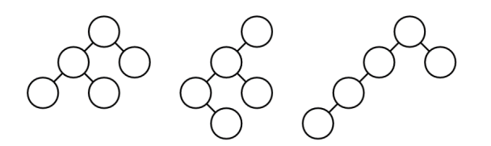
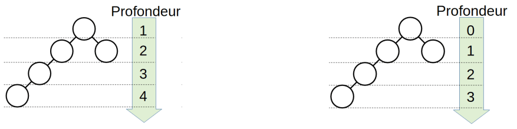
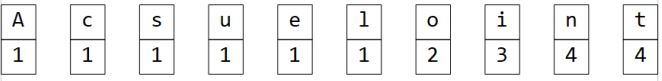
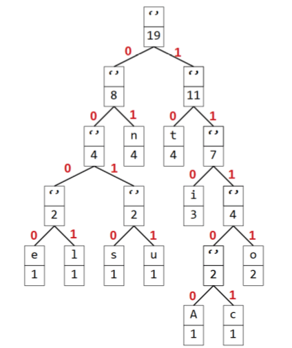
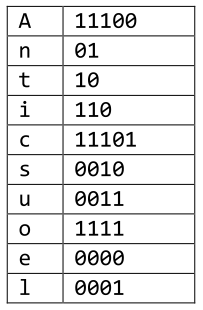

# Les arbres binaires

??? conclu "Programme"
    |Notions|Compétences|Remarques|
    |--|--|--| 
    Arbres : structures hiérarchiques.<br>Arbres binaires : nœuds, racines, feuilles, sous-arbres gauches, sous-arbres droits.|Identifier des situations nécessitant une structure de données arborescente.<br>Évaluer quelques mesures des arbres binaires (taille, encadrement de la hauteur, etc.).| On fait le lien avec la rubrique « algorithmique ».

## Intro

**Exercice 1**

Regardez la video :

<iframe title="marmottes-enonce" src="https://tube-sciences-technologies.apps.education.fr/videos/embed/5c498de7-7a69-4bc8-9827-0d653ec25685" allowfullscreen="" sandbox="allow-same-origin allow-scripts allow-popups" width="560" height="315" frameborder="0"></iframe>

1. Construisez un ou deux terriers correspondants à la consigne : un terrier qui minimise le nombre de trajets.<br>
N'oubliez pas d'indiquer pour chaque arbre le nombre total de trajets fait pour toutes les marmottes du terrier. Pour chaque marmotte on prend le nombre de fois où elle se réveille fois le nombre de tunnels empruntés.
2. Comparez avec les autres élèves de la classe les différents terriers créés. Caractérisez les arbres qui répondent le mieux à la question.
3. Déterminez un algorithme de construction de terrier qui minimise le nombre de trajets.

--8<-- "docs/09-Arbres/Corrections/Exercice1_correction.md"

## Les arbres binaires


Avec l'exercice 1 est introduite la structure de donnée nommée **arbre binaire**. Regardez une description de cette structure avec la video : 

<iframe title="arbre-definition" src="https://tube-sciences-technologies.apps.education.fr/videos/embed/d1870ca9-0274-4703-a04e-9edce320163b" allowfullscreen="" sandbox="allow-same-origin allow-scripts allow-popups" width="560" height="315" frameborder="0"></iframe>

### Définitions

!!!example "Définition"
    Un arbre binaire est une structure dite **arborescente** où chaque position donne accès sur exactement deux branches.

    Un arbre binaire est un ensemble fini de **noeuds** correspondant à l'un des deux cas suivants :

    - soit l'arbre est vide, c'est à dire qu'il ne contient aucun noeud.
    - soit l'arbre n'est pas vide et ses noeuds sont structurés de la manière suivante :
      - un noeud est appelé la **racine** de l'arbre.
      - la racine a deux branches (ou arêtes) qui forment récursivement deux sous-arbres (ou fils) appelés respectivement **sous-arbre gauche** et **sous-arbre droit**.
      
    Un noeud dont les sous-arbres sont vides est appelé **feuille**.

Dans la figure ci-dessous, tous les arbres dessinés sont deux à deux distincts, ce qui confirme qu'il faut distinguer sous-arbre droit et gauche, et qu'un des sous-arbres peut être vide :

{: .center}

**Exercice 2**

1. Dessiner tous les arbres ayant 3 noeuds.
2. Dessiner tous les arbres ayant 4 noeuds.


### Propriétés

!!!example "Propriétés"
    **Taille** : nombre de noeuds d'un arbre.

    **Profondeur** : 
    
    {: .center}

    **Hauteur** : Profondeur maximale d'un arbre

    **Complet ou parfait** : c'est un arbre binaire de hauteur *h* tel qu'à chaque profondeur *p* tous les noeuds sont présents.


**Exercice 3**

Déterminer les taille et hauteur de chaque arbre de l'exercice 2.

--8<-- "docs/09-Arbres/Corrections/Exercice2-3_correction.md"

### Arbres particuliers

{: .center}


### TP 1

Un façon classique de représenter un arbre binaire en Python est de créer une classe *Noeud* :

```python
class Noeud :
    """objet Noeud d'un arbre binaire"""
    def __init__(self, val = None, filsG = None, filsD = None) :
        self.set_val(val)
        self.set_filsG(filsG)
        self.set_filsD(filsD)
    
    def get_val(self):
        return self.val
  
    def set_val(self, nouvelle_val):
        self.val = nouvelle_val
    
    def get_filsG(self):
        return self.filsG
  
    def set_filsG(self, nouveau_filsG):
        self.filsG = nouveau_filsG
  
    def get_filsD(self):
        return self.filsD
  
    def set_filsD(self, nouveau_filsD):
        self.filsD = nouveau_filsD
    
    def __str__(self):
        return f"{self.get_val()}, {self.get_filsG()}, {self.get_filsD()}"
```

Le noeud contient 3 attributs : sa valeur, ses fils droit et gauche. On peut y ajouter un affichage basique.

#### Utilisation de la classe Noeud

{: .center}

**Exercice 4**

Créer l'arbre suivant dans Capytale avec le code suivant : `3213-1144872`

{: .center}

--8<-- "docs/09-Arbres/Corrections/Exercice4_correction.md"

#### Création de la fonction `taille`

Voici l'algorithme **récursif** de la fonction `taille` :

```
Fonction taille(arbre):
  Si arbre est vide :
    Renvoyer 0
  Sinon :
    Renvoyer 1 + taille(arbre.filsG) + taille(arbre.filsD)
  Fin Si
```

Completez le notebook de l'exercice 4 avec cet algorithme codé en Python, et testez-le.

#### Création de la fonction `hauteur`

Voici l'algorithme **récursif** de la fonction `hauteur` : 

```
Fonction hauteur(arbre):
  Si arbre est vide :
    Renvoyer 0
  Sinon :
    Renvoyer 1 + max(hauteur(arbre.filsG) , hauteur(arbre.filsD))
  Fin Si
```

Completez le notebook de l'exercice 4 avec cet algorithme codé en Python, et testez-le.


## Parcours dans un arbre

On parcours un arbre pour "afficher" ou tester toutes les valeurs d'un arbres. Il existe 4 type de parcours :

{: .center}

**Exercice 5**

On donne les algorithmes de parcours suivants :

**Parcours Préfixe :**

```
Fonction parcours_prefixe(arbre):
  Si arbre n'est pas vide :
    Noeud ← arbre.racine
    Afficher Noeud.valeur
    parcours_prefixe(arbre.gauche)
    parcours_prefixe(arbre.droit)
  Fin Si
```

**Parcours Infixe :**

```
Fonction parcours_infixe(arbre):
  Si arbre n'est pas vide :
    Noeud ← arbre.racine
    parcours_infixe(arbre.gauche)
    Afficher Noeud.valeur
    parcours_infixe(arbre.droit)
  Fin Si
```

**Parcours Suffixe :**

```
Fonction parcours_suffixe(arbre):
  Si arbre n'est pas vide :
    Noeud ← arbre.racine
    parcours_suffixe(arbre.gauche)
    parcours_suffixe(arbre.droit)
    Afficher Noeud.valeur
  Fin Si
```

**Parcours en Largeur d'abord :**

```
Fonction parcours_largeur(arbre):
  Enfiler(f,arbre.racine)
  Tant que f est non vide :
    x ← Defiler(f)
    Afficher x.valeur
    Si x.gauche est non nul :
      filsG ← x.gauche
      Enfiler(f,filsG.racine)
    Fin Si
    Si x.droit est non nul :
      filsD ← x.droit
      Enfiler(f,filsD.racine)
    Fin Si 
  Fin Tant que
```


Appliquez les 4 algorithmes "à la main" sur l'abre binaire suivant et donner les valeurs dans l'ordre :

1. {: .center}
2. {: .center}
3. {: .center}
4. {: .center}

--8<-- "docs/09-Arbres/Corrections/Exercice5_correction.md"

### TP 2

**Exercice 6**

Faire le TP dans Capytale dont le code est : `1f75-1144892`

--8<-- "docs/09-Arbres/Corrections/Exercice6_correction.md"

## Arbre binaire de recherche (ABR)

!!!example "Définition"
    Un **arbre binaire de recherche** est un **arbre binaire** dont les valeurs peuvent être **comparées** (entiers, flottants, caractères, chaînes...) avec la règle suivante :

    **Pour tout noeud** de l'arbre :

    - Toutes les valeurs situées dans le **sous-arbre gauche** sont plus **petites** que la valeur du noeud.
    - Toutes les valeurs situées dans le **sous-arbre droit** sont plus **grandes** que la valeur du noeud.

    {: .center}

### TP3

**Exercice 7**

1. Faire le TP Capytale dont le code est `f200-1144899`
2. Complétez l'exercice 7 avec les autres algorithmes de recherches.

--8<-- "docs/09-Arbres/Corrections/Exercice7_correction.md"

## Une application : l'algorithme de Huffman

### Introduction

On cherche à crypter le mot **Anticonstitutionnel** sous forme d’une série de 0 et de 1.

1.	Proposez un cryptage possible.
2.	Quels peuvent être les inconvénients d’un tel cryptage?

### Le principe de l’algorithme de Huffman

L’**algorithme de Huffman** (ou codage de Huffman) permet aussi d’encoder un message texte sous forme d’une série de 0 et de 1. La différence, c’est que ce codage s’appuie sur le nombre d’**occurrence** de chaque caractère.

L’idée consiste à coder les caractères les **plus fréquents** par des mots binaires plus courts que les caractères les moins fréquents. Si bien que chaque caractère sera codé avec un nombre différent de bits que d’autres caractères du même texte, compliquant sérieusement le décodage par une personne malveillante ayant intercepté le message.

### Mise en application : l’arbre binaire de Huffman

Prenons toujours l’exemple du mot Anticonstitutionnel.

#### Comptage des occurrences

On indique pour chaque caractère du mot le nombre d’occurrence de ce caractère dans le mot. (on pourra mettre les résultats sous forme d’un tableau, d’un dictionnaire…)

{: .center}

#### Tri par ordre croissant

On range cette « liste » dans l’ordre **croissant** (ou décroissant) des nombres d’ occurrences.

{: .center}

#### Construction de l’arbre binaire « de Huffman »

On crée des **feuilles** pour chaque élément de la « liste », chacune **étiquetée** par un couple (caractère, nombre d’occurrence).

{: .center}

On sélectionne les **2 feuilles** dont le nombre d’occurrence est **le plus petit**.

{: .center}

On fusionne ces 2 feuilles dans un nouvel arbre. L’étiquette de ce nouvel arbre sera (’’,**somme des poids des deux feuilles**)

{: .center}

On supprime les 2 feuilles de la « liste » et on insère, **à la bonne place**, le nouvel arbre dans cette liste.

{: .center}

Par **récurrence**, on « vide » la liste et l’ensemble des feuilles et des arbres qui s’y trouve. Au final, on obtient un arbre unique : **l’arbre d’Huffman**.

{: .center}

### Mise en application : Codage

On peut maintenant utiliser cet arbre pour coder chaque caractère : en parcourant l’arbre de la racine à une feuille, on notera **0 si on part à gauche ou 1 si on part à droite**. On obtient ainsi la **table de codage**.

{: .center} 

{: .center}

On obtient ainsi le codage d'**Anticonstitutionnel** :

11100011011011101111101001010110100011101101111010100000001

### Mise en application : Décodage

Un algorithme de cryptage ne servirait à rien si on ne pouvait pas décoder le message crypté.

Dans notre cas, l’arbre de Huffman va permettre aussi bien de **coder** que de **décoder** un message, tout simplement en prenant les nombres 0 et 1 les uns à la suite des autres, on **parcourt** l’arbre en partant de la racine de l’arbre et en allant jusqu’à une feuille, puis en **recommençant** à partir de la racine.

### Exercice

1. Codage
<br>
En suivant l’algorithme de Huffman, Dessiner les arbres des Huffman, et donner les tables de codages des mots suivants : 
    - Attention
    - Institutionnalisation
2. Décodage
<br>
On vous donne la série binaire et l’arbre de Huffman suivants :
<br>
110101101101001001111000010110011001111010101111111100100111010111011101110101000010011001100000001
<br>
{: .center}
<br>
Décoder la série binaire et donner le texte en clair.

--8<-- "docs/09-Arbres/Corrections/Huffman_correction.md"

### Mise en pratique sur Python

Faire le TP Capytale dont le code est `082a-1144905`

Une version "à trou" est disponible avec ce code : `36ea-1144909`

--8<-- "docs/09-Arbres/Corrections/HuffmanPy_correction.md"


  


