# Les Graphes

??? conclu "Programme"
    |Notions|Compétences|Remarques|
    |--|--|--| 
    Graphes : structures relationnelles.<br>Sommets, arcs, arêtes, graphes orientés ou non orientés. | Modéliser des situations sous forme de graphes.<br>Écrire les implémentations correspondantes d’un graphe : matrice d’adjacence, liste de successeurs/de prédécesseurs.<br> Passer d’une représentation à une autre. | On s’appuie sur des exemples comme le réseau routier, le réseau électrique, Internet, les réseaux sociaux.<br> Le choix de la représentation dépend du traitement qu’on veut mettre en place : on fait le lien avec la rubrique « algorithmique ».
    Algorithmes sur les graphes. | Parcourir un graphe en profondeur d’abord, en largeur d’abord.<br> Repérer la présence d’un cycle dans un graphe.<br> Chercher un chemin dans un graphe. | Le parcours d’un labyrinthe et le routage dans Internet sont des exemples d’algorithme sur les graphes.<br> L’exemple des graphes permet d’illustrer l’utilisation des classes en programmation.


  
## Intro : les graphes

### La notion de graphe non orienté

Imaginez un réseau social ayant 6 abonnés (A, B, C, D, E et F) où :

- A est ami avec B, C et D
- B est ami avec A et D
- C est ami avec A, E et D
- D est ami avec tous les autres abonnés
- E est ami avec C, D et F
- F est ami avec E et D

La description de ce réseau social, malgré son faible nombre d'abonnés, est déjà quelque peu rébarbative, alors imaginez cette même description avec un réseau social comportant des millions d'abonnés !

Il existe un moyen plus "visuel" pour représenter ce réseau social : on peut représenter chaque abonné par un cercle (avec le nom de l'abonné situé dans le cercle) et chaque relation "X est ami avec Y" par un segment de droite reliant X et Y ("X est ami avec Y" et "Y est ami avec X" étant représenté par le même segment de droite).

Voici ce que cela donne avec le réseau social décrit ci-dessus : 

{: .center}

Ce genre de figure s'appelle un **graphe**. Les graphes sont des objets mathématiques très utilisés, notamment en informatique.

Les cercles sont appelés des **sommets** ( parfois des nœuds ) et les segments de droites qui relient 2 sommets des **arcs** ( parfois des arêtes). 

Plus formellement on dira qu'un graphe G est un couple G = (V,E) avec V un ensemble de sommets et E un ensemble d'arêtes ( V et E pour Vertice (sommet) et Edge (arête) en anglais bien sûr !)

**Exercice 1**

Construisez un graphe de réseau social à partir des informations suivantes : 

- A est ami avec B et E 
- B est ami avec A et C 
- C est ami avec B,F et D 
- D est ami avec C,F et E 
- E est ami avec A,D et F 
- F est ami avec C, D et E 

??? note "Correction"
    
    ```mermaid
    graph
            A((A)) --- B((B))
            A --- E((E))
            B --- C((C))
            E --- F((F))
            E --- D((D))
            C --- F
            C --- D
            F --- D
    ```

### Vocabulaire sur les graphes

!!! example "Vocabulaire"
    Un graphe non orienté est une structure de données constituées d’objets, appelés **sommets**, et de relations entre ces sommets appelées **arcs**.

    Vous trouverez aussi des ouvrages où pour ces graphes on parle de **noeuds** ( sommets ) et d’**arêtes** (arcs) .

    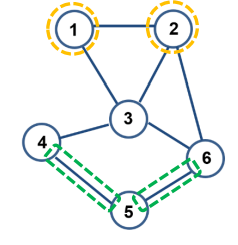{: .center}

    {: .center}

    Un **chemin** ( chaine ) est une suite d'arcs (arêtes) consécutifs dans un graphe, un peu comme si on se promenait sur le graphe. On le désigne par les lettres des sommets qu'il comporte.

    Un chemin ( une chaine ) est dit **élémentaire** si il ne comporte pas plusieurs fois le même sommet.

    Un chemin ( une chaine ) est dit **simple** si il ne comporte pas plusieurs fois le même arc.

    Un **cycle** est un chemin ( une chaine ) qui commence et se termine au même sommet.

    Un graphe est **connexe** s’il existe un chemin (une chaine) pour toute paire de sommets (intuitivement, un graphe connexe comporte un seul « morceau »)

    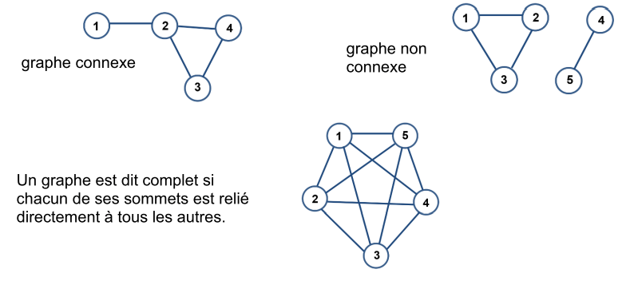{: .center}

**Exercice 2**

Soit le graphe G ci-dessous :

{: .center}

1. Combien G possède-t-il de sommets ?
2. Combien G possède-t-il d’arcs ?
3. G est-il connexe ?
4. Le sommet 1 possède combien de sommets adjacents ?
5. Combien le sommet 4 possède-t-il de sommets adjacents ?
6. Combien existe-t-il de chemins simples entre le sommet 2 et le sommet 4 ?
7. Combien existe-t-il de chemins simples entre le sommet 2 et le sommet 6 ?
8. Combien existe-t-il de chemins élémentaires entre le sommet 2 et le sommet 4 ?
9. Combien existe-t-il de chemins élémentaires entre le sommet 2 et le sommet 6 ?

??? note "Correction"

    1. G a 6 sommets.
    2. G a 6 arcs.
    3. G est connexe.
    4. 1 possède 2 sommets adjacents (2 et 5).
    5. 4 possède 2 sommets adjacents (3 et 5).
    6. Il existe 2 chemins simples entre 2 et 4.
    7. Il existe 3 chemins simples entre 2 et 6.
    8. Il existe 2 chemins élémentaires entre 2 et 4.
    9. Il existe 1 chemin élémentaire entre 2 et 6.
## Graphes Orientés

### La notion de graphe orienté

Autre utilisation possible des graphes : les logiciels de cartographie (ces logiciels sont souvent utilisés couplés à des récepteurs GPS). Ces logiciels de cartographie permettent, connaissant votre position A grâce à un récepteur GPS, d'indiquer la route à suivre pour se rendre à endroit B. Comment modéliser l'ensemble des lieux et des routes ? Simplement à l'aide d'un graphe ! 

Chaque lieu est un sommet et les routes qui relient les lieux entre eux sont des arcs. 

Soit les lieux suivants : A, B, C, D, E, F et G.

Les différents lieux sont reliés par les routes suivantes :

- il existe une route entre A et C 
- il existe une route entre A et B 
- il existe une route entre A et D 
- il existe une route entre B et F 
- il existe une route entre B et E 
- il existe une route entre B et G 
- il existe une route entre D et G 
- il existe une route entre E et F 

Ici aussi, la représentation sous forme de graphe s'impose :

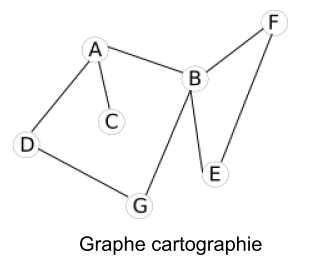{: .center}

Problème : avec cette représentation du réseau routier sous forme de graphe, il est impossible de prendre en compte des routes à sens unique. Pour que cela puisse se faire, il va falloir orienter les arcs.

Voici de nouvelles contraintes : 

- il existe une route entre A et C (double sens) 
- il existe une route entre A et B (sens unique B → A) 
- il existe une route entre A et D (sens unique A → D) 
- il existe une route entre B et F (sens unique B → F) 
- il existe une route entre B et E (sens unique E → B) 
- il existe une route entre B et G (double sens) 
- il existe une route entre D et G (double sens) 
- il existe une route entre E et F (double)

Pour tenir compte de ces nouvelles contraintes, on utilisera un graphe orienté :

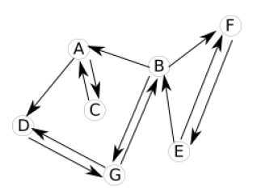{: .center}

Dans un graphe orienté, les arcs possèdent une orientation. On dira qu'un graphe orienté G est un couple G = (V, A) avec V un ensemble de sommets et A un ensemble d'arcs orientés. 

### Vocabulaire sur les graphes orientés

!!!example "Vocabulaire"
    Un **graphe orienté** est une structure de données constituée d’objets, appelés sommets, et de relations entre ces sommets appelées arcs.

    Lorsqu’il y a un arc du sommet 1 vers le sommet 2, on dit que le 
    sommet 2 est **adjacent** au sommet 1 ( voir ci-dessous ).

    Par contre s’il n’existe pas d’arc du sommet 2 vers le sommet 1, 
    le sommet 1 n’est pas adjacent au sommet 2 ( voir schéma ).

    {: .center}

    On note 1 → 2 l’arc (1, 2) où 1 est son extrémité initiale et 2 son extrémité finale.\
    2 est le successeur de 1 et 1 est le prédécesseur de 2.

    Un **chemin** est une suite d'arcs consécutifs dans un graphe, un peu comme si on se promenait sur le graphe. On la désigne par les lettres des sommets qu'il comporte.

    Un chemin est dit **élémentaire** s’il ne comporte pas plusieurs fois le même sommet.

    Un chemin est dit **simple** s’il ne comporte pas plusieurs fois le même arc.

    Un **circuit** est un chemin qui commence et se termine au même sommet.

    Un graphe orienté est **connexe** si le graphe non orienté obtenu en oubliant le sens des arcs est 
    connexe.

    Un graphe orienté est **fortement connexe** lorsque pour toute paire de sommets distincts ( u, v ) il existe un chemin de u vers v et un chemin  de v vers u .

    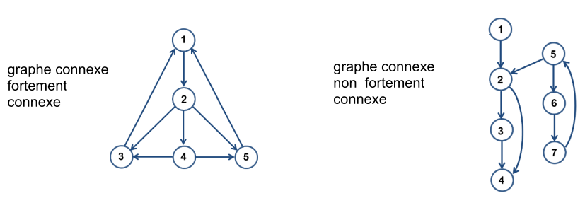{: .center}

**Exercice 3**

Soit le graphe G ci-dessous :

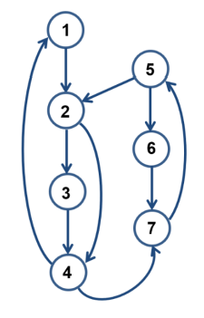{: .center}

1. Combien G possède-t-il de sommets ?
2. Combien G possède-t-il d’arcs ?
3. G est-il connexe ?
4. G est-il fortement connexe ?
5. Le sommet 1 possède combien de sommets adjacents ?
6. Combien le sommet 4 possède-t-il de sommets adjacents ?
7. Combien existe-t-il de chemins simples entre le sommet 2 et le sommet 4 ?
8. Combien existe-t-il de chemins simples entre le sommet 2 et le sommet 7 ?
9. Combien existe-t-il de chemins élémentaires entre le sommet 2 et le sommet 4 ?
10. Combien existe-t-il de chemins élémentaires entre le sommet 2 et le sommet 7 ?

??? note "Correction"

    1. G possède 7 sommets.
    2. G possède 10 arcs.
    3. G est connexe.
    4. G est fortement connexe.
    5. 1 possède 1 sommet adjacent (2).
    6. 4 possède 2 sommets adjacents (1 et 7).
    7. Il existe 2 chemins simples entre 2 et 4.
    8. Il existe 4 chemins simples entre 2 et 7.
    9. Il existe 2 chemins élémentaires entre 2 et 4.
    10. Il existe 2 chemins élémentaires entre 2 et 7.
**Exercice 4**

Les deux graphes suivants sont-ils identiques?

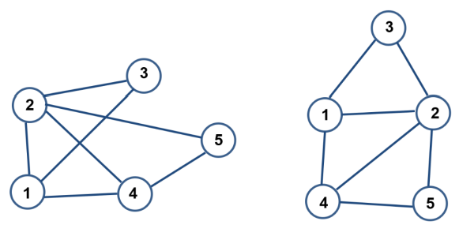{: .center}

??? note "Correction"
    Oui, ils sont identiques.
**Exercice 5**

Les deux graphes suivants sont-ils identiques?

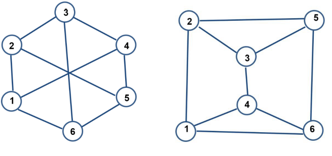{: .center}

??? note "Correction"
    Non, ils ne sont pas identiques (voir voisins de 3).

## Graphes pondérés

Parfois il est intéressant d'associer aux arcs des valeurs, on parle alors de **graphes pondérés**. Si nous revenons à notre "graphe cartographie", il est possible d'associer à chaque arc la distance en km entre les 2 lieux : 

{: .center}


Il est aussi possible d'associer à chaque arc la durée du trajet 
entre 2 points : 

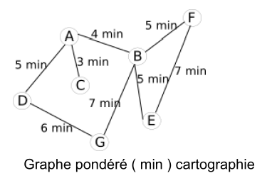{: .center}

En fonction du choix fait par le conducteur (trajet le plus court "en distance" ou trajet le plus court "en temps"), l'algorithme permettant de déterminer le "chemin le plus court entre 2 points" 
travaillera sur le graphe "graphe pondéré (km) cartographie" ou sur le graphe "graphe pondéré (minutes) cartographie". À noter que le "graphe pondéré (minutes) cartographie" peut évoluer au cours du temps en fonction du trafic routier : une application comme Waze utilise les données en provenance des utilisateurs de l'application afin de mettre à jour en temps réel leur "graphe pondéré (minutes) cartographie". 

## Implémentation des graphes

### Matrice d'adjacence

Une matrice est un tableau à double entrée : 

{: .center}

La matrice A ci-dessus est constitué de 5 lignes et 4 colonnes. 

On appelle matrice carrée une matrice qui comporte le même nombre de lignes et de colonnes. 

Les matrices d'adjacences sont des matrices carrées. 

Reprenons l'exemple du "graphe cartographie" précédent :

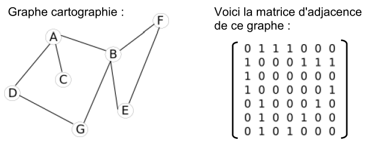{: .center}

On peut observer que pour un graphe non orienté, la matrice d’adjacence sera symétrique.

Comment construire une matrice d'adjacence ?

Il faut savoir qu'à chaque ligne correspond un sommet du graphe et qu'à chaque colonne correspond aussi un sommet du graphe. À chaque intersection ligne i-colonne j (ligne i correspond au sommet i et colonne j correspond au sommet j), on place un 1 s'il existe un arc entre le sommet i et le sommet j, et un zéro s'il n'existe pas d'arc entre le sommet i et le sommet j.

Il existe une arête entre le sommet E et le sommet F, nous avons donc placé un 1 à l'intersection de la ligne E et de la colonne F (il en est de même à l'intersection de la ligne F et de la colonne E).

Il n'existe pas d'arête entre le sommet D et le sommet C, nous avons donc placé un 0 à l'intersection de la ligne D et de la colonne C (il en est de même à l'intersection de la ligne C et de la colonne D). 

Vérifiez que la matrice d'adjacence proposée ci-dessous correspond bien au graphe "cartographie". 

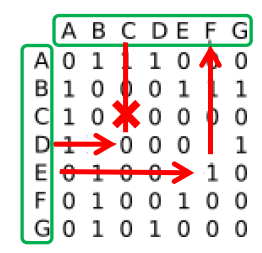{: .center}

Il est aussi possible d'établir une matrice d'adjacence pour un graphe orienté. Le principe reste le même : si le sommet i (ligne) est lié au sommet j (colonne), nous avons un 1 à l'intersection 
(0 dans le cas contraire). 


{: .center}

Il est aussi possible d'utiliser une matrice d'adjacence pour implémenter un graphe pondéré : on remplace les 1 par les valeurs liées à chaque arc.

{: .center}

**Exercice 6**

Établissez la matrice d'adjacence du graphe ci-dessous :

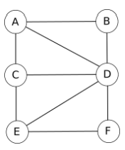{: .center}

??? note "Correction"
    \begin{pmatrix}
    0 & 1 & 1 & 1 & 0 & 0\\
    1 & 0 & 0 & 1 & 0 & 0\\
    1 & 0 & 0 & 1 & 1 & 0\\
    1 & 1 & 1 & 0 & 1 & 1\\
    0 & 0 & 1 & 1 & 0 & 1\\
    0 & 0 & 0 & 1 & 1 & 0
    \end{pmatrix}
**Exercice 7**

Établissez la matrice d'adjacence du graphe ci-dessous :

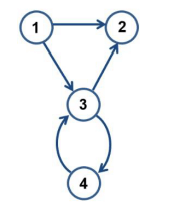{: .center}

??? note "Correction"
    \begin{pmatrix}
    0 & 1 & 1 & 0\\
    0 & 0 & 0 & 0\\
    0 & 1 & 0 & 1\\
    0 & 0 & 1 & 0
    \end{pmatrix}

**Exercice 8**

Établissez la matrice d'adjacence du graphe ci-dessous :

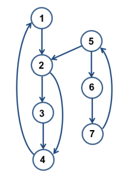{: .center}

??? note "Correction"
    \begin{pmatrix}
    0 & 1 & 0 & 0 & 0 & 0 & 0\\
    0 & 0 & 1 & 1 & 0 & 0 & 0\\
    0 & 0 & 0 & 1 & 0 & 0 & 0\\
    1 & 0 & 0 & 0 & 0 & 0 & 0\\
    0 & 1 & 0 & 0 & 0 & 1 & 0\\
    0 & 0 & 0 & 0 & 0 & 0 & 1\\
    0 & 0 & 0 & 0 & 1 & 0  & 0 
    \end{pmatrix}

**Exercice 9**

Établissez la matrice d'adjacence du graphe ci-dessous :

{: .center}

??? note "Correction"
    \begin{pmatrix}
    0 & 2 & 0 & 0 & 0\\
    2 & 0 & 4 & 5 & 0\\
    0 & 4 & 0 & 1 & 1\\
    0 & 5 & 1 & 0 & 3\\
    0 & 0 & 1 & 3 & 0
    \end{pmatrix}

**Exercice 10**

Dessinez le graphe dont la matrice d'adjacences est la suivante :

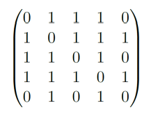{: .center}

??? note "Correction"
    
    ```mermaid
    graph
            A((A)) --- B((B))
            A --- D((D))
            A --- C((C))
            B --- C
            B --- D
            D --- C
            B --- E
            D --- E
    ```

**Exercice 11**

Expliquez la raison pour laquelle un graphe non orienté aura toujours une matrice d’adjacences symétrique par rapport à la diagonale qui part d’en haut à gauche pour arriver en bas à droite.

??? note "Correction"
    Un graphe non orienté aura une matrice d’adjacence symétrique car l’arête (u,v) est équivalente à l’arête (v,u);
**Exercice 12**

Soit la matrice d’adjacence suivante : 

{: .center}

1.  Cette matrice d’adjacence permet-elle de savoir, sans le construire, si le graphe correspondant est orienté ? 
2. Tracez le graphe correspondant à cette matrice d’adjacences.
3. Que pouvez-vous déduire, concernant le sommet 3, du 1 entouré en vert qui est sur la diagonale ?

??? note "Correction"
    1. Le graphe est orienté car la matrice n’est pas symétrique.
    2. 
        ```mermaid
        graph
                A((A)) --> B((B))
                A --- C((C))
                C --> C
                D --> C
                B --> D
        ```


### Matrice d'adjacence et Python

Voici une classe Python de construction de graphe (orienté ou non, pondéré ou non) à l'aide d'une matrice d'adjacence :

```python
class Graphe_Mat:
    '''
    Implantation d'un graphe orienté ou non, pondéré ou non,  sous la forme d'une matrice
    d'adjacence. Cette classe permet d'implanter aussi bien des graphes
    orientés que non orientés selon les méthodes d'ajout et suppression
    d'arrête appelées. Pour garantir la consistance, un booléen, par
    défaut à faux, permet de préciser si on crée un graphe orienté ou pas.
    Pour les poids, on n'autorisera que des entiers positifs ou nuls.

    La matrice d'adjacence contient le poids si l'arrête existe, None si
    l'arrête n'existe pas.

    La méthode 'distance' est présente pour rester compatible avec une
    implantation de l'algorithme de Dijkstra définie sur des graphes
    pondérés.
    '''
    def __init__(self, noms_noeuds = None, oriente = False):
        self.oriente = oriente
        if noms_noeuds is None:
            self.noms_noeuds = []
            self.matrice = []
            self.nb_noeuds = 0
        else:
            self.noms_noeuds = noms_noeuds
            self.nb_noeuds = len(noms_noeuds)
            self.matrice = [[None] *  self.nb_noeuds for _ in range(self.nb_noeuds)]
            
    def ajouter_noeud(self, noeud):
        
        assert not(noeud in self.noms_noeuds)
        
        self.noms_noeuds.append(noeud)
        self.nb_noeuds += 1
        nouvelle_matrice = [[None] * self.nb_noeuds for _ in range(self.nb_noeuds)]
        for i in range(self.nb_noeuds-1):
            for j in range(self.nb_noeuds-1):
                nouvelle_matrice[i][j] = self.matrice[i][j]
        self.matrice = nouvelle_matrice
    
    # pour un graphe non orienté :
    def ajouter_arrete_non_orientee(self, noeud1, noeud2, poids):
        
        assert not(self.oriente)
        assert noeud1 in self.noms_noeuds
        assert noeud2 in self.noms_noeuds
        assert type(poids) is int and poids >= 0
        
        indice_noeud1 = self.noms_noeuds.index(noeud1)
        indice_noeud2 = self.noms_noeuds.index(noeud2)
        self.matrice[indice_noeud1][indice_noeud2] = poids
        self.matrice[indice_noeud2][indice_noeud1] = poids

    def supprimer_arrete_non_orientee(self, noeud1, noeud2):
        
        assert not(self.oriente)
        assert noeud1 in self.noms_noeuds
        assert noeud2 in self.noms_noeuds
        
        indice_noeud1 = self.noms_noeuds.index(noeud1)
        indice_noeud2 = self.noms_noeuds.index(noeud2)
        assert not(self.matrice[indice_noeud1][indice_noeud2] is None)
        self.matrice[indice_noeud1][indice_noeud2] = None
        self.matrice[indice_noeud2][indice_noeud1] = None
        
    # pour un graphe orienté :
    def ajouter_arrete_orientee(self, noeud1, noeud2, poids):
        
        assert self.oriente
        assert noeud1 in self.noms_noeuds
        assert noeud2 in self.noms_noeuds
        assert type(poids) is int and poids >= 0
        
        indice_noeud1 = self.noms_noeuds.index(noeud1)
        indice_noeud2 = self.noms_noeuds.index(noeud2)
        self.matrice[indice_noeud1][indice_noeud2] = poids
   
    def supprimer_arrete_orientee(self, noeud1, noeud2):
        
        assert self.oriente
        assert noeud1 in self.noms_noeuds
        assert noeud2 in self.noms_noeuds
        
        indice_noeud1 = self.noms_noeuds.index(noeud1)
        indice_noeud2 = self.noms_noeuds.index(noeud2)
        assert not(self.matrice[indice_noeud1][indice_noeud2] is None)
        self.matrice[indice_noeud1][indice_noeud2] = None
           
    # affichage
    def affiche(self):
        retour = f"Liste des noeuds : {self.noms_noeuds}\nMatrice d'adjacence :\n"
        for ligne in self.matrice:
            retour = retour + f"{ligne} \n"
        retour = retour.replace("None", "0")
        print(retour)
    
    # méthodes sur un graphe
    def liste_voisins(self, noeud):
        
        assert noeud in self.noms_noeuds
        
        indice_noeud = self.noms_noeuds.index(noeud)
        voisins = []
        for indice_voisin in range(self.nb_noeuds):
            if not(self.matrice[indice_noeud][indice_voisin] is None):
                voisins.append(self.noms_noeuds[indice_voisin])
        return voisins
    
    def taille(self):
        return self.nb_noeuds

    def liste_noeuds(self):
        '''Cette méthode renvoie une copie de la liste des noeuds. Ainsi,
        La valeur renvoyée peut être modifiée sans risque que cela modifie le graphe'''
        return self.noms_noeuds[:]
    
    def distance(self, depart, arrivee):
        
        assert depart in self.noms_noeuds
        assert arrivee in self.liste_voisins(depart)
        
        indice_depart = self.noms_noeuds.index(depart)
        indice_arrivee = self.noms_noeuds.index(arrivee)
        return self.matrice[indice_depart][indice_arrivee]

```

**Exercice 13**

A l’aide de la classe Graphe présentée ci-dessus, écrivez un programme qui permet d’implémenter le graphe ci-contre avec une
matrice d’adjacence.

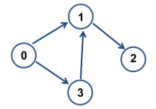{: .center}

{{IDE()}}

**Exercice 14**

Appliquez la méthode  `liste_voisins` sur l’objet créé dans l'exercice précédent, pour chaque noeud. Vérifiez qu’elle fonctionne correctement.

{{IDE()}}

**Exercice 15**

Appliquez la méthode  `taille` sur l’objet créé dans l'exercice précédent. Vérifiez qu’elle fonctionne correctement.

{{IDE()}}

??? note "Correction"
    Code Capytale : `b876-1145767`


**Exercice 16**

Ouvrez le notebook Capytale dont le code est : `a52b-1145696`.

Vous y trouver une cellule permettant de tracer un graphe à l'aide du module `Turtle`.

Cette cellule contient une fonction `dessiner_graphe(g)`.

Le paramètre `g` de cette fonction est un objet de la classe `Graphe_Mat`.

Cette fonction permet de dessiner le graphe orienté correspondant à la matrice d’adjacences de l’objet `g`.

Exécutez cette fonction pour vérifier que vos matrices d’adjacences des exercices précédents correspondent bien aux graphes désirés.

**Remarque : Inconvénients d'une matrice d'adjacence**

La matrice d’adjacence est indéniablement simple à mettre en œuvre mais elle a néanmoins quelques défauts.

D’une part, elle occupe un espace mémoire proportionnel à $n \times n$ . Ainsi un graphe de mille sommets nécessite une matrice d’un million de booléens, ce qui représente déjà quelques mégaoctets, et ce, même si le graphe contient très peu d’arc.

D’autre part, parcourir tous les voisins d’un sommet donné exige de parcourir toute une ligne de la matrice, c’est-à-dire n booléens, alors même qu’il peut y avoir très peu de voisins.

Enfin elle limite les sommets à des entiers, qui plus est consécutifs et d’un nombre connu à l’avance. 

Heureusement, il existe une autre façon de représenter les graphes qui s’affranchit de tous ces défauts.

### Dictionnaire d'adjacence


Dans cette nouvelle représentation, un graphe est un dictionnaire qui associe à chaque sommet l’ensemble de ses voisins. On appelle cela un dictionnaire d’adjacence.

L’ensemble des sommets du graphe est donc exactement l’ensemble des clés du dictionnaire.

*Exemple d'un graphe non orienté*

Le dictionnaire d’adjacence du graphe ci-dessous est créé de la manière suivante :

- chaque sommet du graphe définit une clé du dictionnaire
- la liste des voisins de chaque sommet définit la valeur associée à chaque sommet.

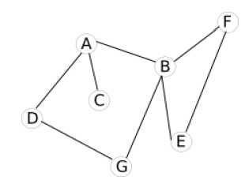{: .center}

Voici les clés ( sommets ) et les valeurs ( listes ) associées à 
chacune de ces clés dans l’exemple étudié :

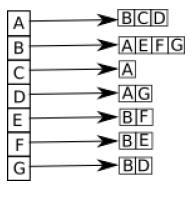{: .center}

**Exercice 17**

Soit le graphe orienté ci-dessous :

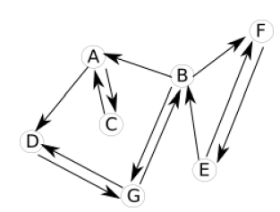{: .center}

Le dictionnaire d’adjacence du graphe ci-dessus est créé de la manière suivante :

- chaque sommet du graphe définit une clé du dictionnaire
- la liste des successeurs de chaque sommet définit la valeur associée à chaque sommet.

Écrivez la liste des successeurs associés à chacun des sommets du 
graphe orienté ci-dessus.

{: .center}

??? note "Correction"
    A → C, D

    B → A, F, G

    C → A

    D → G

    E → B, F

    F → E

    G → B, D
    

    dic = {A: [C, D], ...}


### Dictionnaire d'adjacence et Python

Voici une classe Python de construction de graphe à l'aide d'une matrice d'adjacence :

```python
class Graphe_Dico:
    '''
    Implantation d'un graphe orienté ou non, pondéré ou non, sous la forme de listes
    d'adjacence. Cette classe permet d'implanter aussi bien des graphes
    orientés que non orientés selon les méthodes d'ajout et suppression
    d'arrête appelées. Pour garantir la consistance, un booléen, par
    défaut à faux, permet de préciser si on crée un graphe orienté ou pas.
    Les poids doivent être des nombres entiers positifs ou nuls.

    Pour représenter les poids, on choisit un dictionnaire :
                  (noeud_depart, noeud_arrivée) -> poids
    Mais on aurait auss pu stocker dans le dictionnaire 'voisins' en lui
    donnant la structure : noeud_depart -> (noeud_arrivee, poids)
    '''
    def __init__(self, noms_noeuds = None, oriente = False):
        self.oriente = oriente
        self.voisins = dict()
        if noms_noeuds is None:
            self.nb_noeuds = 0
        else:
            self.nb_noeuds = len(noms_noeuds)
            for noeud in noms_noeuds:
                self.voisins[noeud] = []
        self.poids = dict()
        
    def ajouter_noeud(self, noeud):
        
        assert not(noeud in self.voisins)
        
        self.nb_noeuds += 1
        self.voisins[noeud] = []
        
    # pour un graphe non orienté :
    def ajouter_arrete_non_orientee(self, noeud1, noeud2, poids):
        
        assert not(self.oriente)
        assert noeud1 in self.voisins
        assert noeud2 in self.voisins
        assert not(noeud2 in self.voisins[noeud1])
        assert type(poids) is int and poids >= 0
        
        self.voisins[noeud1].append(noeud2)
        self.voisins[noeud2].append(noeud1)
        self.poids[(noeud1, noeud2)] = poids
        self.poids[(noeud2, noeud1)] = poids

    def supprimer_arrete_non_orientee(self, noeud1, noeud2):
        
        assert not(self.oriente)
        assert noeud1 in self.voisins
        assert noeud2 in self.voisins
        assert noeud2 in self.voisins[noeud1]
        
        self.voisins[noeud1].remove(noeud2)
        self.voisins[noeud2].remove(noeud1)
        del self.poids[(noeud1, noeud2)]
        del self.poids[(noeud2, noeud1)]        

    # pour un graphe orienté :    
    def ajouter_arrete_orientee(self, noeud1, noeud2, poids):
        
        assert self.oriente
        assert noeud1 in self.voisins
        assert noeud2 in self.voisins
        assert not(noeud2 in self.voisins[noeud1])
        assert type(poids) is int and poids >= 0
        
        self.voisins[noeud1].append(noeud2)
        self.poids[(noeud1, noeud2)] = poids
     
    def supprimer_arrete_orientee(self, noeud1, noeud2):
        
        assert self.oriente
        assert noeud1 in self.voisins
        assert noeud2 in self.voisins
        assert noeud2 in self.voisins[noeud1]
        
        del self.poids[(noeud1, noeud2)]
    
    # méthodes sur un graphe
    def liste_voisins(self, noeud):
        
        assert noeud in self.voisins
        
        # on renvoie une copie des voisins pour que les modifications
        # éventuelles apportées à la valeur renvoyée soient sans risque
        # sur le graphe.
        return self.voisins[noeud][:

    def taille(self):
        return self.nb_noeuds

    def liste_noeuds(self):
        return list(self.voisins.keys())

    def distance(self, depart, arrivee):
        assert depart in self.voisins
        assert arrivee in self.voisins[depart]
        return self.poids[(depart, arrivee)]
```

**Exercice 18**

Soit le graphe ci-dessous :

{: .center}

1.  Créez un objet `g1` qui représente le graphe ci-dessus à l’aide de la classe `Graphe_Dico`.
2.  Affichez la liste des sommets de l’objet `g1` .
3.  Ajoutez une méthode `affiche1` qui permet d’afficher pour chaque sommet la liste de ses voisins. L’application de cette méthode sur l’objet `g1` vous permettra de vérifier si la création de votre objet `g1` correspond bien à ce que vous souhaitiez.

{{IDE()}}

**Exercice 19**

Soit le graphe ci-dessous :

{: .center}


1.  Créez un objet `g2` qui représente le graphe ci-dessus à l’aide de la classe `Graphe_Dico`.
2.  Affichez la liste des sommets de l’objet `g2`.
3.  Ajoutez une méthode `affiche2` qui permet d’afficher pour chaque sommet la liste de ses successeurs. L’application de cette méthode sur l’objet `g2` vous permettra de vérifier si la création de votre objet `g2` correspond bien à ce que vous souhaitiez.

??? note "Correction"
    Code Capytale: `c4ec-1145768`


## Algorithme de parcours d'un graphe

L'idée du "parcours" est de "visiter" tous les sommets d'un graphe en partant d'un sommet quelconque. Ces algorithmes de parcours d'un graphe sont à la base de nombreux algorithmes très utilisés : routage des paquets de données dans un réseau, découverte du chemin le plus court pour aller d'une ville à une autre...

Il existe 2 méthodes pour parcourir un graphe :


- Le parcours en largeur d'abord
- le parcours en profondeur d'abord

### Parcours en largeur d'abord

 Nous allons travailler sur un graphe G(V, E) avec V l'ensemble des sommets de ce graphe et E l'ensemble des arêtes de ce graphe. Un sommet u sera adjacent avec un sommet v si u et v sont reliés par une arête (on pourra aussi dire que u et v sont voisins) À chaque sommet u de ce graphe nous allons associer une couleur : blanc ou noir. Autrement dit, chaque sommet u possède un attribut couleur que l'on notera u.couleur, nous aurons u.couleur = blanc ou u.couleur = noir. Quelle est la signification de ces couleurs ?

- si u.couleur = blanc ⇒ u n'a pas encore été "découvert"
- si u.couleur = noir ⇒ u a été "découvert"

**Exercice 20**

1. Etudiez cet algorithme :
    ```
    VARIABLE
    G : un graphe
    s : noeud (origine)
    u : noeud
    v : noeud
    f : file (initialement vide)
    parcours : liste vide

    //On part du principe que pour tout sommet u du graphe G, u.couleur = blanc à l'origine

    DEBUT
    s.couleur ← noir
    enfiler (s,f)
    tant que f non vide :
      u ← defiler(f)
      Ajouter u à parcours
      pour chaque sommet v adjacent au sommet u :
        si v.couleur n'est pas noir :
          v.couleur ← noir
          enfiler(v, f)
        fin si
      fin pour
    fin tant que
    FIN
    ```
2. Appliquez l'algorithme du parcours en largeur d'abord au graphe ci-dessous. Le 'point de départ' de notre parcours (le sommet s dans l'algorithme), sera le sommet A. Vous noterez les sommets atteints à chaque étape ainsi que les sommets présents dans la file f. Vous pourrez aussi, à chaque étape, donner les changements de couleur des sommets. 

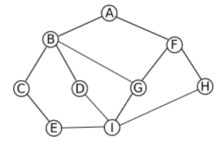{: .center}

??? note "Correction"
    2) En partant de A :
        ```
        s = A(blanc)
        f = []

        A(noir)
        f = [A]

        Debut Tant que:
            u = A
            f = []

            Début pour:
                v = B(blanc) ou F(blanc)

                B(noir)
                f = [B]

                F(noir)
                f = [B, F]

            u = B
            f = [F]

            Début pour:
                v = A(noir), C(blanc), D(blanc), G(blanc)
                
                
                C(noir)
                f = [F, C]

                D(noir)
                f = [F, C, D]

                G(noir)
                f = [F, C, D, G]

            u = F
            f = [C, D, G]

            Début pour:
                v = A(noir), G(noir), h(blanc)

                H(noir)
                f = [C, D, G, H]

            u = C
            f = [D, G, H]

            Début pour:
                v = B(noir), E(blanc)

                E(noir)
                f = [D, G, H, E]

            u = D
            f = [G, H, E]

            Début pour:
                v = B(noir), I(blanc)

                I(noir)
                f = [G, H, E, I]

            u = G
            f = [H, E, I]

            Début pour:
                v = B(noir), F(noir), I(noir)

            u = H
            f = [E, I]

            Début pour:
                v = F(noir), I(noir)

            u = E
            f = [I]
            
            Début pour:
                v = C(noir), I(noir)

            u = I
            f = []

            Début pour:
                v = E(noir), D(noir), G(noir), H(noir)

        Fin Tant que
        ```


        Le parcours en largeur à partir de A est donc :  A, B, F, C, D, G, H, E, I.
 Vous avez sans doute remarqué que dans le cas d'un parcours en largeur d'abord, on "découvre" d'abord tous les sommets situés à une distance k du sommet "origine" (sommet s) avant de commencer la découverte des sommets situés à une distance k+1 (on définit la distance comme étant le nombre d'arêtes à parcourir depuis A pour arriver à destination):

En effet, pour cet exercice, nous avons bien : 

|sommets|A|B|F|C|D|G|H|E|I|
|:--:|:--:|:--:|:--:|:--:|:--:|:--:|:--:|:--:|:--:|
|Distances depuis A|0|1|1|2|2|2|2|3|3|


### Parcours en profondeur d'abord

On va ici retrouver le même système de couleur (blanc : sommet non visité, noir : sommet déjà visité) 

**Exercice 21**

1. Etudiez cet algorithme :
    ```
    VARIABLE
    G : un graphe
    u : noeud
    v : noeud
    //On part du principe que pour tout sommet u du graphe G, u.couleur = blanc à l'origine

    DEBUT
    PARCOURS-PROFONDEUR(G,u,parcours = None, couleurs = None) :
      Si parcours est None:
        parcours ← []
        couleurs ← g.couleur() # g.couleurs() est le dictionnaire composés des noeuds et de la couleur associée au noeud
      Fin Si
      
      Si u n'est pas dans parcours:
        u.couleur ← noir
        Ajouter u à parcours
      Fin Si
      
      Pour chaque sommet v adjacent au sommet u :
        Si v.couleur n'est pas noir :
          PARCOURS-PROFONDEUR(G,v,parcours,couleurs)
        Fin Si
      Fin Pour
    FIN
    ```
Vous avez dû remarquer que le parcours en profondeur utilise une fonction récursive. J'attire votre attention sur l'extrême simplicité de cet algorithme (au niveau de sa conception), c'est souvent le cas avec les algorithmes récursifs.
2. Appliquez l'algorithme du parcours en profondeur d'abord au graphe ci-dessous.

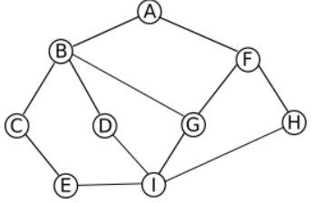{: .center}

??? note "Correction"
    2) En partant de A :
    ```
    u = A(noir)

    v = B(blanc), F(blanc)
    parcours(G, B) :
    u = B(noir)
        v = A(noir), C(blanc), D(blanc), G(blanc)
        parcours(G, C)
        u = C(noir)
            v = B(noir), E(blanc)
            parcours(G, E)
            u = E(noir)
                v = C(noir), I(blanc)
                parcours(G, I)
                u = I(noir)
                    v = E(noir), D(blanc), G(blanc), H(blanc)
                    parcours(G, D)
                    u = D(noir)
                        v = B(noir), I(noir)
                    parcours(G, G)
                    u = G(noir)
                        v = B(noir), I(noir), F(blanc)
                        parcours(G, F)
                        u = F(noir)
                            v = A(noir), G(noir), H(blanc)
                            parcours(G, H)
                            u = H(noir)
                                v = F(noir), I(noir)
    ```

    Parcours en profondeur à partir de A : A, B, C, E, I, D, G, F, H.
**Exercice 22**

Comparez le résultat obtenu avec le parcours en largeur (A, B, F, C, D, G, H, E et I) et le résultat obtenu avec le parcours en profondeur (A, B, C, E, I, D, G, F et H) 


 Dans le cas du parcours en largeur on "découvrait" tous les sommets situés à une distance k de l'origine avant de s'intéresser aux sommets situés à une distance $k+1$ de l'origine. Dans le cas du parcours en profondeur, on va chercher à aller "le plus loin possible" dans le graphe : A → B → C → E → I → D, quand on tombe sur "un cul-de-sac" (dans notre exemple, D est un "cul-de-sac", car une fois en D, on peut uniquement aller en B, or, B a déjà été découvert...), on revient "en arrière" (dans notre exemple, on repart de B pour aller explorer une autre branche : G → F → H)

??? note "Correction"
    Dans le cas du parcours en largeur on “découvrait” tous les sommets situés à une distance k de l’origine avant de s’intéresser aux sommets situés à une distance k+1 de l’origine. Dans le cas du parcours en profondeur, on va chercher à aller “le plus loin possible” dans le graphe : A  B→ → C → E → I → D, quand on tombe sur “un cul-de-sac” (dans notre exemple, D est un “cul-de-sac”, car une fois en D, on peut uniquement aller en B, or, B a déjà été découvert…), on revient “en arrière” (dans notre exemple, on repart de B pour aller explorer une autre branche : G → F → H) 

À noter que l'utilisation d'un algorithme récursif n'est pas une obligation pour le parcours en profondeur : 

**Exercice 23**

1. Etudiez cet algorithme :
    ```
    VARIABLE
    s : noeud (origine)
    G : un graphe
    u : noeud
    v : noeud
    p : pile (pile vide au départ)
    parcours : liste vide

    //On part du principe que pour tout sommet u du graphe G, u.couleur = blanc à l'origine

    DEBUT
    s.couleur ← noir
    piler(s,p)
    tant que p n'est pas vide :
      u ← depiler(p)
      Ajouter u à parcours
      pour chaque sommet v adjacent au sommet u :
        si v.couleur n'est pas noir :
          v.couleur ← noir
          piler(v,p)
        fin si
      fin pour
    fin tant que
    FIN
    ```
Vous avez sans doute remarqué que la version "non récursive" (on dit "itérative") de l'algorithme du parcours en profondeur ressemble beaucoup à l'algorithme du parcours en largeur, on a juste remplacé la file par une pile. 
2. Appliquez cet algorithme au graphe ci-dessous. Vérifiez que l'on obtient bien un parcours en profondeur. 

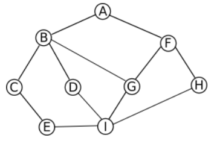{: .center}

??? note "Correction"
    2) En partant de A :
    ```
    s = A(blanc)
    p = []
    parcours = []

    A(noir)
    p = [A]

    Debut Tant que:
        u = A
        p = []
        parcours = [A]

        Début pour:
            v = B(blanc) ou F(blanc)

            B(noir)
            p = [B]

            F(noir)
            p = [F, B]

        u = F
        p = [B]

        Début pour:
            v = A(noir), G(blanc), H(blanc)
            
            
            G(noir)
            p = [G, B]

            H(noir)
            p = [H, G, B]


        u = H
        p = [G, B]

        Début pour:
            v = F(noir), I(blanc)

            I(noir)
            p = [I, G, B]

        u = I
        p = [G, B]

        Début pour:
            v = E(blanc), D(blanc), G(noir), H(noir)

            E(noir)
            p = [E, G, B]

            D(noir)
            p = [D, E, G, B]

        u = D
        p = [E, G, B]

        Début pour:
            v = B(noir), I(noir)

        u = E
        p = [G, B]

        Début pour:
            v = C(blanc), I(noir)

            C(noir)
            p = [C, G, B]

        u = C
        p = [G, B]

        Début pour:
            v = B(noir), E(noir)

        u = G
        p = [B]

        Début pour:
            v = B(noir), I(noir), F(noir)

        u = B
        p = []
        
        Début pour:
            v = A(noir), C(noir), D(noir), G(noir)


    Fin Tant que
    ```

    Le parcours en largeur à partir de A est donc :  A, F, H, I, D, E, C, G, B.

**Exercice 24**

1. Créer une méthode `couleurs()` dans la classe `Graph` (matrice ou dictionnaire, comme bon vous semble...), qui renvoie un dictionnaire composé des couples `(noeuds,'blanc')`, de manière à avoir la couleur blanche associée à chaque noeud par défaut.
2. Implémentez les trois algorithmes de parcours de graphe vu précédemment.

{{IDE()}}

??? note "Correction"
    Code Capytale : `04cc-1145786`
## Algorithme de recherche

### Présence de cycle

!!!example "Définitions"
    Voici un rappel de 2 définitions vues précédemment :

    - Une chaine est une suite d'arêtes consécutives dans un graphe, un peu comme si on se promenait sur le graphe. On la désigne par les lettres des sommets qu'elle comporte. On utilise le terme de chaine pour les graphes non orientés et le terme de chemin pour les graphes orientés.
    - Un cycle est une chaine qui commence et se termine au même sommet.

Pour différentes raisons, il peut être intéressant de détecter la présence d'un ou plusieurs cycles dans un graphe (par exemple pour savoir s'il est possible d'effectuer un parcours qui revient à son point de départ sans être obligé de faire demi-tour).

Nous allons étudier un algorithme qui permet de "détecter" la présence d'au moins un cycle dans un graphe.

**Exercice 25**

1. Étudiez cet algorithme. Que se passe-t-il quand le graphe G contient au moins un cycle ? Que se passe-t-il quand le graphe G ne contient aucun cycle : 
    ```
    VARIABLE
    s : noeud (noeud quelconque)
    G : un graphe
    u : noeud
    v : noeud
    p : pile (vide au départ)
    //On part du principe que pour tout sommet u du graphe G, u.couleur = blanc à l'origine

    DEBUT
    CYCLE():
      piler(s,p)
      tant que p n'est pas vide :
        u ← depiler(p)
        pour chaque sommet v adjacent au sommet u :
          si v.couleur n'est pas noir :
            piler(v,p)
          fin si
        fin pour
        si u est noir :
          renvoie Vrai
        sinon :
          u.couleur ← noir
        fin si
      fin tant que
      renvoie Faux
    FIN
    ```
2. Appliquez l'algorithme de détection d'un cycle au graphe ci-dessous (vous partirez du sommet de votre choix). 
<br>
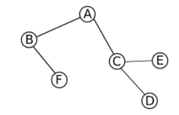{: .center}
3. Appliquez l'algorithme de détection d'un cycle au graphe ci-dessous (vous partirez du sommet de votre choix).
<br>
{: .center}

??? note "Correction"
    1. Quand le graphe G contient au moins un cycle : l’algo renvoie vrai<br>
    Quand le graphe G ne contient aucun cycle : l’algo renvoie faux
    2. A partir de A :

    ```
    p = [A]

    u = A(blanc)
    p = []

        v = B(blanc), C(blanc)
        p = [B]
        p = [C,B]
        A(noir)

    u = C
    p = [B]

        v = E(blanc), D(blanc)
        p = [E, B]
        p = [D, E, B]
        C(noir)

    u = D
    p = [E, B]

        v = C(noir)
        D(noir)

    u = E
    p = [B]

        v = C(noir)
        E(noir)

    u = B
    p = []
        
        v = A(noir), F(blanc)
        B(noir)

    Renvoie Faux
    ```
    3. A partir de A :

    ```
    p = [A]

    u = A(blanc)
    p = []

        v = B(blanc), C(blanc)
        p = [B]
        p = [C, B]
        A(noir)

    u = C(blanc)
    p = [B]

        v = E(blanc), D(blanc)
        p = [E, B]
        p = [D, E, B]
        C(noir)

    u = D(blanc)
    p = [E, B]

        v = C(noir), F(blanc)
        p = [F, E, B]
        D(noir)

    u = F(blanc)
    p = [E, B]

        v = D(noir), B(blanc)
        p = [B, E, B]
        F(noir)

    u = B(blanc)
    p = [E, B]
        
        v = A(noir), F(noir)
        B(noir)

    u = E(blanc)
    p = [B]

        v = C(noir)
        E(noir)

    u = B(noir)
    p = []

        v = A(noir), F(noir)

    Renvoie Vraie
    ```
**Exercice 26**

Implémentez cet algorithme (pensez à recopier la classe Graph (matrice ou dictionnaire, comme bon vous semble...))

{{IDE()}}

??? note "Correction"
    Code Capytale : `5047-1145778`
### Chercher un chemin dans un graphe

Nous allons maintenant nous intéresser à un algorithme qui permet de trouver une chaine entre 2 sommets (sommet de départ et sommet d'arrivée). Les algorithmes de ce type ont une grande importance et sont très souvent utilisés. 

**Exercice 27**

1. Etudiez cet algorithme :
    ```
    DEBUT
    cherche_chemin(graphe,depart,arrivee)
      P ← pile vide
      empiler le couple (depart,[depart]) dans P
      Tant que P n'est pas vide faire
        (sommet,chemin) ← tête de P
        listes_nouveaux_sommets_voisins ← liste des sommets adjacents à sommet qui ne sont pas dans chemin
        Pour un_sommet dans listes_nouveaux_sommets_voisins
          Si un_sommet = arrivee alors
            retourner chemin + [un_sommet]
          sinon
            empiler (un_sommet,chemin + [un_sommet])
          FinSi
        FinPour
      FinTantQue
    FIN
    ```
Vous noterez que l'algorithme ci-dessus est basé sur un parcours en profondeur d'abord.
2. Appliquez l'algorithme permettant de trouver une chaine entre un noeud de départ et un noeud d'arrivée au graphe ci-dessous (vous choisirez les noeuds de départ et d'arrivée de votre choix). 
<br>
{: .center}
<br>
!!!note "A noter"
    Il est important de noter que dans la plupart des cas, les algorithmes de recherche de chaine (ou de chemin), travaillent sur des graphes pondérés (par exemple pour rechercher la route entre un point de départ et un point d'arrivée dans un logiciel de cartographie). Ces algorithmes recherchent aussi souvent les chemins les plus courts (logiciels de cartographie). On peut citer l'algorithme de Dijkstra ou encore l'algorithme de Bellman-Ford qui recherchent le chemin le plus court entre un noeud de départ et un noeud d'arrivée dans un graphe pondéré.
<br>
3. Implémentez cet algorithme sous Python.

{{IDE()}}

??? note "Correction"
    1. Code Capytale : `62e8-1145789`
    2. Départ A, Arrivée E

    ```
    chaine = [A]

    A diff de E

        u = B, F
        E pas dans chaine
            nchemin = TROUVER_CHAINE(G, B, E, chaine)
            chaine = [A, B]
            B diff de E

                u = C, D, G
                E pas dans chaine
                    nchemin = TROUVER_CHAINE(G, C, E, chaine)
                    chaine = [A, B, C]
                    C diff de E

                        u = E, B
                        E pas dans chaine
                            nchemin = TROUVER(G, E, E, chaine)
                            chaine = [A, B, C, E]
                            E = E
                            On renvoie chaine [A, B, C, E]
    ```