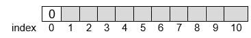
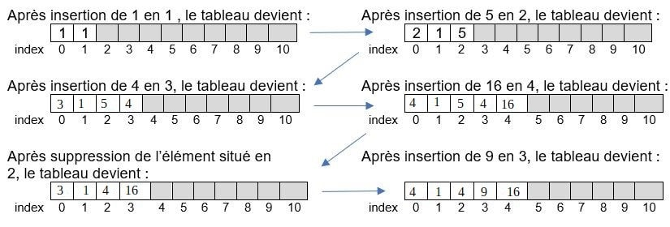
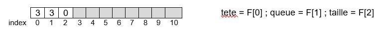
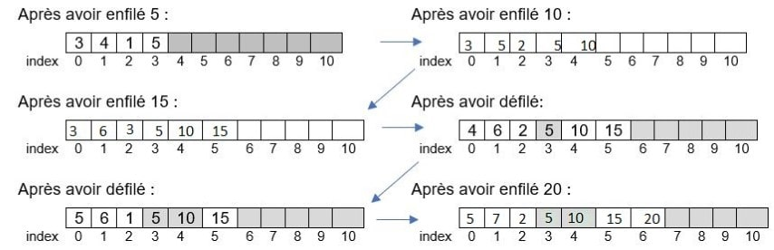
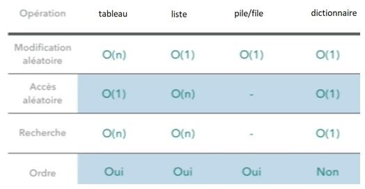

# Structure de données linéaires

??? conclu "Programme"
    |Notions|Compétences|Remarques|
    |--|--|--| 
    Structures de données, interface et implémentation.<br> Listes, piles, files : structures linéaires. <br> Dictionnaires, index et clé. | Spécifier une structure de données par son interface.<br> Distinguer interface et implémentation. <br> Écrire plusieurs implémentations d'une même structure de données.<br> Distinguer des structures par le jeu des méthodes qui  caractérisent. <br> Choisir une structure de données adaptée à la situation à modéliser. <br> Distinguer la recherche d’une valeur dans une liste et dans un dictionnaire. | L’abstraction des structures de données est introduite après plusieurs implémentations d’une structure simple comme la file (avec un tableau ou avec deux piles). <br> On distingue les modes FIFO (first in first out) et LIFO (last in first out) des piles et des files.
    Algorithmes sur les arbres binaires et sur les arbres binaires de recherche. | Calculer la taille et la hauteur d’un arbre. <br> Parcourir un arbre de différentes façons (ordres infixe, préfixe ou suffixe ; ordre en largeur d’abord). <br>Rechercher une clé dans un arbre de recherche, insérer une clé. | Une structure de données récursive adaptée est utilisée. <br> L’exemple des arbres permet d’illustrer la programmation par classe. <br> La recherche dans un arbre de recherche équilibré est de coût logarithmique.

Une **structure linéaire** relie les données en **séquences**. C'est à dire qu'on peut numéroter les données, et que chaque élément a un rang.

Nous verrons dans ce chapitre l'exemple de la LISTE, dont la PILE et la FILE en sont des sous-exemple avec des opérations restreintes.


## La LISTE


!!! python "Rappels sur les types construits de Python"
    Nous avons vu dans les chapitres [Encodage](../../premiere/encodage/) et [Python](../../premiere/python/) comment représenter des données avec des types et valeurs de base : **entier**,  **flottant**, **booléen** et **texte**, appelés respectivement en Python : `int`, `float`, `bool` et `str`.

    Nous avons appris à reconnaître différents **types construits** :

    -	Le **tuple** : ```tuple = ('1', 'a')``` contenant des valeurs ordonnées et repérées par un index (index 0 pour le premier élément, ```tuple[0] = '1'```) et pour lequel on ne peut pas remplacer la valeur en un index donné ; 
   
    -	La **liste** : ```liste = [1, 2, 3]``` contenant des valeurs ordonnées et repérées aussi par un index (```liste[-1] = 3```). 
    
    !!! warning "Attention"
        On appelle **liste** en Python ce qui est plus généralement un **tableau indexé**. Un tableau indexé est une suite d’éléments de même type (il est possible de créer des listes contenant des valeurs de types différents mais c’est déconseillé car le traitement de la liste serait compliqué puisque chaque type devrait être traité différemment) . Il ne faudra pas confondre ces tableaux indexés avec les listes que l’on aborde dans ce chapitre. 


La **LISTE** est aussi une suite d’éléments de même type pour les mêmes raisons que le tableau indexé. Une LISTE est utilisée pour stocker en mémoire des données qui doivent être traitées dans un certain ordre. On peut y **ajouter**, **enlever**, **consulter** un élément d’une liste et **modifier** un élément sans affecter les autres éléments. 

**Etape 1 : Que fait une LISTE ? … les méthodes du type (ou de la classe) LISTE**

La LISTE contiendra des données de même type T (que des entiers par exemple)

On ne conserve que les opérations utiles et autant que possible, les plus efficaces.

Les opérations (ou les méthodes ou interactions avec environnement) sont :

-	`CREER_LISTE_VIDE()` qui retourne un objet de type LISTE : la LISTE est créée et est vide.
-	`INSERER(L, i, e)` : l’élément e est inséré à la position i dans la LISTE L.
-	`SUPPRIMER(L, i)` : l’élément situé à la position i est supprimé.
-	`RECHERCHER(L, e)` qui retourne un objet de type entier  : l’élément e est cherché dans la LISTE et c’est la position i qui est retourné.
-	`LIRE(L, i)` qui retourne un objet du type T : c’est l’élément situé à la position i qui est retourné.
-	`MODIFIER(L, i, e)` : l’élément situé à la position i dans la LISTE est écrasé par le nouvel élément e.
-	`LONGUEUR(L)` qui retourne un objet de type entier : le nombre d’éléments de la LISTE est retourné.

**Exercice d'utilisation d'une LISTE**

1) Que donne la liste d'instructions suivante?

```python
L=[2, 4, 7, 1, 9, None, None]

INSERER(L, 2, 9)
print(L)

SUPPRIMER(L, 1)
print(L)

print(RECHERCHER(L, 1))

print(RECHERCHER(L, 10))

print(LIRE(L, 7))

MODIFIER(L, 4, 8)
print(L)


print(LONGUEUR(L))
```

2) Vérifier avec la console ci-dessous (les fonctions sont déjà préchargées, mais non visibles)

{{IDE('scripts/utilisation_LISTE')}}


**Etape 2 : comment représenter une liste ?**

Puisqu’on les connaît bien, on peut choisir d’utiliser les tableaux indexés vus en première et qui sont de taille fixe.

Lorsqu’on crée une LISTE de taille n, un espace mémoire légèrement plus grand lui est alloué.

Mais attention, la première case de ce tableau, donc d’index 0 est réservée pour contenir le nombre d’éléments contenus dans la liste. 

Le nombre d’éléments contenus dans la liste indique la dernière position occupée et donc informe sur la position de la case disponible. Et chaque élément *e* sera caractérisé par sa position supérieure ou égale à 1.

Supposons un tableau de 11 cases. Alors ce tableau pourra représenter une liste de $n=10$ éléments au maximum. On grise l’espace où l’insertion est possible.

{: .center}

Les espaces libres sont alloués au fur et à mesure, tant qu’il reste de l’espace. Ci-dessous, on rend compte de l’évolution du remplissage du tableau qui représente cette liste, pour différentes insertions

**Exercice 1**

On vous donne les deux premières allocations, à vous de compléter pour les suivantes.

{: .center}

??? note "Correction"
    


!!! note "Remarques"
    Si on veut modifier un élément, puisque l’élément est de position connue, il n’y a pas de coût supplémentaire et ce quel que soit le nombre d’éléments de la liste. Donc la modification, de même que l’allocation, ne dépend pas du nombre d’éléments de la liste. On dit qu’elles ont un coût constant.

    En revanche si la liste doit être rallongée, il faut modifier le nombre de cases du tableau initial et l’index doit être modifié. Cette action dépend proportionnellement du nombre d’éléments de la liste.

    De même si on doit retirer un élément de la liste, il sera moins coûteux de retirer un élément en bout de liste qu’un élément au coeur de la liste où il faudrait redéfinir les index.

**Etape 3 : algorithme et implémentation dans Python**

On sait déjà réaliser les opérations sur une liste déjà existante : trouver sa longueur, rechercher une valeur, lire une valeur, modifier une valeur. On limite donc l’étude à l’implémentation de l’insertion et de la suppression.

Pour cette activité, on part de la liste suivante (un tableau pouvant accueillir les 10 valeurs entières d’une liste)  

`LISTE=[4, 1, 5, 4, 16, None, None, None, None, None, None]`

**Exercice 2**

- Objectif 1 : écrire une fonction qui affiche les éléments de la liste, excepté l’élément d’index 0 .
- Objectif 2 : écrire une fonction qui supprime l’élément e d’index i de la liste LISTE définie ci-dessus.
- Objectif 3 : écrire une fonction qui insère l’élément e à l’index i dans la LISTE définie ci-dessus.

1) Complétez le programme ci-dessous.

{{IDE('scripts/exercice2')}}


2) Testez ce programme avec un doctest, et éventuellement, corrigez-le.

??? note "Correction"
    Code Capytale : `2a5b-774982`

## Les PILES et les FILES

**Etape 1 : principe illustré dans une vidéo**

**Exercice 3**

1. Lire la vidéo ci-dessous **jusqu’à 6 minutes**.

    <iframe title="45522059-bb03-41c3-a38e-bcd390eabc2c-360" src="https://tube-sciences-technologies.apps.education.fr/videos/embed/2e283f1d-4658-4ad9-bb17-75a37cf8dd80" allowfullscreen="" sandbox="allow-same-origin allow-scripts allow-popups" width="560" height="315" frameborder="0"></iframe>

2. Qu’est-ce qui distingue une PILE ou une FILE d’une LISTE ?
3. Compléter le tableau suivant :

    | |La PILE|La FILE|
    |:--|:--:|:--:|
    |Une image du quotidien qui l'illustre|||
    |Qu'est-ce que c'est? (principe)|||
    |Acronyme du mode associé et signification|||
    |Ce qu'on peut faire avec? (méthodes)|||
    |A quoi cela sert?|||

??? note "Correction"
    ||La PILE|La FILE|
    |:--:|:--:|:--:|
    |Une image du quotidien qui l’illustre|La pile d’assiettes (collection verticale)| La file d’attente (collection horizontale)|
    |Qu’est-ce que c’est (principe) ?|Structure où le dernier élément ajouté sera le premier à être retiré.|Structure dans laquelle les  éléments sont récupérés dans l’ordre dans lequel ils ont été ajoutés. Les premiers ajoutés sont les premiers à  être récupérés.|
    |Acronyme du mode associé et signification|LIFO (last in first out)|FIFO (first in first out)|
    |Ce qu’on peut faire avec (méthode)?|On peut empiler, consulter sommet de la  pile, dépiler, vérifier si la pile est vide.|On enfile un élément par la gauche. On défile un élément par la droite. On peut vérifier si la file est vide.|
    |A quoi cela sert ?|Les  processeurs dans les ordinateurs gèrent un système de piles. Une pile est utilisée pour mémoriser les pages visitées dans un navigateur web ;on utilise une pile pour évaluer les expressions mathématiques en notation  polonaise  inverse  (notation sans parenthèses) ; la fonction annuler la  frappe  (`ctrl+Z`); les algorithmes de recherche en profondeur et algorithmes récursifs utilisent une pile.|Elle sert à traiter les données dans l’ordre dans lequel elles arrivent. Utilisés dans les mécanismes d’attente (système d’impression pour traiter les requêtes dans l’ordre dans lequel elles arrivent)dans les systèmes d’exploitation dans mécanismes d’ordonnancement afin de gérer l’ordre d’exécution des processus; pour gérer les mémoires tampons. Dans les algorithmes de parcours en largeur.|


La vidéo évoque le type abstrait (reporté en fin de chapitre). La fin de la vidéo constitue une ouverture sur le type abstrait et des listes chainées et doublement chainées qui sont hors programme.

!!! info "Complément"
    Ces deux structures bien que différentes par certains aspects, sont utilisées pour stocker des éléments dans la LISTE et effectuer des opérations comme ajouter ou supprimer l’élément d’une LISTE. Dans une PILE on n’utilise qu’un seul pointeur (vers le haut de la PILE), alors que dans une FILE, il en faut deux (un vers la tête et l’autre vers la queue)

    Les PILES sont très utilisées sur les plateformes de streaming musical. Lorsqu’on demande à la plateforme de lire une chanson à la suite, elle ajoute cette dernière, tout en haut de la liste "en attente de lecture".

    Mais si nous voulons accéder non pas aux dernières données ajoutées, mais aux premières, il faut alors utiliser une FILE. Les programmeurs l’utilisent dans des services de commande en ligne (commande de pizza sur Internet) ou dans les plateformes de gestion de la clientèle (le premier à avoir posé une question est le premier servi).

**Etape 2 : des méthodes de la PILE à son implémentation en Python avec un tableau**


La PILE est encore une LISTE qui contiendra le même type T de données (que des entiers par exemple).

Les opérations (ou les méthodes ou interactions avec environnement) sont :

- `CREER_PILE_VIDE()`, qui retourne un objet de type PILE : la PILE existe et est vide
- `EMPILER(P, e)`: l’élément e est placé au sommet de la PILE
- `DEPILER(P)` qui retourne un objet de type T : l’élément situé au sommet de la PILE est retiré de la PILE et est renvoyé.
- `PILE_VIDE(P)`, qui retourne un objet de type booléen  : si la PILE est vide True est renvoyé, sinon False
- `PILE_PLEINE(P)`, qui retourne un objet de type booléen  : si la PILE est pleine True est renvoyé, sinon False

**Exercice d'utilisation d'une PILE**

1) Que donne la liste d'instructions suivante?

```python
P = CREER_PILE_VIDE()
print(P)

print(PILE_VIDE(P))

EMPILER(P, 2)
EMPILER(P, 5)
EMPILER(P, 3)
EMPILER(P, 7)

print(P)

DEPILER(P)
print(P)

print(PILE_VIDE(P))
```

2) Vérifier avec la console ci-dessous (les fonctions sont déjà préchargées, mais non visibles)

{{IDE('scripts/utilisation_PILE')}}


Si on choisit de représenter la PILE par un tableau, sa première case, d’index 0 contiendra l’indice (ou position) de la prochaine case vide et donc l’indice du prochain élément à insérer. Ensuite chaque élément inséré sera repéré par son index. Le sommet de la PILE correspond à la dernière case non vide du tableau.

Un exemple pour fixer les idées : 

On part d’un tableau de 11 cases donc qui pourra accueillir les $n=10$ éléments d’une PILE :

{: .center}

**Exercice 4**

Remplir les tableaux suivants. On grise les cases où l’empilement est possible.

{: .center}

??? note "Correction"
    

**Remarque** : on voit qu’il est inutile de « vider » la case lorsqu’on dépile, la valeur dépilée sera écrasée à l’empilement suivant.

**Exercice 5**

On part d’une PILE vide, à 4 cases donc pouvant accueillir 3 éléments : 

`PILE = [1, None, None, None]`

- Objectif 1 : écrire une fonction qui affiche les éléments de la PILE, sous forme d’une PILE.
- Objectif 2 : écrire une fonction qui empile. Attention on ne peut empiler que si la PILE n’est pas pleine.
- Objectif 3 : écrire une fonction qui dépile. Attention on ne peut dépiler que si la PILE n’est pas vide.

1) Complétez le programme suivant.

{{IDE('scripts/exercice5')}}

2) Testez ce programme avec Doctest.

??? note "Correction"
    Code Capytale : `cdcd-775263`

**Etape 3 : des méthodes de la FILE à son implémentation sous forme d’un tableau.**

La FILE est encore une LISTE qui contiendra le même type T de données (que des entiers par exemple).

Les opérations (ou les méthodes ou interactions avec environnement) sont :

- `CREER_FILE_VIDE()`, qui retourne un objet de type FILE : la FILE existe et est vide
- `ENFILER(F, e)`: l’élément e est enfilé en queue de FILE
- `DEFILER(F)` qui retourne un objet de type T : l’élément situé à la tête de la FILE est retiré de la FILE et est renvoyé.
- `FILE_VIDE(F)`, qui retourne un objet de type booléen  : si la FILE est vide True est renvoyé, sinon False
- `FILE_PLEINE(F)`, qui retourne un objet de type booléen  : si la FILE est pleine True est renvoyé, sinon False

**Exercice d'utilisation d'une FILE**

1) Que donne la liste d'instructions suivante?

```python
F = CREER_FILE_VIDE()
print(F)

print(FILE_VIDE(F))

ENFILER(F, 2)
ENFILER(F, 5)
ENFILER(F, 3)
ENFILER(F, 7)

print(F)

DEFILER(F)
print(F)

print(FILE_VIDE(F))
```

2) Vérifier avec la console ci-dessous (les fonctions sont déjà préchargées, mais non visibles)

{{IDE('scripts/utilisation_FILE')}}

Si on choisit de représenter la FILE par un tableau, sa première case, d’index 0 contiendra l’indice de la tête de la FILE ; la deuxième contiendra l’indice de la queue de la FILE et la troisième contiendra le nombre d’éléments présents dans la FILE.

Ensuite chaque élément inséré sera repéré par son index.

Un exemple pour fixer les idées : 

On part d’un tableau de 11 cases donc qui pourra accueillir les n=8 éléments d’une FILE :

{: .center}

Chaque fois qu’un élément est enfilé, la queue et la taille augmente chacune d’une unité.

Chaque fois qu’un élément est défilé, la taille diminue d’une unité et la tête augmente d’une unité.

Lorsque la tête ou la queue dépasse la longueur du tableau, on repart au début du tableau (gestion circulaire du tableau)

**Exercice 6**

Pour comprendre, remplir les tableaux suivants. On grise les espaces dans lesquelles les valeurs pourront être enfilées.

{: .center}

??? note "Correction"
    

**Remarque :** lorsqu’on défile, la case n’est pas vidée. Son contenu sera écrasé lorsqu’un prochain élément sera enfilé.

**Exercice 7**

On part d’une FILE vide, soit un tableau à 6 cases donc pouvant accueillir 3 éléments : 

`FILE = [3, 3, 0, None, None, None]`

- Objectif 1 : écrire une fonction qui affiche tous les éléments du tableau, y compris la tête, la queue et la taille
- Objectif 2 : écrire une fonction qui enfile. Attention on ne peut enfiler que si la FILE n’est pas pleine.
- Objectif 3 : écrire une fonction qui défile. Attention on ne peut défiler que si la FILE n’est pas vide.

1) Complétez le programme ci-dessous.

{{IDE('scripts/exercice7')}}

2) Testez-le.

??? note "Correction"
    Code Capytale : `5ee6-775379`
 
## Les dictionnaires

Les dictionnaires sont comme les listes, des objets structurés pouvant contenir d’autres objets. Mais contrairement aux listes, dans un dictionnaire, les données ne sont pas stockées dans un ordre précis. Donc pour accéder à un objet, on utilise une clé à la place d’un indice.

Avantage du dictionnaire sur la liste : lors de la recherche d’une valeur, inutile de parcourir une liste, on la trouve grâce à la clé. Inconvénient, pour ajouter des paires au dictionnaire il faut prévoir plus de mémoire potentiellement inutilisée.

Les dictionnaires existent nativement dans Python, il est donc inutile de les implémenter ; toutefois dans d’autres langages, on pourrait être amené à le faire. Auquel cas il faut définir les méthodes de la classe dictionnaire :

- `CREER_DICO_VIDE()` : qui retourne un objet dictionnaire, le dictionnaire existe et il est vide.
- `INSERER(D, cle, valeur)` : qui insère la paire clé-valeur dans le dictionnaire
- `SUPPRIMER(D, cle)` : qui supprime la paire clé-valeur dans le dictionnaire, lorsque la clé est supprimée, la valeur l’est aussi automatiquement.
- `LIRE(D, cle)` : qui retourne un objet de même type que celui de la valeur.
- `RECHERCHER(D, cle)` : qui retourne un objet de type booléen, True si clé présente dans le dictionnaire et False si clé absente.

## Comment choisir une structure de données adaptée à la situation à modéliser ?

**Exercice 8**

Nommer la structure de données qui convient pour chaque situation ci-dessous : 

1.	Représenter un répertoire téléphonique.
2.	Stocker l’historique des actions effectuées dans un logiciel et disposer d’une commande Annuler (ou Undo).
3.	Envoyer des fichiers au serveur d’impression.

??? note "Correction"
        a. dictionnaire
        b. pile
        c. file


!!! note "A Noter"
    Il est aisé de reconnaître l’outil adapté mais pourquoi est-il le mieux adapté?

    En organisant d'une certaine manière les données, on permet un traitement automatique de ces dernières plus efficace et rapide.

    Le fait d'utiliser une structure de données appropriée à un traitement informatique peut également faire baisser de manière significative la complexité d'une application informatique et ainsi contribuer à diminuer le taux d'erreurs.

    En plus de manipuler l'information, il faut aussi la stocker. La manière dont on organise cette information stockée peut avoir des conséquences très importantes sur leur manipulation.

    La performance est quantifiée par la notion de complexité (rien à voir avec difficulté) déjà abordée en première pour les algorithmes de recherche et de tris.


!!! info "Rappels"
    Vidéo à regarder pour revoir la notion de complexité et voir le lien entre la complexité et les structures de données à utiliser : 
    <iframe title="eca60635-980a-4883-96d3-ee42aea020fd-360" src="https://tube-sciences-technologies.apps.education.fr/videos/embed/9a6d40ee-d8fb-4756-93b5-96bf53eb6d1d" allowfullscreen="" sandbox="allow-same-origin allow-scripts allow-popups" width="560" height="315" frameborder="0"></iframe>


!!! note "En Résumé"
    Si un algorithme est une recette de cuisine (succession d’étapes à réaliser, plus ou moins difficiles et plus ou moins longues), la complexité de l’algorithme correspond à la difficulté des étapes, le nombre de réalisation et leur temps de réalisation. 
    Dans le cas du traitement des données, la complexité est liée à l’espace de stockage (mémoire) le temps de traitement (par le processeur) et le nombre de ces données.

Les complexités et leur représentation graphique :

{: .center}

Tableau résumé des complexités pour les différentes structures abordées :

{: .center}
 
## Comment distinguer les structures ? … par le jeu des méthodes qui les caractérisent

Tableau résumé des méthodes de la liste, de la pile, de la file et du dictionnaire

|classe|	LISTE	|PILE	|FILE	|dictionnaire|
|:--|:--|:--|:--|:--|
|**Méthodes**	|CREER_LISTE_VIDE()|CREER_PILE_VIDE()| CREER_FILE_VIDE()|CREER_DICO_VIDE()|
| |INSERER(L,indice,element)|EMPILER(P,element) |ENFILER(F,element)|INSERER(D, cle, valeur) |
| |SUPPRIMER(L,indice) |DEPILER(P)|DEFILER(F)|SUPPRIMER(D, cle)|
| |RECHERCHER(L,element)| PILE_VIDE(P)|FILE_VIDE(F)|LIRE(D, cle) |
| |LIRE(L,indice) |PILE_PLEINE(P)|FILE_PLEINE(F)	 |RECHERCHER(D, cle)|
| |MODIFIER(L,indice,element)| | | | 
| |LONGUEUR(L) |	| | |

 

On rend compte d’un jeu de méthodes spécifiques à chaque classe. C’est pour cela qu’on peut qualifier d’abstraite, chacune de ces structures de données.

## Structures de données, interface et implémentation 

Dans les parties précédentes, nous avons choisi le tableau pour représenter, la LISTE, la PILE et la FILE. L’objectif de l’activité suivante est de réinvestir ce qui a été vu dans la programmation objet  et de montrer que l’on peut implémenter différemment une même structure de données : la FILE.

**Objectif final : implémenter une FILE avec deux PILES**

Pour alléger l’implémentation et réinvestir le vocabulaire de la programmation objet, on décompose la tâche en plusieurs étapes.

**Etape 1 :**

On crée la classe PILE avec les méthodes rappelées ci-dessus. 


**Exercice 9** 

1) Parcourir le programme implémenté et indiquer ce que l’on obtient lorsqu’on effectue les tests.

```python
class Pile:
    def __init__(self, n):
        self.set_n(n)
        n = self.get_n()
        self.PILE = [None]*(n+1)
        self.TaillePILE = n + 1
        self.Queue = 1
        
    def set_n(self, nouveau_n):
        self.n = nouveau_n
        
    def get_n(self):
        return self.n
    
    
    def PILE_VIDE(self):
        return self.Queue == 1
    
    def PILE_PLEINE(self):
        return self.Queue == self.TaillePILE
    
    def EMPILER(self, x):
        msg = ""
        if self.PILE_PLEINE():
            msg = 'la pile est pleine'
        else:
            self.PILE[self.Queue] = x
            self.Queue = self.Queue + 1
        return msg
        
    def DEPILER(self):
        msg = ""
        if self.PILE_VIDE():
            msg = 'la pile est vide'
            return msg
        self.Queue = self.Queue - 1
        return self.PILE[self.Queue]
    
    def AFFICHER_PILE(self):
        msg = f"PILE :\n "
        for i in range (self.Queue-1, 0, -1):
            msg = msg + f"{self.PILE[i]} \n"
        return msg    
        
# zone de tests de la pile
MAPILE=Pile(3)
print(MAPILE.EMPILER(5))
print(MAPILE.AFFICHER_PILE())
print(MAPILE.EMPILER(10))
print(MAPILE.AFFICHER_PILE())
print(MAPILE.EMPILER(15))
print(MAPILE.AFFICHER_PILE())
print(MAPILE.EMPILER(20))
print(MAPILE.AFFICHER_PILE())
print(MAPILE.DEPILER())
print(MAPILE.AFFICHER_PILE())
print(MAPILE.EMPILER(20))
print(MAPILE.AFFICHER_PILE())
print(MAPILE.DEPILER())
print(MAPILE.AFFICHER_PILE())
print(MAPILE.DEPILER())
print(MAPILE.AFFICHER_PILE())
print(MAPILE.DEPILER())
print(MAPILE.AFFICHER_PILE())
print(MAPILE.DEPILER())
print(MAPILE.AFFICHER_PILE())
print(MAPILE.EMPILER(25))
print(MAPILE.AFFICHER_PILE())
```

2) Implémenter ce programme sur Python et vérifier vos résultats de la question 1)

{{IDE()}}

??? note "Correction"
    Code Capytale : `7407-775471`

**Etape 2 :**

On crée la classe FILE à partir de deux PILES a et b. La PILE a est une zone de remplissage de la FILE. La PILE b est une zone de suppression de la FILE. Lorsqu’on veut enfiler un élément dans la FILE, on l’empile dans la PILE a. Lorsqu’on veut défiler la FILE, il faut dépiler la PILE a dans la PILE b puis dépiler la PILE b.

Soit par exemple deux PILES pouvant contenir 3 éléments chacune, et la FILE pourra en contenir 3. La FILE est initialement vide. On montre le fonctionnement ci-dessous.

{: .center}

 
!!! note "Remarque"
    Il faut dépiler complètement b avant de dépiler a dans b.

**Exercice 10**

1) Parcourir le programme et indiquer ce qui est renvoyé lorsqu’on effectue les tests.

```python
class File:
#Definition d'une file a l'aide de deux piles
    def __init__(self, n):
        self.set_n(n)
        n = self.get_n()
        self.a = Pile(n)
        self.b = Pile(n)
        
    def set_n(self, nouveau_n):
        self.n = nouveau_n
        
    def get_n(self):
        return self.n
    
    def FILE_VIDE(self):
        return self.a.PILE_VIDE() and self.b.PILE_VIDE()
    
    def FILE_PLEINE(self):
        return self.a.PILE_PLEINE()
    
    def ENFILER(self, x):
        if self.FILE_PLEINE():
            msg = 'la file est pleine'
        else:
            self.a.EMPILER(x)
            msg = f"élément enfilé : {x}"
        return msg
            
    def DEFILER(self):
        if self.FILE_VIDE():
            msg = 'la file est vide'
        else:
            if self.b.PILE_VIDE():
                while not self.a.PILE_VIDE():
                    self.b.EMPILER(self.a.DEPILER())
            elt_retire = self.b.DEPILER()
            msg = f"élément retiré : {elt_retire}"
        return msg
    
    def AFFICHER_FILE(self):
        print('ZONE POUR EMPILAGE')
        print(self.a.AFFICHER_PILE())
        print('ZONE POUR DEPILAGE')
        print(self.b.AFFICHER_PILE()) 
        
# zone de tests de la file
MAFILE=File(3)
print(MAFILE.ENFILER(5))
print(MAFILE.AFFICHER_FILE())
print(MAFILE.ENFILER(10))
print(MAFILE.AFFICHER_FILE())
print(MAFILE.ENFILER(15))
print(MAFILE.AFFICHER_FILE())
print(MAFILE.ENFILER(20))
print(MAFILE.AFFICHER_FILE())
print(MAFILE.DEFILER())
print(MAFILE.AFFICHER_FILE())
print(MAFILE.DEFILER())
print(MAFILE.AFFICHER_FILE())
print(MAFILE.DEFILER())
print(MAFILE.AFFICHER_FILE())
print(MAFILE.DEFILER())
print(MAFILE.AFFICHER_FILE())
print(MAFILE.ENFILER(20))
print(MAFILE.AFFICHER_FILE())
```
2) Implémenter ce programme sur Python et vérifier vos résultats de la question 1)

{{IDE()}}

??? note "Correction"
    Code Capytale : `b04c-775506`

On a donc implémenté différemment une même structure de données


## Conclusion

Pour une même spécification, plusieurs implémentations concrètes peuvent exister. Cette notion de spécification et implémentation existe aussi pour les algorithmes en général, nous avons par exemple vu que plusieurs algorithmes de tri existent (leur spécification, « trier la liste qui leur est passée en argument », étant commune).

En général, il existe plusieurs manières de représenter ces données et plusieurs implémentations de leur manipulation.
De manière générale, on définit une interface, ou spécification, d’une structure de données.

L'interface sera définie dans un type de données abstrait (TDA). Il spécifie précisément la nature et les propriétés des données à stocker et les modalités des opérations.

En informatique, une structure de données est une manière d'organiser les données pour les traiter plus facilement. Une structure de données est une mise en œuvre concrète d'un type abstrait.

Le type abstrait de données = représentation logique qui définit le comportement ; que l’on différencie de la réalisation concrète et physique avec utilisation de la mémoire, qu’on appelle implémentation.

En Python, l’interface et l’implémentation sont en général mêlés dans le même fichier. L’interface est tout ce dont on  a besoin de connaître pour écrire un programme utilisant la classe. L’implémentation est nécessaire à l’ordinateur pour l’exécution du programme.


