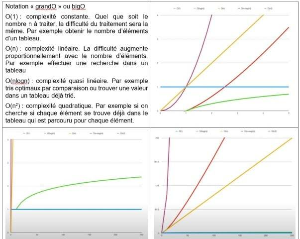

# Conclusion
**Comment choisir une structure de données adaptée à une situation à modéliser**

Nommer la structure de données qui convient pour chaque situation ci-dessous : 

1.	Représenter un répertoire téléphonique.
2.	Stocker l’historique des actions effectuées dans un logiciel et disposer d’une commande Annuler (ou Undo).
3.	Envoyer des fichiers au serveur d’impression.

??? success "Correction"
        a. dictionnaire
        b. pile
        c. file

!!! note "A Noter"
    Il est aisé de reconnaître l’outil adapté mais pourquoi est-il le mieux adapté?

    En organisant d'une certaine manière les données, on permet un traitement automatique de ces dernières plus efficace et rapide.

    Le fait d'utiliser une structure de données appropriée à un traitement informatique peut également faire baisser de manière significative la complexité d'une application informatique et ainsi contribuer à diminuer le taux d'erreurs.

    En plus de manipuler l'information, il faut aussi la stocker. La manière dont on organise cette information stockée peut avoir des conséquences très importantes sur leur manipulation.

    La performance est quantifiée par la notion de complexité (rien à voir avec difficulté) déjà abordée en première pour les algorithmes de recherche et de tris.

!!! info "Rappels"
    Vidéo à regarder pour revoir la notion de complexité et voir le lien entre la complexité et les structures de données à utiliser : 
    <iframe title="eca60635-980a-4883-96d3-ee42aea020fd-360" src="https://tube-sciences-technologies.apps.education.fr/videos/embed/9a6d40ee-d8fb-4756-93b5-96bf53eb6d1d" allowfullscreen="" sandbox="allow-same-origin allow-scripts allow-popups" width="560" height="315" frameborder="0"></iframe>

!!! note "En Résumé"
    Si un algorithme est une recette de cuisine (succession d’étapes à réaliser, plus ou moins difficiles et plus ou moins longues), la complexité de l’algorithme correspond à la difficulté des étapes, le nombre de réalisation et leur temps de réalisation. 
    Dans le cas du traitement des données, la complexité est liée à l’espace de stockage (mémoire) le temps de traitement (par le processeur) et le nombre de ces données.

Les complexités et leur représentation graphique :

{: .center}

Tableau résumé des complexités pour les différentes structures abordées :

{: .center}
 
**Comment distinguer les structures ? … par le jeu des méthodes qui les caractérisent**

Tableau résumé des méthodes de la liste, de la pile, de la file et du dictionnaire

|classe|	LISTE	|PILE	|FILE	|dictionnaire|
|:--|:--|:--|:--|:--|
|**Méthodes**	|CREER_LISTE_VIDE()|CREER_PILE_VIDE()| CREER_FILE_VIDE()|CREER_DICO_VIDE()|
| |INSERER(L,indice,element)|EMPILER(P,element) |ENFILER(F,element)|INSERER(D, cle, valeur) |
| |SUPPRIMER(L,indice) |DEPILER(P)|DEFILER(F)|SUPPRIMER(D, cle)|
| |RECHERCHER(L,element)| PILE_VIDE(P)|FILE_VIDE(F)|LIRE(D, cle) |
| |LIRE(L,indice) |PILE_PLEINE(P)|FILE_PLEINE(F)	 |RECHERCHER(D, cle)|
| |MODIFIER(L,indice,element)| | | | 
| |LONGUEUR(L) |	| | |

 On rend compte d’un jeu de méthodes spécifiques à chaque classe. C’est pour cela qu’on peut qualifier d’abstraite, chacune de ces structures de données.

