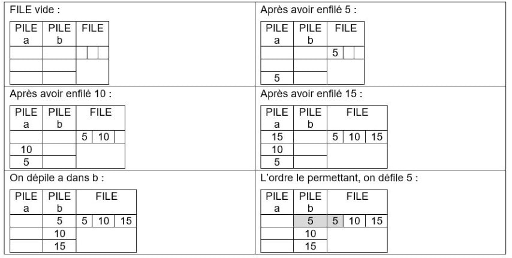

# Interface et implémentation en POO

Dans les parties précédentes, nous avons choisi le tableau pour représenter, la LISTE, la PILE et la FILE. L’objectif de l’activité suivante est de réinvestir ce qui a été vu dans la programmation objet  et de montrer que l’on peut implémenter différemment une même structure de données : la FILE.

**Objectif final :** implémenter une FILE avec deux PILES

Pour alléger l’implémentation et réinvestir le vocabulaire de la programmation objet, on décompose la tâche en plusieurs étapes.

{{exercice(1, titre="Création de la pile")}}

    On crée la classe PILE avec les méthodes rappelées ci-dessus. 

    1) Parcourir le programme implémenté et indiquer ce que l’on obtient lorsqu’on effectue les tests.

    ```python
    class Pile:
        def __init__(self, n):
            self.set_n(n)
            n = self.get_n()
            self.PILE = [None]*(n+1)
            self.TaillePILE = n + 1
            self.Queue = 1
            
        def set_n(self, nouveau_n):
            self.n = nouveau_n
            
        def get_n(self):
            return self.n
        
        
        def PILE_VIDE(self):
            return self.Queue == 1
        
        def PILE_PLEINE(self):
            return self.Queue == self.TaillePILE
        
        def EMPILER(self, x):
            msg = ""
            if self.PILE_PLEINE():
                msg = 'la pile est pleine'
            else:
                self.PILE[self.Queue] = x
                self.Queue = self.Queue + 1
            return msg
            
        def DEPILER(self):
            msg = ""
            if self.PILE_VIDE():
                msg = 'la pile est vide'
                return msg
            self.Queue = self.Queue - 1
            return self.PILE[self.Queue]
        
        def AFFICHER_PILE(self):
            msg = f"PILE :\n "
            for i in range (self.Queue-1, 0, -1):
                msg = msg + f"{self.PILE[i]} \n"
            return msg    
            
    # zone de tests de la pile
    MAPILE=Pile(3)
    print(MAPILE.EMPILER(5))
    print(MAPILE.AFFICHER_PILE())
    print(MAPILE.EMPILER(10))
    print(MAPILE.AFFICHER_PILE())
    print(MAPILE.EMPILER(15))
    print(MAPILE.AFFICHER_PILE())
    print(MAPILE.EMPILER(20))
    print(MAPILE.AFFICHER_PILE())
    print(MAPILE.DEPILER())
    print(MAPILE.AFFICHER_PILE())
    print(MAPILE.EMPILER(20))
    print(MAPILE.AFFICHER_PILE())
    print(MAPILE.DEPILER())
    print(MAPILE.AFFICHER_PILE())
    print(MAPILE.DEPILER())
    print(MAPILE.AFFICHER_PILE())
    print(MAPILE.DEPILER())
    print(MAPILE.AFFICHER_PILE())
    print(MAPILE.DEPILER())
    print(MAPILE.AFFICHER_PILE())
    print(MAPILE.EMPILER(25))
    print(MAPILE.AFFICHER_PILE())
    ```

    2) Implémenter ce programme sur Python et vérifier vos résultats de la question 1)

    {{IDE()}}

    ??? success "Correction"
        ```python
        class Pile:
            def __init__(self, n):
                self.set_n(n)
                n = self.get_n()
                self.PILE = [None] * (n+1)
                self.TaillePILE = n + 1
                self.Queue = 1
                
            def set_n(self,nouveau_n):
                self.n = nouveau_n
                
            def get_n(self):
                return self.n
            
            
            def PILE_VIDE(self):
                return self.Queue == 1
            
            def PILE_PLEINE(self):
                return self.Queue == self.TaillePILE
            
            def EMPILER(self, x):
                msg = ""
                if self.PILE_PLEINE():
                    msg = 'la pile est pleine'
                else:
                    self.PILE[self.Queue] = x
                    self.Queue = self.Queue + 1
                return msg
                
            def DEPILER(self):
                msg = ""
                if self.PILE_VIDE():
                    msg = 'la pile est vide'
                    return msg
                self.Queue = self.Queue - 1
                return self.PILE[self.Queue]
            
            def AFFICHER_PILE(self):
                msg = f"PILE :\n "
                for i in range (self.Queue-1,0,-1):
                    msg = msg + f"{self.PILE[i]} \n"
                return msg
        # zone de tests de la pile
        MAPILE=Pile(3)
        print(MAPILE.EMPILER(5))
        print(MAPILE.AFFICHER_PILE())
        print(MAPILE.EMPILER(10))
        print(MAPILE.AFFICHER_PILE())
        print(MAPILE.EMPILER(15))
        print(MAPILE.AFFICHER_PILE())
        print(MAPILE.EMPILER(20))
        print(MAPILE.AFFICHER_PILE())
        print(MAPILE.DEPILER())
        print(MAPILE.AFFICHER_PILE())
        print(MAPILE.EMPILER(20))
        print(MAPILE.AFFICHER_PILE())
        print(MAPILE.DEPILER())
        print(MAPILE.AFFICHER_PILE())
        print(MAPILE.DEPILER())
        print(MAPILE.AFFICHER_PILE())
        print(MAPILE.DEPILER())
        print(MAPILE.AFFICHER_PILE())
        print(MAPILE.DEPILER())
        print(MAPILE.AFFICHER_PILE())
        print(MAPILE.EMPILER(25))
        print(MAPILE.AFFICHER_PILE())
        ```

{{exercice(titre="Création de la file")}}

    On crée la classe FILE à partir de deux PILES a et b. La PILE a est une zone de remplissage de la FILE. La PILE b est une zone de suppression de la FILE. Lorsqu’on veut enfiler un élément dans la FILE, on l’empile dans la PILE a. Lorsqu’on veut défiler la FILE, il faut dépiler la PILE a dans la PILE b puis dépiler la PILE b.

    Soit par exemple deux PILES pouvant contenir 3 éléments chacune, et la FILE pourra en contenir 3. La FILE est initialement vide. On montre le fonctionnement ci-dessous.

    {: .center}

    
    !!! note "Remarque"
        Il faut dépiler complètement b avant de dépiler a dans b.

    1) Parcourir le programme et indiquer ce qui est renvoyé lorsqu’on effectue les tests.

    ```python
    class File:
    #Definition d'une file a l'aide de deux piles
        def __init__(self, n):
            self.set_n(n)
            n = self.get_n()
            self.a = Pile(n)
            self.b = Pile(n)
            
        def set_n(self, nouveau_n):
            self.n = nouveau_n
            
        def get_n(self):
            return self.n
        
        def FILE_VIDE(self):
            return self.a.PILE_VIDE() and self.b.PILE_VIDE()
        
        def FILE_PLEINE(self):
            return self.a.PILE_PLEINE()
        
        def ENFILER(self, x):
            if self.FILE_PLEINE():
                msg = 'la file est pleine'
            else:
                self.a.EMPILER(x)
                msg = f"élément enfilé : {x}"
            return msg
                
        def DEFILER(self):
            if self.FILE_VIDE():
                msg = 'la file est vide'
            else:
                if self.b.PILE_VIDE():
                    while not self.a.PILE_VIDE():
                        self.b.EMPILER(self.a.DEPILER())
                elt_retire = self.b.DEPILER()
                msg = f"élément retiré : {elt_retire}"
            return msg
        
        def AFFICHER_FILE(self):
            print('ZONE POUR EMPILAGE')
            print(self.a.AFFICHER_PILE())
            print('ZONE POUR DEPILAGE')
            print(self.b.AFFICHER_PILE()) 
            
    # zone de tests de la file
    MAFILE=File(3)
    print(MAFILE.ENFILER(5))
    print(MAFILE.AFFICHER_FILE())
    print(MAFILE.ENFILER(10))
    print(MAFILE.AFFICHER_FILE())
    print(MAFILE.ENFILER(15))
    print(MAFILE.AFFICHER_FILE())
    print(MAFILE.ENFILER(20))
    print(MAFILE.AFFICHER_FILE())
    print(MAFILE.DEFILER())
    print(MAFILE.AFFICHER_FILE())
    print(MAFILE.DEFILER())
    print(MAFILE.AFFICHER_FILE())
    print(MAFILE.DEFILER())
    print(MAFILE.AFFICHER_FILE())
    print(MAFILE.DEFILER())
    print(MAFILE.AFFICHER_FILE())
    print(MAFILE.ENFILER(20))
    print(MAFILE.AFFICHER_FILE())
    ```
    2) Implémenter ce programme sur Python et vérifier vos résultats de la question 1)

    {{IDE()}}

    ??? success "Correction"

        ```python
        class Pile:
            def __init__(self, n):
                self.set_n(n)
                n = self.get_n()
                self.PILE = [None] * (n+1)
                self.TaillePILE = n + 1
                self.Queue = 1
                
            def set_n(self,nouveau_n):
                self.n = nouveau_n
                
            def get_n(self):
                return self.n
            
            
            def PILE_VIDE(self):
                return self.Queue == 1
            
            def PILE_PLEINE(self):
                return self.Queue == self.TaillePILE
            
            def EMPILER(self, x):
                msg = ""
                if self.PILE_PLEINE():
                    msg = 'la pile est pleine'
                else:
                    self.PILE[self.Queue] = x
                    self.Queue = self.Queue + 1
                return msg
                
            def DEPILER(self):
                msg = ""
                if self.PILE_VIDE():
                    msg = 'la pile est vide'
                    return msg
                self.Queue = self.Queue - 1
                return self.PILE[self.Queue]
            
            def AFFICHER_PILE(self):
                msg = f""
                for i in range (self.Queue-1,0,-1):
                    msg = msg + f"{self.PILE[i]}\n"
                return msg    

        class File:
        #Definition d'une file a l'aide de deux piles
            def __init__(self,n):
                self.set_n(n)
                n = self.get_n()
                self.a = Pile(n)
                self.b = Pile(n)
                
            def set_n(self,nouveau_n):
                self.n = nouveau_n
                
            def get_n(self):
                return self.n
            
            def FILE_VIDE(self):
                return self.a.PILE_VIDE() and self.b.PILE_VIDE()
            
            def FILE_PLEINE(self):
                return self.a.PILE_PLEINE()
            
            def ENFILER(self, x):
                if self.FILE_PLEINE():
                    msg = 'la file est pleine'
                else:
                    self.a.EMPILER(x)
                    msg = f"élément enfilé : {x}"
                return msg
                    
            def DEFILER(self):
                if self.FILE_VIDE():
                    msg = 'la file est vide'
                else:
                    if self.b.PILE_VIDE():
                        while not self.a.PILE_VIDE():
                            self.b.EMPILER(self.a.DEPILER())
                    elt_retire = self.b.DEPILER()
                    msg = f"élément retiré : {elt_retire}"
                return msg
            
            def AFFICHER_FILE(self):
                print('ZONE POUR EMPILAGE')
                print(self.a.AFFICHER_PILE())
                print('ZONE POUR DEPILAGE')
                print(self.b.AFFICHER_PILE()) 

        # zone de tests de la file
        MAFILE=File(3)
        print(MAFILE.ENFILER(5))
        print(MAFILE.AFFICHER_FILE())
        print(MAFILE.ENFILER(10))
        print(MAFILE.AFFICHER_FILE())
        print(MAFILE.ENFILER(15))
        print(MAFILE.AFFICHER_FILE())
        print(MAFILE.ENFILER(20))
        print(MAFILE.AFFICHER_FILE())
        print(MAFILE.DEFILER())
        print(MAFILE.AFFICHER_FILE())
        print(MAFILE.DEFILER())
        print(MAFILE.AFFICHER_FILE())
        print(MAFILE.DEFILER())
        print(MAFILE.AFFICHER_FILE())
        print(MAFILE.DEFILER())
        print(MAFILE.AFFICHER_FILE())
        print(MAFILE.ENFILER(20))
        print(MAFILE.AFFICHER_FILE())
        ```


    On a donc implémenté différemment une même structure de données


??? note "Conclusion"

    Pour une même spécification, plusieurs implémentations concrètes peuvent exister. Cette notion de spécification et implémentation existe aussi pour les algorithmes en général, nous avons par exemple vu que plusieurs algorithmes de tri existent (leur spécification, « trier la liste qui leur est passée en argument », étant commune).

    En général, il existe plusieurs manières de représenter ces données et plusieurs implémentations de leur manipulation.
    De manière générale, on définit une interface, ou spécification, d’une structure de données.

    L'interface sera définie dans un type de données abstrait (TDA). Il spécifie précisément la nature et les propriétés des données à stocker et les modalités des opérations.

    En informatique, une structure de données est une manière d'organiser les données pour les traiter plus facilement. Une structure de données est une mise en œuvre concrète d'un type abstrait.

    Le type abstrait de données = représentation logique qui définit le comportement ; que l’on différencie de la réalisation concrète et physique avec utilisation de la mémoire, qu’on appelle implémentation.

    En Python, l’interface et l’implémentation sont en général mêlés dans le même fichier. L’interface est tout ce dont on  a besoin de connaître pour écrire un programme utilisant la classe. L’implémentation est nécessaire à l’ordinateur pour l’exécution du programme.

