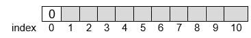

# La LISTE

!!! python "Rappels sur les types construits de Python"
    Nous avons vu dans les chapitres [Encodage](/encodage/) et [Python](/python/) comment représenter des données avec des types et valeurs de base : **entier**,  **flottant**, **booléen** et **texte**, appelés respectivement en Python : `int`, `float`, `bool` et `str`.

    Nous avons appris à reconnaître différents **types construits** :

    -	Le **tuple** : ```tuple = ('1', 'a')``` contenant des valeurs ordonnées et repérées par un index (index 0 pour le premier élément, ```tuple[0] = '1'```) et pour lequel on ne peut pas remplacer la valeur en un index donné ; 
   
    -	La **liste** : ```liste = [1, 2, 3]``` contenant des valeurs ordonnées et repérées aussi par un index (```liste[-1] = 3```). 
    
    !!! warning "Attention"
        On appelle **liste** en Python ce qui est plus généralement un **tableau indexé**. Un tableau indexé est une suite d’éléments de même type (il est possible de créer des listes contenant des valeurs de types différents mais c’est déconseillé car le traitement de la liste serait compliqué puisque chaque type devrait être traité différemment) . Il ne faudra pas confondre ces tableaux indexés avec les listes que l’on aborde dans ce chapitre. 


!!! info "Définition"
    La **LISTE** est une suite d’éléments de même type pour les mêmes raisons que le tableau indexé. Une LISTE est utilisée pour stocker en mémoire des données qui doivent être traitées dans un certain ordre. On peut y **ajouter**, **enlever**, **consulter** un élément d’une liste et **modifier** un élément sans affecter les autres éléments. 


{{exercice(1, titre="Utilisation d'une LISTE")}}
    !!! info "Méthodes du type (ou de la classe) LISTE"

        La LISTE contient des données de même type T (que des entiers par exemple)

        On ne conserve que les opérations utiles et autant que possible, les plus efficaces.

        Les opérations (ou les méthodes ou interactions avec environnement) sont :

        -	`CREER_LISTE_VIDE()` qui retourne un objet de type LISTE : la LISTE est créée et est vide.
        -	`INSERER(L, i, e)` : l’élément e est inséré à la position i dans la LISTE L.
        -	`SUPPRIMER(L, i)` : l’élément situé à la position i est supprimé.
        -	`RECHERCHER(L, e)` qui retourne un objet de type entier  : l’élément e est cherché dans la LISTE et c’est la position i qui est retourné.
        -	`LIRE(L, i)` qui retourne un objet du type T : c’est l’élément situé à la position i qui est retourné.
        -	`MODIFIER(L, i, e)` : l’élément situé à la position i dans la LISTE est écrasé par le nouvel élément e.
        -	`LONGUEUR(L)` qui retourne un objet de type entier : le nombre d’éléments de la LISTE est retourné.

    1) Que donne la liste d'instructions suivante?

    ```python
    L=[2, 4, 7, 1, 9, None, None]

    INSERER(L, 2, 9)
    print(L)

    SUPPRIMER(L, 1)
    print(L)

    print(RECHERCHER(L, 1))

    print(RECHERCHER(L, 10))

    print(LIRE(L, 7))

    MODIFIER(L, 4, 8)
    print(L)


    print(LONGUEUR(L))
    ```

    2) Vérifier avec la console ci-dessous (les fonctions sont déjà préchargées, mais non visibles)

    {{IDE('scripts/utilisation_LISTE')}}

{{exercice(titre="Représentation d'une LISTE")}}

    !!! info "Taille d'un tableau indexé"
        Puisqu’on les connaît bien, on peut choisir d’utiliser les tableaux indexés vus en première et qui sont de taille fixe.

        Lorsqu’on crée une LISTE de taille n, un espace mémoire légèrement plus grand lui est alloué.

        Mais attention, la première case de ce tableau, donc d’index 0 est réservée pour contenir le nombre d’éléments contenus dans la liste. 

        Le nombre d’éléments contenus dans la liste indique la dernière position occupée et donc informe sur la position de la case disponible. Et chaque élément *e* sera caractérisé par sa position supérieure ou égale à 1.

        Supposons un tableau de 11 cases. Alors ce tableau pourra représenter une liste de $n=10$ éléments au maximum. On grise l’espace où l’insertion est possible.

        {: .center}

        Les espaces libres sont alloués au fur et à mesure, tant qu’il reste de l’espace. Ci-dessous, on rend compte de l’évolution du remplissage du tableau qui représente cette liste, pour différentes insertions


    On vous donne les deux premières allocations, à vous de compléter pour les suivantes.

    {: .center}

    ??? success "Correction"
        


    !!! note "Remarques"
        Si on veut modifier un élément, puisque l’élément est de position connue, il n’y a pas de coût supplémentaire et ce quel que soit le nombre d’éléments de la liste. Donc la modification, de même que l’allocation, ne dépend pas du nombre d’éléments de la liste. On dit qu’elles ont un coût constant.

        En revanche si la liste doit être rallongée, il faut modifier le nombre de cases du tableau initial et l’index doit être modifié. Cette action dépend proportionnellement du nombre d’éléments de la liste.

        De même si on doit retirer un élément de la liste, il sera moins coûteux de retirer un élément en bout de liste qu’un élément au coeur de la liste où il faudrait redéfinir les index.

{{exercice(titre="Algorithme et implémentation dans Python")}}

    On sait déjà réaliser les opérations sur une liste déjà existante : trouver sa longueur, rechercher une valeur, lire une valeur, modifier une valeur. On limite donc l’étude à l’implémentation de l’insertion et de la suppression.

    Pour cette activité, on part de la liste suivante (un tableau pouvant accueillir les 10 valeurs entières d’une liste)  

    `LISTE=[4, 1, 5, 4, 16, None, None, None, None, None, None]`


    1) Complétez le programme ci-dessous.

    - Objectif 1 : écrire une fonction qui affiche les éléments de la liste, excepté l’élément d’index 0 .
    - Objectif 2 : écrire une fonction qui supprime l’élément e d’index i de la liste LISTE définie ci-dessus.
    - Objectif 3 : écrire une fonction qui insère l’élément e à l’index i dans la LISTE définie ci-dessus.

    {{IDE('scripts/exercice2')}}

    2) Testez ce programme avec un doctest, et éventuellement, corrigez-le.

    ??? success "Correction"
        ```python
        """
        Ce module contient les fonctions :
        - AFFICHER : fonction afficher la liste , sans l'element d'index 0
        - SUPPRIMER : fonction qui supprime un élément de la liste
        - INSERER : fonction qui insère un élément dans la liste
        """

        def CREER_LISTE_VIDE():
            return []

        def INSERER(L, i, e):
            if i > len(L):
                msg = "insertion pas possible: indice pas correct"
            else:
                L.insert(i, e)
                L.pop()
                msg = "insertion effectuée"
            return msg


        def SUPPRIMER(L, i):    
            if  i > len(L):
                msg = "suppression pas possible"
            else :
                del L[i]
                L.append(None)
                msg = "la suppression est possible"
            return msg


        def RECHERCHER(L, e):
            if e in L:
                msg = L.index(e)
            else:
                msg = "L'élément n'est pas dans la liste"
            return msg

        def LIRE(L, i):
            if  i > len(L):
                msg = "lecture impossible"
            else:
                msg = L[i]
            return msg

        def MODIFIER(L, i, e):
            if  i > len(L):
                msg = "modification impossible"
            else:
                L[i] = e
                msg = "modification effectuée"
            return msg

        def LONGUEUR(L):
            return len(L)
        
        if __name__ == '__main__':
            import doctest
            doctest.testmod()
        ```


??? note "Cas particulier des dictionnaires"

    Les **dictionnaires** sont comme les **listes**, des objets structurés pouvant contenir d’autres objets. Mais contrairement aux listes, dans un dictionnaire, les données ne sont pas stockées dans un ordre précis. Donc pour accéder à un objet, on utilise une clé à la place d’un indice.

    Avantage du dictionnaire sur la liste : lors de la recherche d’une valeur, inutile de parcourir une liste, on la trouve grâce à la clé. Inconvénient, pour ajouter des paires au dictionnaire il faut prévoir plus de mémoire potentiellement inutilisée.

    Les dictionnaires existent nativement dans Python, il est donc inutile de les implémenter ; toutefois dans d’autres langages, on pourrait être amené à le faire. Auquel cas il faut définir les méthodes de la classe dictionnaire :

    - `CREER_DICO_VIDE()` : qui retourne un objet dictionnaire, le dictionnaire existe et il est vide.
    - `INSERER(D, cle, valeur)` : qui insère la paire clé-valeur dans le dictionnaire
    - `SUPPRIMER(D, cle)` : qui supprime la paire clé-valeur dans le dictionnaire, lorsque la clé est supprimée, la valeur l’est aussi automatiquement.
    - `LIRE(D, cle)` : qui retourne un objet de même type que celui de la valeur.
    - `RECHERCHER(D, cle)` : qui retourne un objet de type booléen, True si clé présente dans le dictionnaire et False si clé absente.