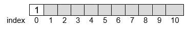
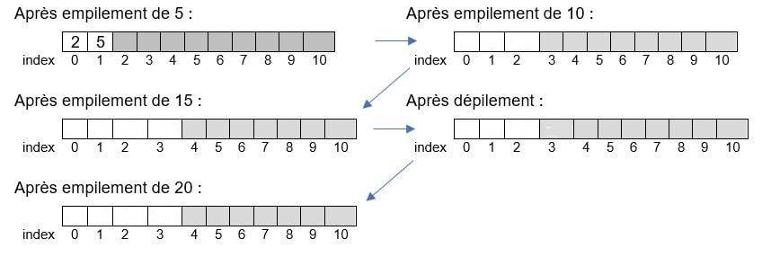
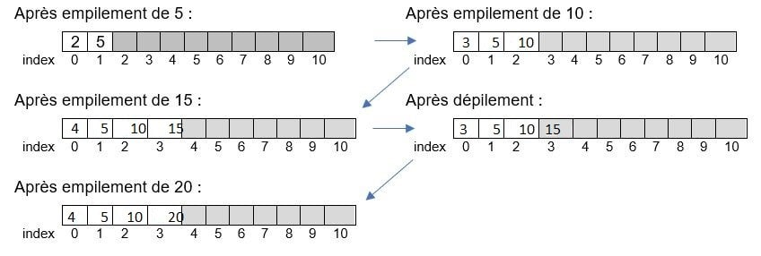
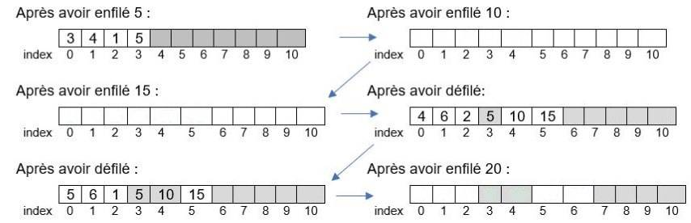

# Les PILES et les FILES

{{exercice(1, titre="Introduction : Différence entre un pile et d'une file")}}

    1. Lire la vidéo ci-dessous **jusqu’à 6 minutes**.

        <iframe title="45522059-bb03-41c3-a38e-bcd390eabc2c-360" src="https://tube-sciences-technologies.apps.education.fr/videos/embed/2e283f1d-4658-4ad9-bb17-75a37cf8dd80" allowfullscreen="" sandbox="allow-same-origin allow-scripts allow-popups" width="560" height="315" frameborder="0"></iframe>

    2. Qu’est-ce qui distingue une PILE ou une FILE d’une LISTE ?

    3. Compléter le tableau suivant :

        | |La PILE|La FILE|
        |:--|:--:|:--:|
        |Une image du quotidien qui l'illustre|||
        |Qu'est-ce que c'est? (principe)|||
        |Acronyme du mode associé et signification|||
        |Ce qu'on peut faire avec? (méthodes)|||
        |A quoi cela sert?|||

    ??? success "Correction"
        ||La PILE|La FILE|
        |:--:|:--:|:--:|
        |Une image du quotidien qui l’illustre|La pile d’assiettes (collection verticale)| La file d’attente (collection horizontale)|
        |Qu’est-ce que c’est (principe) ?|Structure où le dernier élément ajouté sera le premier à être retiré.|Structure dans laquelle les  éléments sont récupérés dans l’ordre dans lequel ils ont été ajoutés. Les premiers ajoutés sont les premiers à  être récupérés.|
        |Acronyme du mode associé et signification|LIFO (last in first out)|FIFO (first in first out)|
        |Ce qu’on peut faire avec (méthode)?|On peut empiler, consulter sommet de la  pile, dépiler, vérifier si la pile est vide.|On enfile un élément par la gauche. On défile un élément par la droite. On peut vérifier si la file est vide.|
        |A quoi cela sert ?|Les  processeurs dans les ordinateurs gèrent un système de piles. Une pile est utilisée pour mémoriser les pages visitées dans un navigateur web ;on utilise une pile pour évaluer les expressions mathématiques en notation  polonaise  inverse  (notation sans parenthèses) ; la fonction annuler la  frappe  (`ctrl+Z`); les algorithmes de recherche en profondeur et algorithmes récursifs utilisent une pile.|Elle sert à traiter les données dans l’ordre dans lequel elles arrivent. Utilisés dans les mécanismes d’attente (système d’impression pour traiter les requêtes dans l’ordre dans lequel elles arrivent)dans les systèmes d’exploitation dans mécanismes d’ordonnancement afin de gérer l’ordre d’exécution des processus; pour gérer les mémoires tampons. Dans les algorithmes de parcours en largeur.|


    La vidéo évoque le type abstrait (reporté en fin de chapitre). La fin de la vidéo constitue une ouverture sur le type abstrait et des listes chainées et doublement chainées qui sont hors programme.

    !!! info "Complément"
        Ces deux structures bien que différentes par certains aspects, sont utilisées pour stocker des éléments dans la LISTE et effectuer des opérations comme ajouter ou supprimer l’élément d’une LISTE. Dans une PILE on n’utilise qu’un seul pointeur (vers le haut de la PILE), alors que dans une FILE, il en faut deux (un vers la tête et l’autre vers la queue)

        Les PILES sont très utilisées sur les plateformes de streaming musical. Lorsqu’on demande à la plateforme de lire une chanson à la suite, elle ajoute cette dernière, tout en haut de la liste "en attente de lecture".

        Mais si nous voulons accéder non pas aux dernières données ajoutées, mais aux premières, il faut alors utiliser une FILE. Les programmeurs l’utilisent dans des services de commande en ligne (commande de pizza sur Internet) ou dans les plateformes de gestion de la clientèle (le premier à avoir posé une question est le premier servi).

## Les Piles

!!! info "Définition d'une pile"

    La **PILE** est encore une **LISTE** qui contiendra le même type T de données (que des entiers par exemple).

    Les opérations (ou les méthodes ou interactions avec environnement) sont :

    - `CREER_PILE_VIDE()`, qui retourne un objet de type PILE : la PILE existe et est vide
    - `EMPILER(P, e)`: l’élément e est placé au sommet de la PILE
    - `DEPILER(P)` qui retourne un objet de type T : l’élément situé au sommet de la PILE est retiré de la PILE et est renvoyé.
    - `PILE_VIDE(P)`, qui retourne un objet de type booléen  : si la PILE est vide True est renvoyé, sinon False
    - `PILE_PLEINE(P)`, qui retourne un objet de type booléen  : si la PILE est pleine True est renvoyé, sinon False


{{exercice(titre="Implémentation en python des méthodes d'une PILE")}}


    1) Que donne la liste d'instructions suivante?

    ```python
    P = CREER_PILE_VIDE()
    print(P)

    print(PILE_VIDE(P))

    EMPILER(P, 2)
    EMPILER(P, 5)
    EMPILER(P, 3)
    EMPILER(P, 7)

    print(P)

    DEPILER(P)
    print(P)

    print(PILE_VIDE(P))
    ```

    2) Vérifier avec la console ci-dessous (les fonctions sont déjà préchargées, mais non visibles)

    {{IDE('scripts/utilisation_PILE')}}


    Si on choisit de représenter la PILE par un tableau, sa première case, d’index 0 contiendra l’indice (ou position) de la prochaine case vide et donc l’indice du prochain élément à insérer. Ensuite chaque élément inséré sera repéré par son index. Le sommet de la PILE correspond à la dernière case non vide du tableau.

    Un exemple pour fixer les idées : 

    On part d’un tableau de 11 cases donc qui pourra accueillir les $n=10$ éléments d’une PILE :

    {: .center}

{{exercice(titre="Principe de l'empilement et du dépilement")}}

    Remplir les tableaux suivants. On grise les cases où l’empilement est possible.

    {: .center}

    ??? note "Correction"
        

    **Remarque** : on voit qu’il est inutile de « vider » la case lorsqu’on dépile, la valeur dépilée sera écrasée à l’empilement suivant.

{{exercice(titre="Fonction d'empilement et dépilement")}}

    On part d’une PILE vide, à 4 cases donc pouvant accueillir 3 éléments : 

    `PILE = [1, None, None, None]`

    - Objectif 1 : écrire une fonction qui affiche les éléments de la PILE, sous forme d’une PILE.
    - Objectif 2 : écrire une fonction qui empile. Attention on ne peut empiler que si la PILE n’est pas pleine.
    - Objectif 3 : écrire une fonction qui dépile. Attention on ne peut dépiler que si la PILE n’est pas vide.

    1) Complétez le programme suivant.

    {{IDE('scripts/exercice5')}}

    2) Testez ce programme avec Doctest.

    ??? success "Correction"
        ```
        """
        Ce module contient les fonctions :
        - AFFICHER : fonction afficher la pile verticalement , sans l'element d'index 0
        - EMPILER : fonction qui empile l'element e dans la pile P
        - DEPILER : fonction qui depile dans la pile P
        """

        #objectif 1: fonction qui affiche sous forme d’une pile, les elements de la pile P, excepte celui d'index 0
        def AFFICHER(P):
            """
            Cette fonction permet d'afficher les éléments d'une pile verticalement à partir de l'indice 1
            param : L(list)
            return msg(str)
            Exemples :
            >>> print(AFFICHER([5, 1, 5, 4, 16, None, None, None ,None, None, None]))
            Pile : 
            None 
            16 
            4 
            5 
            1
            """   
            
            msg = f"Pile : \n"
            for i in range(P[0], 1, -1):
                msg = msg + f"{P[i]} \n"
            msg = msg + f"{P[1]}"   
            return msg

        #objectif 2:fonction qui empile l'element e dans la pile P
        def EMPILER(P, e):
            """
            Cette fonction permet d'empiler l'élement e dans la pile P
            param : L(list)
                    e(float)
            return : msg(str)
            Exemples :
            >>> EMPILER([5, 1, 5, 4, 16], 2)
            'la pile est pleine'
            >>> EMPILER([5, 1, 5, 4, 16, None], 2)
            'element empiler : 2'
            """
            
            # test si on peut empiler
            if P[0] == len(P):
                msg = 'la pile est pleine'
            # empiler l'element e
            else:
                P[P[0]] = e
                #mise a jour de la prochaine position disponible
                P[0] = P[0] + 1
                msg = f"element empiler : {e}"
            return msg

        #objectif 3: fonction qui depile dans la pile P
        def DEPILER(P):
            """
            Cette fonction permet de dépiler la pile P
            param : L(list)
            return : msg(str)
            Exemples :
            >>> DEPILER([1, None, None, None, None, None, None])
            'la pile est vide'
            >>> DEPILER([5, 1, 5, 4, 16, None, None, None, None, None, None])
            'element dépilé : 16'
            """
            # test si on peut depiler
            if P[0] == 1:
                msg = 'la pile est vide'
            else:
                # mise a jour de la prochaine position disponible
                P[0] = P[0] - 1
                # depiler et renvoyer l'element retire
                elt_depile = P[P[0]]
                msg = f"element dépilé : {elt_depile}"
            return msg
        if __name__ == '__main__':
            import doctest
            doctest.testmod()
        ```


## Les Files


!!! info "Définition d'une File"
    La FILE est  une LISTE qui contient le même type T de données (que des entiers par exemple).

    Les opérations (ou les méthodes ou interactions avec environnement) sont :

    - `CREER_FILE_VIDE()`, qui retourne un objet de type FILE : la FILE existe et est vide
    - `ENFILER(F, e)`: l’élément e est enfilé en queue de FILE
    - `DEFILER(F)` qui retourne un objet de type T : l’élément situé à la tête de la FILE est retiré de la FILE et est renvoyé.
    - `FILE_VIDE(F)`, qui retourne un objet de type booléen  : si la FILE est vide True est renvoyé, sinon False
    - `FILE_PLEINE(F)`, qui retourne un objet de type booléen  : si la FILE est pleine True est renvoyé, sinon False

{{exercice(titre="Utilisation d'une file")}}


    1) Que donne la liste d'instructions suivante?

    ```python
    F = CREER_FILE_VIDE()
    print(F)

    print(FILE_VIDE(F))

    ENFILER(F, 2)
    ENFILER(F, 5)
    ENFILER(F, 3)
    ENFILER(F, 7)

    print(F)

    DEFILER(F)
    print(F)

    print(FILE_VIDE(F))
    ```

    2) Vérifier avec la console ci-dessous (les fonctions sont déjà préchargées, mais non visibles)

    {{IDE('scripts/utilisation_FILE')}}


    !!! note "Explications"

        Si on choisit de représenter la FILE par un tableau, sa première case, d’index 0 contiendra l’indice de la tête de la FILE ; la deuxième contiendra l’indice de la queue de la FILE et la troisième contiendra le nombre d’éléments présents dans la FILE.

        Ensuite chaque élément inséré sera repéré par son index.

        Un exemple pour fixer les idées : 

        On part d’un tableau de 11 cases donc qui pourra accueillir les n=8 éléments d’une FILE :

        {: .center}

        Chaque fois qu’un élément est enfilé, la queue et la taille augmente chacune d’une unité.

        Chaque fois qu’un élément est défilé, la taille diminue d’une unité et la tête augmente d’une unité.

        Lorsque la tête ou la queue dépasse la longueur du tableau, on repart au début du tableau (gestion circulaire du tableau)

{{exercice(titre="Principe d'une file")}}

    Pour comprendre, remplir les tableaux suivants. On grise les espaces dans lesquelles les valeurs pourront être enfilées.

    {: .center}

    ??? note "Correction"
        

    **Remarque :** lorsqu’on défile, la case n’est pas vidée. Son contenu sera écrasé lorsqu’un prochain élément sera enfilé.

{{exercice(titre="Implémentation d'une file")}}

    On part d’une FILE vide, soit un tableau à 6 cases donc pouvant accueillir 3 éléments : 

    `FILE = [3, 3, 0, None, None, None]`

    - Objectif 1 : écrire une fonction qui affiche tous les éléments du tableau, y compris la tête, la queue et la taille
    - Objectif 2 : écrire une fonction qui enfile. Attention on ne peut enfiler que si la FILE n’est pas pleine.
    - Objectif 3 : écrire une fonction qui défile. Attention on ne peut défiler que si la FILE n’est pas vide.

    1) Complétez le programme ci-dessous et testez le.

    {{IDE('scripts/exercice7')}}

    ??? success "Correction"
        ```python
        """
        Ce module contient les fonctions :
        - AFFICHER : fonction afficher la file , sans les elements d'index 0 et 1
        - ENFILER : fonction qui enfile l'element e dans la file F
        - DEFILER : fonction qui defile dans la file F
        """

        #objectif 1: fonction qui affiche le tableau complet
        def AFFICHER_tableau(F):
            """
            Cette fonction permet d'afficher les éléments d'une pile à partir de l'indice 2
            param : F(list)
            return msg(str)
            Exemples :
            >>> print(AFFICHER_tableau([3,5,2,4,16,None,None]))
            FILE : 4 16 None None 
            """   
            msg = f'FILE : '
            for i in range (F[0], len(F)):
                msg = msg + f"{F[i]} "
            return msg

        #objectif 2:fonction qui enfile l'element e dans la file F
        def ENFILER(F, e):
            """
            Cette fonction permet d'enfiler l'élement e dans la file F
            param : F(list)
                    e(float)
            return : msg(str)
            Exemples :
            >>> ENFILER([3, 3, 2, 4, 16], 2)
            'la file est pleine'
            >>> ENFILER([3, 5, 2, 4, 16, None, None], 2)
            'élément enfilé : 2'
            >>> ENFILER([3, 5, 2, 5, 10, None], 2)
            'retour au debut, élément enfilé : 2'
            """
            
            msg = ""
            # test si on peut enfiler
            if F[2] == (len(F) - 3):
                msg = 'la file est pleine'
            else : 
                # enfiler l'element e dans la file
                F[F[1]] = e
                # test si on doit retourner au debut
                if F[1] == (len(F) - 1):
                    F[1] = 3
                    msg = 'retour au debut, '
                else:
                    # mise a jour de la position de la place prochaine place disponible
                    F[1] = F[1] + 1
                # mise a jour du nombre d'elements dans la file
                F[2] = F[2] + 1
                msg = msg + f"élément enfilé : {e}"
            return msg


        #objectif 3: fonction qui defile dans la file F
        def DEFILER(F):
            """
            Cette fonction permet de défiler la file F
            param : F(list)
            return : msg(str)
            Exemples :
            >>> DEFILER([2, 2, 0, None, None, None, None])
            'la file est vide'
            >>> DEFILER([3, 5, 2, 4, 16, None, None])
            'élément retiré : 4'
            >>> DEFILER([3, 3, 1, 5, 10, 15])
            'élément retiré : 5'
            """
            
            msg = ""
            # test si on peut defiler
            if F[2] == 0: #ou si F[0]==F[1]
                msg = 'la file est vide'
            else :
                # defiler et renvoyer l'element retire
                elt_retire = F[F[0]]
                # mise a jour de la tete
                F[0] = F[0] + 1
                # mise a jour du nombre d'elements dans la file
                F[2] = F[2] - 1
                msg = msg + f"élément retiré : {elt_retire}"
            return msg
        if __name__ == '__main__':
        import doctest
        doctest.testmod()
        ```