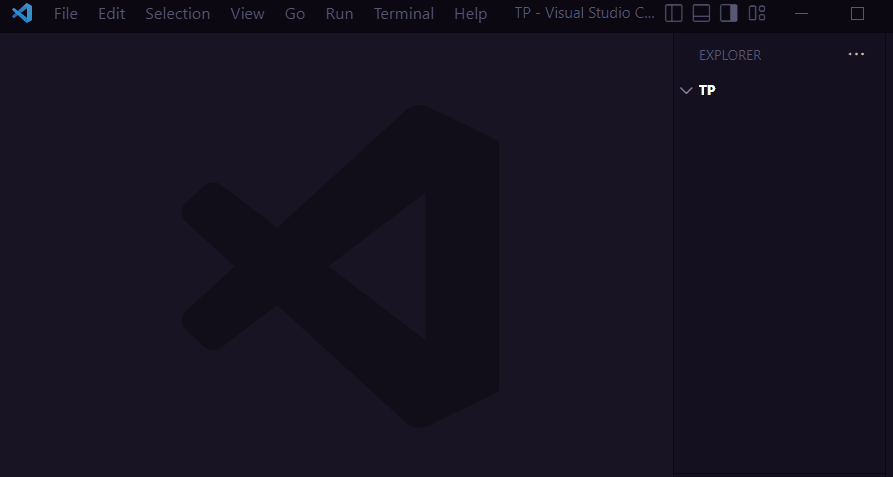

# 📑 Les fichiers `csv` et `json`


!!! info "Fichiers de données"

    Le site [data.gouv](https://www.data.gouv.fr/fr/) propose de nombreux jeux de données en libre accès.

    Les fichiers correspondants sont souvent proposés aux formats 

    * `csv` pour _**C**omma **S**eparated **V**alues_,
    * `json` pour _**J**ava**S**cript **O**bject **N**otation_.

    Ces deux formats de fichiers permettent de **présenter des données textuelles**. Voici par exemple les mêmes informations présentées dans chacun des formats :

    * au format  `csv` (le fichier s'appelle `amis.csv`):

        ```title="📑 Données CSV"
        nom,âge,ville,passion
        Jean,26,Paris,VTT
        Marion,28,Lyon,badminton
        ```

    * au format `json` (le fichier s'appelle `amis.json`):

        ```json
        { "amis": [
            {"nom": "Jean","âge": 26,"ville": "Paris","passion": "VTT"},
            {"nom": "Marion","âge": 28,"ville": "Lyon","passion": "badminton"},
                ]
        }
        ```

!!! note "Remarques"

    Nous travaillerons désormais avec les fichiers `csv`. L'exemple précédent permet de remarquer plusieurs choses :

    * un fichier `csv` contient des **données textuelles**,

    * les données sont organisées en lignes,

    * la première ligne regroupe le nom des **descripteurs** (il y en a quatre ici : `#!py nom`, `#!py âge`, `#!py ville` et `#!py passion`),

    * les autres lignes contiennent des **enregistrements** (il y en a deux ici : `#!py Jean,26,Paris,VTT` et `#!py Marion,28,Lyon,badminton`),

    * au sein de chaque ligne, les valeurs sont délimitées par un **séparateur** (ici le caractère `#!py ","`),

    * les données peuvent être de types différents. Ici le `#!py nom`, la `#!py ville` et la `#!py passion` sont des chaînes de caractères, l'`#!py âge` un entier.

!!! danger "Attention"

    La réalité n'est pas aussi simple :

    * il arrive que **la première ligne ne contienne pas les entêtes**. Ils peuvent être listés dans un fichier annexe ou... perdus !
    
    * on trouve parfois **une seconde ligne contenant les types des données** (entier, texte...).
    
    * le séparateur **n'est pas toujours une virgule**. Il est courant que l'on trouve des `#!py ";"` dans les fichiers français car la virgule est utilisée comme séparateur décimal.

{{exercice(1, titre="Premiers contacts")}}

    On considère les deux fichiers `csv` ci-dessous (on n'en donne que les trois première lignes) :

    * `petanque.csv` ([Localisation des terrains de pétanque dans l'agglomération de Tours](https://www.data.gouv.fr/fr/datasets/terrain-de-petanque-tours-metropole/)) :

    ```title="📑 Données CSV"
    geo_point_2d;nb_equipement;commune;cp
    (47.3392380011,0.7162219998);1;Chambray-lès-Tours;37170
    (47.3300100011,0.6120900019);5;Ballan-Miré;37510
    ```
    
    * `bac.csv` ([Résultats au baccalauréat par académie](https://www.data.gouv.fr/fr/datasets/le-baccalaureat-par-academie/)) :

    ```title="📑 Données CSV"
    session,academie,sexe,diplome_specialite,nombre_d_inscrits,nombre_d_admis_totaux
    INT,TEXT,TEXT,TEXT,INT,INT
    2021,AIX-MARSEILLE,FILLES,BAC PRO AG 21302 GEST MILIEUX NATURELS FAUNE,16,13
    ```

    Cochez la ou les bonnes réponses.

    === "Propositions"
        
        - [ ] Le séparateur du fichier `petanque.csv` est la virgule
        - [ ] Le fichier `petanque.csv` compte quatre descripteurs
        - [ ] Le séparateur du fichier `bac.csv` est la virgule
        - [ ] `INT` est un descripteur du fichier `bac.csv`

    === "Solution"
        
        - :x: Le séparateur du fichier `petanque.csv` est le point-virgule
        - :white_check_mark: Le fichier `petanque.csv` compte bien quatre descripteurs
        - :white_check_mark: Le séparateur du fichier `bac.csv` est bien la virgule
        - :x: `INT` est un type de données

{{exercice(titre="Problème")}}

    On propose ci-dessous un extrait d'un fichier `csv`. Identifiez les trois problèmes présents :

    ```title="📑 Données CSV"
    nom,prenom,identifiant;mdp,derniere_connexion
    Clark,Sarah,sclark,k012345,20230105,
    Mapple,Marc,marc.mapple,20221231
    ```

    ??? success "Solution"

        1. Le séparateur n'est pas constant : il y a un point-virgule dans la première ligne
        2. Il y a une virgule en trop en fin de deuxième ligne
        3. Il manque un champs sur la troisième ligne

        On pourrait aussi noter le **gros** problème qui consiste à stocker les mots de passe des utilisateurs en clair dans un fichier !

??? note "Autres formats..."

    Les fichiers `csv` et `json` ne sont pas les seuls formats permettant de conserver des données. 
    
    On peut aussi retenir le format `xml` pour _e**X**tensible **M**arkup **L**anguage_ qui utilise des balises au même titre que le `html` :


    ```xml title="📑 Données XML"
    <?xml version="1.0" encoding="UTF-8"?>
    <amis>
        <personne>
            <nom>Jean</nom>
            <âge>26</âge>
            <ville>Paris</ville>
            <passion>VTT</passion>
        </personne>
        <personne>
            <nom>Marion</nom>
            <âge>28</âge>
            <ville>Lyon</ville>
            <passion>badminton</passion>
        </personne>
    </amis>
    ```

## Création

On l'a dit, les fichiers `csv` et `json` sont des fichiers « texte » classique. Il est donc possible de les créer avec un simple éditeur de texte.

{ width=60% .center}

{{exercice(titre="« *Créer* » un fichier `csv`")}}

    On souhaite « *créer* » un fichier `csv` recensant les jours fériés en France durant l'année 2023.
    
    Afin de rester dans l'interface proposée par ce site nous travaillerons dans un éditeur Python.

    !!! note "Pour de vrai !"

        Au lieu de travailler dans l'éditeur Python proposé ci-dessous, vous pouvez utiliser votre propre éditeur et réellement créer le fichier `csv` en l'enregistrant avec l'extension `.csv`. Vous pourrez ensuite le lire comme vu plus haut. Remarquez qu'un "copié/collé" de cet écran peut vous faire gagner du temps. Il faudra juste le transformer un peu ...

    Ces jours sont présentés dans le tableau ci-dessous :

    |           motif |     jour | numero |     mois |
    | --------------: | -------: | -----: | -------: |
    |    Jour de l'an | dimanche |      1 |  janvier |
    | Lundi de Pâques |    lundi |     10 |    avril |
    | Fête du travail |    lundi |      1 |      mai |
    |   Victoire 1945 |    lundi |      8 |      mai |
    |       Ascension |    jeudi |     18 |      mai |
    |  Fête Nationale | vendredi |     14 |  juillet |
    |      Assomption |    mardi |     15 |     août |
    |       Toussaint | mercredi |      1 | novembre |
    |  Armistice 1918 |   samedi |     11 | novembre |
    |            Noël |    lundi |     25 | décembre |

    Compléter la chaîne de caractère `contenu` ci-dessous en saisissant le **contenu** du fichier `csv` :

    * on saisira les descripteurs sur la première ligne,
    * on utilisera la virgule comme séparateur.

    Vous pouvez saisir les descripteurs dans l'ordre que vous souhaitez, il faut par contre faire en sorte de saisir les valeurs dans le même ordre !

    {{ IDE('pythons/creation_csv/exo') }}


{{exercice(titre="« *Créer* » un fichier `json`")}}

    On souhaite « *créer* » un fichier `json` recensant les jours fériés en France durant l'année 2023. Ces jours sont présentés dans le tableau ci-dessous :

    |           motif |     jour | numero |     mois |
    | --------------: | -------: | -----: | -------: |
    |    Jour de l'an | dimanche |      1 |  janvier |
    | Lundi de Pâques |    lundi |     10 |    avril |
    | Fête du travail |    lundi |      1 |      mai |
    |   Victoire 1945 |    lundi |      8 |      mai |
    |       Ascension |    jeudi |     18 |      mai |
    |  Fête Nationale | vendredi |     14 |  juillet |
    |      Assomption |    mardi |     15 |     août |
    |       Toussaint | mercredi |      1 | novembre |
    |  Armistice 1918 |   samedi |     11 | novembre |
    |            Noël |    lundi |     25 | décembre |


    Compléter le dictionnaire `contenu` ci-dessous en saisissant le contenu du fichier `json`.
    
    Ce dictionnaire contient une unique clé `#!py jours_fériés` pour laquelle la valeur associée est une liste.

    Chacun des éléments de cette liste est un dictionnaire contenant les couples `#!py descripteur: valeur`.

    !!! warning "L'ordre est important !"

        Les données étant saisies dans une liste, **leur ordre importe**.
        
        Vous devez donc saisir les lignes dans l'ordre dans lequel elles apparaissent dans le tableau ci-dessus. 

    {{ IDE('pythons/creation_json/exo') }}
