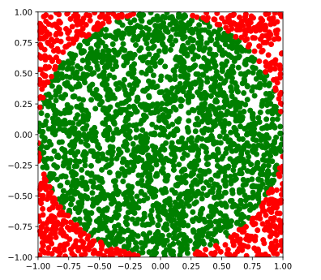

# 🏁 Les listes en compréhension

## Sans condition

Créer une liste contenant de nombreux éléments peut se faire à l'aide d'une boucle « Pour ».
Le script ci-dessous crée par exemple la liste des éléments entre `#!py 0` et `#!py 100` :

```python
entiers = []
for x in range(101):
    entiers.append(x)
```

Python propose une autre façon de créer la même liste : la **liste en compréhension**.

Le schéma général est `#!py [valeur for element in iterable]` dans lequel :

* `#!py valeur` est une valeur quelconque. Cela peut être un entier, une chaîne de caractère, obtenu en effectuant un calcul à l'aide de `#!py element` ou sans rapport avec ce dernier...,

* `#!py element` prend les différentes valeurs présentes dans `#!py iterable`,

* `#!py iterable` est un objet que Python peut parcourir. Ce peut être une liste, un tuple, un dictionnaire, un objet de type `#!py range`...

Par exemple :

* Les entiers entre `#!py 0` et `#!py 4` :

    ```pycon
    >>> [x for x in range(5)]
    [0, 1, 2, 3, 4]
    ```

* Les entiers pairs entre `#!py 0` et `#!py 8` :

    ```pycon
    >>> [2 * x for x in range(5)]
    [0, 2, 4, 6, 8]
    ```

* La liste des lettres de `#!py "python"` :

    ```pycon
    >>> [lettre for lettre in "python"]
    ['p', 'y', 't', 'h', 'o', 'n']
    ```

* La liste des lettres de `#!py "python"` en majuscule :

    ```pycon
    >>> [lettre.upper() for lettre in "python"]
    ['P', 'Y', 'T', 'H', 'O', 'N']
    ```

??? question "Comment faire ?"

    On souhaite obtenir la liste des entiers entre `#!py 3` (inclus) et `#!py 103` (inclus).

    Quelles instructions renvoient cette liste ?

    === "Cocher la ou les affirmations correctes"
        
        - [ ] `#!py [k in range(3, 104)]`
        - [ ] `#!py [k for k in range(3, 103)]`
        - [ ] `#!py [k for k in range(3, 104)]`
        - [ ] `#!py [k + 3 for k in range(101)]`
        - [ ] `#!py [k // 2 for k in range(6, 208)]`

    === "Solution"
        
        - :x: `#!py [k in range(3, 104)]` est syntaxiquement incorrect, la structure attendue est `#!py [valeur for element in iterable]`
        - :x: `#!py [k for k in range(3, 103)]` génère `#!py [3, 4, ..., 102]`. Il manque la dernière valeur
        - :white_check_mark: `#!py [k for k in range(3, 104)]`
        - :white_check_mark: `#!py [k + 3 for k in range(101)]`
        - :x: `#!py [k // 2 for k in range(6, 208)]` pourrait fonctionner si l'on utilisait un pas égal à `#!py 2`. Ici on génère la liste `#!py [3, 3, 4, 4, ..., 103, 103]`
        
??? question "Dans un terminal"

    Utilisez le terminal ci-dessous afin de créer les listes suivantes :

    1. les entiers entre `#!py 0` et `#!py 10` (inclus l'un et l'autre)
    2. les entiers entre `#!py -10` et `#!py 10` (inclus l'un et l'autre)
    3. les entiers pairs entre `#!py -10` et `#!py 10` (inclus l'un et l'autre)
    4. les multiples de 3 entre `#!py -30` et `#!py 30` (inclus l'un et l'autre)
    5. vingt fois la valeur `#!py None`
    6. la liste des caractères de "Hello World"
    7. la liste des caractères de "Hello World" en minuscule (Python considère que la minuscule de `' '` est `' '` !)

    {{ terminal() }}

    ??? success "Solution"

          1. `#!py [k for k in range(0, 11)]`
          2. `#!py [k for k in range(-10, 11)]`
          3. `#!py [k for k in range(-10, 11, 2)]`
          4. `#!py [k for k in range(-30, 31, 3)]`
          5. `#!py [None for _ in range(20)]`. La variable d'itération n'étant pas utilisée, on peut la nommer `#!py _`
          6. `#!py [caractere for caractere in "Hello World"]`
          7. `#!py [caractere.lower() for caractere in "Hello World"]`

??? question "Générer l'alphabet"


    On cherche dans cet exercice à créer la liste de toutes les lettres de l'alphabet en majuscule. Plusieurs options s'offrent à nous :

    * écrire la liste à la main. C'est fastidieux et nous ne sommes pas à l'abri d'un oubli ou d'une erreur...
    * s'appuyer sur la table ASCII qui contient déjà tous ces  caractères.

    On en fournit ci-dessous un extrait :

    <table>
        <tr>
            <td>`#!py ...`</td>
            <td>`#!py "A"`</td>
            <td>`#!py "B"`</td>
            <td>`#!py "C"`</td>
            <td>`#!py ...`</td>
            <td>`#!py "Y"`</td>
            <td>`#!py "Z"`</td>
            <td>`#!py "["`</td>
            <td>`#!py ...`</td>
        </tr>
    </table>

    Comme on peut le voir, les caractères de l'alphabet en majuscule sont tous à la suite dans la table. Chacun est associé à un code (non donné dans le tableau). Ces codes sont des entiers consécutifs (le code de `#!py "B"` est égal à celui de `#!py "A"` augmenté de `#!py 1`...).

    La fonction `#!py ord` de Python permet d'obtenir le code d'un caractère présent dans la table ASCII. Par exemple `#!py ord("@")` renvoie `#!py 64`.

    La fonction `#!py chr` fait l'opération réciproque : elle prend en argument un entier et renvoie le caractère correspondant de la table ASCII. Ainsi : `#!py chr(64)` renvoie `#!py '@'`.

    Utilisez le terminal ci-dessous afin de créer la liste contenant toutes les lettres de l'alphabet en majuscule.

    On rajoute les contraintes suivantes :
    
    * il est interdit d'écrire directement l'alphabet : vous devez utiliser une liste en compréhension ;
    
    * afin de corser la difficulté, on interdit de plus d'utiliser des chiffres autres que le `#!py 1` ! Il est donc interdit de saisir « en dur » le code du `#!py "A"` et celui du `#!py "Z"`. Rien n'empêche par contre d'utiliser `#!py ord("A")`...

    {{ terminal() }}

    ??? success "Solution"

        On peut faire `#!py [chr(k) for k in range(ord("A"), ord("Z") + 1)]`. On est ainsi sûr de n'oublier aucune lettre !

        Sans la contrainte sur les caractères numériques, on peut faire `#!py [chr(k) for k in range(ord("A"), ord("A") + 26)]`


## Avec condition

Les listes en compréhension sont encore plus intéressantes lorsque l'on rajoute des conditions. La structure générale devient alors `#!py [valeur for element in iterable if condition]` :

* `#!py valeur`, `#!py element` et `#!py iterable` répondent aux même spécifications que dans la version de base,
* `#!py condition` est une expression renvoyant un booléen (`#!py True` ou `#!py False`).

Par exemple :

* Les entiers pairs entre `#!py 0` et `#!py 10` :

    ```pycon
    >>> [x for x in range(11) if x % 2 == 0]
    [0, 2, 4, 6, 8, 10]
    ```
    
* Les notes comprises entre `#!py 12` et `#!py 14` (inclus l'un et l'autre):

    ```pycon
    >>> notes = [17, 11, 13, 14, 10, 19, 13]
    >>> [x for x in notes if 12 <= x <= 14]
    [13, 14, 13]
    ```

* Les fleurs débutants par le caractère `#!py "A"` :

    ```pycon
    >>> fleurs = ("Arum", "Rose", "Azalée", "aster")
    >>> [f for f in fleurs if f[0] == "A"]
    ["Arum", "Azalée"]
    ```

    !!! note "Remarque"

        Notez que `#!py fleurs` est un `#!py tuple` mais que l'on crée bien une **liste** en compréhension.

Il est aussi possible d'utiliser des conditions complexes :

* Les nombres pairs et inférieurs à `#!py 100` :

    ```pycon
    >>> nombres = [353, 108, 98, 101, 79, 93]
    >>> [x for x in nombres if x % 2 == 0 and x <= 100]
    [98]
    ```

* Les fleurs débutants par `#!py "A"` ou dont le nom comporte moins de `#!py 4` caractères :

    ```pycon
    >>> fleurs = ("Arum", "Rose", "Azalée", "aster")
    >>> [f for f in fleurs if f[0] == "A" or len(f) <= 4]
    ["Arum", "Rose", "Azalée"]
    ```

??? question "Qui fait quoi ?"

    On considère la liste nombres définie par `#!py nombres = [k for k in range(-10, 11)]`.

    Cocher les informations correctes.

    === "Propositions"
        
        - [ ] `#!py [x for x in nombres if x != 11]` renvoie une copie de `#!py nombres`
        - [ ] `#!py [x for x in nombres if x > 10]` renvoie une liste vide 
        - [ ] `#!py [True for x in nombres if x % 2 == 0]` renvoie une liste d'autant de `#!py True` que `#!py nombres` compte de nombres pairs
        - [ ] `#!py [1 / x for x in nombres]` renvoie la liste des inverses des valeurs de `#!py nombres`

    === "Solution"
        
        - :white_check_mark: `#!py [x for x in nombres if x != 11]` renvoie bien une copie de `#!py nombres`
        - :white_check_mark: `#!py [x for x in nombres if x > 10]` renvoie une liste vide  car tous les éléments de `#!py nombres` sont inférieurs ou égaux à `#!py 10`
        - :white_check_mark: `#!py [True for x in nombres if x % 2 == 0]` renvoie une liste autant de fois `#!py True` que `#!py nombres` compte de nombres pairs
        - :x: `#!py [1 / x for x in nombres]` renvoie une erreur car on demande à Python de diviser par `#!py 0`

??? question "Filtrer des nombres aléatoires"

    Les instructions suivantes permettent de générer 1 000 nombres entiers aléatoires de -100 à 100 :

    ```python
    from random import randrange
    nombres = [randrange(-100, 101) for _ in range(1000)]
    ```

    Compléter le code ci-dessous afin de filtrer cette liste comme demandée.
    
    Au bout de 10 essais infructueux, le corrigé vous est proposé.

    {{ IDE('/pythons/filtre/exo', MAX=10) }}

??? question "π à Monte-Carlo"

    La [méthode de Monte-Carlo](https://fr.wikipedia.org/wiki/M%C3%A9thode_de_Monte-Carlo) est un ensemble de méthodes algorithmiques visant à déterminer la valeur approchée d'une constante en utilisant des procédés aléatoires.

    On peut utiliser cette méthode afin de déterminer une valeur approchée de $\pi$. L'idée est la suivante :

    * on considère un carré de $2$ unités de côtés. Son aire vaut donc $4$ ;
    * on considère un disque de rayon $1$ centré au centre du carré. Son aire vaut donc $\pi \times 1^2=\pi$ ;
    * on génère un grand nombre de points aléatoires répartis de façon uniforme dans le carré.
    
    Il reste alors à compter le nombre de points à l'intérieur du disque. On peut montrer que leur fréquence tend vers $\frac{\pi}{4}$ quand le nombre de points aléatoires devient très grand.
    
    Une valeur approchée de $\pi$ est donc :
    
    $$\pi \approx 4 \times \frac{\text{nombre de points dans le disque}}{\text{nombre de points dans le carré}}$$

    On observe ci-dessous le carré de départ ainsi que de nombreux points. On a représenté de couleur différente ceux qui sont dans le cercle et ceux qui n'y sont pas.

    { .center .autolight width=50%}

    On se donne donc : 

    * une liste de `#!py nb_points` aléatoires, tous dans le carré décrit ci-dessus. Cette liste est nommée `points` et chaque point est représenté par ses coordonnées. Par exemple `#!py [(-0.5313, 0.0936), (0.9638, 0.3577), ...]`.
    
    * une fonction `#!py distance_origine` prenant en argument les coordonnées `x` et `y` d'un point et renvoyant sa distance à l'origine du repère (et donc au centre du cercle)

    ??? note "La fonction `#!py random`"

        Le module `#!py random` de Python propose une fonction `#!py random` qui génère des nombres aléatoires uniformément répartis entre `#!py 0` et `#!py 1`.
        
        Donc `#!py 2 * random()` est compris entre `#!py 0` et `#!py 2` et `#!py 2 * random() - 1` entre `#!py -1` et `#!py 1`. 

    On demande d'extraire la liste des points situés dans le cercle à l'aide d'une liste en compréhension.
    
    Au bout de 10 essais infructueux, le corrigé vous est proposé.
    
    {{ IDE('/pythons/points/exo', MAX=10) }}
