# Composants intégrés d'un système sur puce

??? conclu "Programme"
    |Notions|Compétences|Remarques|
    |--|--|--| 
    Composants intégrés d’un système sur puce. | Identifier les principaux composants sur un schéma de circuit et les avantages de leur intégration en termes de vitesse et de consommation. | Le circuit d’un téléphone peut être pris comme un exemple : microprocesseurs, mémoires locales, interfaces radio et filaires, gestion d’énergie, contrôleurs vidéo, accélérateur graphique, réseaux sur puce, etc.

## De l'ENIAC au téléphone portable

Le premier ordinateur entièrement électronique capable, en principe, de résoudre tous les problèmes calculatoires par la saisie d'un programme informatique est l'ENIAC (Electronic Numerical Integrator And Computer) construit en 1945.

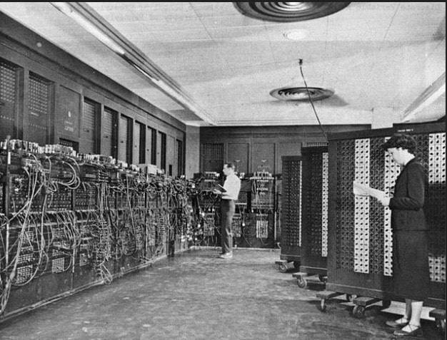{: .center}

Sa capacité est de 20 nombres à 10 chiffres signés permettant chacun de réaliser 5 000 additions simples chaque seconde (pour un total de 100 000 additions par seconde). Il ne peut en revanche gérer que 357 multiplications ou 38 divisions par seconde. Cette puissance de calcul lui a permi en 1949 de calculer 2000 décimales de pi en 70 heures. Son poids est de 30 tonnes et il occupe la surface d'une maison individuelle ! Sa consommation est de 150 kW, soit l'équivalent de 100 bouilloires électriques branchées simultanément ! Il faudrait la puissance électrique disponible dans une vingtaine de maisons individuelles pour l'alimenter.

Dans les années 1960, les missions Apollo qui ont envoyé des hommes sur la lune ont imposé une puissance de calcul disponible dans un espace restreint. Cela a conduit à la conception de l'ordinateur AGC (Apollo Guidance Computer).

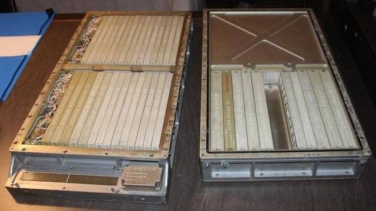{: .center}

Celui-ci ne pèse que 32kg et possède une consommation électrique suffisemment faible pour être embarqué dans une capsule spatiale fonctionnant sur batteries. Ces progrès ont été possibles grâce notamment au recours aux circuits intégrés (CI) pour réaliser des fonctions logiques : Il a fallu plus de 5 000 portes NOR pour constituer l'unité de calcul de l'AGC. Voici une photo de l'une d'entre elles :

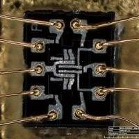{: .center}

L'AGC possède une mémoire de stockage de 72ko et une mémoire de travail (RAM) de 2ko.

Le premier microprocesseur commercialisé est apparu en 1971 : c'est le 4004 d'Intel.

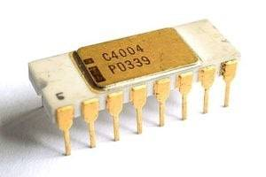{: .center}

Il intègre dans une seule puce 2300 transistors ce qui lui donne une puissance de calcul comparable à l'ENIAC !!

En 1975 est apparu le premier microprocesseur bon marché permettant l'essort des ordinateurs personnels : le 6502 de MOS. Ce microprocesseur a équipé le tout premier ordinateur APPLE (APPLE 1) et est encore fabriqué de nos jours ! Le site [Visual 6502](http://visual6502.org/JSSim/index.html){:target="_blank" } permet de voir le fonctionnement interne de ce processeur lors de l'exécution d'un programme.

A partir des années 1980, l'architecture des ordinateurs n'a plus beaucoup évolué. Les puces ont intégré de plus en plus de composants leur permettant de réaliser des opérations plus complexes. La miniaturisation de la gravure de la puce a permis une montée de la fréquence d'horloge permettant aux ordinateurs d'aller plus vite ainsi qu'une consommation d'énergie moindre.

Les puces sont devenues tellement miniaturisées que l'on trouve maintenant sur une seule puce un système embarqué complet réalisant toutes les fonctions d'un ordinateur. La carte BBC microbit en est un exemple :

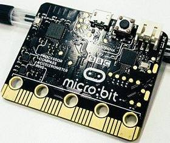{: .center}

Cette carte embarque un microcontrolleur qui est un système complet tenant dans une seule puce : SoC (System On Chip). On y trouve de la mémoire RAM, de la mémpore FLASH, un microprocesseur, des périphériques d'interface, un circuit radio.

Voici le schéma de circuit d'un SoC : 

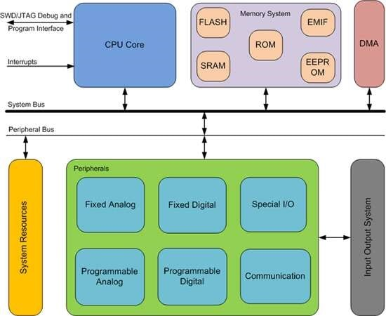{: .center}

 Vous pouvez remarquer que l'on retrouve bien sur ce schéma un CPU et de la mémoire (on a différents types de mémoires, mais ce sujet ne sera pas abordé ici).

Outre leur taille, les Soc ont d'autres avantages par rapport aux systèmes "classiques" (carte mère + CPU + carte graphique...) :

- les SoC sont conçus pour consommer beaucoup moins d'énergie qu'un système classique (à puissance de calcul équivalente).
- Cette consommation réduite permet dans la plupart des cas de s'affranchir de la présence de système de refroidissement actif comme les ventilateurs. Un système équipé de SoC est donc silencieux.
- Vu les distances réduites entre, par exemple, le CPU et la mémoire, les données circulent beaucoup plus vites, ce qui permet d'améliorer les performances. En effet, dans les systèmes "classiques" les bus (si nécessaire voir le cours de première : Modèle d'architecture de von Neumann à propos des bus) sont souvent des "goulots d'étranglement" en termes de performances à cause de la vitesse de circulation des données.

Une autre catégorie de l'utilisation de ces puces intégrées se trouve dans les SBC (Single Board Computers) ou ordinateurs sur carte unique dont le représentant le plus célèbre est probablement le Raspberry Pi.

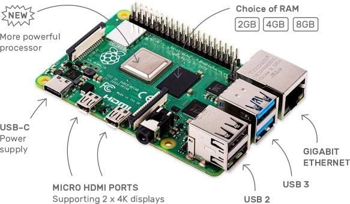{: .center}

Cette carte est assez puissante pour faire fonctionner le système d'exploitation Linux et être utilisé comme ordinateur de bureau. Il est néanmoins le plus souvent utilisé en mini serveur ou sur des projets IoT (Internet of Things : Internet des Objets).

L'aboutissement de toute cette miniaturisation est le téléphone portable qui intègre tout ce que la technologie peut nous apporter : un microprocesseur puissant, de la mémoire, des interfaces de communication rapides (4G, 5g, Wifi...), un contrôleur graphique digne d'une console de jeu, tout cela fonctionnant sur batterie avec une durée de fonctionnement de plusieurs heures.

## Fonctionnement d'un téléphone portable

Le téléphone portable semble réaliser l'impossible : concilier à la fois performances, fonctionnalités et consommation électrique réduite. Le secret réside dans l'intégration de toutes les fonctionnalités sur une seule puce éléctronique. Une telle intégration est possible grâce à une gravure de plus en plus fine. Aujourd'hui la finesse de gravure descend en dessous de 10nm, soit quelques dizaines de couches atomiques ! Cela permet

- d'intégrer plus de 10 milliards de transistors sur une même puce et donc de miniaturiser davantage la puce tout en augmentant ses fonctionnalités
- de monter en fréquence et de gagner en performance car les signaux électriques se propagent de plus courtes distances
- de limiter les déperditions d'énergie et donc augmenter l'autonomie du téléphone.

Le microprocesseur n'est qu'un composant du SoC qui est au coeur du téléphone. On peut voir un SoC comme un PC miniaturisé à l’extrême. Il comprend donc des composants et contrôleurs lui permettant de gérer tous les équipements de votre smartphone, qu’il s’agisse de l’appareil photo, de la mémoire interne, ou encore des modules radio.

Voici la photo d'un iPhone 4S démonté. Comme vous le voyez, le nombre de composants est très réduit au regard des fonctionaltés ! La puce principale SoC est la puce A5.

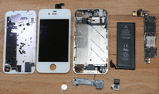{: .center}

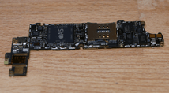{: .center}

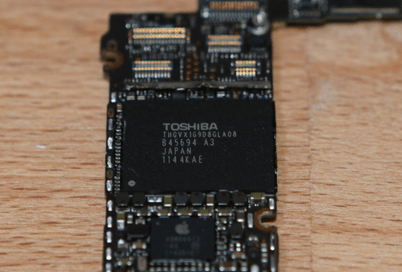{: .center}

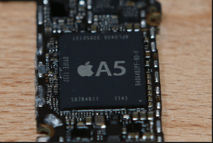{: .center}

**Exercice 1**

1. Quel est le nom du SoC de votre smartphone?
2. Quelles en sont les fonctionnalités?

## Hiérarchie de la mémoire

On peut prendre pour analogie l'accès à une information écrite : vous avez

- des feuilles sur votre bureau
- des feuilles dans votre tirroir
- des feuilles dans le meuble d'archives dans la pièce voisine
- des feuilles archivées dans des cartons au sous sol

Accéder à une information écrite sur une feuille de votre bureau est bien plus rapide que de descendre au sous-sol et ouvrir des cartons. Le plus rapide est bien sûr de mémoriser l'information dans votre cerveau et y accéder directement sans délai. Il en va de même pour un ordinateur :

Il y a plusieurs types de mémoire dans un ordinateur. En voici quelques exemples :

- registre processeur
- mémoire cache dans un processeur
- mémoire RAM
- mémoire de stockage (disque dur)

La vitesse d'accès à ces mémoires peut être radicalement différent d'un type de mémoire à l'autre : l'accès à la RAM est des milliers de fois plus lent que l'accès au cache processeur.

Cela doit être pris en compte lorsqu'on cherche à évaluer la vitesse d'exécution réelle d'un programme : parfois un algorithme performant sur le papier est gourmand en mémoire et necessite l'accès à de la mémoire de stockage qui est très lent. On priviligiera alors peut-être un algorithme moins performant sur le papier mais utilisant de la mémoire plus rapide.

L'idée est que plus l'information est proche de la source de traitement (Processeur), plus l'accès sera rapide. Pour de meilleure performances, on cherchera donc à centraliser sur une même puce un maximum de composants. On en arrive donc à la notion de composants intégrés sur une puce.

## Conception d'un SoC

Les premiers microprocesseurs étaient conçus à la main. Ils étaient dessinés sur de grands calques, puis réduits par procédés photographique avant d'être gravés dans le silicium. C'était un process extrèmement lourd, long et couteux. Il était difficile de reproduire ou d'améliorer les plans sans faire d'erreurs !

Pour vous faire une idée de la complexité d'un tel design, ou juste pour la beauté de l'animation, allez voir [cette reconstitution animée](http://visual6502.org/sim/varm/armgl.html){:target="_blank" } d'un processeur ARM.

De nos jours, les SoC sont conçus par des logiciels très puissants permettant d'assembler des briques déjà conçues et de les intégrer dans une seule puce.

Il existe également des circuits logiques qui peuvent être reprogrammés après leur fabrication. Dans ce cas précis, le terme reprogrammé est impropre, il faudrait parler de reconfiguration car dans le cas présent, on modifie des connexions ou le comportement du composant, on connecte des portes logiques entre elles afin d'obtenir une puce aux fonctionnalités désirées ! Parmi ces puces, les plus répandues et les moins chères se trouvent sous la dénomination de FPGA (Field Programmable Gate Array). Les langages les plus répendus permettant de les reconfigurer sont Verilog et VHDL. Jusqu'alors restés longtemps réservés à des spécialistes du fait de leur coût et de leur complexité, ces systèmes de puces reconfigurables arrivent maintenant dans le domaine des particuliers avec des cartes permettant de créer des prototypes autour d'une cinquantaide d'euros, le tout s'appuyant sur des suites logicielles libres. La fabrication d'une puce simple devient alors un jeu d'enfant ! En voici une petite démonstration dans cette video :

<iframe title="48ce8db5-0ee4-45f5-a5cf-894a26622ef4-360" src="https://tube-sciences-technologies.apps.education.fr/videos/embed/6e407b51-8faa-4aa9-8958-65ad00b0e682" allowfullscreen="" sandbox="allow-same-origin allow-scripts allow-popups" width="560" height="315" frameborder="0"></iframe>

On peut réaliser des taches bien plus complexes comme par exemple fabriquer un microprocesseur ! Vous trouverez [ici](https://github.com/Arlet/verilog-6502){:target="_blank" } un projet reconstituant un microprocesseur 6502 sur un FPGA à l'aide du langage verilog. Ce qui a demandé des années de développement pour une équipe dans les années 1970 peut à présent être reproduit avec 1300 lignes de code sur un FPGA à 50 € !

La fabrication d'un système intégré sur une puce est une opération extrèmement complexe. Néanmoins, la technologie actuelle apporte des outils rendant possible la conception de système toujours plus sophistiqués. C'est ainsi que nous voyons années après années dans nos poches des téléphones aux capacités toujours plus étendues.

La question est : avons nous vraiment besoin de toute cette puissance et cette sophistication ?

