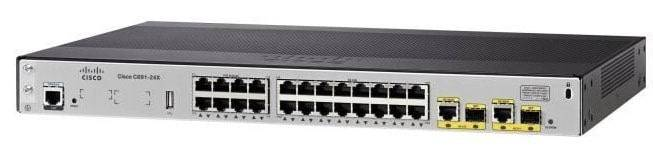
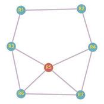
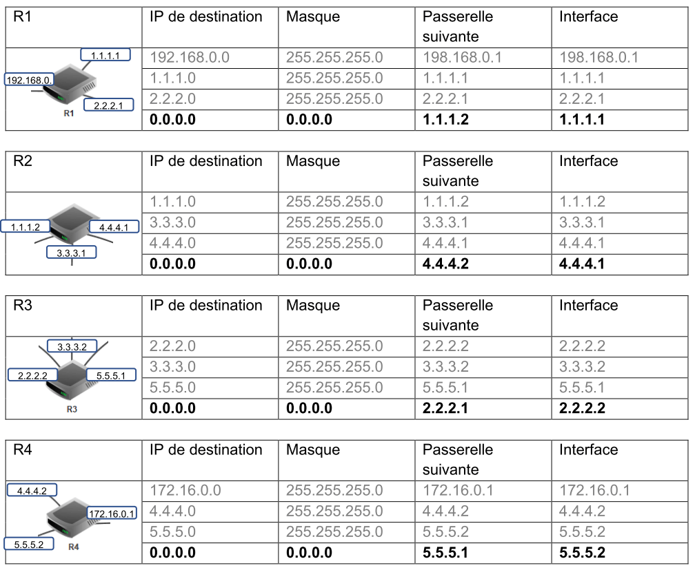

# Protocoles de routage

??? conclu "Programme"
    |Notions|Compétences|Remarques|
    |--|--|--|
    Protocoles de routage.| Identifier, suivant le protocole de routage utilisé, la route empruntée par un paquet. |  En mode débranché, les tables de routage étant données, on se réfère au nombre de sauts (protocole RIP) ou au coût des routes (protocole OSPF).<br> Le lien avec les  algorithmes de recherche de chemin sur un graphe est mis en évidence.
    
## Prérequis

Avant d'introduire les algorithmes de routage, il est important de bien maîtriser les concepts de base qui régissent la communication sur internet, en regardant cette video :

<iframe title="35be237a-922c-4c2d-a317-4daf2ca0f606-360" src="https://tube-sciences-technologies.apps.education.fr/videos/embed/380281f7-c11f-4c55-8e2c-a7de840da27d" allowfullscreen="" sandbox="allow-same-origin allow-scripts allow-popups" width="560" height="315" frameborder="0"></iframe>

## Introduction

Nous allons regarder en détails deux exemples de protocoles de routage (RIP et OSPF). Afin de comprendre les enjeux de ces protocoles de routage, voici une petite video introductive expliquant pourquoi et comment les routeurs communiquent entre eux afin de déterminer le meilleur itinéraire à faire emprunter aux paquets dont ils ont la charge.

<iframe title="08358d74-e742-42d8-b1fd-386683e4fa2e-360" src="https://tube-sciences-technologies.apps.education.fr/videos/embed/9e3f6fb2-251f-487a-939c-7886145c94ab" allowfullscreen="" sandbox="allow-same-origin allow-scripts allow-popups" width="560" height="315" frameborder="0"></iframe>

## Exemple de routage

Le travail d'un réseau consiste essentiellement à trouver les bons chemins pour amener chaque paquet à sa destination.

Un paquet de données qui doit traverser un réseau n'a a priori aucune idée du chemin qu'il va devoir suivre. Il fait entièrement confiance aux indications fournies par les routeurs, espérant que celles-ci soient les plus fiables possibles.

### Le routeur

La box que vous avez chez vous est un routeur également qui possède plusieurs interfaces réseau :

- une interface est connectée au réseau de votre opérateur (FAI).
- une interface filaire (Ethernet) connectée à votre réseau local
- une interface Wifi

Un routeur sur internet est un peu plus sophistiqué, possède souvent plus de ports et ressemble d'extérieur à un switch. Il dispose d'un logiciel interne bien plus sophistiqué afin de lui permettre de communiquer avec ses routeurs voisins pour l'aider à déterminer les meilleures routes à emprunter pour acheminer ses paquets.

{: .center}

Le routeur reçoit un paquet sur l'un de ses ports et sa mission consiste essentiellement à déterminer sur lequel de ses autres ports il doit réacheminer le paquet. Il doit le faire très vite et s'adapter à un environnement qui change (routes qui apparaissent et disparaissent).

#### Exemple

Voici le schéma d'un réseau :

{: .center}

Nous avons sur ce schéma les éléments suivants :

- 15 ordinateurs : M1 à M15
- 6 switchs : R1 à R6
- 8 routeurs : A, B, C, D, E, F, G et H

Nous avons 6 réseaux locaux, chaque réseau local possède son propre switch.

Les ordinateurs M1, M2 et M3 appartiennent au réseau local 1. Les ordinateurs M4, M5 et M6 appartiennent au réseau local 2. Nous pouvons synthétiser tout cela comme suit :

- réseau local 1 : M1, M2 et M3
- réseau local 2 : M4, M5 et M6

**Exercice 1**

Complétez la liste ci-dessus avec les réseaux locaux 3, 4, 5 et 6

??? success "Correction"
    - réseau local 3 : M7, M8
    - réseau local 4 : M9, M10
    - réseau local 5 : M11, M12
    - réseau local 6 : M13, M14, M15

Voici quelques exemples de communications entre 2 ordinateurs :

**cas n°1 : M1 veut communiquer avec M3**

Le paquet est envoyé de M1 vers le switch R1, R1 "constate" que M3 se trouve bien dans le réseau local 1, le paquet est donc envoyé directement vers M3. On peut résumer le trajet du paquet par :

M1 → R1 → M3

**cas n°2 : M1 veut communiquer avec M6**

Le paquet est envoyé de M1 vers le switch R1, R1 « constate » que M6 n’est pas sur le réseau local 1, R1 envoie donc le paquet vers le routeur A. Le routeur A n'est pas connecté directement au réseau localR2 (réseau local de la machine M6), mais il "sait" que le routeur B est connecté au réseau local 2. Le routeur A envoie le paquet vers le routeur B. Le routeur B est connecté au réseau local 2, il envoie le paquet au Switch R2. Le Switch R2 envoie le paquet à la machine M6.

M1 → R1→ Routeur A → Routeur B → R2 → M6

**cas n°3 : M1 veut communiquer avec M9**

M1 → R1 → Routeur A → Routeur B → Routeur D → Routeur E → R4 → M9

Restons sur ce cas n°3 : comme vous l’avez peut-être constaté, le chemin donné ci-dessus n’est pas l’unique possibilité, en effet on aurait pu aussi avoir :

M1 → R1 → Routeur A → Routeur H → Routeur F → Routeur E → R4 → M9

Il est très important de bien comprendre qu’il existe souvent plusieurs chemins possibles pour relier 2 ordinateurs :

**cas n°4 : M13 veut communiquer avec M9**

Nous pouvons avoir : M13 → R6 → Routeur G → Routeur F → Routeur E → R4 → M9

ou encore : M13 → R6 → Routeur G → Routeur F → Routeur H → Routeur C → Routeur D → Routeur E → R4 → M9

On pourrait penser que le chemin "Routeur F → Routeur E" est plus rapide et donc préférable au chemin "Routeur F → Routeur H", cela est sans doute vrai, mais imaginez qu’il y ait un problème technique entre le Routeur F et le Routeur E, l’existence du chemin "Routeur F → Routeur H" permettra tout de même d’établir une communication entre M13 et M9. 

**Exercice 2**

Déterminer un chemin possible permettant d’établir une connexion entre la machine M4 et M14.

??? note "Correction"
    M4 → R2 → Routeur B → Routeur A → Routeur H → Routeur F → Routeur G → R6  → M14

On peut se poser la question : comment les switchs ou les routeurs procèdent pour amener les paquets à bon port.

Nous avons vu l'année dernière que 2 machines appartenant au même réseau local doivent avoir la même adresse réseau (n'hésitez pas à relire le cours de première!). Dans le schéma ci-dessus M1 et M4 n'ont pas la même adresse réseau (car elles n'appartiennent pas au même réseau local), si M1 cherche à entrer en communication avec M4, le switch R1 va constater que M4 n'appartient pas au réseau local (grâce à son adresse IP), R1 va donc envoyer le paquet de données vers le routeur A. Cela sera donc au routeur A de gérer le "problème" : comment atteindre M4 ? 

### Table de routage

Pour choisir le bon chemin, le routeur s'appuie sur une table de routage : c'est une table donnant pour chaque destination connue par le routeur la porte de sortie à emprunter ainsi que l'efficacité de cette route. Cette efficacité sera exploitée dans les algorithmes que nous détaillerons par la suite.

**Exercice 3**

Avec le schéma ci-dessous, on a la table de routage simplifiée de A suivante :

|Réseau |	Moyen de l'atteindre|
|:--:|:--:|
|172.168.0.0/16| 	eth0|
|192.168.7.0/24 |	eth1|
|172.169.0.0/16| 	eth2|
|10.0.0.0/8 |	192.168.7.2/24|

{: .center}

Déterminez la table de routage du routeur G

??? note "Correction"
    |Réseau|Moyen de l’atteindre|
    |:--:|:--:|
    |10.0.0.0/8|eth0|
    |192.168.7.0/24|eth1|
    |172.168.0.0/16|192.168.7.1/24|
    |172.169.0.0/16|192.168.7.1/24|

Dans des réseaux très complexes, chaque routeur aura une table de routage qui comportera de très nombreuses lignes (des dizaines voir des centaines...). En effet chaque routeur devra savoir vers quelle interface réseau il faudra envoyer un paquet afin qu'il puisse atteindre sa destination. On peut trouver dans une table de routage plusieurs lignes pour une même destination, il peut en effet, à partir d'un routeur donné, exister plusieurs chemins possibles pour atteindre la destination. Dans le cas où il existe plusieurs chemins possibles pour atteindre la même destination, le routeur va choisir le "chemin le plus court". Pour choisir ce chemin le plus court, le routeur va utiliser la métrique : plus la valeur de la métrique est petite, plus le chemin pour atteindre le réseau est "court". Un réseau directement lié à un routeur aura une métrique de 0. 

En voici un exemple :

```
Total number of IP routes: 687
Destination     NetMask             Gateway         Port    Cost
137.194.2.0     255.255.254.0       137.194.4.254       v10     2
137.194.4.0     255.255.255.248     137.194.4.253       v10     2
137.194.4.8     255.255.255.248     137.194.4.251       v10     11
137.194.4.192   255.255.255.192     0.0.0.0             v10     1
137.194.6.0     255.255.254.0       137.194.4.254       v10     2
137.194.8.0     255.255.248.0       137.194.4.251       v10     20
137.194.16.0    255.255.255.128     137.194.160.230     v160    11
137.194.16.128  255.255.255.128     137.194.192.102     v192    10
137.194.16.144  255.255.255.240     137.194.192.102     v192    11
137.194.16.176  255.255.255.240     137.194.192.103     v192    20
137.194.17.0    255.255.255.0       137.194.192.103     v192    2
```

Le routeur sait ainsi que pour atteindre la machine 137.194.2.21, il doit s'adresser au réseau 137.194.2.0 [/23](https://en.wikipedia.org/wiki/Wildcard_mask){" target="_blank"} en redirigeant le paquet au routeur 137.194.4.254 qui est joignable sur l'interface v10.

**Exercice 4**

1. Comment atteindre la machine 137.194.6.37?
2. Comment atteindre la machine 137.194.16.101?

??? note "Correction"
    1. Pour atteindre la machine 137.194.6.37, le routeur doit s’adresser au réseau 137.194.6.0/23 en redirigeant le paquet au routeur 137.194.4.254 qui est joignable sur l’interface v10.
    2. Pour atteindre la machine 137.194.16.101, le routeur doit s’adresser au réseau 137.194.16.0/28 en redirigeant le paquet au routeur 137.194.160.230 qui est joignable sur l’interface v160.

### Protocoles de routage

Imaginons le petit réseau suivant : 

{: .center}

Aller du réseau 5 (R5) au réseau 2 (R2) revient à trouver son chemin dans un graphe :

- les routeurs constituent les nœuds de ce graphe
- les liaisons (cuivre ,fibre, wifi, 3/4/5G, satellite ...) constituent les arêtes

Plusieurs algorithmes sont possibles. Néanmoins pour le routage réseau, des contraintes particulières liées au fonctionnement des réseaux sont à prendre en compte :

- les routeurs n'ont pas connaissance de la topologie globale du réseau, ils ne communiquent qu'avec leur voisin immédiats.
- l'algorithme est distribué : il n'y a pas en général de centre de gestion central. Chaque routeur se constitue sa propre table lui même à partir des informations communiquées par ses voisins. Lui même transmet à ses voisins les informations en sa possession.
- l'algorithme est itératif : il est exécuté en permanence et ne s'arrête jamais. Lorsqu'une modification est faite sur le réseau, celle-ci se propage de proche en proche à chaque routeur qui adapte sa table en conséquence.

Sur notre réseau d'exemple, R2 signale sa présence à R1 et R4. R4 se signale à R5 et indique aussi qu'il peut joindre R2. De proche en proche, les tables de routage de chacun se propagent. Pour aller de R2 à R5, R2 a le choix entre plusieurs chemins :

- R2 → R4 → R5
- R2 → R1 → R3 → R5
- R2 → R1 → R3 → R6 → R5 ...

A partir de là, deux grandes familles d'algorithmes se dégagent :

- le routage à vecteur de distance
- le routage à état de lien

La première famille consiste à compter le nombre d'étapes nécessaires pour atteindre l'objectif. Dans notre exemple, R2 → R4 → R5 est clairement avantageux. Mais il se peut que la liaison R4 → R5 utilise une liaison satellite à bas débit et grande latence. 

On a alors une seconde famille d’algorithmes à état de liens qui va prendre en compte la qualité des liaisons pour optimiser le débit ou la latence de la liaison.

Nous allons maintenant étudier le protocole RIP (Routing Information Protocol) qui rentre dans la première famille et le protocole OSPF (Open Shortest Path First) qui est de la seconde famille de protocoles.

## Le protocole RIP

Le protocole **RIP** rentre dans la catégorie des protocoles à vecteur de distance. Un vecteur de distance est un couple (adresse, distance).

Le principe simplifié de ce protocole est de chercher à minimiser le nombre de routeurs à traverser pour atteindre la destination (on minimise le nombre de sauts).

### Principe général de l'algorithme

!!! example "Principe RIP"
    Chaque routeur reçoit en permanence (toutes les 30 secondes environ) de ses voisins les informations de routage qu'ils possèdent. Il va alors exploiter ces informations pour se construire lui-même sa table de routage en ne retenant que les informations les plus pertinentes : une simple comparaison permet de ne garder que le chemin le plus avantageux. Il transmettra à son tour ces informations à ses voisins et ainsi de suite. C'est l'algorithme de Belman-Ford : un des algorithmes de recherche de plus court chemin dans un graphe.

!!! note "Remarque"
    A l'issue de quelques étapes, les tables se stabilisent et le routage est pleinement opérationnel. Le temps nécessaire à la stabilisation des tables est proportionnel au diamètre du graphe modélisant le réseau (c'est à dire au nombre maximal d'étapes nécessaires pour relier deux points quelconques du réseau).

Regardez cette video de Claude Chaudet (Institut Mines-Télécom) qui expose le principe du routage à vecteur de distance.

<iframe title="67fb0893-2eb5-4755-a4fc-b2bcce3e3a9a-360" src="https://tube-sciences-technologies.apps.education.fr/videos/embed/d0dec19f-ab32-47cb-a430-965a6e846972" allowfullscreen="" sandbox="allow-same-origin allow-scripts allow-popups" width="560" height="315" frameborder="0"></iframe>

### Exemple

Considérons le réseau suivant :

{: .center}

Il est composé de :

- 2 sous-réseaux locaux (LAN) ayant pour adresse réseau 192.168.0.0 et 172.16.0.0.
- 5 sous-réseaux composant une partie de l'internet.

Nous allons nous intéresser à l'évolution des tables de routage des routeurs R1 et R2 sur lesquels on a activé le protocole RIP.

#### Étape 1

Au démarrage, les routeurs R1 et R2 ne connaissent que leurs voisins proches. Leurs tables peuvent donc ressembler à ceci.

Pour R1 :

|IP de destination |Masque |	Passerelle suivante | Interface |Nombre de sauts|
|:--:|:--:|:--:|:--:|:--:|
|192.168.0.0| 255.255.255.0	|	 |	wifi0 |	1|
|1.1.1.0| 255.255.255.0	|	 |	eth0 |	1|
|2.2.2.0| 255.255.255.0	|	 |	eth1 |	1|

Au départ, R1 ne peut atteindre que ses voisins immédiats (nb Sauts vaut 1). Aucune passerelle n'est nécessaire puisque la communication est directe. Chaque sous réseau utilise une interface spécifique. Le réseau local 1 contenant les postes de travail est accessible en wifi.

En ce qui concerne le routeur 2, celui-ci possède 3 interfaces réseau filaires, que nous nommerons eth0, eth2 et eth3 qui permettent d'atteindre les routeurs immédiats (R1, R3, R4). Voici à quoi peut ressembler sa table de routage au démarrage.

Pour R2 :

|IP de destination |Masque |	Passerelle suivante | Interface |Nombre de sauts|
|:--:|:--:|:--:|:--:|:--:|
|1.1.1.0| 255.255.255.0	|	 |	eth0 |	1|
|4.4.4.0| 255.255.255.0	|	 |	eth2 |	1|
|3.3.3.0| 255.255.255.0	|	 |	eth3 |	1|

#### Etape 2

Au bout de 30 secondes, un premier échange intervient avec les voisins immédiats de chacun des routeurs.

!!! example "Le principe de l'algorithme"

    Lorsqu'un routeur reçoit une nouvelle route de la part d'un voisin, 4 cas sont envisageables :

    - Il découvre une route vers un nouveau **réseau inconnu** ⇒ Il l'ajoute à sa table.
    - Il découvre une route vers un réseau **connu**, **plus courte** que celle qu'il possède dans sa table ⇒ Il actualise sa table.
    - Il découvre une route vers un réseau **connu**, **plus longue** que celle qu'il possède dans sa table ⇒ Il ignore cette route.
    - Il reçoit une route vers un réseau **connu** en provenance d'un routeur **déjà existant dans sa table** ⇒ Il met à jour sa table car la topologie du réseau a été modifiée.

En appliquant ces règles, voici la table de routage de R1 après une étape :

|IP de destination |Masque |	Passerelle suivante | Interface |Nombre de sauts|
|:--:|:--:|:--:|:--:|:--:|
|192.168.0.0| 255.255.255.0	|	 |	wifi0 |	1|
|1.1.1.0| 255.255.255.0	|	 |	eth0 |	1|
|2.2.2.0| 255.255.255.0	|	 |	eth1 |	1|
|4.4.4.0| 255.255.255.0	|	4.4.4.1 |	eth0 |	2|
|3.3.3.0| 255.255.255.0	|	3.3.3.1 |	eth1 |	2|

On ajoute à la table précédente les réseaux atteignables par R2. On pense cependant à ajouter 1 au nombre de sauts ! Si R1 veut atteindre le réseau 4.4.4.0, il s'adressera à R2 et atteindra le réseau cible en 2 sauts.

Voici la table de R2 qui s'enrichit des informations envoyées par R1 afin d'atteindre le réseau local, mais aussi des informations en provenance de R3 et R4. Il découvre ainsi 2 nouveaux réseaux.

|IP de destination |Masque |	Passerelle suivante | Interface |Nombre de sauts|
|:--:|:--:|:--:|:--:|:--:|
|1.1.1.0| 255.255.255.0	|	 |	eth0 |	1|
|4.4.4.0| 255.255.255.0	|	 |	eth2 |	1|
|3.3.3.0| 255.255.255.0	|	 |	eth3 |	1|
|192.168.0.0| 255.255.255.0	|198.168.0.1	 |	eth0 |	2|
|2.2.2.0| 255.255.255.0	|	2.2.2.2 |	eth0 |	2|
|5.5.5.0| 255.255.255.0	|	5.5.5.1 |	eth2 |	2|


#### Étape 3

Comme vous le voyez, les tables deviennent vite longues et énumérer dans le détail chacune d'elle est trop long. On va donc passer directement à l'étape finale : l'étape 3. Voici ce que contient la table de routage de R1 :

|IP de destination |Masque |	Passerelle suivante | Interface |Nombre de sauts|
|:--:|:--:|:--:|:--:|:--:|
|192.168.0.0| 255.255.255.0	|	 |	wifi0 |	1|
|1.1.1.0| 255.255.255.0	|	 |	eth0 |	1|
|2.2.2.0| 255.255.255.0	|	 |	eth1 |	1|
|4.4.4.0| 255.255.255.0	|	4.4.4.1 |	eth0 |	2|
|3.3.3.0| 255.255.255.0	|	3.3.3.1 |	eth0 |	2|
|5.5.5.0| 255.255.255.0	|	5.5.5.2 |	eth1|	2|
|172.16.0.0| 255.255.255.0	|	172.16.0.1 |	eth0 |	3|

Comme vous le voyez, le routeur R1 est à présent en capacité d'acheminer un paquet du poste de travail du réseau 1 vers les postes de travail se trouvant dans le réseau 2.

### Détection des pannes

Le protocole RIP est en mesure de détecter des pannes : Si un routeur ne reçoit pas d'information de la part d'un de ses voisins au bout d'un temps de l'ordre de 3 minutes (configurable) il va considérer que ce lien est mort et en informer ses voisins en indiquant un nombre de sauts égal à 16. Puisque RIP ne gère que 15 sauts au maximum, 16 peut être considéré comme une distance infinie.

De cette manière, les voisins vont pouvoir recalculer leurs routes en conséquence en évitant le lien qui est tombé.

### Détection des boucles

RIP implémente d'autres mécanismes pour empêcher que se forment des boucles de routage. Une boucle est par exemple une route du type R2 → R3 → R4 → R2. Des exemples de tels mécanismes sont :

- une durée de vie limitée sur les paquets (TTL) afin qu'un paquet qui tourne en rond soit détruit
- ne pas renvoyer une information vers un routeur si celle-ci est déjà passée par ce routeur


### Applications

**Exercice 5**

Tracer sur le schéma ci-dessous le chemin d'un ping de la machine 192.168.0.10 vers le serveur 172.16.0.30 en tenant compte des tables de routages suivantes (la ligne 0.0.0.0 est le trajet par défaut si l'IP de destination n'est pas écrite):

{: .center}

{: .center}

??? note "Correction"
    

**Exercice 6**

Modifier les tables de routages des routeurs du schéma "routage_manuel" de façon à obtenir le cheminement suivant lors d'un "ping" de la machine 192.168.0.10 vers le serveur 172.16.0.30.

{: .center}

??? note "Correction"
    

**Exercice 7**

Soit le réseau suivant :

{: .center}

1. En vous basant sur le protocole RIP (métrique = nombre de sauts), déterminez la table de routage du routeur A
2. Quel est, d'après la table de routage construite ci-dessus, le chemin qui sera emprunté par un paquet pour aller d'une machine ayant pour adresse IP 172.18.1.1/16 à une machine ayant pour adresse IP 172.16.5.3/16 ? 

??? note "Correction"
    1)

    |Routeur A|Ip de destination|Masque|Passerelle suivante|Interface|Nb Saut|
    |:--:|:--:|:--:|:--:|:--:|:--:|
    ||172.18.0.0|255.255.0.0||eth0|1|
    ||192.168.1.0|255.255.255.0||eth1|1|
    ||192.168.2.0|255.255.255.0||eth2|1|
    ||192.168.3.0|255.255.255.0|192.168.2.2|eth2|2|
    ||172.17.0.0|255.255.0.0|192.168.2.2|eth2|2|
    ||172.16.0.0|255.255.0.0|192.168.1.2|eth1|2|

    2) Chemin : Portable à Gauche, Routeur A, Routeur B, Portable à droite

### Conclusion sur le protocole RIP

!!! attention "En conclusion"
    Le protocole RIP est en général utilisé sur de petits réseaux : il est en effet limité à 15 sauts et il génère de plus un trafic important.

Pour des structures plus importantes, on va lui préférer le protocole **OSPF**.

## Le protocole OSPF

Le protocole **OSPF** (Open Shortest Path First) rentre dans la catégorie des protocoles à état de lien.

Dans le protocole à vecteur de distance que nous venons de voir, on cherche à minimiser le nombre de sauts, mais sans aucune garantie que le chemin emprunté soit en réalité le plus performant (en termes de débit par exemple). De plus avec RIP, chaque routeur ne connaît que ses voisins immédiats, il n'a donc pas connaissance de l'ensemble de la topologie du réseau. Enfin, le protocole RIP est limité aux petits réseaux (15 routeurs maximum) et est assez gourmand en termes de bande passante puisqu'il nécessite l'échange d'un volume de données assez important.

### Principe général de l'algorithme

!!! example "Principe OSPF"
    Le protocole OSPF propose une approche tout à fait différente : au lieu de s'intéresser au nombre de sauts, on va chercher à optimiser le débit des liaisons empruntées. Pour cela, chaque routeur va devoir connaître l'intégralité du réseau avec le débit associé à chaque lien afin d'appliquer un algorithme de recherche de chemin optimal.

!!! note "Remarque"
    On peut faire un parallèle entre le fonctionnement d'OSPF et celui de nos logiciels de guidage par GPS. En effet, dans ce type de logiciels :
    - l'ensemble de la carte de France et de ses routes est connue du logiciel
    - le type de chaque route est renseigné ainsi que la vitesse autorisée sur la route
    - le calcul d'itinéraire va permettre le calcul d'un chemin permettant par exemple d'emprunter les routes sur lesquelles la vitesse est la plus importante (temps le plus court).

Cette video de Claude Chaudet (Institut Mines-Télécom) expose le principe du routage à état de lien.

<iframe title="1e636c24-c6fd-4588-8b50-3e408e227be2-360" src="https://tube-sciences-technologies.apps.education.fr/videos/embed/cf2d05fc-c98c-4b88-ae12-445af3dea2d2" allowfullscreen="" sandbox="allow-same-origin allow-scripts allow-popups" width="560" height="315" frameborder="0"></iframe>

### Découverte de la topologie du réseau

OSPF a besoin de connaître la topologie du réseau ainsi que la qualité de chaque lien en terme de bande passante. Pour cela, chaque routeur va fabriquer une table de voisinage : il s'agit d'un tableau permettant d'identifier tous les routeurs qui lui sont connectés ainsi que le débit associé à chaque lien. Pour obtenir ces information, le routeur échange périodiquement des messages (appelés messages hello) avec ses voisins.

{: .center}

|Voisin |	qualité du lien|
|:--:|:--:|
|B |	1 Gb/s|
|C |	10 Gb/s|

Une fois tous ses voisins directs identifiés, le routeur va envoyer sa table de voisinage à tous les autres routeurs du réseau. Il va recevoir des autres routeurs leurs tables de voisinages et ainsi pouvoir constituer une cartographie complète du réseau.

**Exercice 8**

{: .center}

1. En vous basant sur le protocole OSPF (métrique = somme des coûts), déterminez la table de routage du routeur A.
<br>
On donne les débits suivants :
    - liaison routeur A - routeur B : 1 Mbps
    - liaison routeur A - routeur C : 10 Mbps
    - liaison routeur C - routeur B : 10 Mbps
    - On supposera que les liaisons Routeur - portable sont de 1 Mbps
<br>
<br>
On prendra comme débit maximal de référence 1 Mbps.
<br>
Le coût est alors calculé de la façon suivante : $cout=\dfrac{debit~maximal~de~reference}{debit~du~reseau~concerne}$.
2. Quel est, d'après la table de routage construite ci-dessus, le chemin qui sera emprunté par un paquet pour aller d'une machine ayant pour adresse IP 172.18.1.1/16 à une machine ayant pour adresse IP 172.16.5.3/16 ? 

??? note "Correction"
    1) En supposant que les liens Routeur/portable soit de 1 Mbps

    |Routeur A|Ip de destination|Masque|Passerelle suivante|Interface|Somme des coûts|
    |:--:|:--:|:--:|:--:|:--:|:--:|
    ||172.18.0.0|255.255.0.0||eth0|1|
    ||192.168.1.0|255.255.255.0|192.168.2.2|eth2|0,2|
    ||192.168.2.0|255.255.255.0||eth2|0,1|
    ||192.168.3.0|255.255.255.0|192.168.2.2|eth2|0,2|
    ||172.17.0.0|255.255.0.0|192.168.2.2|eth2|1,1|
    ||172.16.0.0|255.255.0.0|192.168.2.2|eth2|1,2|

    2) Chemin : Portable à Gauche, Routeur A, Routeur C, Routeur B, Portable à droite

### L'algorithme de Djikstra

L'algorithme de Djikstra datant de 1959 permet de trouver le chemin le plus court sur un graphe.

#### Exemple

Considérons le [réseau suivant](https://graphonline.ru/fr?graph=BPTnrZPMWqlGXaGe). Après échanges de messages hello, la cartographie suivante du réseau a été constituée :

{: .center}

Nous cherchons à déterminer le chemin le plus rapide entre R1 et R7. L'outil [graphonline](https://graphonline.ru/fr?graph=BPTnrZPMWqlGXaGe) vous permet de le faire visuellement via le menu *Algorithmes / plus court chemin avec l'algorithme de Djisktra*.

{: .center}

Contrairement à RIP, le chemin qu'OSPF nous indiquera sera R1 → R2 → R3 → R5 → R4 → R6 → R7. Ce chemin n'est clairement pas le plus efficace en termes de sauts mais est le plus rapide en termes de débit car il n'exploite pratiquement que des liaisons à 10 Gb/s. 

#### Principe de l'algorithme

Cet algorithme est expliqué dans cette video :

<iframe title="dad2c5a6-1fab-4532-93e1-5803f40ee8d9-360" src="https://tube-sciences-technologies.apps.education.fr/videos/embed/ea4bb362-3af3-4517-bca6-1da34a705560" allowfullscreen="" sandbox="allow-same-origin allow-scripts allow-popups" width="560" height="315" frameborder="0"></iframe>

**Application à notre exemple :**

Djisktra permet de minimiser la longueur d'un chemin, or nous souhaitons maximiser le débit sur nos liaisons. Nous allons donc considérer l'inverse de la bande passante de nos liens pour appliquer Djisktra : maximiser les débit revient à minimiser l'inverse des débits :

- 1 Gb/s sera affecté du poids 1
- 10 Gb/s sera affecté du poids 0.1
- 100 Mb/s sera affecté du poids 10

Nous allons ensuite constituer notre tableau. A chaque nouvelle ligne, on calcule les distances totales vers les destinations possibles et on ne retient que la plus petite (en gras) que l'on marque sur une nouvelle ligne.

Pour empêcher les retours, une fois une destination choisie (en gras), on désactive tout le reste de la colonne (avec des x)

|R1 |	R2 |	R3 |	R4 |	R5 |	R6 |	R7|
|:--:|:--:|:--:|:--:|:--:|:--:|:--:|
|0 - R1 |||||||						
|**0 - R1**| 0.1 - R1| 	1 - R1 	|||||			
|x 	|**0.1 - R1** |	0.2 - R2| 	1.1 R2 ||||	
|x |	x |	**0.2 - R2** |	|	0.3 - R3 |||		
|x |	x |	x |	0.4 - R5| 	**0.3 - R3** |	1.3 - R5 |	10.3 - R5|
|x |	x |	x |	**0.4 - R5**| 	x| 	0.5 - R4|| 	
|x |	x| 	x |	x |	x |	**0.5 - R4**| 	1.5 - R6|
|x |	x| 	x |	x |	x |	x |	**1.5 - R6**|

Dans le tableau, on indique des couples distance - origine : ainsi **0.5 - R4** dans la colonne R6 signifie que R6 est à une distance minimum de 0,5 du départ en provenance de R4. On peut ainsi reconstituer l'itinéraire optimal en partant de R7 et en remontant à l'envers en utilisant le champ origine :

R1 → R2 → R3 → R5 → R4 → R6 → R7 avec un poids total minimum de 1,5.

**Exercice 9**

On supprime la liaison R4-R5. Réappliquez l'algorithme de Djikstra pour déterminer un chemin optimal entre R1 et R7.

??? note "Correction"

    |R1|R2|R3|R4|R5|R6|R7|
    |:--:|:--:|:--:|:--:|:--:|:--:|:--:|
    |0 - R1|||||||
    |0 - R1|0,1 - R1|1 - R1|||||
    |x|**0,1 - R1**|0,2 - R2|<mark>1,1 - R2</mark>||||
    |x|x|**0,2 - R2**||0,3 - R3|||
    |x|x|x||**0,3 - R3**|1,3 - R5|10,3 - R5|
    |x|x|x|<mark style="background: red"> 1,4 - R6</mark>||1,3 - R5|10,3 - R5|
    |x|x|x|**1,1 - R2**|x|1,2 - R4||
    |x|x|x|x|1,3 - R6|**1,2 - R4**|2,2 - R6|
    |x|x|x|x|x|x|**2,2 - R6**|
    
    On revient sur R4 avec un chemin plus long (<mark style="background: red"> 1,4 – R6 </mark>  > <mark> 1,1 - R2 </mark> ),  on reprend donc à partir de R4 mais avec le nouveau poids le plus petit.

    R1 ; R2 ; R4 ; R6 ; R7

    
### Conclusion sur le protocole OSPF

!!! attention "En conclusion"
    OSPF peut s'adapter à la qualité des liens mais dans une certaine mesure uniquement : Si un lien à 10 Gb/s est saturé, il vaut mieux emprunter un lien à 1 Gb/s sous utilisé, mais OSPF n'en a pas connaissance.

!!! note "Remarque"
    Il n'y a pas dans l'absolu de meilleur algorithme de routage, tout dépend du réseau auquel on a affaire. Un protocole sera plus réactif face aux changements de topologie mais au prix d'un plus gros volume échangé. Un autre sera plus efficace si les liaisons au sein du réseau sont très hétérogènes.


## Conclusion


|Protocole |	RIP| 	OSPF|
|:--:|:--:|:--:|
|Depuis |	~1970 |	1988|
|Algorithme |	Bellman-Ford |	Dijkstra|
|Métrique |	nombre de sauts |	bande passante|
|Couche OSI |	Réseau |	Réseau|
|Utilise |	UDP (transport)| 	IP (réseau)|
|Taille max |	LAN < 16 routeurs |	LAN < ~1000 routeurs|
|Avantage |	Simplicité 	|Souplesse|
|Défauts| 	Gaspille la BP, n’en tient pas compte| 	Gourmand (CPU, mémoire), complexe|


