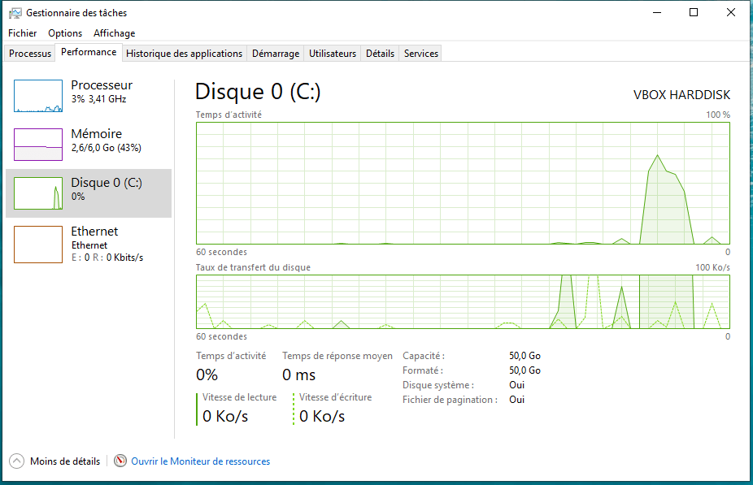

# OS et Gestion des processus

??? conclu "Programme"
    |Notions|Compétences|Remarques|
    |--|--|--| 
    Gestion des processus et des ressources par un système d’exploitation. | Décrire la création d’un processus, l’ordonnancement de plusieurs processus par le système.<br>Mettre en évidence le risque de l’interblocage (deadlock). | À l’aide d’outils standard, il s’agit d’observer les processus actifs ou en attente sur une machine.<br> Une présentation débranchée de l’interblocage peut être proposée.

## Le système d'exploitation

Le système d’exploitation, souvent appelé OS  ( Operating System ) est un ensemble de programmes qui permet d’utiliser les composants physiques d’un ordinateur pour exécuter toutes les applications dont l’utilisateur aura besoin.

Toute machine est dotée d’un système d’exploitation qui a pour fonction de charger les programmes depuis la mémoire de masse et de lancer leur exécution en leur créant des processus, de gérer l’ensemble des ressources, de traiter les interruptions ainsi que les entrées-sorties et enfin d’assurer la sécurité globale du système.

*Exemples*

Windows 10 , Mac OS, Ubuntu Mate  sont des systèmes d’exploitation.\
Attention, Linux n’est pas à  proprement parlé  un OS , c’est en fait le noyau de nombreux OS  que l’on appelle des distributions Linux comme par exemple Gentoo, Debian, Linux Mint, Ubuntu, Fedora, RedHat … 

**L’élément fondamental d’un OS est son noyau** ( kernel en anglais ); c’est lui qui gère l’accès aux ressources matérielles.
**Le noyau est un logiciel** qui permet : 

- la communication avec les périphériques (processeur, mémoire, disques, cartes réseaux, cartes graphiques, clavier , écran, souris ,...) 
-  la gestion des diverses tâches  (lancement des programmes, …)
- la gestion des accès aux ressources afin d’une part, d’assurer le travail simultané des divers utilisateurs et d’autre part, de limiter l’utilisation d’une ressource qu’aux utilisateurs autorisés.

Au-dessus du noyau, de nombreux logiciels facilitent l’utilisation de l'OS.<br>
Au niveau utilisateur, on trouve les applications, exécutées via une interface graphique ou un interpréteur de commandes. Elles utilisent souvent des bibliothèques de fonctions. 
Les applications s'appuient sur l’élément central qu’est le noyau.

Le noyau génère des appels systèmes pour accéder à des ressources.<br>
Divers gestionnaires peuvent êtres sollicités : le gestionnaire de mémoire pour l’accès à des données en mémoire, le système de fichiers pour gérer les périphériques de stockage de masse, les protocoles réseaux, le gestionnaire de processus pour l’exécution d’un programme par le microprocesseur.

Chaque ressource physique est gérée par un pilote.

{: .center}

## Les processus

Le processeur appelé aussi CPU ( Central Processing Unit ) est l'unité matérielle en charge de l'exécution au sein d'un ordinateur.<br>
Il exécute des instructions de bas niveau. Ces instructions  proviennent en général de programmes lancés sur la machine.


**L’écriture d'un programme se fait dans des fichiers sources :**

- Il peut y avoir un ou plusieurs fichiers sources
- Les fichiers source sont écrits dans un langage haut niveau
- Les fichiers sont des données stockées sur disque

**Comment passe-t-on des sources à l'exécution d'un programme ?**

-  soit le programme est compilé : on obtient un fichier exécutable et on le lance
- soit le programme est interprété : c'est l'interpréteur qui doit être lancé

**Au sein de la machine l’exécution d’un programme créé un processus**. Un ordinateur équipé d'un OS  multitâches comme Linux, MacOS ou Windows  est capable d'exécuter plusieurs processus de façon quasi simultanée.  S'il y a plusieurs processeurs, l'exécution des processus est distribuée  sur ces processeurs.


*Par exemple*, lorsque nous ouvrons un navigateur Internet comme Firefox, nous pouvons dire qu’un processus, responsable de l’exécution de  Firefox a été lancé et est en cours d’exécution jusqu’à ce que nous fermions le navigateur.  Si nous ouvrons la même application deux fois ou si vous et un ami l'ouvrez sur le même système, deux processus distincts seront lancés. 


!!! note "En résumé"
    Un processus est un "programme" en cours d’exécution.

!!! attention "Attention"
    Il y a une différence entre programme et processus : le même programme peut être lancé plusieurs fois et donner naissances à des processus distincts.

**Analogie avec le domaine de la musique**

Programme  ~  Partition 

Processus  ~  Musicien 

Processeur  ~  Instrument

La création d’un nouveau processus à partir d'un programme sous Linux  est réalisée par un appel système avec la fonction fork().
Tous les processus sauf le tout premier processus  sont créés par un appel à fork.<br>
Le processus qui appelle le fork est appelé processus père. Le nouveau processus est appelé processus fils. Chaque processus possédera en mémoire les instructions à exécuter et ses propres données.

Par exemple, si on ouvre  deux consoles sous linux, deux processus seront créés ; les deux processus sont exactement identiques et exécutent le même programme sur deux copies distinctes des données.<br>
Les espaces de données sont complètement séparés: la modification d'une variable dans l'un est invisible dans l'autre.

À l’issue d’un fork() les deux processus s’exécutent simultanément.

{: .center}

**Le système gère les processus:**

- il sait tout et il peut tout
- il  sait combien de processus sont lancés
- il  sait ce qu'ils exécutent
- il  sait combien de ressources ils utilisent
- il  peut agir sur leur état de fonctionnement
- il décide si et quand ils s'exécutent

**On rencontre 2 types de processus**

Les processus  « système » :

- Pilotes d’entrées/sorties, processus de sauvegarde, ...
- Usuellement lancés au démarrage

Les processus « utilisateur » :

- Applications :  Firefox, Libreoffice, ...
- Exécution de commandes : ls, cd, grep, …
- Lancés par une action explicite de l’utilisateur

## Comment voir les processus sur son OS?

Sur chaque OS, il y a des utilitaires en **mode graphique** (GUI) ou en **mode console** ( CLI ) pour observer les processus en cours d’exécution.

### Exemples d’interfaces graphiques ( GUI = Graphical User Interface )

- Sous Windows 10, il y a le  bien connu  gestionnaire de tâches ( raccourci : `CRTL+MAJ+ECHAP` )

{: .center}

{: .center}

- Sous Ubuntu Mate, une distribution Linux,  il y a par exemple **Moniteur Système**. (cf MENU puis Outils Système )

{: .center}

{: .center}

- Sous Kubuntu, une autre distribution Linux, il y a par exemple  **KsysGuard**.

{: .center}

{: .center}


### Exemples avec la console sous Linux  (CLI= Command Line Interface)

La commande `top` permet d'afficher la liste des processus de manière dynamique ( la liste est rafraîchit toutes les 3 secondes) (Pensez à la commande  `man top` pour plus d'informations).

*Sur Windows, on utilisera :*

- le site (comme pour les bases de données) : [linux en ligne](https://bellard.org/jslinux/vm.html?url=alpine-x86.cfg&mem=192){:target="_blank" }
- le logiciel [ntop.exe](Documents/ntop.exe) pour visualiser les différents processus, mais nous ne pourrons pas aller plus loin...

{: .center}

Lorsque la commande `top` fonctionne, les lettres suivantes permettent de changer son fonctionnement :

- h : affiche l'aide
- q : quitte la commande top
- M : tri les processus par utilisation de la mémoire (du plus gourmand au plus sobre)
- P : tri les processus par utilisation du processeur (du plus gourmand au plus sobre)
- s : permet de changer la durée de rafraîchissement de top
- k : permet d'envoyer un signal à un processus

Pour en savoir plus : [https://debian-facile.org/doc:systeme:top](https://debian-facile.org/doc:systeme:top){:target="_blank" }


*Exemple*
 
Lançons les applications suivantes : Firefox, Libreoffice et Spyder (un logiciel pour programmer en Python)

{: .center}

Le  moniteur système juste après le lancement :

{: .center}

Les différentes colonnes nous renseignent sur le nom du processus, son propriétaire , etc.
Le système d'exploitation alloue des ressources nécessaires aux processus : mémoires et temps processeur notamment.


Au démarrage de l'ordinateur, le système charge le noyau Linux qui se charge de l'initialisation du matériel et de la détection des périphériques. Ceci fait, il démarre ensuite le processus **init** qui a comme particularité d'être **le premier processus et de toujours utiliser le PID 1**.

Le processus **init**  démarre ensuite des processus noyaux et les premiers processus systèmes.<br>
Chaque processus a ainsi un père (sauf init), et peut être à son tour le père d'autres processus, etc...


**Un processus est toujours identifié par un numéro unique** que l'on appelle le **PID** (Process IDentifiant).<br>
**Un processus dispose d'un processus père que l'on appelle le PPID (Parent PID)**.<br>
La particularité d'un processus est de s'exécuter avec les droits accordés à l'utilisateur qui a lancé la commande. Ceci participe fortement à la sécurité du système.

{: .center}

La commande `pstree`  permet de visualiser l'arbre des processus.<br>
L'option `-p`  permet de visualiser les PID de chaque processus.

## Comment gérer les processus?

Sous un système UNIX comme Linux on utilise la commande `ps`.<br>
Pour rappel, en tapant `man ps` dans la console vous pouvez voir les très nombreuses options de cette commande.

*Exemple*

- ouvrez un terminal et  exécutez la commande  `ps -a`
- ouvrez un autre terminal et exécutez `python3` dans la console
- revenez sur le premier terminal et relancez la commande `ps -a`

{: .center}

{: .center}

{: .center}

La première commande `ps -a` permet de voir qu’il y a un processus de **PID 9984**  créé en lançant la commande `ps -a` !<br>
Après avoir exécuter la commande `python3` puis en relançant la commande `ps -a`  on peut voir que son PID est **10055** et que celui de python est **10054**.

{: .center}

**Les différents champs**

- **USER** indique le nom de l'utilisateur du processus
- **PID** est l'identificateur unique du processus qui à été définit par le système.
- **%CPU** affiche l'utilisation du processeur en pourcentage
- **%MEM** affiche l'utilisation de la mémoire vive en pourcentage
- **VSZ** donne l'utilisation des bibliothèques partagées et la mémoire utilisé pour son fonctionnement
- **RSS** donne l'utilisation de la mémoire physique utilisée en kilobytes par le processus (hors swap)
- **TTY** indique le numéro de port du terminal (le "?" indique que la commande n'est pas associée à un terminal)
- **STAT** affiche l'état actuel du processus
- **START** indique l'heure a laquelle le processus a commencé
- **TIME** affiche le temps processeur utilisé par ce processus
- **COMMAND** affiche le nom de la commande qui utilise ce PID

{: .center}

**Quelques options de la commande  `ps`**

- L'option `-x` permet de visualiser tout les processus actifs de l'utilisateur courant
- L'option `-ax` permet de visualiser tous les processus de la machine de tous les utilisateurs
- L'option `-aux` permet d’afficher tous les utilisateurs associés à chaque processus
- L'option `-u nom_utilisateur` affiche chaque processus associés à utilisateur
- L'option `-p PID` affiche les informations sur un processus
- L'option `-t` affiche tout les processus liées a un terminal

## Etat d'un processus

**Un processus peut avoir plusieurs états. Pour exécuter un processus sur le processeur, le processus doit être prêt.**

En effet, un processus peut ne pas être en état de s'exécuter puisque en attente par exemple :

- d'une entrée clavier
- de réception de message réseau
- en attente d'un autre processus

Selon les systèmes, le nombre et le nom des états peut varier. Mais la base commune est :

- **Élu**: en train de s’exécuter sur un processeur
- **Éligible ou Prêt** : en attente d’un processeur pour s’exécuter 
- **Bloqué**: en attente d’un événement ; ne peut donc pas s’exécuter pour l’instant 

{: .center}

**On peut voir l’état d’un processus dans le champ STAT après une commande ps. Ci-dessous quelques exemples d’attributs possibles :**

- **D** en sommeil non interruptible (normalement entrées et sorties) ;
- **I** fil inactif du noyau ;
- **R** s’exécutant ou pouvant s’exécuter (dans la file d’exécution) ;
- **S** en sommeil interruptible (en attente d’un événement pour finir) ;
- **T** arrêté par le signal de contrôle de la tâche ;
- **Z** processus zombie , terminé mais pas détruit par son parent...

{: .center}

## Envoyer un signal à un processus

Un signal est une interruption logicielle envoyée par un processus à un autre processus.<br>
Il peut signaler une anomalie ou solliciter l'arrêt définitif ou temporaire d'un processus. Un utilisateur ne peut envoyer de signal qu'à des processus qui lui appartiennent.

La syntaxe est la suivante :  

`kill -SIG pid` : Envoie au processus, dont le numéro identificateur est pid, le **signal SIG**.
La liste des signaux possibles peut être obtenue avec l'option `-l` : `kill -l`

*Exemple de signaux*

1 - `HUP` qui permet de recharger un processus

9 - `KILL` qui permet de tuer un processus

15 - `TERM` qui permet de terminer proprement un processus

Si un processus  ne répond plus on peut prendre l’initiative de le stopper avec un **signal** approprié en identifiant son PID au préalable.

Illustration ci-dessous avec un programme python qui aurait  « planté ».

{: .center}

## Comment s'organise les processus?

**Multi-programmation**

- Il est possible de charger plusieurs processus en mémoire, il peut donc y avoir plusieurs processus prêts
- Le choix du processus à exécuter parmi tous ceux qui sont prêts s’appellent l’ordonnancement.

**Au début de l'informatique**, un seul processus était chargé en mémoire et pouvait s'exécuter.<br>
Le temps de récupérer les résultats et de préparer le prochain processus, le CPU était  inutilisé…

**L'ordonnancement ( Scheduling )**

L'OS doit permettre à toutes les applications et tous les utilisateurs de travailler en même temps ; dans la pratique, il doit donner l'impression à chacun qu'il est le seul à utiliser l'ordinateur et ses ressources.<br>
**Cette gestion des ressources est réalisée par un module dédié du noyau** : l'ordonnanceur. Comme une ressource ne peut pas être réellement partagée, c'est son temps d'utilisation qui va l'être : l'ordonnanceur va allouer les ressources  en divisant le temps d'utilisation en intervalles très courts.

**L'ordonnanceur cherche :**

- à minimiser le temps de traitement du processus d'un utilisateur
- à garantir l'égalité entre les différents utilisateurs
- d'optimiser l'utilisation des ressources
- d'éviter les blocages


**Algorithmes d'ordonnancement  fréquemment utilisés :**

- **L'algorithme FIFO ( First in, First out ) :  Premier entré / Premier sorti**<br>
Les processus sont dans une file d’attente. Le premier arrivé est admis immédiatement et s'exécute tant qu'il n'est pas bloqué ou terminé. Lorsqu'il se bloque, le processus suivant commence à s'exécuter et le processus bloqué va se mettre au bout de la file d'attente.<br>
*Avantages* : l'algorithme est simple, l'ordonnancement est équitable.<br>
*Inconvénient* : Le processus qui utilise davantage de temps est favorisé par rapport à ceux qui font beaucoup d'appels aux entrées/sorties.
- **L'algorithme du "plus court d'abord" (SJF  -  Shorted Job First)** :<br>
Sera élu, le processus dont on suppose que le traitement sera le plus court. C'est ce qui se passe quand à la caisse d'une grande surface des clients sympathiques laissent passer devant quelqu'un qui n'a qu'un article.<br>
*Inconvénient* : les processus les plus courts sont favorisés. Si des processus courts arrivent sans cesse, les processus plus longs n'auront jamais le temps de s'exécuter
- **L'algorithme du tourniquet (RR = Round Robin)** :
Chaque processus reçoit tour à tour un intervalle de temps appelé quantum. Au terme de ce quantum ou, si le processus s'achève ou se bloque avant cet instant, l'ordonnanceur attribue directement le processeur au processus suivant. L'algorithme est simple et équitable. C'est généralement cet ordonnancement circulaire qui est utilisé dans les systèmes à temps partagé. 
- **L'ordonnancement avec priorité**:\
Un ordre de priorité est assignée à chaque processus.  Un processus en temps réel sera par exemple prioritaire par rapport à une tâche de fond.

## L'interblocage (Deadlock)

**Le dîner des philosophes**

Une version imagée de ce problème est présentée sous la forme d'un groupe de philosophes qui mangent des spaghettis.<br>
Imaginons 4 philosophes qui passent leur temps soit à réfléchir, soit à manger. Ils disposent seulement de 4 fourchettes : il y a une fourchette entre 2 assiettes. Les règles sont les suivantes :

- Chacun possède une place autour d'une table circulaire.
- Chaque place est représentée par une assiette de spaghetti. 
- Un philosophe doit avoir deux fourchettes pour manger.
- Un philosophe peut seulement prendre la fourchette située immédiatement à sa droite et celle située immédiatement à sa gauche.

Supposons que tous les philosophes prennent leur fourchette de droite et qu’ils attendent que la fourchette de gauche se libère. Alors, aucun philosophe ne pourra obtenir la fourchette de gauche manquante. Les philosophes attendent mutuellement l’un après l'autre. Le philosophe A attend après B, B après C, C après D et D après A. Il y a attente circulaire et les philosophes sont bloqués et vont mourir de faim !

L’analogie consiste maintenant à identifier un philosophe à un processus et une fourchette à une ressource pouvant être sollicitée par un philosophe… On obtient alors ce que l’on appelle un interblocage de processus.

{: .center}

**Un exemple plus détaillé**

Pour terminer, illustrons ce phénomène avec deux  processus P1 et P2 initialement « éligibles » et deux  ressources R1 et R2, initialement libres. On rappelle à droite les 3 états de bases dans lesquels se trouvent en général un processus.<br>
On suppose que l’algorithme d’ordonnancement  utilisé est celui du tourniquet et que les processus P1 et P2 contiennent les instructions  décrites ci-contre. Démarrons :

- Le système passe le processus P1 à l’état « élu », P1 commence son exécution et une instruction demande la ressource R1. Il obtient satisfaction puisque R1 est libre puis le système repasse P1 dans l'état « éligible ».
- Le système passe ensuite le processus P2 à l'état « élu » : P2 commence son exécution et demande la ressource R2. Il obtient immédiatement R2 puisque cette ressource était libre. 
- Le système maintient P2 à l'état « élu » et P2 poursuit donc son exécution et une instruction de P2 demande la ressource R1, il passe donc dans l’état « bloqué » puisque la ressource R1 n’est pas libre : P1 étant toujours dans l'état « éligible », il n'a pas pu libérer la ressource R1  (pour  libérer R1, P1 doit être dans l'état « élu »). 
- P2 étant bloqué (en attente de R1), le système repasse P1 dans l'état « élu » et avant de libérer R1, une des instructions de P1 demande à utiliser R2. Problème : R2 n'a pas encore été libéré par P2,  R2 n'est donc pas disponible, P1 passe donc aussi à l’ état « bloqué ».


**Processus P1** | **Processus P2**

```
...        | ...
demande R1 | demande R2
demande R2 | demande R1
...        | ...
libère R1  | libère R2
libère R2  | libère R1
...        | ...
```

*Résumons la situation à cet instant* : P1 possède la ressource R1 et se trouve dans l'état « bloqué » (attente de R2), P2 possède la ressource R2 et se trouve dans l'état « bloqué » (attente de R1).<br>
Pour que P1 puisse poursuivre son exécution, il faut que P2 libère la ressource R2, mais P2 ne peut pas poursuivre son exécution (et donc libérer R2) puisqu'il est bloqué dans l'attente de R1.<br>
Pour que P2 puisse poursuivre son exécution, il faut que P1 libère la ressource R1, mais P1 ne peut pas poursuivre son exécution (et donc libérer R1) puisqu'il est bloqué dans l'attente de R2.<br>

**La situation est  donc totalement bloquée !**

Dans de nombreux cas , deux  processus  peuvent souhaiter accéder à la même ressource sur le disque dur , par exemple :

- les 2 processus ont juste besoin de lire la donnée ; celle-ci est alors partagée sans problème.
- les 2 processus ont besoin de la  donnée de façon exclusive pour la modifier par exemple.
- les 2 processus ont besoin de communiquer entre eux : l’un doit attendre un résultat de l’autre

**L’interblocage est donc le risque pour plusieurs processus qui interagissent de se bloquer l’un et l’autre.**<br>
Il existe plusieurs solutions permettant, soit de mettre fin à un interblocage (cela passe par l'arrêt d'un des processus), soit d'éviter les interblocages, mais ces solutions ne seront pas étudiées ici.<br>
La plupart des OS ont choisi de ne pas essayer d’éviter les interblocages, mais de le détecter s’ils surviennent et de les résoudre.

