# Arborescence du système de fichiers Unix / GNU-Linux

Dans les systèmes de type Unix / GNU-Linux, nous avons un système de fichier en **arborescence**. 

On parle d'arborescence, car ce système de fichier ressemble à un arbre à l'envers. La base de l'arbre s'appelle la **racine** (root) de l'arborescence et se représente par un simple `/`.

Dans le schéma ci-dessous on trouve des **répertoires** (entourés d'un rectangle sur le schéma) et des **fichiers** (entourés d'ovales).

!!! note "Remarque"
    Il n'est pas nécessaire de connaitre le détail de l'arborescence GNU-Linux, mais il faut en connaitre le principe et déterminer le chemins **absolus** et **relatifs** d'un répertoire ou d'un fichier. Ci-dessous, à titre d'information, le détail des fonctions des principaux répertoires.

```mermaid
    graph TD
    A["/"] --> B[bin]
    click A callback "C'est la racine. Ce dossier est le point de départ de l'arborescence, il contient les répertoires principaux."
    click B callback "Binaries : Exécutables essentiels au système, utilisables par tous les utilisateurs. Par exemple on y trouve ls pwd..."
    A --> C[boot] 
    click C callback "fichiers permettant à Linux de démarrer, tels que le noyau et les fichiers de démarrage (GRUB). Dans /boot/efi est monté la partition EFI pour les systèmes disposant de ce micrologiciel."
    A --> D[dev]
    click D callback "Devices : Fichiers spéciaux représentant les point d'entrées de tous les périphériques (fichiers spéciaux des disques durs, écrans, partitions, consoles TTY, webcam, clavier, ...)"
    A --> E[etc]
    click E callback "Editing Text Config : Contient les fichiers texte nécessaires à la configuration du système et des setvices (XXX.conf, passwd, inittab, fstab)"
    A --> L[home]
    click L callback "Répertoire personnel des utilisateurs du système"
    A --> H[lib]
    click H callback "Librairies : contient les bibliothèques partagées essentielles au système lors du démarrage (et modules noyau)"
    A --> I[opt]
    click I callback "Optional : répertoire générique pour l'installation de programmes installés hors dépôts de la distribution."
    A --> P[proc]
    click P callback "Process : répertoire virtuel ne prenant aucune place sur le disque. Contient des fichiers spéciaux offrant des informations sur le système (noyau, processus)."
    A --> F[root]
    click F callback "Répertoire personnel du super utilisateur (le répertoire de root n'est pas dans /home, car bien souvent le /home est sur une partition à part. En cas d'échec de montage de /home, root à quand même accès à son répertoire personnel)."
    A --> J[run]
    click J callback "Runtime system : contient des informations relatives au système concernant les utilisateurs et les services en cours d'exécution."
    A --> Q[sys] 
    click Q callback "Répertoire virtuel ne prenant aucune place sur le disque. Contient des fichiers spéciaux offrant des informations entre le système et ses composants matériels."
    A --> K[tmp]
    click K callback "Temporary : contient des fichiers temporaires"
    A --> R[usr]
    click R callback "Unix System Resources : contient des programmes, des données et des documents utilisés par les utilisateurs du système."
    A --> G[var]
    click G callback "Variable : contient les données variables qui varient en fonction de l'utilisation du système, tels que les fichiers de log, les fichiers de bases de données, des fichiers de mails, des sites internet..."
    R --> S[bin]
    click S callback "Contient des exécutables et des commandes utilisées par les utilisateurs du système."
    R --> T[include]
    click T callback "Contient des fichiers d'en-tête utilisés par les compilateurs pour inclure du code dans les programmes."
    R --> U[lib]
    click U callback "Contient des bibliothèques (librairies) utilisées par les programmes (32 et 64 bits)"
    R --> V[local]
    click V callback "Contient des programmes et des données installées localement sur le système, par un administrateur, non installés par le gestionnaire de paquets"
    R --> W[sbin]
    click W callback "Contient des exécutables et des commandes utilisées par l'admin système"
    R --> X[share]
    click X callback "Contient des données partagées utilisées par les programmes (fichiers de langue, images, polices de caractères ...)"
    R --> Y[src] 
    click Y callback "Contient le code source des programmes installés"
    G --> GA[cache]
    click GA callback "Contient des données mises en cache par les programmes et le système, telles que les paquets de logiciels téléchargés (apt, yum, dnf, emerge suivant votre distribution)"
    G --> GB[lib] 
    click GB callback "Contient des données utilisées par les programmes du système, telles que les bases de données (mysql) par exemple"
    G --> GC[log] 
    click GC callback "Contient des fichiers de log, avec un sous dossier par service installé"
    G --> GD[run] 
    click GD callback "Contient des fichiers temporaires utilisés par les programmes en cours d'exécution (fichiers .pid, ...)"
    G --> GE[spool]
    click GE callback "Contient des fichiers en attente d'être traités par les programmes système, tels que les impressions et les tâches cron."
    G --> GF[tmp] 
    click GF callback "Contient des fichiers temporaires utilisés par les programmes. Par rapport à /tmp ces fichiers tomporaires ne sont pas épurés automatiquement."
    L --> M[davy]
    M --> MA([.bashrc])
    click MA callback "Fichier présent dans le dossier /home/.. de chaque utilisateur. Contient des scripts à lancer au démarrage de la session."
    L --> N[luna]
    N --> NA[Images]
    NA --> NB([donjon.jpg])
    NA --> NC[photo_vrac]
    L --> O[marius]
    O --> OA[Documents]
    OA --> OB([monGrandOral.odt])
    O --> OC[boulot]
    OC --> OD([TODO.txt])
```

!!! conclu "Chemins relatifs et absolus"
    Pour indiquer la position d'un fichier (ou d'un répertoire) dans l'arborescence, il existe 2 méthodes : indiquer un **chemin absolu** ou indiquer un **chemin relatif**.

    - Le **chemin absolu** doit indiquer le chemin depuis la racine. Par exemple le chemin absolu du fichier `monGrandOral.odt` est : `/home/marius/Documents/monGrandOral.odt`.

    - On peut aussi repérer ce fichier depuis le répertoire où l'on se trouve, et on parle alors de **chemin relatif**. Par exemple, toujours pour le fichier `monGrandOral.odt` :
        - si on est déjà dans le répertoire `marius`, son chemin relatif est `Documents/monGrandOral.odt` ;
            
        - si on est dans le répertoire `boulot`, son chemin relatif est `../monGrandOral.odt` (où le `../` désigne une remontée d'un cran dans l'arborescence) ;
            
        - si on est dans le répertoire `Images` de l'utilisateur `luna`, son chemin relatif est `../../marius/Documents/monGrandOral.odt`.

    !!! note "Remarque"
        L'absence du caractère `/` au début du chemin relatif : c'est cela qui permet de distinguer un chemin relatif et un chemin absolu.

{{exercice(1, "Trouver le chemin relatif ?")}}
    Avec l'arborescence précédente, on suppose que l'on se trouve dans le répertoire `boulot`. Quel est le chemin relatif du répertoire `photo_vrac` ?

    ??? tip "Réponse"
        `../../../luna/Images/photo_vrac`
