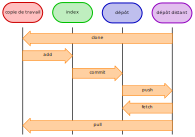

# Introduction

## Présentation
Git est un **logiciel de gestion de versions décentralisé** (ou DVCS en anglais, pour Distributed Version Control System).

Un VCS permet de stocker un ensemble de fichiers en conservant la chronologie de toutes les modifications qui ont été effectuées dessus. Il permet ainsi de retrouver les différentes versions d'un projet.
Fini les embrouilles d'un dossier rempli de fichiers du type : mondoc-v1.odt, mondoc-v1modifié.odt, mondoc-finalv1.odt, mondoc-final.odt...

Pour info il existe d'autres VCS : SVN ou CVS (centralisé), Mercurial (décentralisé).

## Historique

Git un logiciel libre créé en 2005 par Linus Torvalds pour développer le noyau Linux (créé en 1991).

Pour la petite histoire, le magazine [PC World](https://www.pcworld.com/) nous apprend que quand on lui a demandé pourquoi il avait appelé son logiciel `git`, qui est à peu près l’équivalent de “connard” en argot britannique, Linus Torvalds a répondu :

    Je ne suis qu'un sale égocentrique, 
    donc j'appelle tous mes projets d'après ma propre personne. 
    D’abord Linux, puis Git.

Git est depuis devenu le VCS le plus utilisé par les développeur·euses, que ce soit avec Github, Gitlab, Bitbucket
ou d'autres services en ligne. 

## Fonctionnement

[Ce livre très complet](https://git-scm.com/book/fr/v2) vous permettra d'en savoir plus sur le fonctionnement de Git.

### Diagramme de fonctionnement
