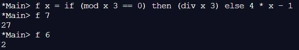

??? note "Correction"
    1. 
    2.  Pour f 7 : on fait la DE de 7 par 3 : le reste est égale à 1, donc différent de 0, on fait donc l’opération : 4 * 7 – 1 = 27 
    Pour f 6 : on fait la DE de 6 par 3 : le reste est égale à 0, on fait donc l’opération : 6/3 = 2
