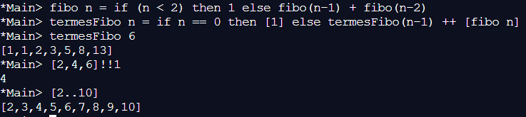

??? note "Correction"
    1. 
    2.  On obtient la liste des termes de la suite de Fibonacci jusqu’au terme d’indice 6.
    3. 
    4. Le terme d’indice 1 de la liste [2,4,6], soit 4.
    5. 
    6. La liste des entiers de 2 à 10.

