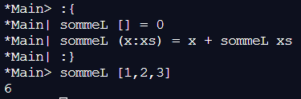

??? note "Correction"
    

    1.
    ``` 
    prodL [x] = x
    prodL (x:xs) = x * prodL xs
    ```
    2. 
    ```
    maxL [x] = x
    maxL (x:xs) = if (x < maxL xs) then maxL xs else x
    ```
    3. 
    ```
    supL x [y] = if x == y then [] else [y]
    supL x (y:ys) = if x == y then ys else y:supL x ys
    ```
    4. 
    ```
    supL2 x [y] = if x == y then [] else [y]
    supL2 x (y:ys) = if x == y then supL2 x ys else y:supL2 x ys
    ```
    5. 
    ```
    filtre p [] = []
    filtre p (x:xs) = if (p x) then x:(filtre p xs) else fonc p xs
    ```
    6. 
    ```
    sommeT [] [] = []
    sommeT (x:xs) (y:ys) = x+y:(sommeT xs ys)
    ```
