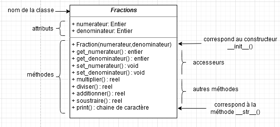

# Programmation Orientée Objet et modularité

??? conclu "Programme"
    |Notions|Compétences|Remarques|
    |--|--|--| 
    Vocabulaire de la programmation objet : classes, attributs, méthodes, objets.|Écrire la définition d’une classe. <br>Accéder aux attributs et méthodes d’une classe. | On n’aborde pas ici tous les aspects de la programmation objet comme le polymorphisme et l’héritage.
    Modularité. | Utiliser des API (Application Programming Interface) ou des bibliothèques.<br>Exploiter leur documentation.<br>Créer des modules simples et les documenter.

## Un peu d'histoire

La programmation orientée objet est un nouveau paradigme de programmation.

Les idées sous-tendant le paradigme objet datent des années 60. Mais il faudra attendre le début des années 70 et la mise au point du langage Smalltalk pour que le paradigme objet gagne en popularité chez les informaticiens. 

Aujourd'hui de nombreux langages permettent d'utiliser le paradigme objet : C++, Java, Python...

## Un petit exemple d'approche : où vous utilisez déjà des Objets

Prenons une chaîne de caractère quelconque : `chaine`. Completez la ligne ci-dessous pour transformer cette chaîne avec uniquement des minuscules :

**Vous n'avez pas le droit d'utiliser `"ne crie pas si fort"` dans votre réponse.**

{{IDEv('scripts/lower')}}

## La POO

### Vocabulaire

La programmation orientée objet repose, comme son nom l'indique, sur le concept d'objet.

Un objet dans la vie de tous les jours, vous connaissez, mais en informatique, qu'est ce que c'est ? Une variable ? Une fonction ? Ni l'un ni l'autre, c'est un nouveau concept.

Imaginez un objet (de la vie de tous les jours) très complexe (par exemple un moteur de voiture) : il est évident qu'en regardant cet objet, on est frappé par sa complexité (pour un non spécialiste). Imaginez que l'on enferme cet objet dans une caisse et que l'utilisateur de l'objet n'ait pas besoin d'en connaître son principe de fonctionnement interne pour pouvoir l'utiliser. L'utilisateur a, à sa disposition, des boutons, des manettes et des écrans de contrôle pour faire fonctionner l'objet, ce qui rend son utilisation relativement simple. La mise au point de l'objet (par des ingénieurs) a été très complexe, en revanche son utilisation est relativement simple. Programmer de manière orientée objet, c'est un peu reprendre cette idée : utiliser des objets sans se soucier de leur complexité interne. Pour utiliser ces objets, nous n'avons pas à notre disposition des boutons, des manettes ou encore des écrans de contrôle, mais des **attributs** et des **méthodes** (nous aurons l'occasion de revenir longuement sur ces 2 concepts). Un des nombreux avantages de la programmation orientée objet (**POO**), est qu'il existe des milliers d'objets (on parle plutôt de classes, mais là aussi nous reviendrons sur ce terme de classe un peu plus loin) prêts à être utilisés (vous en avez déjà utilisé de nombreuses fois sans le savoir). On peut réaliser des programmes extrêmement complexes uniquement en utilisant des classes préexistantes.

Dans la suite de ce cours, nous utiliserons l'exemple des fractions en mathématiques.

Considérons donc la classe des fractions.

La classe est une espèce de "moule", à partir duquel nous allons créer des **objets** (plus exactement nous parlerons d'**instances**). Par exemple, pour la classe `Fractions`, nous pouvons créer différentes instances de cette classe (`frac1`,`frac2`...). Pour créer une de ces instances, la procédure est relativement simple : 
`frac1=Fractions()`, `frac2=Fractions()`,...

Mais pour le moment, notre classe ne sert à rien car il n'y a rien dedans.

Comme expliqué précédemment, une instance de classe possède des attributs et des méthodes. Commençons par les attributs :

Un **attribut** possède une valeur (un peu comme une variable). Nous allons associer un attribut `numerateur` et un attribut `denominateur` à notre classe `Fractions`.

Ces attributs s'utilisent comme des variables.

L'utilisateur va vouloir accéder aux différents attributs de son instance et modifier éventuellement ces attributs. Pour cela, on créera deux méthodes : `get()` (pour accéder) et `set()` (pour modifier).

Il ne faut pas oublier que notre classe doit être "enfermée dans une caisse" pour que l'utilisateur puisse l'utiliser facilement sans se préoccuper de ce qui se passe à l'intérieur. Il faut donc, à la création d'une instance, que tous ses attributs soient définis à l'aide d'une **méthode**, ici le **constructeur** `__init__` : la méthode `__init__()` est automatiquement exécutée au moment de la création d'une instance.

Il faudra aussi que l'utilisateur puisse faire des opérations sur les instances créées. Par exemple, il voudra multiplier des fractions, les additionner... toutes ces opérations vont être définies dans la classe par des **méthodes** : ce sont des fonctions à l'intérieur de la classe.

On aura donc les méthodes `multiplier()`, `diviser()`, `additionner()` et `soustraire()`.

L'utilisera voudra enfin afficher les résultats de ses opérations, il faudra donc créer une méthode pour cela : `__str__()` qui sera appelé lors d'un `print(...)`.

!!! note "En Résumé"
    Une classe est caractérisée par :
    
    - un nom (ici `Fractions`)
    - des **attributs** (on parle aussi de **champs** ou **variables d'instances**) (ici `numerateur` et `denominateur`)
    - des **méthodes** : ce sont des fonctions de traitement de données de la classe. Parmis celles-ci, on retrouve :
        - le **constructeur** : elle initialise les données de la classe à leur création
        - les **accesseurs** :
            - en **lecture** : elle se contente de renvoyer la valeur d'une variable d'instance. (ici `get()`)
            - en **écriture** : elle se contente de modifier la valeur d'une variable d'instance, avec éventuellement une vérification de la nouvelle valeur. (ici `set()`)
        - les autres : ce sont des fonctions de traitement de données de la classe. (ici `multiplier()`,...)


### Modèle UML

Nous pouvons résumer l'ensemble de ce qui a été dit dans un schéma appelé diagramme de classe (modèle UML).

Pour notre classe Fractions, cela donnera :

{: .center}

### Exercice : La classe Fractions en Python

Pour créer une classe en Python, on procède ainsi :

```python
class nom_de_la_classe:
    def __init__(self,at1,at2)
        self.set_attribut1(at1)
        ...
    
    def set_attribut1(self,nouvelle_valeur):
        ...
    ...
```

Le *self* représente l'instance que l'on créera à chaque appel de la classe Fractions.

Quand on aura créé l'instance *frac1*, tous les *self* qui se trouveront dans la classe Fractions seront remplacés par *frac1*.

1) Complétez la classe Fractions ci-dessous pour que les tests de la cellule suivante fonctionnent :

{{IDE('scripts/frac')}}

??? success "Corrigé"
    {{IDE('scripts/frac_corr')}}

## Exercices

### Exercice 1

On considère le code suivant :

```python
class  Personne:
    def  __init__(self,  nom,  age):
        self.set_nom(nom)
        self.set_age(age)
      
    def set_nom(self, nouveau_nom):
        self.nom = nouveau_nom
      
    def set_age(self, nouvel_age):
        self.age = nouvel_age
          
    def get_nom(self):
        return self.nom

    def get_age(self):
        return self.age

    def  vieillir(self,  periode):
        self.set_age(self.get_age() + periode)
        return  f"le  nouvel  age  de  {self.get_nom()}  est : {str(self.get_age())}"
    
    
moi  =  Personne("Albert",  51)
monchien  =  Personne("Rex",  14)

for  i  in  range(3):
    moi.vieillir(1)
    monchien.vieillir(7)
```


1. Quels sont les noms des attributs d’un objet de la classe `Personne` ?
2. Que fait la méthode `vieillir` ?
3. A la fin de la boucle, on execute à la console :
```python
Moi.age
```
Quel est l'affichage?
4. Quel est l'âge de Rex après l'exécution du programme, comment l'obtenir?
5. Vérifiez vos réponses avec la console ci-dessous :

{{IDE()}}

??? success "Corrigé"
    1) Attributs : nom et age

    2) La méthode Vieillir permet d'augmenter d'un certain nombre d'année (période) l'age d'une personne

    ```python
    class  Personne:
        def  __init__(self,  nom,  age):
            self.set_nom(nom)
            self.set_age(age)
            
        def set_nom(self, nouveau_nom):
            self.nom = nouveau_nom
        
        def set_age(self, nouvel_age):
            self.age = nouvel_age
            
        def get_nom(self):
            return self.nom
        
        def get_age(self):
            return self.age
        
        def  vieillir(self,  periode):
            self.set_age(self.get_age() + periode)
            return  f"le  nouvel  age  de  {self.get_nom()}  est : {str(self.get_age())}"
        
    Moi  =  Personne("Albert",  51)
    Monchien  =  Personne("Rex",  14)

    for  i  in  range(3):
        Moi.vieillir(1)
        Monchien.vieillir(7)
    ```
    ```pycon
    >>>Moi.age
    54
    ```

    3) Moi s'appelle Albert et à 51 ans avant la boucle Pour. La boucle Pour fait vieillir Moi de 1 an à chaque tour, et on fait 3 tours. On affiche donc 51+3=54 ans

    4) De même, l'âge de Rex augment de 7 ans à chaque tours de boucle Pour, soit 14+3x7=35 ans.

    ```pycon
    >>> Monchien.age
    35
    ```


###  Exercice 2

A l’aide du code Python ci-dessous, répondre aux questions suivantes :


1. Quels sont les noms des attributs de R1 et R2 ?
2. Compléter la méthode `afficher_aire()` permettant de calculer l’aire d’un rectangle.
3. Compléter les lignes de commandes à la console pour afficher les aires et périmètres de R1 et R2.


{{IDE('scripts/exo2')}}

??? success "Corrigé"

    1) Nom des attributs de R1 et R2 : longueur et largeur


    ```python
    class  Rectangle:
        def  __init__(self,  longueur,  largeur):
            self.set_longueur(longueur)
            self.set_largeur(largeur)
            
        def get_largeur(self):
            return self.largeur
        
        def get_longueur(self):
            return self.longueur

        def set_longueur(self, nouvel_longueur):
            self.longueur = nouvel_longueur
        
        def set_largeur(self, nouvel_largeur):
            self.largeur = nouvel_largeur
        
        def  afficher_perimetre(self):
            p  =  2*(self.get_largeur() + self.get_longueur())
            return  f"le  perimetre  du  rectangle  est  :  {str(p)}"
        
        def  afficher_aire(self):
            a = self.get_largeur()*self.get_longueur()
            return f"l'aire  du  rectangle  est  :  {str(a)}"
    
    
    R1  =  Rectangle(4,3)
    R2  =  Rectangle(5,6)


    print(R1.afficher_perimetre())
    print(R1.afficher_aire())
    print(R2.afficher_perimetre())
    print(R2.afficher_aire())
    ```


### Exercice 3

Les loueurs de voitures doivent gérer l’entretien des voitures de location. En principe il faut effectuer une révision tous les 20 000 km. (Quand on a dépassé les 20 000 km puis les 40 000 km, ...)

On suppose écrite la classe `Vehicule`, dont on vous donne les en-têtes de méthodes :


{{IDE('scripts/exo3')}}


1. Créer les trois véhicules suivants :
    - Voiture1 : une Peugeot 107 toute neuve
    - Voiture2 : une Peugeot 207 de 15 000 km
    - Voiture3 : une Peugeot 307 de 26 000 km ayant déjà effectué une révision
2. Compléter la méthode `bilan` permettant d’afficher la marque, le modèle de la voiture, le nombre de km, ainsi que le nombre de révisions déjà effectuées.
3. Compléter la méthode `faire_revision` de manière à incrémenter l’attribut correspondant au nombre de révisions.
4. A chaque retour d’une voiture le loueur ajoute à la voiture le nombre de kilomètres effectués.
Compléter la méthode `ajouter_km` permettant d’ajouter à la voiture le nombre de kilomètres parcourus.
En fonction du nombre de kilomètres total de la voiture, la méthode `ajouter_km` devra appeler la méthode `faire_revision`.
    - Exemple 1 : La voiture a 15 000 km, elle a parcouru 4 000 km soit un total de 19 000 km. La méthode doit uniquement ajouter les kilomètres.
    - Exemple 2 : La voiture a 15 000 km, elle a parcouru 6 000 km soit un total de 21 000 km. La méthode doit ajouter les kilomètres et préciser que la révision doit être faite si elle n’a pas déjà effectuée.
    - Exemple 3 : La voiture a 21 000 km, elle a parcouru 4 000 km soit un total de 25 000 km. La voiture a déjà effectué la révision 1, la méthode doit uniquement ajouter les kilomètres.

??? success "Corrigé"
    ```python
    class  Vehicule:
        def  __init__(self,  marque,  modele,  km,  nbRevisions):
            self.set_marque(marque)
            self.set_modele(modele)
            self.set_km(km)
            self.set_nbRevisions(nbRevisions)
            
        def get_marque(self):
            return self.marque
        
        def get_modele(self):
            return self.modele
        
        def get_km(self):
            return self.km
        
        def get_nbRevisions(self):
            return self.nbRevisions

        def set_marque(self, nouvel_marque):
            self.marque=nouvel_marque
        
        def set_modele(self, nouveau_modele):
            self.modele = nouveau_modele
            
        def set_km(self, nouveau_km):
            self.km = nouveau_km
            
        def set_nbRevisions(self, nouvel_nbRevisions):
            self.nbRevisions = nouvel_nbRevisions
            
        def  bilan(self):
            affiche = f"La voiture est de marque {self.get_marque()}, le modèle est {self.get_modele()}, elle a {str(self.get_km())} km et a eu {str(self.get_nbRevisions())} révision(s)"
            return affiche        
    
    
        def  faire_revision(self):
            self.set_nbRevisions(self.get_km()//20000)
    
        def  ajouter_km(self,  km_parcourus):
            avant = self.get_km()
            self.set_km(avant + km_parcourus)
            apres = self.get_km()
            rev_avant = avant//20000
            rev_apres = apres//20000
            if rev_avant < rev_apres :
                self.faire_revision()

    Voiture1 = Vehicule("Peugeot","107",0,0)
    Voiture2 = Vehicule("Peugeot","207",15000,0)
    Voiture3 = Vehicule("Peugeot","307",26000,1)

    print(Voiture1.bilan())
    print(Voiture2.bilan())
    print(Voiture3.bilan())


    Voiture2.ajouter_km(4000)
    print(Voiture2.bilan())
    Voiture2.ajouter_km(2000)
    print(Voiture2.bilan())
    ```

### Exercice 4


1. Définir une classe `Livre` avec les attributs suivants : `titre`, `auteur` (Nom complet), `prix`.
2. Définir à l’aide des propriétés les méthodes d’accès aux différents attributs de la classe.
3. Définir un constructeur permettant d’initialiser les attributs de la méthode par des valeurs saisies par l’utilisateur.
4. Définir la méthode `__str__()` permettant d’afficher les informations du livre en cours.
5. Écrire un programme testant la classe `Livre`.
6. Faire le diagramme de classe correspondant.


{{IDE()}}

??? success "Corrigé"
    ```python

    class Livre:
        def __init__(self, t, a1, a2, p):
            self.set_titre(t)
            self.set_auteur(a1, a2)
            self.set_prix(p)

        def set_titre(self, nouveau_t):
            self.titre = nouveau_t
            
        def set_auteur(self, nouveau_prenom, nouveau_nom):
            self.prenom = nouveau_prenom
            self.nom = nouveau_nom

        def set_prix(self, nouveau_p):
            self.prix = nouveau_p
        
            
        def get_titre(self):
            return self.titre
        
        def get_auteur(self):
            return self.prenom, self.nom

        def get_prix(self):
            return self.prix
        
        def __str__(self):
            affiche = f" Titre du livre : {self.get_titre()}, Auteur : {' '.join(self.get_auteur())}, Prix : {self.get_prix()} "
            return affiche


    Livre1 = Livre("Le Seigneur des anneaux", "JRR","Tolkien", 30)
    Livre2 = Livre("4 3 2 1", "Paul", "Auster", 10)
    Livre3 = Livre("Ca", "Stephen", "King", 8)
    print(Livre1)
    print(Livre2)
    print(Livre3)
    ```

### Exercice 5


1. Définir une classe `Point` avec les attributs : `abscisse` et `ordonnee`.
2. Définir à l'aide des propriétés les méthodes d'accès aux différents attributs de la classe.
3. Définir un constructeur permettant d'initialiser les attributs de la méthode par des valeurs saisies par l'utilisateur.
4. Définir la méthode `__str__()` permettant d'afficher les coordonnées du point en cours.
5. Définir la méthode `distance()` permettant de calculer la distance entre deux points.
6. Ecrire un programme testant la classe `Point`.
7. Définir de la même manière une classe `Segment`, avec pour méthode `longueur()` (pour la longueur d'un segment) et `milieu()` (pour les coordonnées du milieu du segment).
8. Faire les diagrammes de classe correspondants.


{{IDE()}}

??? success "Corrigé"
    ```python
    # Classe Point


    from math import *
    class Point:
        def __init__(self, abscisse, ordonnee):
            self.set_x(abscisse)
            self.set_y(ordonnee)
            
        def set_x(self, nouvel_x):
            assert nouvel_x >= 0, "l'abscisse doit être positive"
            self.x = nouvel_x
            
        def set_y(self, nouvel_y):
            self.y = nouvel_y   
            
        def get_x(self):
            return self.x
        
        def get_y(self):
            return self.y
        
        def distance(self, autre):
            d=sqrt((autre.get_x()-self.get_x())**2 + (autre.get_y()-self.get_y())**2)
            return d   
        
        def __str__(self):
            affiche = f"({self.get_x()},{self.get_y()})"
            return affiche

    A = Point(1,2)
    B = Point(3,4)
    print(f"A{A}")
    print(f"B{B}")
    d = A.distance(B)
    print(f"AB = {d}")


    # Classe Segment

    class Segment:
        def __init__(self, d, f):
            self.set_debut(d)
            self.set_fin(f)
            
        def set_debut(self, nouveau_d):
            self.debut = nouveau_d
            
        def set_fin(self, nouvel_fin):
            self.fin = nouvel_fin 
            
        def get_debut(self):
            return self.debut
        
        def get_fin(self):
            return self.fin
        
        def longueur(self):
            d = sqrt((self.get_fin().get_x() - self.get_debut().get_x())**2 + (self.get_fin().get_y() - self.get_debut().get_y())**2)
            return d
        
        def milieu(self):
            x_milieu = (self.get_debut().get_x() + self.get_fin().get_x())/2
            y_milieu = (self.get_debut().get_y() + self.get_fin().get_y())/2
            return Point(x_milieu,y_milieu)
        
        def __str__(self):
            affiche = f"[{self.get_debut()},{self.get_fin()}]"
            return affiche    

    A = Point(1,2)
    B = Point(3,4)
    s1 = Segment(A,B)
    I = s1.milieu()
    AB = s1.longueur()
    print(f"Segment AB : {s1}")
    print(f"Milieu de AB : {I}")
    print(f"AB = {AB}")
    ```


### Exercice 6


1. Définir une classe `Employe` caractérisée par les attributs : `matricule`, `nom`, `prenom`, `date_naissance`, `date_embauche`, `salaire`.
2. Définir à l’aide des propriétés les méthodes d’accès aux différents attributs de la classe.
3. Définir un constructeur permettant d’initialiser les attributs de la méthode par des valeurs saisies par l’utilisateur.
4. Ajouter à la classe la méthode `age()` qui retourne l’âge de l’employé.
5. Ajouter à la classe la méthode `anciennete()` qui retourne le nombre d’années d’ancienneté de l’employé.
6. Ajouter à la classe la méthode `augmentation_du_salaire()` qui augmente le salaire de l’employé en prenant en considération l’ancienneté.
    - Si Ancienneté < 5 ans, alors on ajoute 2%. 
    - Si Ancienneté < 10 ans, alors on ajoute 5%. 
    - Sinon, on ajoute 10%.
7. Ajouter la méthode `__str__()` qui affiche les informations de l’employé comme suit :
    - Matricule : […]
    - Nom complet : [NOM Prénom]
    - Age : […]
    - Ancienneté : […]
    - Salaire : […]
Le nom doit être affiché en majuscule. Pour le prénom, la première lettre doit être en majuscule, les autres en minuscule.
8. Faire le diagramme de classe correspondant.


{{IDE()}}

??? success "Corrigé"
    ```python
    # La classe Employé

    from datetime import date

    class Employe:
        def __init__(self, matricule, nom, prenom, date_naissance, date_embauche, salaire):
            self.set_matricule(matricule)
            self.set_nom(nom)
            self.set_prenom(prenom)
            self.set_dateN(date_naissance)
            self.set_dateE(date_embauche)
            self.set_salaire(salaire)
            
        def set_matricule(self, nouveau_matricule):
            self.matricule = nouveau_matricule

        def set_nom(self, nouveau_nom):
            self.nom = nouveau_nom

        def set_prenom(self, nouveau_prenom):
            self.prenom = nouveau_prenom
            
        def set_dateN(self, nouvelle_dateN):
            assert type(nouvelle_dateN) == tuple, "la date doit être un tuple"
            assert len(nouvelle_dateN) == 3, "la date doit être de la forme (AAA,MM,JJ)"
            annee = nouvelle_dateN[0]
            mois = nouvelle_dateN[1]
            jour = nouvelle_dateN[2]
            self.dateN = date(annee, mois, jour)

        def set_dateE(self, nouvelle_dateE):
            assert type(nouvelle_dateE) == tuple, "la date doit être un tuple"
            assert len(nouvelle_dateE) == 3, "la date doit être de la forme (AAA,MM,JJ)"
            annee = nouvelle_dateE[0]
            mois = nouvelle_dateE[1]
            jour = nouvelle_dateE[2]
            self.dateE = date(annee, mois, jour)
            
        def set_salaire(self, nouveau_salaire):
            self.salaire = nouveau_salaire

        def get_matricule(self):
            return self.matricule

        def get_nom(self):
            return self.nom

        def get_prenom(self):
            return self.prenom
            
        def get_dateN(self):
            return self.dateN

        def get_dateE(self):
            return self.dateE
            
        def get_salaire(self):
            return self.salaire
        
        def age(self):
            today = date.today()
            return today.year - self.get_dateN().year - ((today.month, today.day) < (self.get_dateN().month, self.get_dateN().day))
        
        def anciennete(self):
            today = date.today()
            return today.year - self.get_dateE().year - ((today.month, today.day) < (self.get_dateE().month, self.get_dateE().day))        

        def augmentationDuSalaire(self):
            if self.anciennete() >= 10:
                self.set_salaire(self.get_salaire()*1.1)
            elif 5 <= self.anciennete()<10:
                self.set_salaire(self.get_salaire()*1.05)
            else:
                self.set_salaire(self.get_salaire()*1.02)
            salaire_en_cours = round(self.get_salaire(),2)
            return salaire_en_cours
        
        def __str__(self):
            affiche = f" Matricule : [{self.get_matricule()}]\n Nom complet : [{self.get_nom().upper()} {self.get_prenom()[0].upper()+self.get_prenom()[1:].lower()}] \n Age : [{self.age()}] \n Anciennete : [{self.anciennete()}] \n Salaire début de carrière : [{self.get_salaire()}] \n Salaire en cours : [{self.augmentationDuSalaire()}]"
            return affiche

    employe1 = Employe("2332", "Beucher", "aNgélique", (1985,6,6), (2002,9,1), 1800)
    print(employe1)
    ```