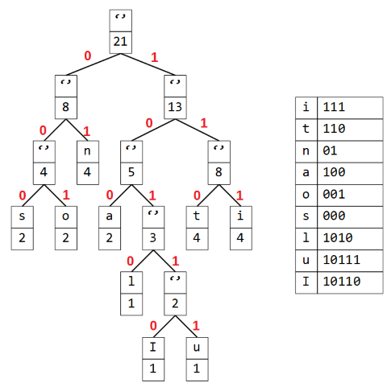
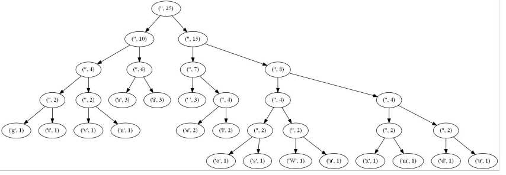

??? note "Correction"
    1. Codage
     
    En suivant l’algorithme de Huffman, Dessiner les arbres des Huffman, et donner les tables de codages des mots suivants : 
        - Attention 
        
        - Institutionnalisation 
        
    2. Décodage
     
    On vous donne la série binaire et l’arbre de Huffman suivants : 
    110101101101001001111000010110011001111010101111111100100111010111011101110101000010011001100000001 
     
    Décoder la série binaire et donner le texte en clair.  
    'Warriors deux mille vingt'