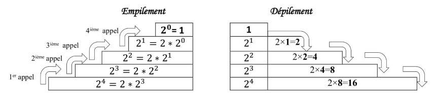
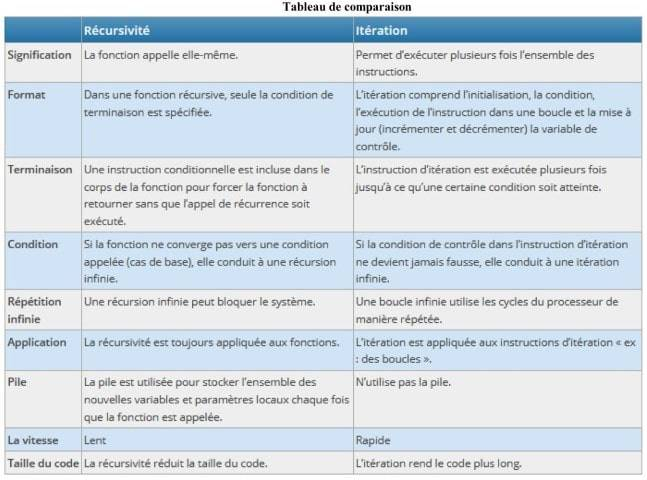

# La récursivité


??? conclu "Programme"
    |Notions|Compétences|Remarques|
    |--|--|--| 
    Récursivité.|Écrire un programme récursif.<br> Analyser le fonctionnement d’un programme récursif.|Des exemples relevant de domaines variés sont à privilégier.

## Introduction

**Exercice 1**

Implémenter en Python une fonction `puissance1` permettant de calculer $2^{n}$, pour $n$ entier positif, de manière itérative (c'est-à-dire en utilisant une boucle).

On rappelle que $2^{n}$ peut s'écrire : $2\times 2 \times 2 \times 2 \times... \times 2$, $n$ fois.

{{IDE()}}

--8<-- "docs/05-Recursivite/Corrections/Exercice1_correction.md"

!!! abstract "Un peu de math..."
    En mathématiques, il existe des fonctions particulières appelées **suites** qu'on peut définir de deux manières différentes.

    Par exemple :

    1. $u(n)=2^{n}$ est la suite donnant les différentes puissances de 2.<br>
    Avec cette fonction, calculez les 5 premières puissances de 2.<br>
    On dit que cette suite est définie explicitement.
    2. On pourrait aussi l'écrire ainsi : si $n=0$ alors $u(n)=1$, sinon $u(n)=2 \times u(n-1)$.<br>
    Vérifiez que cette deuxième fonction permet d'obtenir les puissances de 2.<br>
    On dit que cette suite est définie par récurrence.


## Définition de la récursivité

**Exercice 2**

Ecrire un **algorithme** permettant de calculer les puissances de 2 avec la deuxième définition de l'exemple précédent. On notera `puissance2` le nom de la fonction.

--8<-- "docs/05-Recursivite/Corrections/Exercice2_correction.md"

!!! example "Définition"
    Pour $n>0$, la fonction puissance s'appelle elle-même : on parle de définition par **récursivité**.


**Exercice 3**

Implémenter la fonction `puissance2` avec Python.

{{IDE()}}

--8<-- "docs/05-Recursivite/Corrections/Exercice3_correction.md"

**Exercice 4 : Comparaison des vitesses d'éxécutions**

1. Comparez les vitesses d'exécutions des fonctions `puissance1` et `puissance2`. Pour tester la vitesse d'éxécution d'une fonction, on utilise le module `timeit`, comme le montre le code ci-dessous pour une entier naturel N assez grand.<br>
On pourra tester pour des valeurs de N de plus en plus grandes.
```python
from timeit import default_timer as timer

N=5

debut = timer()
print(puissance1(N))
fin = timer()
print(f"temps pour calculer 2^{N} en version itérative : {fin - debut}")

debut = timer()
print(puissance2(N))
fin = timer()
print(f"temps pour calculer 2^{N}en version récursive : {fin - debut}")
```
{{IDE()}}

2) Que pouvez-vous en conclure?

--8<-- "docs/05-Recursivite/Corrections/Exercice4_correction.md"

## Principe de la récursivité : lien avec la notion de pile

Le principe de programmation par récursivité est basé sur le fonctionnement de *"l'empilement-dépilement"* à l'aide d'une pile d'exécution stockant l'adresse mémoire de la prochaine instruction machine à exécuter et conservant une "trace" des valeurs des variables :

{: .center}

- L'exécution d'un programme peut être représentée comme le parcours d'un chemin ayant une origine (entrée) et une extrémité (sortie).
- L'appel d'une procédure (ou d'une fonction) se caractérise alors par un circuit, c'est-à-dire un chemin dont l'origine et l'extrémité sont confondus.
- Le processeur a alors besion de stocker différentes informations (adresses mémoire, variables, paramètres, etc...)

!!! example "Propriété"
    Pour réaliser tout cela, le processeur gère une ou plusieurs piles dans lesquelles il stocke les adresses de retour des procédures et les valeurs des différentes variables. La récursivité est donc généralement plus lent en raison des frais généraux liés à la maintenance de la pile.

## Petit piège à éviter

**Exercice 5**

1. Implémentez la procédure récursive suivante et tester la pour $a=4$ :
```python
def fonction(a):
  return a*fonction(a-1)
```
{{IDE()}}
Que se passe-t-il? Quelle explication peut-on en donner?

2)  a) Compléter cette procédure pour obtenir une sortie avec l'entrée $a=4$.<br>
    b) Cette procédure retourne-t-elle alors un résultat pour tout entier $a$?<br>
    c) Quelle règle tirez-vous de cette expérience?

--8<-- "docs/05-Recursivite/Corrections/Exercice5_correction.md"

!!! note "En résumé"
    - Une fonction récursive doit avoir un "état trivial", cela permet d'avoir une condition d'arrêt.
    - Un algorithme récursif doit avoir une terminaison, c'est-à-dire conduire vers cet "état trivial" (il ne faut pas une infinité d'appels récursifs).
    - Une fonction récursive doit s'appeler elle-même.


!!! note "A savoir"
    Ces deux paradigmes de programmation sont équivalents, c'est-à-dire que tout algorithme itératif possède une version récursive, et réciproquement.

    Le type de langage de programmation utilisé peut conduire à programmer d'une manière ou d'une autre. Par exemple Caml est un langage conçu pour exploiter la récursivité. A l'inverse, Python, même s'il l'autorise, ne favorise pas l'écriture récursive (limitation basse du nombre d'appels récursifs à 1000 par défaut).

    Enfin, le choix d'écrire une fonction récursive ou itérative peut dépendre du problème à résoudre : certains problèmes se résolvent particulièrement simplement sous forme récursive.

    La version récursive d'un algorithme est souvent plus succinte et plus lisible.


{: .center}

## Quelques autres exemples


**Exercice 6**

Soit $n$ un entier naturel. On définit la factorielle de $n$ et on note $n!$ le nombre :

$n!=n \times (n-1) \times (n-2) \times ... \times 3 \times 2 \times 1$

et $0!=1$.

1) Ecrire une fonction itérative permettant de calculer n'importe quelle $n!$.
{{IDE()}}
2) Ecrire une fonction récursive permettant de calculer n'importe quelle $n!$.
{{IDE()}}
3) Comparer l'exécution en temps de ces deux fonctions.
{{IDE()}}

--8<-- "docs/05-Recursivite/Corrections/Exercice6_correction.md"

**Exercice 7**

On définit la suite de Fibonacci par :

$u_{0}=1$

$u_{1}=1$

Pour $n \ge 2$, $u_{n}=u_{n-1}+u_{n-2}$.

Ecrire la fonction récursive permettant de calculer n'importe quelle valeur $u_{n}$.

{{IDE()}}

--8<-- "docs/05-Recursivite/Corrections/Exercice7_correction.md"

**Exercice 8**

1) Ecrire une fonction déterminant le minimum d'une liste d'entier de taille minimale 1 de manière itérative.
{{IDE()}}
2) Ecrire une fonction déterminant le minimum d'une liste d'entier de taille minimale 1 de manière récursive.
{{IDE()}}
3) Comparer l'exécution en temps de ces deux fonctions.
{{IDE()}}

--8<-- "docs/05-Recursivite/Corrections/Exercice8_correction.md"

**Exercice 9**

Implémenter la fonction récursive permettant de calculer la somme des éléments d'une liste de taille minimale 1.

{{IDE()}}

--8<-- "docs/05-Recursivite/Corrections/Exercice9_correction.md"

## Exercices

Dans Capytale, ouvrez le notebook avec le code `7434-627790` et faites l'exercice 10.

--8<-- "docs/05-Recursivite/Corrections/Exercice10_correction.md"

Dans Capytale, ouvrez le notebook avec le code `51f8-627791` et faites l'exercice 11.

--8<-- "docs/05-Recursivite/Corrections/Exercice11_correction.md"

Dans Capytale, ouvrez le notebook avec le code `0b69-627792` et faites l'exercice 12.

--8<-- "docs/05-Recursivite/Corrections/Exercice12_correction.md"

