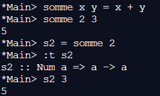

??? note "Correction"
    1. 
    2. On obtient bien la somme 2+3 = 5
    3. On obtient le fait que la variable s2 est du type Num et provient de deux variables  de type num
    4. On obtient bien 5 : somme 2 3
