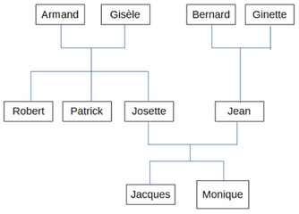

# Paradigmes de programmation


??? conclu "Programme"
    |Notions|Compétences|Remarques|
    |--|--|--| 
    Paradigmes de programmation.|Distinguer sur des exemples les paradigmes impératif, fonctionnel et objet.<br> Choisir le paradigme de programmation selon le champ  d’application d’un programme.|Avec un même langage de programmation, on peut utiliser des paradigmes différents. Dans un même programme, on peut utiliser des paradigmes différents.
    
## Introduction

Le nombre de langages de programmation est gigantesque : on en dénombre plus de 2000. Pourquoi autant de langages ? Comment les choisir ?

Il y a bien sûr des langages plus populaires que d'autres - reste bien sûr à définir la notion de populaire. Si on prend comme critère les recherches des développeurs sur les forums d'entraide, on obtient ce classement qui fait de Python le langage le plus populaire : [http://pypl.github.io/PYPL.html](http://pypl.github.io/PYPL.html)

Python rentre dans la catégorie des langages généralistes : il peut s'adapter à beaucoup de situations et de paradigmes différents.

Dans certaines situations, on va choisir un langage particulier parce qu'il est plus adapté qu'un langage généraliste pour effectuer certaines tâches. Pour prendre un exemple un peu extrême : pour gérer efficacement l'accès à un grand nombre de données, on va privilégier un langage orienté requêtes comme SQL plutôt que python.

Voici quelques exemples de paradigmes déjà étudiés : Impératif, Orienté Objets, Evénementiel, Orienté requêtes.

Nous allons maintenant détailler deux nouveaux paradigmes de programmation.

## Programmation fonctionnelle

### Le principe de la programmation fonctionnelle

La programmation fonctionnelle est une programmation dans laquelle un programme est une composition de fonctions calculant un résultat à partir de données d’entrée.

La théorie sous-jacente est celle du λ-calcul, introduite par Church en 1925.

Le premier langage fonctionnel fut le Lisp (1958), qui eut un certain succès, dans le domaine de l’IA.

D’autres langages fonctionnels sont à citer :

- ML (1970), plus proche de la théorie de λ-calcul
- CAML (1985), déclinaison française de ML, autorisant la programmation impérative et objet
- Haskell(1990), une version plus moderne, très pure, de la notion de langage fonctionnel

Le paradigme fonctionnel a le vent en poupe :  de nombreux langages récents intègrent des aspects fonctionnels, au sens où :

- Les fonctions sont des données comme les autres, qui peuvent donc être passées en paramètres à d’autres fonctions
- Il est possible de définir à la volée des fonctions anonymes appelées λ-expressions.

Parmi ces langages, on trouve notamment Skala, Java (à partir de Java 8), Javascript et Python.

Par exemple, la fonction qui consiste à ajouter 1 à une autre s'écrit en λ-calcul :

    λx.(x+1)
  
On appelle cela une $\lambda$-expression; En mathématiques, on noterait cela $x \mapsto x+1$

On peut appliquer une telle expression à une valeur ainsi :

    (λx.(x+1))(3) = (3+1) = 4
  
Une fonction additionnant ses 2 paramètres se représente ainsi :

    λ(x,y).(x+y)
  
Soit en mathématiques : $(x,y) \mapsto x+y$

Les $\lambda$-fonctions sont des fonctions anonymes, et ce n'est pas très pratique. Souvent, on préférera les stocker dans des variables, ce qui reviendra à leur donner un nom. Par ailleurs, pour éviter la profusion de parenthèses, on préférera séparer les paramètres du nom de la fonction et entre eux par des espaces. On pourra donc écrire :

    f = λ(x,y).(x + y)
    f 3 5
    8
    g = f 3
    g 5
    8

### Exemples de programmation fonctionnelle avec Haskell

Nous allons maintenant étudier quelques exemples de programmes écrits dans un langage fonctionnel, Haskell en l'occurrence. Vous pourrez tester ces exemples sans installation en utilisant cet [interpréteur en ligne](https://replit.com/languages/haskell){target="_blank"}.

Les exemples qui suivent sont à taper dans l'interpréteur, c'est-à-dire la partie droite de la fenêtre.

<!-- Avant de commencer le moindre exemple, à l'ouverture de l'interpréteur, commencer par rentrer ces lignes (toujours dans la zone de droite) : 

```
ghci
```

```
Prelude> :load main.hs
```
-->

#### Définition et application d'une fonction

**Exercice 1**

1. Testez le programme suivant :
    ```
    somme x y = x + y
    somme 2 3
    ```
2. Qu'obtient-on?
3. Puis testez le programme suivant :
    ```
    s2 = somme 2
    :t s2
    ```

    !!! info "Remarque"
        `:t` permet de connaître le type d'une donnée
    
4. Qu'obtient-on?

    !!! info "Remarque"
        il s'agit d'une application partielle de la fonction `somme` : `s2` est une fonction qui ajoute 2 au nombre qui lui est passé en paramètre
    
5. Puis testez le programme suivant :
    ```
    s2 3
    ```
6. Qu'obtient-on?

--8<-- "docs/13-Paradigmes_de_programmation/Corrections/Exercice1_correction.md"

**Exercice 2**

On peut aussi composer les fonctions :

1. Testez le programme suivant :
    ```
    somme x y = x + y
    suivant x = x + 1
    somme (suivant 3) 4
    ```
2. Qu'obtient-on?
3. Puis testez le programme suivant :
    ```
    myst x y = somme (suivant x) (suivant y)
    myst 2 4
    ```
4. Qu'obtient-on?

--8<-- "docs/13-Paradigmes_de_programmation/Corrections/Exercice2_correction.md"

#### Conditionnel

Dans les langages fonctionnels, tout est fonction. C'est notamment le cas du `if ... then ... else ...` : c'est en fait une fonction d'arité 3 :

- le premier paramètre est la fonction de test
- le deuxième paramètre la fonction calculant la valeur dans le cas où le test est vrai,
- le troisième paramètre la fonction calculant la valeur dans le cas où le test est faux

Ainsi, `if t then g else h` renvoie une valeur (celle renvoyée par `g` ou `h` suivant que `t` renvoie `vrai` ou `faux`).

**Exercice 3**

1. Testez le programme suivant :
    ```
    f x = if (mod x 3 == 0) then (div x 3) else 4 * x - 1
    f 7
    f 6
    ```
2. Qu'obtient-on?

--8<-- "docs/13-Paradigmes_de_programmation/Corrections/Exercice3_correction.md"

#### Récursivité

Comme les langages fonctionnels ne connaissent que la composition de fonctions, il n'y a pas de boucle, et la répétition s'effectue donc par récursivité. Voici par exemple une définition de la suite de Fibonacci en Haskell :

**Exercice 4**

1. Testez le programme suivant :
    ```
    fibo n = if (n < 2) then 1 else fibo(n-1) + fibo(n-2)
    fibo 6
    ```
2. Qu'obtient-on?

--8<-- "docs/13-Paradigmes_de_programmation/Corrections/Exercice4_correction.md"

#### Les listes

Les listes sont un élément essentiel des langages fonctionnels. Elles ressemblent aux listes que vous connaissez en Python. Voici un exemple de fonction construisants les termes de la suite de Fibonacci jusqu'à un indice donné :

**Exercice 5**

1. Testez le programme suivant :
    ```
    fibo n = if (n < 2) then 1 else fibo(n-1) + fibo(n-2)
    termesFibo n = if n == 0 then [1] else termesFibo(n-1) ++ [fibo n]
    termesFibo 6
    ```
2. Qu'obtient-on?
3. Pour accéder à l'élément d'une liste à un indice donné, on utilise l'opérateur *!!*. Testez :
    ```
    [2,4,6]!!1
    ```
4. Qu'obtient-on?
5. Il est possible, comme en Python, de définir des listes en compréhension. On peut également définir des listes sous la forme d'un intervalle. Testez :
    ```
    [2..10]
    ```
6. Qu'obtient-on?

--8<-- "docs/13-Paradigmes_de_programmation/Corrections/Exercice5_correction.md"

#### Mapping

Ce type d'opération consiste à appliquer une fonction à tous les éléments d'une liste, et à renvoyer la liste des résultats.

**Exercice 6**

1. Testez le programme suivant :
    ```
    doubler x = x + x
    map doubler [1,2,3]
    ```
2. Qu'obtient-on?

--8<-- "docs/13-Paradigmes_de_programmation/Corrections/Exercice6_correction.md"

#### Filtrage

Ce type d'opération consiste à renvoyer une liste constituée des éléments de la liste passée en paramètre qui vérifient un certain critère.

**Exercice 7**

1. Testez le programme suivant :
    ```
    pair x = (mod x 2) == 0
    filter pair [1,2,3,4,5,6]
    ```
2. Qu'obtient-on?

--8<-- "docs/13-Paradigmes_de_programmation/Corrections/Exercice7_correction.md"

### A vous de chercher

**Exercice 8**

En Haskell, il est possible de définir des fonctions sur les listes par filtrage. Pour ce faire, on pourra définir la
fonction en utilisant différents motifs :

- `[]` : la liste vide
- `[ x ]` : une liste réduite à un élément
- `(x:xs)` : une liste d’au moins un élément : `x` représente le premier élément, `xs` la liste (éventuellement vide) des autres éléments.

Voici par exemple comment définir une fonction calculant la somme des éléments d’une liste :

```
:{
sommeL [] = 0
sommeL (x:xs) = x + sommeL xs
:}
```

!!! info "Remarque"
    Pour rentrer dans l'interpréteur une fonction sur plusieurs lignes, on utilise les balises `:{` et `:}`

Tester la fonction en tapant par exemple : `sommeL [1, 2, 3]`

Écrivez maintenant les fonctions réalisant les calculs suivants :

1. produits des éléments d'une liste
2. Élément maximal d’une liste
3. suppression de la première occurrence d’un élément dans une liste
4. suppression de toutes les occurrences d'un élément dans une liste
5. fonction renvoyant les éléments de la liste passée en deuxième paramètre vérifiant le prédicat passé en premier paramètre
6. Somme terme à terme des éléments de 2 listes de même longueur

--8<-- "docs/13-Paradigmes_de_programmation/Corrections/Exercice8_correction.md"


## Programmation logique

## Principe de la programmation logique

Certains langages sont spécialement conçus pour traiter des problèmes logiques, voire faire des preuves mathématiques. On peut citer Prolog ou Coq pour les preuves.

Développons le langage Prolog : ce langage a été créé en 1972 par un Français : Alain Colmerauer. Il est surtout utilisé dans le domaine de l'intelligence artificielle, mais aussi dans le traitement du langage. Dans Prolog, un programme est en fait une base de faits et règles, et le programme est en quelque sorte exécuté en posant une question dans l'interpréteur.

Sans faire un tutoriel, regardons juste un exemple qui montre le fonctionnement totalement différent de ce langage très spécial :

**Le problème à résoudre : **

Les données du problèmes sont :

- Max a un chat.
- Eric n'est pas en pavillon.
- Luc habite un studio mais le cheval n'y est pas.
- Chacun habite une maison différente et possède un animal distinct.

La problématique à résoudre est : Qui habite le château et qui a le poisson ?

**Le programme en Prolog :**

Nous utiliserons pour ce paradigme l'[émulateur de Prolog](https://swish.swi-prolog.org/){target="_blank"}.

On commencera par appuyer sur le '+' en haut de la fenêtre à gauche, puis on cliquera sur 'Program'.

La fenêtre de gauche est celle dédiée aux règles et aux faits, la fenêtre en bas à droit est la console de saisie des requêtes, et celle en haut à droite donne les résultats de la requête.

Copier-coller le code suivant :

```
    %--------------------------------------------------------
    % les faits :

    % les 3 maisons :
    maison(chateau).
    maison(studio).
    maison(pavillon).

    % les 3 animaux :
    animal(chat).
    animal(poisson).
    animal(cheval).

    %--------------------------------------------------------
    % les règles :

    % le prédicat relation constitue la relation entre une personne, son animal et sa maison :
    relation(max,M,chat):-maison(M).
    relation(luc,studio,A):-animal(A),A\==cheval.
    relation(eric,M,A):-maison(M),M\==pavillon,animal(A).

    % le prédicat different est vraie seulement si ses 3 paramètres sont différents :
    different(X,X,_):-!,fail.
    different(X,_,X):-!,fail.
    different(_,X,X):-!,fail.
    different(_,_,_).

    % le prédicat "resoudre" indique les 4 inconnues à retrouver :
    resoudre(MM,ME,AE,AL):-

            relation(max,MM,chat),
            relation(eric,ME,AE),
            different(MM,ME,studio),
            relation(luc,studio,AL),
            different(AE,AL,chat).
```

**La solution**

Pour résoudre le problème, on tape `resoudre(MM,ME,AE,AL)` ce qui donne :

```
MM = pavillon,
ME = chateau,
AE = cheval,
AL = poisson .
```

qui s'interprète ainsi :

- la maison de Max (MM) est un pavillon
- la maison d'Eric (ME) est un chateau
- l'animal d'Eric (AE) est le cheval
- l'animal de Luc (AL) est le poisson

Sans chercher à rentrer dans les détails, un survol de cet exemple vous montre comment à partir de faits et de règles, le langage trouve une solution à un problème. Il utilise pour cela un moteur d'inférence qui simule des raisonnements déductifs.

### Mise en pratique de la programmation logique

**Exercice 9 : Un arbre généalogique**

Nous allons d'abord créer les faits à partir d'un arbre généalogique, puis créer les régles décrivant les liens de parenté.

1. **Ecriture des faits**<br>
   Nous allons utiliser les faits suivants : `homme`, `femme`, `parent` comme point de départ.<br>
   Nous définirons ensuite des règles permettant d'établir d'autres relations de parentés, pour les tester ensuite avec des requêtes.<br>
   Nous utiliserons l'arbre généalogique de la figure suivante :
   {width=70% .center}

   a. **Faits de genre**

   Commencez pas saisir les faits concernant le genre de la personne considérée. Attention, n'utilisez pas les majuscules, car en Prolog, elles indiquent une variable et non une constante.<br>
   Par exemple :
   ```
   homme(armand).
   femme(gisele).
   ```
   Complétez les faits de genre.

   b. **Faits de liens de parenté**

   On choisit pour `parent` la syntaxe : `"Si A est un parent de B, alors parent(A,B)"`.
   ```
   parent(armand,robert).
   parent(gisele,robert).
   ```
   Complétez les faits de parenté.<br>
2. **Ecriture de règles**<br>
   Nous allons maintenant établir des règles plus précises, en commençant par la notion de père et mère.<br>
   A est le père de B si A est un homme et si A est un parent de B.<br>
   Pour celà, on écrit :
   ```
   pere(X,Y):-homme(X),parent(X,Y).
   ```
   On peut ensuite tester dans l'interpréteur avec une requête, par exemple `pere(armand,robert)` qui doit retourner `true`.<br>
   On peut aussi tester les unifications, en demandant `pere(armand,X).`, qui donnera toutes les possibilités pour unifier X.<br>
   Complétez avec les règles suivantes :

   - mere
   - enfant
   - fils
   - fille
   - grandparent
   - grandpere
   - grandmere
   - frere
   - soeur
   - oncle
   - tante


3. Elaborez un jeu de tests à partir de la base de faits établie pour vérifier que ces règles fonctionnent correctement.

**Compléments de Prolog**

1. Il est possible d'imposer une utilisation précise des règles que l'on écrit en Prolog. On peut par exemple obliger d'utiliser une variable dans un paramètre, ou pas.<br>
   Pour celà, on précède dans la définition de la règle les paramètres par les caractères suivants :

   - $+$ : l'argument doit être connu
   - $-$ : l'argument doit être inconnu
   - ? : libre
   Si on définit une règle `toto(?X,+Y)`, il faut donc que Y soit un élément connu.
2. En Prolog, le symbole `=` ne permet pas une affectation, mais demande une unification. Il permet donc d'avoir la liste de toutes les possibilités d'instanciation d'une variable.
3. Même si cela n'est pas forcément naturel en Prolog, on peut avoir besoin d'affecter directement une variable dans certains cas. Cela est réalisé avec l'opérateur `is`.
4. Si l'unification d'une variable intermédiaire n'est pas utile, on peut utiliser le symbole `_` à la place du nom de variable.

--8<-- "docs/13-Paradigmes_de_programmation/Corrections/Exercice9_correction.md"

**Exercice 10**

On considère une base de faits décrivant des vols de la compagnie Air-Gonomie sous la forme : `vol(numero du vol,ville de depart,ville d'arrivee,heure de depart,heure d'arrivee,nombre de passagers)`

Un certain nombre de faits sont fournis dans le document [Exo10-Regles.txt](Documents/Exo10-Regles.txt){target="_blank"}

Pour les requêtes, on pourra utiliser le caractère `_` en variable muette, comme expliqué dans les compléments ci-dessus.

Quelles questions Prolog doit-on poser pour déterminer la liste des vols (identifiés par leur numéro) :

1. au départ d'une ville donnée?
2. qui arrivent dans une ville donnée?
3. au départ d'une ville donnée et qui partent avant midi?
4. arrivant dans une ville donnée à partir de 14h?
5. qui ont plus de 100 passagers et qui arrivent dans une ville donnée avant 17h?
6. qui partent à la même heure de deux villes différentes?
7. qui durent plus de deux heures?

--8<-- "docs/13-Paradigmes_de_programmation/Corrections/Exercice10_correction.md"

**Exercice 11**

Cet exercice considère des graphes et leur traitement en Prolog.

On va définir un réseau routier minimal, et demander à Prolog l'existence, ou non, d'une route entre deux points.

On considère le réseau suivant :

{: .center}

Pour définir l'existence d'une route entre deux sommets, on utilisera la syntaxe : *route(a,b)* si une route existe.

1. Complétez les faits permettant de décrire le réseau ci-dessus.
2. Ecrire une règle `voisines(X,Y)` établissant s'il existe une route directe entre X et Y.

--8<-- "docs/13-Paradigmes_de_programmation/Corrections/Exercice11_correction.md"

**Exercice 12**

On dispose de 4 couleurs pour colorier la carte suivante :

{: .center}

Ecrire un programme Prolog permettant d'associer une couleur (rouge, jaune, vert, bleu) à une région (1,2,3,4,5,6) de telle manière que deux régions adjacentes ne soient pas de la même couleur.

*Indication :*

Commencer par définir les faits de couleurs : `couleur(vert).`, etc...

Ecrire ensuite une règle `carte(C1,C2,C3,C4,C5,C6)` qui affectera une couleur en tenant compte des contraintes du schéma.

--8<-- "docs/13-Paradigmes_de_programmation/Corrections/Exercice12_correction.md"

*Exemple plus simple :*

Si on cherche à colorier avec 3 couleurs un découpage de cercle entre 3 parts égales, on pourrait écrire le code suivant :

```
couleur(rouge).
couleur(vert).
couleur(bleu).
carte(C1,C2,C3): −couleur(C1),couleur(C2),couleur(C3),C1\==C2,C2\==C3,C3\==C1.
```

La requête `carte(X,Y,Z).` va ainsi lister toutes les possibilités de coloration

### Listes en Prolog

#### Définition et opérateurs

Les listes se définissent comme en Python, entre crochets et en séparant par une virgule.

L'opérateur '|' permet lui de couper une liste, en unifiant l'élément qui est avant, et en laissant ce qui est après dans une liste.

Exemples :

- `[X,Y]=[1,2]` va renvoyer X=1 et Y=2
- `[X,Y]=[1,2,3]` va renvoyer `false` car il n'est pas possible d'unifier X et Y.
- `[X|Y]=[1,2,3]` va renvoyer X=1 et Y=[2,3].

#### Exemples complexes

**Exercice 13**

1. Testez si un nombre est le premier d'une liste : `premier(X,[X|_]).` On utilise icie directement le résultat de l'unification pour répondre. Si on demande `?-premier(1,[1,2,3]).`, on obtient bien `true`.
2. Testez si un nombre est le dernier d'une liste : On commence par traiter le cas où la liste est composée de l'élément seul : `dernier(X,[X]).`, puis on fait une récursivité : `dernier(X,[_|Q]):-dernier(X,Q).`
3. Calculez la longueur d'une liste : On traite le cas d'une liste vide : `longueur(0,[]).`, puis on utilise la récursivité pour calculer une liste plus longue : `longueur(N,[_|Q]):-longueur(M,Q),N is M+1.`

--8<-- "docs/13-Paradigmes_de_programmation/Corrections/Exercice13_correction.md"

#### Exercices d'approfondissement

**Exercice 14**

Définir des règles répondant aux questions suivantes :

- `dans (?X,+L)` doit renvoyer si X est dans la liste L.
- `hors(?X,+L)` doit renvoyer si X n'est pas dans L.
- `unique(?X,+L)` doit renvoyer si X n'apparaît qu'une seule fois dans L.
- `occurences(?X,+L)` doit renvoyer le nombre d'occurences de X dans L.

--8<-- "docs/13-Paradigmes_de_programmation/Corrections/Exercice14_correction.md"