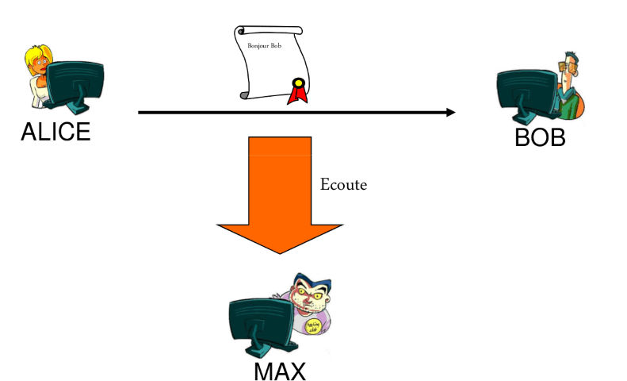
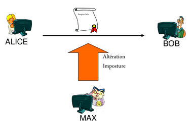
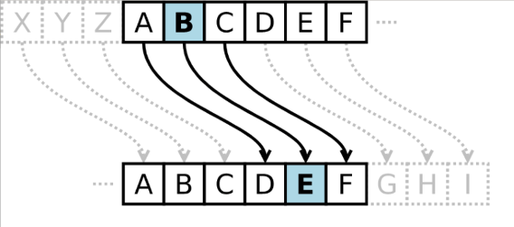
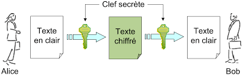
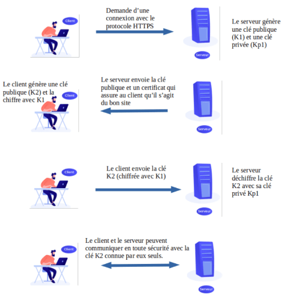
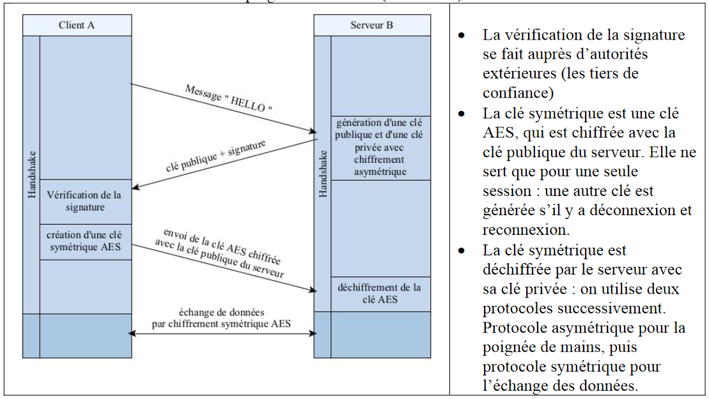

# Sécurisation des communications

??? conclu "Programme"
    |Notions|Compétences|Remarques|
    |--|--|--| 
    Sécurisation des communications. |Décrire les principes de chiffrement symétrique (clef partagée) et asymétrique (avec clef privée/clef publique).<br> Décrire l’échange d’une clef symétrique en utilisant un protocole asymétrique pour sécuriser une communication HTTPS.| Les protocoles symétriques et asymétriques peuvent être illustrés en mode débranché, éventuellement avec description d’un chiffrement particulier.<br>La négociation de la méthode chiffrement du protocole SSL (Secure Sockets Layer) n’est pas abordée.
    
## Introduction

Les  communications,  qu’elles  soient  entre  humains,  entre  humains  et  machines,  ou  entre  machines, peuvent  être  interceptées  par  différents  moyens,  parfois  surprenants. 

{: .center}


Il  est  donc  important  de  les protéger,  que  ce soit  pour  **protéger** sa  vie  privée  ou  pour  éviter  un  **piratage**.  

{: .center}

Pour  protéger  ces communications,  on  **chiffre** les  messages à  l’aide  d’une  méthode  de  **cryptographie**. 

Les deux principes de chiffrement sont le **chiffrement symétrique** et le **chiffrement  asymétrique** utilisant des clés supposées secrètes.

Reste à assurer que les clés ne soient pas piratées, ce qui est le problème de  l’authenticité  des  utilisateurs.

La  sécurité  des  communications  dépend  à  la  fois  des  méthodes de chiffrement et des protocoles d'échange des clés.

## Le chiffrement symétrique

**Exercice 1**

Quel est le principe de chiffrage dans les messages suivants ?

Message clair :   LA NSI C EST FANTASTIQUE

Message chiffré : MB OTJ D FTU GBOUBTUJRVF

--8<-- "docs/12-Securisation_des_communications/Corrections/Exercice1_correction.md"

### Un exemple simple : le code César

Principe : Chaque lettre est décalée d'une certaine valeur (appelée clé)  dans l'alphabet. Lorsque le décalage "dépasse" la fin de l'alphabet, on revient au début.

Dans l'exemple ci-dessous, la clé est de 3

{: .center}


**Exercice 2**

1. Quelle est la clé de chiffrement du code César de l'exercice 1?
2. Chiffrez la phrase "COMMENT ALLEZ VOUS" avec le code César de clé 4.
3. Déchiffrez le mot "YAVKX" avec le code César de clé 6.

--8<-- "docs/12-Securisation_des_communications/Corrections/Exercice2_correction.md"

**Exercice 3**

Ecrire une fonction python `code_Cesar` prenant en paramètres la clé et une chaîne de caracatère à chiffrer et qui renvoie la chaîne chiffrée. 

On pourra utiliser un dictionnaire et la table ASCII :

```python
d = {chr(i) : chr((i+cle)%127) if (i+cle)<127 else chr((i+cle)%127+33) for i in range(33,127)}
```

`chr(i)` transforme un nombre décimal `i` en son caractère [ASCII](https://fr.m.wikipedia.org/wiki/Fichier:ASCII-Table.svg){:target="_blank"} correspondant.
<br>
Le `range(33,127)` permet d'aller du caractère `!` au caractère `~` dans la table ASCII.
<br>
Un espace sera systématiquement remplacé par un espace pour garder la "forme" du message.


{{IDE()}}

--8<-- "docs/12-Securisation_des_communications/Corrections/Exercice3_correction.md"

**Exercice 4**

Ecrire une fonction python `decode_Cesar` prenant en paramètres la clé et une chaîne de caracatère à déchiffrer et qui renvoie une chaîne déchiffrée.

{{IDE()}}

--8<-- "docs/12-Securisation_des_communications/Corrections/Exercice4_correction.md"

### Le principe du chiffrement symétrique

!!!note "Principe"
    {: .center}

    Dans un **chiffrement symétrique**, la clé utilisée par l'expéditeur pour chiffrer le message est la même que celle utilisée par le récepteur pour déchiffrer le message.

    La clé secrète doit donc être connue préalablement par les deux entités communiquant.

    Il faut également échanger cette clé au préalable, sans qu'elle ne soit interceptée (d'où certains problèmes...le python se mord la queue !)

### Exemple de XOR

Nous nous intéresserons ici uniquement aux communications ayant lieu par l'intermédiaire d'un réseau informatique. Comme nous avons déjà eu l'occasion de le voir en première, toute "donnée informatique" peut être vue comme une suite de zéro et de un. Nous chercherons donc à chiffrer une suite de zéro et de un :

Soit le message "HELLO WORLD!" ce qui nous donnera en binaire (en utilisant le code ASCII) : 

```
010010000100010101001100010011000100111100100000010101110100111101010010010011000100010000100001
```

Choisissons maintenant un mot (ou une phrase) qui nous servira de clé de chiffrement, prenons pour exemple le mot "toto". "toto" nous donne en binaire : 

```
01110100011011110111010001101111
```

Pour chiffrer le message nous allons effectuer un XOR bit à bit.

Pour rappel, voici la table de vérité du *XOR* :

|E1|E2|S|
|:--:|:--:|:--:|
|0|0|0|
|0|1|1|
|1|0|1|
|1|1|0|

Comme la clé est plus courte que le message, il faut "reproduire" la clé vers la droite autant de fois que nécessaire (si la taille du message n'est pas un multiple de la taille de la clé, on peut reproduire seulement quelques bits de la clé pour la fin du message): 

&nbsp;&nbsp;&nbsp;&nbsp;0100100001000101 0100110001001100 0100111100100000 0101011101001111 0101001001001100 0100010000100001
<br>
$\oplus$0111010001101111 &nbsp;0111010001101111 &nbsp;0111010001101111 &nbsp;0111010001101111 &nbsp;0111010001101111 &nbsp;0111010001101111
<br>
<hr>
&nbsp;&nbsp;&nbsp;&nbsp;0011110000101010 0011100000100011 0011101101001111 0010001100100000 0010011000100011 0011000001001110
 
Le signe $\oplus$ symbolise XOR.

Après ce XOR on obtient donc la suite de bits suivante : 

```
001111000010101000111000001000110011101101001111001000110010000000100110001000110011000001001110
```

Soit la chaine de caractères suivante (si on cherche à afficher le message chiffré avec un éditeur de texte) : 

```
<*8#;O# &#0N
```

Maintenant ce message est prêt pour être envoyé à son destinataire Bob. Si Max intercepte le message et cherche à le lire avec un éditeur de texte, il obtiendra la suite de caractère

```
<*8#;O# &#0N
```

Bob a maintenant reçu le message chiffré, il possède la clé (toto), il va donc pouvoir déchiffrer le message en appliquant un XOR entre le message chiffré et la clé (on applique exactement la même méthode que ci-dessus). 


&nbsp;&nbsp;&nbsp;&nbsp;0011110000101010 0011100000100011 0011101101001111 0010001100100000 0010011000100011 0011000001001110
<br>
$\oplus$0111010001101111 &nbsp;0111010001101111 &nbsp;0111010001101111 &nbsp;0111010001101111 &nbsp;0111010001101111 &nbsp;0111010001101111
<br>
<hr>
&nbsp;&nbsp;&nbsp;&nbsp;0100100001000101 0100110001001100 0100111100100000 0101011101001111 0101001001001100 0100010000100001
 
 
On trouve le code binaire suivant :

```
010010000100010101001100010011000100111100100000010101110100111101010010010011000100010000100001
```

Vous pouvez remarquer que nous avons bien retrouvé le code binaire d'origine.
				
On retrouve bien le message d'origine : Hello World!, Bob a pu lire le message envoyé par Alice alors que pour Max, malgré le fait qu'il a pu intercepter le message, il n'a pas pu prendre connaissance de son contenu sans la clé. 

**Exercice 5**

Avec de l'Unicode (plutôt que du binaire !)

1. Testez le code suivant : 
```python
m = "bonjour"
for c in m:
    print(ord(c), end = ’ ’)
```
Ce programme donne le code Unicode du mot 'bonjour', soit 98 111 119 196 111 117 114.
<br>
Le mot 'nsi' va nous servir de clé. Quel est son code Unicode?
2. En python l'opérateur $\wedge$ (accent circonflexe sur le clavier) permet d'effectuer un *xor* directement sur deux entiers. Le programme suivant chiffre un message en utilisant cette méthode :

```python
def chiffre_xor(message, key):
    c = []
    n = len(message)
    m = len(key)
    j = 0
    for i in range(n):
        c.append(ord(message[i]) ^ ord(key[j]))
        j = (j+1)%m
    return c
```
Modifier la fonction chiffre_xor pour qu'elle renvoie le message chiffré (avec les caractères)
3. Ecrire une fonction dechiffre_xor qui prend en paramètres le message chiffré et la clé et qui renvoie le message déchiffré.

{{IDE()}}

--8<-- "docs/12-Securisation_des_communications/Corrections/Exercice5_correction.md"

### Exemple du AES

 La méthode la plus utilisée en matière de chiffrement symétrique se nomme AES (Advanced Encryption Standard). Cette méthode utilise une technique de chiffrement plus élaborée que ce qui a été vu ci-dessus, mais les grands principes restent identiques.

### Problèmes

Le gros problème avec le chiffrement symétrique, c'est qu'il est nécessaire pour A et B de se mettre d'accord à l'avance sur la clé qui sera utilisée lors des échanges. Le chiffrement asymétrique permet d'éviter ce problème.

## Le chiffrement asymétrique

### Le principe du chiffrement asymétrique

!!!note "Principe"
    Dans le cas du chiffrement asymétrique, A et B n'ont pas besoin de partager une "clé secrete".


    Imaginon que Bob souhaite envoyer des messages secrets à Alice. Ils vont pour cela utiliser utiliser la cryptographie symétrique.

    Alice génère tout d'abord un couple de clés. Une clé privée (en rouge) et une clé publique (en vert).

    Ces clés ont des propriétés particulières vis à vis des algorithmes utilisés. En effet, un message chiffré avec une clé ne peut être déchiffré qu'avec l'autre clé. Il s'agit de fonctions à sens unique.

    {: .center}

    Alice transmet ensuite la clé publique (en vert) à Bob. Grâce à cette clé, Bob peut chiffrer un texte et l'envoyer à Alice.

    {: .center}

    En utilisant la clé publique d'Alice, Bob est certain de deux choses :

    - Personne ne peut lire le message, puisqu'il est crypté.
    - Seule Alice peut déchiffrer le message, car elle est la seule à posséder la clé privée.

    Si un pirate intercepte le message, il sera incapable de déterminer le message sans la clé privée de B.
 
### Le chiffrement RSA

Le chiffrement asymétrique repose sur des problèmes très difficiles à résoudre dans un sens et faciles à résoudre dans l'autre sens. 

Prenons un exemple : l'algorithme de chiffrement asymétrique RSA (du nom de ses 3 inventeurs : Rivest Shamir et Adleman), est très couramment utilisé, notamment dans tout ce qui touche au commerce électronique. 

RSA se base sur la factorisation des très grands nombres premiers. Si vous prenez un nombre premier A (par exemple A = 16813007) et un nombre premier B (par exemple B = 258027589), il est facile de déterminer C le produit de A par B (ici on a A x B = C avec C = 4338219660050123). En revanche si je vous donne C (ici 4338219660050123) il est très difficile de retrouver A et B. En tous les cas, à ce jour, aucun algorithme n'est capable de retrouver A et B connaissant C dans un temps "raisonnable". Nous avons donc bien ici un problème relativement facile dans un sens (trouver C à partir de A et B) est extrêmement difficile dans l'autre sens (trouver A et B à partir de C). Les détails du fonctionnement de RSA sont relativement complexes (mathématiquement parlant) et ne seront pas abordés ici. Vous devez juste savoir qu'il existe un lien entre une clé publique et la clé privée correspondante, mais qu'il est quasiment impossible de trouver la clé privée de quelqu'un à partir de sa clé publique.

Dans l'exemple ci-dessus, la clé publique est C et la clé privée est le couple (A,B).


## Le protocole HTTPS

Le protocole HTTPS (client/serveur) utilise ces deux méthodes de chiffrement.

Avant de parler du protocole HTTPS, petit retour sur le protocole HTTP : un client effectue une requête HTTP vers un serveur, le serveur va alors répondre à cette requête (par exemple en envoyant une page HTML au client)

Le protocole HTTP pose 2 problèmes en termes de sécurité informatique :

- Un individu qui intercepterait les données transitant entre le client et le serveur pourrait les lire sans aucun problème (ce qui serait problématique notamment avec un site de e-commerce au moment où le client envoie des données bancaires)
- Grâce à une technique qui ne sera pas détaillée ici (le DNS spoofing), un serveur "pirate" peut se faire passer pour un site sur lequel vous avez l'habitude de vous rendre en toute confiance : imaginez vous voulez consulter vos comptes bancaires en ligne, vous saisissez l'adresse web de votre banque dans la barre d'adresse de votre navigateur favori, vous arrivez sur la page d'accueil d'un site en tout point identique au site de votre banque, en toute confiance, vous saisissez votre identifiant et votre mot de passe. C'est terminé, un "pirate" va pouvoir récupérer votre identifiant et votre mot de passe ! Pourquoi ? Vous avez saisi l'adresse web de votre banque comme d'habitude ! Oui, sauf que grâce à une attaque de type "DNS spoofing" vous avez été redirigé vers un site pirate, en tout point identique au site de votre banque. Dès que vos identifiant et mot de passe seornt saisis sur ce faux site, le pirate pourra les récupérer et se rendre avec sur le véritable site de votre banque. À noter qu'il existe d'autres techniques que le DNS spoofing qui permettent de substituer un serveur à un autre, mais elles ne seront pas évoquées ici.

HTTPS est donc la version sécurisée de HTTP, le but de HTTPS est d'éviter les 2 problèmes évoqués ci-dessus. HTTPS s'appuie sur le protocole TSL (Transport Layer Security) anciennement connu sous le nom de SSL (Secure Sockets Layer) 


Dans le schéma ci-dessous, on a représenté les échanges de communications entre un client et un serveur avec le protocole HTTPS :

{: .center}

Les échanges entre client et serveur se font avec un chiffrement symétrique (clé K2) après que celle-ci ait été échangée avec un chiffrement asymétrique.

Plus en détail, on obtient ceci :

{: .center}


## Et dans le futur?

Les protocoles actuels sont très solides, les coûts de décryptage étant prohibitifs. Par contre, avec un ordinateur  quantique  ils seront cassés très  rapidement.  Il faudra alors passer à des méthodes de cryptographie quantique. Notamment, lors de transmissions de paquets quantiques, une éventuelle interception est toujours détectable (elle modifie la nature du paquet transmis). Cela permet au moins de savoir que la communication a été interceptée.
